# 1 INLEIDING 

In 2008 werd de eerst versie van de onderzoeksbalans online geplaatst. Dat instrument omvat een evaluatie van de stand van het onderzoek over het onroerend erfgoed in Vlaanderen. Naast een overzicht van de actuele kennis, bevat het ook een opsomming van hiaten in die kennis.

Vanuit het bewustzijn dat het wetenschappelijk onderzoek continu in verandering is, was de onderzoeksbalans oorspronkelijk voorzien om een dynamisch instrument te zijn, dat continu geactualiseerd zou worden onder meer op basis van input of reacties door externen. In de praktijk werkte de actualisering echter niet en bleef de onderzoeksbalans een statische rapportering van de stand van zaken rond 2008.

In 2020 werd vanuit het Agentschap Onroerend Erfgoed een studieopracht uitgeschreven, die tot doel had om de hoofdstukken paleolithicum, mesolithicum en neolithicum te actualiseren. De drie hoofdstukken werden afzonderlijk uitbesteed en respectievelijk aan RAAP België, Gate en Archeoworks - KU Leuven gegund.

De noodzaak tot de actualisatie is mede ingegeven door de grondige veranderingen in het archeologische werkveld tijdens de laatste 12 jaar. Er kwamen nieuwe spelers op de voorgrond, er ontstonden nieuwe uitdagingen en opportuniteiten. De preventieve archeologie naar aanleiding van economische en ruimtelijke ontwikkelingen zorgde voor een grote hoeveelheid nieuwe onderzoeksdata die tot op het niveau van het basisrapport is verwerkt. Bovendien wordt deze preventieve archeologie geconfronteerd met specifieke noden en uitdagingen, zowel op het vlak van beleid als beheer, waarvoor een breed gedragen en geactualiseerde onderzoeksbalans noodzakelijk is.

De onderzoeksbalans omvat een evaluatie van de stand van het onderzoek over het archeologisch erfgoed in Vlaanderen. Het bevat een gekwantificeerd overzicht van het onderzoek doorheen de tijd en in de ruimte, met achtereenvolgens het terreinwerk, de ontsluiting van het onderzoek via publicaties, de gekende vindplaatsen en de voor handen zijnde bronnen. Aanvullend bevat het eveneens een balans van de actuele onderzoeksthema's en -vragen, het methodologisch en theoretisch werk en duidt het de lacunes in de kennis. Aldus fungeert de onderzoeksbalans als kader voor het onderzoek en wil het ook een inspiratiebron zijn voor toekomstig onderzoek. Maar ook bij het sturen van beleid en beheer speelt de onderzoeksbalans een belangrijke rol.

Met het oog op het verzekeren van de continuïteit en uit respect voor de auteurs van de eerste versie van de onderzoeksbalans (nl. Marc de Bie, Philip Van Peer, Philippe Crombé, Marijn van Gils, Ann Van Baelen, Yves Perdaen & David De Wilde), werd voor deze actualisatie zoveel mogelijk vertrokken vanuit de bestaande structuur en teksten. Deze werden door de huidige auteurs (Caroline Ryssaert, Yves Perdaen en Ine Depaepe) aangevuld met nieuwe informatie, geactualiseerde inzichten en waar nodig uitgebreid. Hierbij werd vooral de focus gelegd op de hoofdstukken met betrekking tot de balans van het terreinwerk, ontsluiting, in de tijd, van de bronnen, onderzoeksvragen en methodiek. Terwijl de inleidende hoofdstukken slechts minimaal gewijzigd werden. De teksten werden nagelezen door een aantal belangrijke spelers binnen het paleolithisch onderzoek in Vlaanderen (Philip Van Peer, Philippe Crombé, Hans Vandendriessche, Ann Van Baelen & Gunther Noens) evenals door het begeleidingscomité van het Agentschap Onroerend Erfgoed (Marijn Van Gils, Erwin Meylemans & Marleen Martens). We zijn dan ook bijzonder erkentelijk voor de input en raadgevingen die we van hen mochten ontvangen.

## 1.1 AFBAKENING IN TIJD EN RUIMTE 

De archeologie van het paleolithicum onderzoekt de vroegste aanwezigheid van de mens in zijn toenmalige milieu op basis van achtergelaten en bewaarde materiële sporen en resten.

Het gaat om de bij uitstek langste periode in de geschiedenis van de mens, waarbij die zelf ook fysiek evolueerde van archaïsche hominide tot de (huidige soort) Homo sapiens. Die biologische evolutie wordt onderzocht in de paleoantropologie, een discipline die in Vlaanderen nauwelijks aan bod komt door het volledig ontbreken van menselijk bot uit deze periode. Dit hoofdstuk bespreekt dus enkel het onderzoek van de nagelaten (materiële) cultuur van deze vroege gemeenschappen, weliswaar binnen de (veranderende) omgeving van het pleistocene milieu.

Het paleolithicum vangt aan met het verschijnen van de vroegste artefacten. De ouderdom daarvan varieert van regio tot regio. De oudste artefacten die in Vlaanderen met enige zekerheid gedateerd kunnen worden, zijn aangetroffen in een leemgroeve in Kesselt en gaan terug tot *Marine Isotope Stage*[^1] (MIS) 10 (ca. 390.000 B.P.), hoewel een oudere datering niet volledig kan worden uitgesloten[^2]. In onze gebieden duurt dat middenpaleolithicum wellicht tot zowat 35.000 jaar geleden. Uit het daaropvolgende jong- of laatpaleolithicum zijn in Vlaanderen bijzonder weinig sporen gekend. Eén enkele opgegraven site, in Kanne, kan hieraan met zekerheid worden toegeschreven[^3].

In de opwarmende laatste fase van de ijstijd is het grondegebied van het huidige Vlaamse gewest duidelijk wel bevolkt door finaalpaleolithische groepen[^4]. Het einde van het paleolithicum valt samen met het einde van de laatste ijstijd en het begin van het holoceen, zowat 11.600 jaar geleden.

Deze bijzonder lange periode in het pleistoceen wordt gekenmerkt door een afwisseling van ijstijden en tussenijstijden en daarmee gepaard gaande veranderingen in de natuurlijke omgeving. De '*afbakening in de ruimte*' vraagt dan ook wat toelichting.

Door uitbreiden van de poolkappen tijdens een ijstijd verdwenen enerzijds hele stukken land onder gletsjers (echter niet tot in het huidige Vlaanderen), maar kwamen anderzijds ook grote gebieden droog te liggen door het dalen van de zeespiegel, precies als gevolg van die ijsaccumulatie op de polen. Concreet bestond er bijvoorbeeld de meeste tijd een landbrug tussen het huidige vasteland en de Britse eilanden. Dit impliceert dat de 'afbakening in de ruimte' met enige flexibiliteit moet worden benaderd. We dienen er bijvoorbeeld rekening mee te houden dat ook in de territoriale zee en op het Belgische continentaal plat (BCP) nog paleolithische sites kunnen schuilgaan, zoals blijkt uit opgeviste geïsoleerde artefacten in steen, been en gewei in naburige regio's, evenals het lopende onderzoek op de Noordzee door de samenwerking van verschillende universiteiten en onderzoeksinstellingen[^5].

Tijdens de koudste fases van de ijstijden kon er door de afwezigheid van vegetatie vrij intensieve erosie plaatsvinden, maar anderzijds ook depositie in de vorm van eolische sedimenten (zand en loess). Naar de overgang naar de tussenijstijden zorgde het opwarmend klimaat enerzijds tot het vrijkomen van veel smeltwater (permafrost) met erosie tot gevolg, maar anderzijds ook depositie in de vorm van alluviale en colluviale afzettingen. In de uiteindelijk stabiele klimaatscondities van de interstadialen, zorgde de teruggekomen vegetatie voor een stabilisatie van landschapsoppervlakken met bodemvorming tot gevolg. Alles samen betekent dit dat het landschap doorheen deze cycli voortdurend veranderd is en dat de huidige kaarten of archeoregio's niet noodzakelijk representatief zijn voor de gehele tijdsperiode waarover ze uitspraak doen. Het impliceert ook dat heel wat sites aan erosieve processen onderhevig geweest moeten zijn, maar dat anderzijds diep begraven contexten, in het bijzonder onder de loess, binnen de Vlaamse vallei en in de huidige alluviale gebieden, nog heel wat potentieel te bieden hebben.

Naast het abiotische was ook het biotische landschap, onder invloed van de klimaatschommelingen, voortdurend in beweging. Bosgebieden met aangepast wild in een tussenijstijd maakten tijdens volle ijstijdperiodes plaats voor een poolwoestijn of een toendra met bijvoorbeeld mammoeten of

rendieren. Ook de mens moest zich als deelnemer in het ecosysteem op zijn beurt telkens aan die nieuwe leefomgeving aanpassen (of mee migreren). Concrete gegevens voor onderzoek naar het veranderende milieu komen vooral van de palynologie. Bijkomende paleo-ecologische informatie gebaseerd op dierlijk materiaal is nog bijzonder schaars. Algemeen kan men stellen dat onderzoek naar de biostratigrafie van deze periode in Vlaanderen tot hiertoe beperkt is gebleven, hoewel het afgelopen decennium er een opmerkelijke inhaalbeweging gestart is in verscheidene wetenschappelijke disciplines[^6].

Hoewel zowel (paleo)geografisch als paleo-ecologisch onderzoek essentieel zijn bij de studie van het paleolithicum nemen we in dit hoofdstuk enkel dat onderzoek mee dat een directe link heeft met de archeologische sites. Bij de voorstelling van het *tijdskader* past echter wel een korte schets van het paleomilieu.

Voor de archeologie van het paleolithicum in Vlaanderen zijn vooral de laatste drie ijs- en tussenijstijden van belang. Op een bepaald moment tijdens de koude fases behorend tot de Saale (MIS 10 tot en met MIS 6; 380.000 tot 128.000 geleden), rukte de noordelijke ijskap op tot in middenNederland en schuurde de Vlaamse Vallei uit tot op haar grootste diepte (tot 25 meter beneden het huidige zeepeil). Dit enorme valleistelsel omvatte alle huidige bijrivieren van de Schelde en voerde het water in een brede verwilderde rivier af via 'Gent' en 'Brugge' naar een veel verder afgelegen Noordzee.

Tijdens het Eemiaan (MIS 5e; 128.000 tot 112.000 jaar geleden), de (voor)laatste tussenijstijd, was het iets warmer en droger dan in het huidige interglaciaal. In dit gewijzigde ecosysteem pasten fauna en vegetatie zich aan. De zee drong binnen tot in de Vlaamse Vallei.

Het Weichseliaan (112.000 tot 11.650 jaar geleden) is tot nu toe de laatste ijstijd. In onze streken krijgt het landschap een toendra-vegetatie, in de meest koude fase zelfs een boomloze arctische steppe of poolwoestijn. De ijskap kwam maximaal tot in Denemarken, de zeespiegel lag dan tot 130 meter lager. De wind had vrij spel met het blootliggende sediment. Door intense noorderwinden werd het huidige Vlaamse gewest bedekt met dekzanden in het noorden en loess in het zuiden; het brede dal van de Vlaamse Vallei raakt gradueel voor de laatste keer volledig opgevuld. De dekzanden in het noorden hopen zich naar het einde van het glaciaal op tot een 4 meter hoge dekzandrug tussen 'Maldegem' en 'Stekene' die zorgde voor een afdamming van de natuurlijke noordelijke afvloei van het water. Het water kon initieel niet afstromen met de vorming van verschillende paleomeren langs de zuidelijke rand van de dekzandrug tot gevolg, waarvan de Moervaartdepressie veruit de grootste is. Maar het vond uiteindelijk een weg langs het noordoosten en zou voortaan via 'Antwerpen' en de huidige Oosterschelde het bekken van Maas en Rijn bereiken[^7].

Het laatste gedeelte van het Weichseliaan (14.650 tot 11.650 jaar geleden) wordt het tardi- of laatglaciaal genoemd. In deze fase, waarin op het grondgebied van het huidige Vlaamse gewest de oudste duidelijke bewijzen van aanwezigheid van de moderne mens verschijnen (archeologisch overeenkomend met het laat- en finaalpaleolithicum), begint de opwarming van het klimaat. Het laatglaciaal was een erg dynamische periode met snelle klimatologische veranderingen, en grote biodiversiteit. De rivieren gingen breed meanderen en zich insnijden en er werden grote rivierduinen gevormd. Tijdens de interstadialen lag de zomertemperatuur gemiddeld iets lager in vergelijking met het holoceen en raakte het open steppelandschap gradueel bebost met wilg en berk en later vooral den. De stadialen kenden een open landschap. Na de laatste felle koudeterugslag, tijdens de jonge dryas, met opnieuw steppevegetatie, volgt zowat 11.600 jaar geleden het eigenlijke begin van het holoceen.

## 1.2 HISTORIEK VAN HET PALEOLITHISCH ONDERZOEK IN VLAANDEREN 

Terwijl het zuiden van België in de 19^de^ eeuw een belangrijke rol speelde in het internationale onderzoek van het paleolithicum en de paleoantropologie, vooral door vondsten en onderzoek door de universiteit van Luik en het Museum voor Natuurwetenschappen in grotsites (bijv. Engis en Spy voor Neanderthalers en het middenpaleolithicum, Chaleux en Goyet voor het laatpaleolithicum) en in het Hainebekken in Henegouwen, kwam het onderzoek van het paleolithicum in Vlaanderen in de eerste helft van de twintigste eeuw maar traag op gang. Ook dan was het vooral de Luikse school onder leiding van J. Hamal-Nandrin die uitstappen maakte naar openluchtsites in de Kempen, vooral in Lommel en Zonhoven. Deze vindplaatsen zouden lange tijd de belangrijkste bronnen blijven voor het paleolithicum in Vlaanderen.

J. Hamal-Nandrin was een industrieel die via de Luikse universiteit (o.a. M. De Puydt) geïnteresseerd raakte in de prehistorie en die in de eerste helft van de 20^ste^ eeuw een enorme collectie artefacten bijeen bracht (voor een overzicht zie C. Ophoven[^8]). Hij gaf de eerste Belgische cursus in prehistorische archeologie (Luik, 1926) en wordt beschouwd als de stichter van wat de *Ecole Liégeoise* is gaan heten, maar zijn manier van 'opgraven' is fel bekritiseerd[^9]. Hij schonk immers nauwelijks aandacht aan de context van het materiaal en haalde nooit het wetenschappelijke niveau van 19^de^-eeuwse onderzoekers als E. Dupont. Toch heeft J. Hamal-Nandrin een enorme stempel gedrukt op het Belgisch prehistorisch onderzoek in de eerste helft van de 20^ste^ eeuw. Aan de universiteiten in Vlaanderen kwam prehistorie toen niet aan bod en hoewel in 1903 bij de Koninklijke Musea voor Kunst en Geschiedenis de eerste Belgische Rijksdienst voor Opgravingen werd opgericht, had ook deze geen aandacht voor het paleolithicum.

Vanaf 1905 werden in Zonhoven vondsten gedaan die in een overgangsfase van het paleolithicum naar het mesolithicum werden geplaatst[^10] en vergeleken werden met magdaleniaan[^11] en tardenoisiaan[^12]. Het ging om oppervlaktemateriaal (40.000 stuks!) dat vaak tegen vergoeding was ingezameld door plaatselijke 'helpers' en dat aanvankelijk niet veel aandacht kreeg.

Na Zonhoven richtte J. Hamal-Nandrin zich een tijd op de Ardennen en Haspengouw, tot hij in 1934 het onderzoek in Lommel opstartte, nadat daar door verscheidene amateurs vondstmeldingen waren gedaan. In een vergelijkende studie plaatste hij het materiaal uit Lommel en Zonhoven in het aurignaciaan[^13]. Hoewel in Lommel voor de eerste keer ook echt werd gegraven, gebeurde dit opnieuw zonder enige aandacht voor de stratigrafische context. Het bleef een zoeken naar de stukken *an sich*. Tussen 1937 en 1939 werden op dezelfde manier ook in Zolder artefacten verzameld en toegewezen aan het aurignaciaan.

De publicatie van al het materiaal werd geleverd door C. Ophoven[^14], studente en assistente van J. Hamal-Nandrin. Zij beschreef afzonderlijk de gravettespitsen, stekers, boren en schrabbers, waarbij ze zonder voorbehoud aan deze klassen een zuiver functionele betekenis toekende. Evenmin werd de interpretatie van de sites in vraag gesteld. De gravettespitsen bewezen voor haar als gidsfossiel

zondermeer het bestaan van het aurignaciaan in de provincie Limburg[^15]. Intussen weten we dat het hier om materiaal van de *Federmesser*groepen[^16] ging.

Uit dit alles blijkt hoezeer in België de prehistorici en met name de *Ecole Liègeoise* lange tijd naar de Franse traditie bleven kijken. Het onderzoek bestond uit louter typologische vergelijkingen, gericht op het Franse paradigma[^17]. Deze onderzoekssituatie had tot gevolg dat de finaalpaleolithische sites in Vlaanderen aanvankelijk *a priori* onmogelijk bij noordelijke tradities konden aansluiten.

De visie om deze ensembles onder te brengen in de *federmesser*groepen (of het tjongeriaan) kwam bijgevolg pas na de Tweede Wereldoorlog, en wel uit Nederland[^18] en Duitsland^19^. Daar werd al vanaf de jaren 1930 veel aandacht geschonken aan de eigen stratigrafie en paleo-ecologie (ondermeer via pollenanalyses) en werd het vroege prehistorisch onderzoek bedreven vanuit diverse invalshoeken. Bij de verwerking werd bijvoorbeeld ook gewag gemaakt van 'etnologische vergelijkingen'. De tijdschriften waarin de prehistorisch publicaties in Nederland verschenen, respectievelijk van biologische, geografische en sociologische aard, reflecteren op treffende wijze de richtingen waarin de prehistorici zich daar al voor de Tweede Wereldoorlog oriënteerden en, vooral onder impuls van een eminent archeoloog als A.E. Van Giffen, een tijdlang toonaangevend waren in West-Europa. In Vlaanderen ontbrak tot dan zo een leidende figuur.

Hier bleef de discussie ook na de Tweede Wereldoorlog vooral gaan over cultuurhistorische toewijzingen. In een artikel waarin voor de eerste maal getracht werd de Limburgse finaalpaleolithische sites in hun stratigrafische en natuurlijke context te plaatsen, vergeleek J. de Heinzelin van het Museum voor Natuurwetenschappen het materiaal met het \"*Tardenoisien français, s\'allient au Tjongergroup neérlandais*\"[^19]. De tjongergroep moest daarmee als mesolithicum beschouwd worden. Angelroth[^20] daarentegen pleitte ervoor om de sites in verband te brengen met het perigordiaan, zoals dat in Frankrijk door Peyrony[^21] was gedefinieerd en situeerde de Vlaamse sites daarmee nog steeds exclusief in het Franse conceptuele kader. Ook de Brusselaar J. Verheyleweghen hield een krachtig pleidooi om ze daarin onder te brengen[^22]. Het perigordiaan zou daarbij gedurende het volledige jongpaleolithicum getuigd hebben van een opmerkelijke vitaliteit en verspreid zijn over Azië, Afrika, en Europa. J. Verheyleweghen toonde zich daarmee nog steeds een aanhanger van de oude Franse theorieën, voortvloeiend uit het ontstaan van de prehistorische archeologie vanuit de geologie, als zou er mondiaal een parallelle evolutie zijn vast te stellen (zie verder ook 'theoretisch kader').

Op zijn werkwijze kwam echter grondige kritiek van de Fransen zelf, bij monde van D. de SonnevilleBordes[^23]. Zij verweet J. Verheyleweghen de Franse jongpaleolithische typelijst foutief te hebben toegepast en onvoldoende op de hoogte te zijn van de klassieke perigordiaan- en magdaleniaansites. Volgens D. de Sonneville-Bordes[^24] maakte Lommel deel uit van het \"*grand complex de l\'Epimagdalénien*\", zoals dat in Noordwest-Europa was vastgesteld, verwant met de klassieke epipaleolitische en aziliaan industrieën in Frankrijk. Daarmee was het finaalpaleolithicum in Vlaanderen definitief geassocieerd met de *Federmesser*groepen en het aziliaan.

De belangrijkste bijdrage van het hernieuwd onderzoek in Lommel werd wellicht geleverd door het terreinwerk en de stratigrafische studie van F. Gullentops, die in associatie met de site een Usselobodem[^25] vaststelde^27^. Dergelijke directe associatie tussen finaalpaleolithisch materiaal en een laatglaciaal stratigrafisch niveau kon in Vlaanderen ook tot vandaag nog niet vaak worden geregistreerd.

Intussen waren aan de Vlaamse universiteiten ook de eerste leerstoelen in Nationale Archeologie opgericht. Verbonden aan de universiteit van Leuven begon J. Mertens, die eveneens verbonden was aan de Nationale Dienst voor Opgravingen, aan een indrukwekkende reeks opgravingen van de ijzertijd tot de middeleeuwen (geen steentijden), verbonden aan de Universiteit Gent profileerde S.J. De Laet zich als specialist in pre- en protohistorie, maar ook daar bleef het paleolithicum ondervertegenwoordigd. S.J. De Laet speelde wel een fundamentele rol in de verdere ontwikkeling van de prehistorische archeologie in Vlaanderen. Met zijn uitvoerige synthesewerken over de prehistorie van de Lage Landen[^26] bracht hij verspreide kennis bij elkaar. Door de prehistorie van Vlaanderen ook telkens samen te brengen met de inzichten uit het zuiden van België (en Luxemburg) en uit Nederland heeft het prehistorisch onderzoek hierdoor ongetwijfeld sterke impulsen gekregen.

S.J. De Laet was dan ook de eerste Belgische archeoloog na J. de Heinzelin die de Vlaamse finaalpaleolithische sites met het tjongeriaan associeerde. In zijn eerste (Engelstalig) overzicht van de prehistorie in de Lage Landen, nam hij voor de \"*Tjonger group*\" de sites over van Bohmers[^27], waaronder dus ook Lommel en Zolder[^28]. Ook Zonhoven werd met de tjongergroep in verband gebracht, zij het als uitzonderlijk site, waarin ook microlieten waren aangetroffen. De tjongergroep zou volgens De Laet het resultaat zijn van een tweede invasie in de Noordwest-Europese vlakte, afkomstig uit het Engelse creswelliaan. Verwantschap met het aurignaciaan zou ten onrechte zijn gezocht door \"*typologicallyminded archaeologists*\"[^29]. Met deze visie sloot De Laet[^30] zich grotendeels aan bij Bohmers[^31] en Schwabedissen[^32].

In de Nederlandstalige en uitgebreide versie van zijn synthesewerk werd dit bevestigd en verder uitgewerkt. Op basis van oude collecties van het Gruuthuse Museum in Brugge vulden De Laet en Glasbergen[^33] de inventaris verder aan met de sites Kemmelberg, Sint-Kruis en Steenbrugge (prov. West-Vlaanderen).

Daarmee was het finaalpaleolithicum ook in Vlaanderen definitief erkend. In de jaren 1960 konden er nog een aantal nieuwe vondsten aan toegevoegd worden, meer bepaald de sites van Merksplas[^34], Huise[^35], en Mol[^36]. Alleen op deze laatste site werden ook enkel coupes bestudeerd. Een Usselo bodem[^37] kon echter niet worden vastgesteld.

De site van Mol vormde, aangevuld met eigen studie van nog niet gepubliceerde collecties, ook het onderwerp van een synthetisch onderzoek over de tjongerkultuur in België door F. Van Noten^40^. Naast de al boven aangehaalde sites en het hierna besproken site Meer I, voegde hij in dit overzicht de nieuwe vindplaatsen Balen-Keiheuvels, Brasschaat-Driehoek (Ankerhof) en Brasschaat-Pompstation

Pidpa toe. Deze ensembles waren in openbare, zowel als in privécollecties teruggevonden, helaas zonder enige referentie naar de terreingegevens. Bij 'waarschijnlijke sites' vinden we voor Vlaanderen Zolder, Balen-Nethe (Munitiefabriek), Brasschaat-Bosduin, Gierle, Holsbeek-de Wing, Huise, Mendonk, Overpelt, Ravels en Wachtebeke terug. Hier beschikte F. Van Noten over zeer weinig en vaak gemengde gegevens, waardoor het grootste voorbehoud moet worden in acht genomen.

In 1966 startte F. Van Noten, met de steun van de Nationale Dienst voor Opgravingen zijn onderzoek op de Meirberg in Meer. Al in 1963 en 1964 was hier door A. Goossens opgegraven op een door zandwinning bedreigd terrein. Het materiaal uit deze beide opgravingen werd samen met dat van vroegere oppervlaktevondsten bestudeerd en gepubliceerd, met voor het eerst aandacht aan de horizontale verspreiding van het materiaal en aan de betekenis van de verschillende kuilen[^38]. Uit verspreide partikels uit de sleuven en uit één van die kuilen werd voor het eerst ook houtskool bemonsterd voor ^14^C-dateringen. Door de verrassend jonge ouderdom hiervan werd meteen de problematiek aangesneden rond problemen met absolute dateringen op de zandgronden.

We kunnen stellen dat het dus tot ver in de jaren 1960 heeft geduurd vooraleer er een behoorlijke opgraving plaatsvond van een paleolithische site in Vlaanderen. Vanaf 1967 begon F. Van Noten zijn onderzoek op Meer II[^39] wat de aanzet was tot nieuwe gegevens en vooral tot nieuwe interpretaties. Met de medewerking van D. Cahen, L Keeley en J. Moeyersons groeide dit uit tot een internationaal project dat vooral bekendheid verwierf door de combinatie van refitting, gebruikssporenanalyse en ruimtelijk onderzoek, waardoor een dynamisch beeld ontstond van activiteiten die zich in de kampplaats hadden afgespeeld[^40]. De benadering (door Van Noten wat ambitieus 'paleo-ethnografie' gedoopt) kreeg heel wat weerklank in de internationale literatuur. Later zou ze ook worden toegepast op nieuw terreinwerk in Meer IV[^41], maar ondanks zware investeringen in opgravingen en verwerking raakte deze sector nooit gepubliceerd.

Intussen was onder promotorschap van F. Gullentops ook aan de K.U. Leuven onderzoek in de steentijden opgestart. P. Vermeersch richtte er begin jaren 1970 het Laboratorium voor Prehistorie op en verrichtte aanvankelijk eerder kleinschalige opgravingen op finaalpaleolithische sites, ondermeer in Helchteren-Sonnisse Heide[^42], Zolder-Terlamen[^43], Harelbeke-Gavermeersen[^44] en Achel-De Waag[^45]. Speciale aandacht ging daarbij naar de problematiek van de verticale spreiding van artefacten in de bodem[^46], een onderwerp dat heel wat belangstelling is blijven krijgen[^47].

Tot hiertoe uniek in Vlaanderen is de opgraving door de KULeuven in 1978 van de laatpaleolithische magdaleniaansite van Kanne[^48]. Het betreft nog steeds de enige gekende, goed bewaarde magdaleniaansite in Vlaanderen. Ook hier werd refitting en ruimtelijke analyse toegepast.

Vanaf de jaren 1980 kwam ook het middenpaleolithicum voor het eerst ernstig aan bod, eerst met het onderzoek van opgespoten vondsten uit het oostelijk deel van de Vlaamse Vallei[^49], daarna ook met echte opgravingen, in Kesselt[^50] en in Vollezele-Congoberg^54^. Tot dan toe was het middenpaleolithisch

onderzoek in Vlaanderen beperkt gebleven tot kleine opgravingen op de Kluisberg in Ruien door J. de Heinzelin in 1949 en 1956 (Oost-Vlaanderen, op de taalgrens).

Ook aan de UGent kwam in de jaren 1980 paleolithisch onderzoek op gang, eerst onder invloed van J. Vanmoerkerke die op korte tijd verschillende opgravingen opstartte, onder meer op de finaalpaleolithische site Klein-Sinaai Baudeloo-Abdij[^51] en in Adegem "Berlaars". Daarnaast werden in deze periode de eerste contacten gelegd met verschillende amateurarcheologen, die soms een zeer aanzienlijke steentijdcollectie bezaten.

Voor het finaalpaleolithicum valt in de jaren 1980 vooral het onderzoek op de *Federmesser*-site van Rekem te melden, tot hiertoe nog steeds de grootste opgraving in Vlaanderen op een paleolithische vindplaats. De site op de rand van de Maasvallei werd opgegraven onder leiding van R. Lauwers[^52] en daarna grondig uitgewerkt tot een uitgebreide publicatie[^53]. Het project te Rekem was een samenwerking tussen de KULeuven en het Instituut voor het Archeologisch Patrimonium (IAP).

Deze Vlaamse wetenschappelijke instelling was in 1991 opgericht als opvolger van de Nationale Dienst voor Opgravingen, die zelf nooit activiteiten in de paleolithische archeologie heeft ontwikkeld. In het oprichtingsbesluit van het IAP werd naast een afdeling 'Historische tijden' wel een afdeling 'Prehistorie' voorzien. Hoewel deze afdelingen in de praktijk nooit operationeel zijn geworden en vooral de archeologie van de historische periodes is uitgegroeid, kunnen we stellen dat in Vlaanderen in de jaren 1990 voor het eerst de overheid zelf initiatief heeft genomen in onderzoek naar het paleolithicum. Het karteren en waarderen van het sitecomplex Meer-Meirberg, de eerste beschermde paleolithische site in Vlaanderen (1993) was daarbij één van de eerste eigen projecten[^54]. De methodologie die hier werd ontwikkeld zou de aanzet vormen voor nieuwe waarderingsprojecten in de jaren daarna.

In de jaren 90 vallen verder met betrekking tot terreinwerk nog de opgravingen van de KULeuven op de Ahrensburgsite in Zonhoven te vermelden[^55], waar eveneens refitting is toegepast, maar waarvan de resultaten pas in 2015 gepubliceerd werden. Daarnaast zijn in Weelde talrijke finaalpaleolithische sites in akkerland opgegraven[^56] grotendeels in het kader van een Ruilverkaveling, waarvoor voor het eerst het principe 'de veroorzaker betaalt' werd toegepast in paleolithisch onderzoek.

Belangrijk terreinonderzoek van jagers-verzamelaar in de jaren 1990 vond plaats in Zandig Vlaanderen. In het kader van het project *Archeologische Inventaris Vlaanderen* werden verschillende archeologiestudenten in de jaren 1980-1990 aangespoord om één prefusiegemeente archeologisch door te lichten. Daarbij namen ze niet alleen de gepubliceerde resultaten mee, maar contacteerden ze ook amateurarcheologen en voerden ze veldkarteringen uit. Een eerste evaluatie van het potentieel van Zandig Vlaanderen kwam er door het onderzoek van P. Crombé[^57]. Hij maakte een doorlichting van de bekende steentijdvindplaatsen in Zandig Vlaanderen met de klemtoon op het finaalpaleolithicum en mesolithicum. Tot dan toe was de informatie meer verspreid gebleven. In het kader van zijn onderzoek naar de typochronologie en de sitestructuur onderzocht P. Crombé ook de finaalpaleolithische site Maldegem. Bijzonder aan deze vindplaats was de aanwezigheid van blanchèrespitsen, een spitstype dat in de laatste fase van het finaalpaleolithicum thuishoort, een periode die bijzonder slecht gekend is. Daarnaast initieerde hij in het kader van de preventieve opgravingen te Verrebroek (zie hoofdstuk mesolithicum) interdisciplinair onderzoek van diverse laatglaciale-vroegholocene bodemsequenties (14C, pollen, macroresten, houtskool, micromorfologie,

enz.)[^58]. Bij controle van de graafwerken kwam ook een paleobodem aan het licht met daarin de resten van een zeer kleine vuursteenconcentratie[^59]. Verdere controle van de profielwanden, het zetten van een aantal proefsleuven en proefvakken leverde een goed beeld op van het landschap ten tijde van het laatglaciaal maar geen verdere artefacten. Ook de controle van de graafwerken bij de bouw van een containergetijdendok, het zogenaamde Deurganckdok in Doel tijdens dezelfde periode bracht verschillende finaalpaleolithische sites aan het licht[^60].

Ook het middenpaleolithicum kreeg in de jaren 1990 verdere aandacht, met publicatie van prospectievondsten door de UGent[^61], opgravingen in Oosthoven door de KULeuven[^62] en de start van terreinwerk in de leemgroeve van Veldwezelt[^63], eveneens door KULeuven, met steun van het IAP. Diverse academische onderzoekscampagnes hebben geleid tot het in kaart brengen van een bijzondere rijkdom aan goed bewaarde, afgedekte vindplaatsen zowel te Veldwezelt als te Kesselt waar in de jaren 2000 verschillende opgravingscampagnes plaatsvonden. Twee doctoraatsonderzoeken brachten nieuwe inzichten in de diachronische aanwezigheid van middenpaleolithische ensembles in de loess in dit gebied die o.m. betrekking hadden op lithische technologie en variabiliteit, grondstofgebruik als de organisatie en functie van nederzettingen[^64].

Zoals boven aangehaald lag de focus vanuit het IAP, later het VIOE, in de jaren 2000 vooral op inventarisatie, prospectie, kartering en waardering van finaalpaleolithische sites, hoofdzakelijk in de Kempen[^65]. Deze onderzoekscampagnes brachten een aantal goed bewaarde, uitgestrekte sitecomplexen aan het licht met zowel finaalpaleolithische als mesolithische vindplaatsen, zoals bijvoorbeeld het sitecomplex De Liereman[^66], dat tevens sinds 2013 een archeologische bescherming kreeg. Daarnaast werd tussen 2003 en 2008 opnieuw opgravingscampagnes op de paleolithische site waar ooit het eerste graafwerk is begonnen, met name de Maatheide in Lommel, opgestart[^67].

Onder impuls van de UGent vond sinds de jaren 2000 systematisch prospectief en vlakdekkend onderzoek plaats naar finaalpaleolithische en mesolithische vindplaatsen in Zandig Vlaanderen. Onderzoek naar de afgedekte finaalpaleolithische en mesolithische vindplaatsen te Verrebroek en Doel resulteerden o.m. in een doctoraat gericht op de technologische aspecten van de lithische materiaal, dit aan de hand van een attributenanalyse en (beperkte) refittingstudie[^68]. Tevens werd gefocust op de optimalisatie van prospectiemethodes, met name gericht op afgedekte vindplaatsen in de midden- en benedenloop van de Schelde[^69]. Deze studies richtten zich met name op de toepassing van systematisch booronderzoek in een vast grid en het nat uitzeven op een fijne maaswijdte van de boormonsters als succesvolle methode om dergelijke vindplaatsen in kaart te brengen. Een derde onderzoeksthema richtte zich op de Moervaartvallei. De regio was reeds langer gekend omwille van de aanwezigheid van talrijke vindplaatsen die zich op de noordrand van de depressie lijken te concentreren. Deze werden door middel van jarenlange prospectie, voornamelijk uitgevoerd door vrijetijdsarcheoloog Luc Van Vlaenderen, in kaart waren gebracht^74^. Door UGent, maar ook door het toenmalige VIOE werd de afgelopen decennia zowel landschappelijke als archeologische boringen, geofysisch onderzoek, gedetailleerd paleo-ecologisch onderzoek (gekoppeld aan een extensief ^14^Cdateringsprogramma) uitgevoerd en nieuwe inzichten in de landschapsevolutie en bewoning

verkregen.[^70] De Moervaartdepressie gaat terug op een ondiep laatglaciaal meer. Aan de westkant van de depressie getuigen verschillende opgevulde geulen van een anastomoserend[^71] netwerk aan waterlopen. Er bevinden zich opvallend veel federmesservindplaatsen op de noordrand van het toenmalige meer, evenals op de duinruggen en de randen van de geulen in het westen. Op basis van de recentste inzichten lijkt het erop dat de menselijke aanwezigheid grotendeels verdween wanneer het meer begon op te drogen op het einde van de Allerød en daaropvolgende koude Jonge Dryas.

Ondertussen vond in Vlaanderen een verschuiving plaats richting Malta-onderzoek. Sinds 1993 liet het archeologiedecreet toe om binnen het kader van grootschalige ontwikkelingen preventief archeologisch onderzoek te verrichten volgens het 'veroorzakers'-principe. Terwijl dergelijk onderzoek eind de 20^ste^ eeuw voornamelijk nog door overheden en wetenschappelijke instellingen werd uitgevoerd, zet de liberalisering en opkomst van commerciële uitvoerders zich vanaf het begin van de 21^ste^ eeuw in. De keuze waar en op welke wijze preventief onderzoek dient te gebeuren lag echter nog steeds in handen van het toenmalige VIOE (later Agentschap Onroerend Erfgoed). Het resulteert in een stelselmatige toename aan archeologische onderzoek. Steentijdonderzoek werd echter lange tijd onderbelicht, waarbij vindplaatsen vaak per toeval aan het licht kwamen. In een aantal gevallen werd weliswaar overgeschakeld naar een aangepaste methodiek (bijvoorbeeld op de finaapaleolithische vindplaatsen te Tongeren-Plinius[^72], Gent-Tweekerkenstraat[^73] en recent te Ruien-Rosalinde[^74]), maar vaker werd lithisch materiaal enkel als losse vondst ingezameld. Uitzondering hierop waren de onderzoeken in het kader van grootschalige waterbeheersingswerken en de uitbreiding van de Antwerpse haven op linkeroever waar systematische en interdisciplinair onderzoek gericht op afgedekte vindplaatsen vanaf het finaalpaleolithicum werd uitgevoerd door respectievelijk het toenmalige VIOE en UGent/Gate. Dit onderzoek richtte zich op de Benedenschelde en zijn bijrivieren (Dijle, Durme en Zenne) waarbij aan de hand van geoarcheologisch onderzoek het laatglaciaal en holoceen landschap en de bewoningsgeschiedenis in kaart werden gebracht[^75].

Met het invoege treden van het hoofdstuk archeologie van het onroerenderfgoeddecreet in 2016, voltrok zich een verdere opschaling en liberalisering van het preventieve onderzoek.[^76] Tegelijkertijd zien we de afgelopen jaren stilaan een toenemende aandacht voor steentijdonderzoek binnen dat traject. Dit lijkt het resultaat te zijn van voortschrijdend inzicht zowel bij de controlerende overheden als bij de uitvoerders. Een recente screening van archeologienota's en nota's[^77], evenals de evaluatierapporten opgesteld door het Agentschap[^78], maakt echter duidelijk dat in vergelijking met onderzoek gericht op jongere periodes (zogenaamde 'sporenarcheologie') steentijdonderzoek nog steeds een heel klein percentage van het vooronderzoek vertegenwoordigt. Voor de periode 20162019 gaat het om 8% voor gerichte steentijdprospecties, terwijl voor 49% van de dossiers een proefsleuvenonderzoek werd opgestart gericht op sporenvindplaatsen. Bovendien blijken de aangewende selectiecriteria sterk te verschillen en zijn ze soms weinig onderbouwd, wat leidt tot heel wat verschillen in de manier waarop met steentijdwaardes wordt omgegaan^84^. Bovendien lijkt het

onderzoek zich voornamelijk te richten op niet-afgedekte vindplaatsen vanaf het finaalpaleolithicum die vaak op eenzelfde manier worden benaderd als potentiële mesolithische vindplaatsen. Terwijl aandacht voor oudere periodes of begraven contexten eerder beperkt lijkt. Hiervoor zijn verschillende verklaringen. Mogelijk heeft het te maken met de beperkte expertise bij de heel diverse groep van uitvoerders die momenteel actief is in het archeologische werkveld. Kennis omtrent het potentieel aan paleolithische vindplaatsen in Vlaanderen en waar die te zoeken, ontbreekt enerzijds vaak. Anderzijds botst de complexiteit en interdisciplinaire aanpak die een dergelijk onderzoek vaak noodzaakt met de continue druk op de kostprijs en snelheid die door de liberalisering in de hand wordt gewerkt. Een steentijdtraject wordt dan vaak gezien als extra belastend en de druk op uitvoerders om het steentijdpotentieel te minimaliseren hoog. Deze problematiek beperkt zich niet enkel tot het preventief onderzoek van paleolithische vindplaatsen, maar geldt ook voor jongere steentijdvindplaatsen (voor een uitgebreide discussie verwijzen we naar hoofdstuk 2 van het hoofdstuk mesolithicum). Onderhavige tekst zal duidelijk maken dat er omtrent het paleolithisch potentieel in Vlaanderen nog heel wat kennishiaten en opportuniteiten tot kenniswinst bestaan, o.m. met betrekking tot de aanwezigheid van goed bewaarde, afgedekte contexten en hoe deze opgespoord kunnen worden. Dit zijn aspecten waaraan recent onderzoek vanuit academische hoek tracht tegemoet te komen. Zo heeft KU Leuven het *Flemish Valley Survey Project* opgestart dat zich richt op middenpaleolithische vindplaatsen in de oostelijke Vlaamse vallei[^79], terwijl vanuit UGent een onderzoeksproject is opgestart naar de aanwezigheid van finaalpaleolithische vindplaatsen in de rivierduinen binnen de Scheldevallei[^80]. Een tweede belangrijk kennishiaat dat sinds kort meer aandacht krijgt, en die eigenlijk qua problematiek enigszins aansluit hierbij, is het onderzoek naar paleolithische bewoning in het kustgebied (kustpolders, duinen/strand en subtidale zone)[^81].

##  1.3 OVERZICHT VAN ACTUELE ONDERZOEKERS 

De trend die in de onderzoeksbalans uit 2008 reeds werd opgemerkt, heeft zich in de afgelopen jaren verdergezet. Er heeft een duidelijke verschuiving plaatsgevonden waarbij archeologisch veldwerk tegenwoordig bijna uitsluitend door de commerciële sector in het kader van projecten wordt uitgevoerd. De onderzoekers binnen de projectarcheologie hebben hierbij vaak slechts ruimte en middelen voor een basisverwerking van de materiële resten. Toch zien we dat personen en instanties met expertise voor wetenschappelijke begeleiding geconsulteerd worden. Gedetailleerde uitwerking (uitgebreide technologische analyse, grondstof-, refit- en gebruikssporenonderzoek) en kadering binnen een groter geheel blijven grotendeels het domein van wetenschappelijke instellingen en hun onderzoekers. In de Vlaamse commerciële archeologie, maar ook in de (inter)gemeentelijke, stedelijke of provinciale archeologische diensten, is namelijk nog steeds te weinig actieve expertise in paleolithisch onderzoek. Voorheen was deze expertise ook sterk persoonsgebonden. Iedere vorser had een vrij uitgesproken voorkeur voor een specifieke periode. Tegenwoordig is het onderzoek noodzakelijkerwijs voornamelijk regiogebonden geworden.

Vanuit museuminstellingen wordt momenteel weinig paleolithisch onderzoek uitgevoerd in Vlaanderen, hoewel een groot aantal over belangrijke collecties beschikt (bijv. KMKG, met materiaal van Lommel, Meer, etc.) en vroeger wel degelijk in Vlaanderen actief waren (bijv. Koninklijk Museum voor Midden-Afrika in Meer). Ook regionale musea beheren paleolithische collecties (bijv. GalloRomeins Museum in Tongeren, Vleeshuismuseum in Antwerpen), maar doen er in de regel geen onderzoek op. De enige uitzondering hierop vormt De Kolonie, Archeologisch en Historisch Museum in Lommel, waar Ferdi Geerts actief is rond het paleolithicum in de regio.

Terwijl het Vlaams archeologisch werkveld een hele metamorfose kende, bevindt de paleolithische expertise zich nog grotendeels binnen universiteits- en overheidsinstellingen.

Expertise in het **vroeg- en middenpaleolithicum** ligt nog steeds voornamelijk bij de onderzoeksgroep van de Eenheid Prehistorische Archeologie van de KULeuven, onder leiding van Philip Van Peer. Onder meer Els Meirsman, Karen Ruebens en Ann Van Baelen publiceerden in de afgelopen jaren resultaten van vroeg- en middenpaleolithisch onderzoek. Daarnaast maakte ook Kévin Di Modica, eerst verbonden aan de Universiteit vna Luik en later bij het *Centre archéologique de la grotte Scladina* overzichtswerken over het middenpaleolithicum in België. Occasioneel worden ook aan de UGent middenpaleolithische vondsten gepubliceerd door de Sectie Pre- en Protohistorie onder leiding van Philippe Crombé (o.a. Hans Vandendriessche). In de afgelopen ca. 15 jaar rondden enkelen met succes doctoraatsverhandelingen en masterthesissen met een (vroeg-/)middenpaleolithisch onderwerp af: het gaat meer specifiek om Ann Van Baelen (KULeuven)[^82], Glenn De Nutte (KULeuven)[^83] en Hans Vandendriessche (UGent)[^84].

De overgrote meerderheid van de kennis over het **laat- en** **finaalpaleolithicum** is ontwikkeld aan de UGent, onder leiding van Philippe Crombé. Hans Vandendriessche verdedigde er in 2021 met succes zijn doctoraatsverhandeling over de technologische aspecten tijdens het laatglaciaal/vroegholoceen in de Scheldevallei. Verschillende vorsers die aanvankelijk verbonden waren aan de universiteit zijn nu werkzaam in de privé-archeologie: Joris Sergant en Machteld Bats voerden archeologisch onderzoek uit onder GATE bv, Yves Perdaen onderzocht in de afgelopen jaren onder BAAC Vlaanderen vindplaatsen met o.a. finaalpaleolithische fases. Ook Marijn Van Gils (OE), Marc De Bie (VUB) en Ferdi

Geerts (Erfgoed Lommel vzw) leverden belangrijke bijdrages. Occasioneel komt het laat- en finaalpaleolithicum ook aan bod bij Pierre Vermeersch, Philip Van Peer, Els Meirsman en Bart Vanmontfort (KULeuven).

Naast de eerder periodegebonden expertise vallen enkele vorsers op door hun **expertise op gerelateerde vlakken**. Zo zijn Luc Allemeersch (GATE bv), Johanna A. A. Bos (ADC-projecten), Annelies Storme (UGent/Gate), Jeroen Verhegge (UGent/Gate) en Philippe De Smedt (UGent) gespecialiseerd in de reconstructie van laatglaciale en vroegholocene landschappen. Verder verdienen ook de amateurarcheologen Van Vlaenderen, De Bock en De Meireleir een eervolle vermelding voor hun expertise van de steentijdoppervlaktevondsten in de Moervaartdepressie en het Waasland.

Wanneer de wetenschappelijke output tussen 2007-2019 wordt bekeken, is er nog steeds een overwicht aan publicatie in de vorm van tijdschriftartikels, congrespapers, thesissen en boek(del)en (n=95; 62,8 %). Binnen deze groep is voornamelijk Philippe Crombé dominant als eerste auteur, met 18 publicaties als eerste auteur. Onderzoekers als eerste auteur met meer dan twee publicaties in de afgelopen jaren zijn Ann Van Baelen, Marijn Van Gils, Hans Vandendriessche, Johanna A. A. Bos, Kévin Di Modica en Bart Vanmontfort.

De overige ca. 37 % van de output van de afgelopen jaren wordt ingenomen door rapporten (n=58). Aangezien het bij de overgrote meerderheid over rapporten met een (korte) vondstmelding gaat of de eerste auteur vaak niet de onderzoeker van het materiaal is, zou bovenstaande oefening zoals bij de andere wetenschappelijke publicaties geen indicatie van actuele onderzoekers weerspiegelen.

# 2 BALANS VAN HET TERREINWERK 

##  2.1 INLEIDING 

In dit hoofdstuk bespreken we per periode de verspreiding van de vindplaatsen en wijze waarop deze aan het licht gekomen zijn. Er wordt tevens specifieke aandacht geschonken aan het terreinwerk dat na het opstellen van de eerste versie van de onderzoeksbalans werd verricht.

Deze analyse is in de eerste plaats uitgevoerd op basis van de CAI data, maar waar nodig en mogelijk bijgesteld op basis van literatuurgegevens. Zoals ook verder in de tekst wordt vermeld, zijn bepaalde ingaves in de CAI niet volledig correct en dient zich voor een aantal van hen een redactie aan. Voor de periode na 2007 zijn deze ingaves telkens systematisch nagekeken. Echter voor de oudere data bleek dit niet steeds haalbaar.

## 2.2 OVERZICHT VAN TOEVALSVONDSTEN, PROSPECTIEVONDSTEN, OPGRAVINGEN

### Het vroegpaleolithicum 

Vroegpaleolithische sites zijn in Vlaanderen schaars. Het oudste niveau te Kesselt-Op De Schans bevat herwerkt materiaal dat op basis van hun stratigrafische positie mogelijk aan het vroegpaleothicum kan worden toegeschreven,. Een screening van de vindplaatsen die opgenomen zijn in de CAI en een vroegpaleolithische datering vermelden, leert dat het zo goed als altijd gaat om materiaal dat door middel van veldkarteringen aan het licht gekomen is (fig. 1). Een aantal wordt op basis van de aanwezigheid van een vuistbijl in het vroegpaleolithicum geplaatst. Of het materiaal wordt op basis van eenvoudige, robuuste afslagen en fysische verwering een oude datering toegedicht. Dat is bijvoorbeeld het geval voor de zogenaamde clactoniaansites die zich in het oosten van Vlaanderen bevinden. Deze dateringen zijn echter onvoldoende onderbouwd. Tot slot wordt voor een beperkt aantal vindplaatsen een datering vanaf het vroegpaleolithicum opgegeven, maar werd deze nuance niet overgenomen in de CAI. Dat is bijvoorbeeld het geval voor de vindplaats Steenbakkerstraat te Gistel[^85] die zich op de grens van de kustpolders bevindt. Sinds de vorige versie van de onderzoeksbalans zijn naast deze vindplaats nog drie 'nieuwe' vindplaatsen door middel van veldkartering in de CAI ingevoerd. Twee ervan blijken in feite om oudere meldingen te gaan en werden onlangs geredigeerd. Enkel te Genk -- Kattevennen I gaat het om een nieuwe melding. Hier werd een vuurstenen artefact als mogelijke vroegpaleolithische pick[^86] is gedetermineerd[^87].

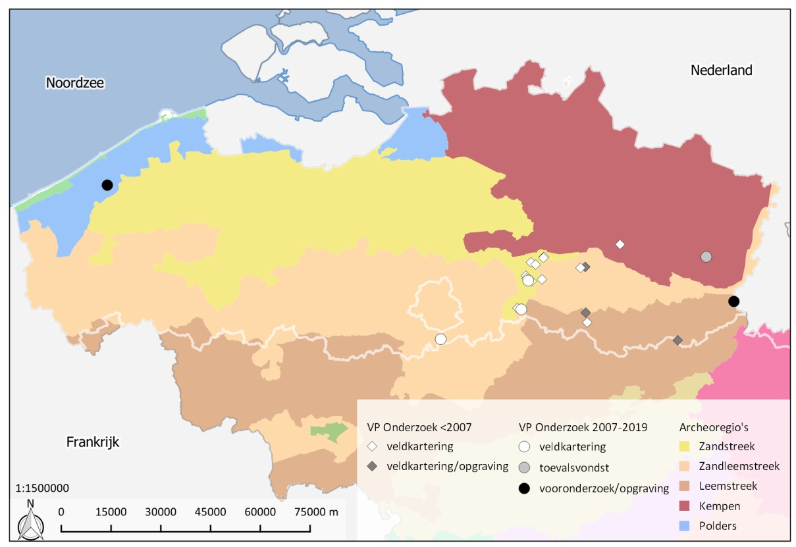{width="6.298472222222222in" height="4.33125in"}

> Figuur 1: Verspreiding van de vindplaatsen met een vroegpaleolithische component per onderzoeksmethode (toestand eind 2019).

### Het middenpaleolithicum 

Ook voor het middenpaleolithicum geldt dat de meeste vindplaatsen bekend zijn door veldkartering. Het gaat dus eveneens om oppervlaktemateriaal. Voorbeelden zijn de grotere collecties die bijv. zijn ingezameld te Aalter-Hageland en Aalter-Nieuwendam[^88] of 's Gravenvoeren -- Snauwenberg[^89] en het resultaat zijn van een systematische zoektocht. Vaker nog betreft het een beperkt aantal vondsten, die geïsoleerd of samen met jonger materiaal zijn aangetroffen. Recente prospectievondsten (sinds 2007) zijn slechts in beperkte mate opgenomen in de CAI: het gaat met name om geïsoleerde of een beperkt aantal vondsten zoals te Bilzen - Wijngaardstraat I, Rotem -- Pex, Lubbeek -- Hazenput en Baarle-Hertog -- Baarlebrugse Beemden 1. Te Vollezele -- Hof te Put[^90] en Overboelare -- Grote Buizemont[^91] zijn iets omvangrijkere collecties ingezameld, waarbij de artefacten zowel op basis van typologische als fysische kenmerken gedateerd werden. Tot slot vermelden we nog oppervlaktevondsten te Kesselt -- Op de Schans en te Oekene -- Rennevoordestraat. Op deze locaties werd aansluitend een opgraving uitgevoerd (zie verder).

{width="6.297501093613298in" height="4.330555555555556in"}

> Figuur 2: Verspreiding van de vindplaatsen met een middenpaleolithische component per onderzoeksmethode (toestand eind 2019).

De vondstlocaties die op Figuur 2 als 'opgraving' staan aangeduid, betreffen grotendeels opgravingen gericht op jongere periodes. Het middenpaleolithisch materiaal werd er als losse vondst ingezameld, maar de onderzoeksstrategie werd niet bijgesteld. Hetzelfde geldt voor de vondsten die tijdens vooronderzoek werden aangetroffen. Vooral na 2007 zien we op dat vlak een toename. Dat was bijvoorbeeld het geval in Rekem, Tongeren-Plinius[^92], Sint-Andries, Aalter-Langevoorde[^93], Oedelem, Ver-Assebroek[^94] en Beernem[^95]. Toevalsvondsten zijn dan weer vooral aangetroffen in zandwinningsgebieden en bij baggerwerken, bijvoorbeeld in Gent[^96], Merelbeke[^97], Ronse, Rotselaar[^98], Schulen[^99], Uitbergen en Zemst[^100]. Hoewel geen enkele van deze laatste sites is opgegraven duiden ze op een groot potentieel aan goed bewaarde contexten, met name in de Vlaamse Vallei en het loess-gebied (zie verder). Het betreffen ook grotendeels oudere vondstmeldingen, terwijl voor de periode na 2007 slechts 1 zogenaamde toevalsvondst werd gemeld ter hoogte van het Bos van Aa.

Tegenover het te voorspellen potentieel aan middenpaleolithicum in Vlaanderen op basis van de geomorfologie van bepaalde regio's (bijvoorbeeld voor de Vlaamse vallei[^101]), is het aantal echt onderzochte sites bedroevend laag. Dat was reeds bij het opstellen van de eerste versie van de onderzoeksbalans het geval en deze situatie is nauwelijks gewijzigd. Opgravingen naar

middenpaleolithische contexten zijn in Vlaanderen enkel uitgevoerd te Kesselt[^102], Veldwezelt[^103], Vollezele-Congoberg[^104], Oosthoven[^105] en meer recentelijk op verschillende locaties te Kesselt[^106] en Veldwezelt[^107]. Terwijl uitgebreidere evaluaties zijn uitgevoerd te Ruien (op de Kluisberg, waarbij de site evenwel vooral in Amougies (Henegouwen) ligt [^108], Wommersom, de Kemmelberg[^109] en Lauw[^110] evenals op een aantal vindplaatsen in de oostelijke Vlaamse vallei en recenter te Oekene -- Rennevoordestraat[^111].

Dit alles impliceert dat wetenschappelijk bronnenmateriaal van deze periode voorlopig vrij beperkt is. Ook dat is een observatie die reeds werd gemaakt bij het opstellen van de eerste versie van de onderzoeksbalans en nauwelijks gewijzigd is. Dit is een opmerkelijke vaststelling aangezien preventief onderzoek in het kader van malta-archeologie de laatste decennia sterk is toegenomen. Dit heeft weliswaar geleid tot een beperkt aantal nieuwe vindplaatsen, maar deze bestaan voornamelijk uit geïsoleerde vondsten. Onderzoek naar vindplaatsen met een rijker potentieel werd enkel uitgevoerd binnen een academisch kader (de verschillende vindplaatsen te Kesselt en Veldwezelt, aanvullend onderzoek te Oosthoven) of onder impuls van een lokale vereniging (zoals in de groeve te OekeneRennevoordestraat).

Een inhaalbeweging om te komen tot Europese standaarden is hier zeker aangewezen. De eerste stappen in die richting werden gezet vanuit academische hoek door de KULeuven met het *Flemish Valley Survey Project* dat gestart werd in 2015. Door middel van mechanische boringen wordt de pleistocene context van reeds gekende vindplaatsen -- o.m. Rotselaar-Toren ter Heide en Schulensbroek -- onderzocht[^112].

### Het laatpaleolithicum 

Op basis van de CAI lijkt het erop dat er behoorlijk wat laatpaleolithische vindplaatsen voorkomen in Vlaanderen. Echter, zoals we ook verder in de tekst zullen aangeven, is het aantal vindplaatsen dat overtuigend in het jong- of laatpaleolithicum kan geplaatst worden bijzonder beperkt. De verspreidingskaart geeft wederom vooral vindplaatsen weer die door middel van veldkartering aan het licht kwamen. Een steekproef van deze CAI records voor de periode voor 2007 leert dat het vaak om materiaal gaat dat een laat- of finaalpaleolithische toewijzing krijgt, maar in de CAI onder laatpaleolithicum gecatalogiseerd zijn. Daarnaast betreft het vaak materiaal waarvan de typotechnologische kenmerken eigenlijk slechts een algemene datering in het paleolithicum (of zelfs steentijd algemeen) toelaat. De vindplaatsen die aan het licht kwamen na 2007 zijn systematisch nagekeken. Slechts drie vindplaatsen zijn gedetecteerd door middel van veldkartering (Maasmechelen -- Ven Onder de Berg[^113], Moerbeke -- Heirweg I[^114] en Oud-Turnhout -- Liereman I[^115]). Het gaat telkens om weinig diagnostische stukken met een vermoedelijke datering vanaf het laatpaleolithicum. Dat geldt overigens ook voor vindplaatsen die bestaan uit losse vondst(en) aangetroffen bij vooronderzoek (Dilbeek - Wolsemveld[^116], Deurne -- Park Groot Schijn123). De vindplaats Bilzen --

Spelverstraat werd aangetroffen tijdens een opgraving gericht op jongere periodes. De kleine verzameling wordt door de onderzoekers op basis van typotechnologische kenmerken eerder tot de federmessercultuur gerekend.[^117] Dat geldt eveneens voor de vindplaats Kasterlee -- Binnenpad waar een ensemble van 167 artefacten werd ingezameld. Op basis van technologische kenmerken werd deze algemeen in het laatpaleothicum gedateerd, maar waarschijnlijk eerder aansluitend aan de federmessercultuur. Omwille van de aaanwezigheid van vorstbreuken wordt een datering voor de Jonge Dryas als plausibel geacht.[^118] Nijlen- Varenheuvel 1 is de enige vindplaats waar gericht onderzoek werd verricht naar een mogelijke laatpaleolithische aanwezigheid. De vindplaats was eerder gekend aan de hand van oppervlaktevondsten maar werd in 2006 en 2007 verder gewaardeerd aan de hand van verkennende boringen, proefputten- en sleuven en een kleine opgraving. Alhoewel een deel van het materiaal in stratigrafische positie werd aangetroffen, bleek het zich evenwel in een secundaire positie te bevinden en deels vermengd met jonger materiaal. De datering blijft daarom onzeker. De aanwezigheid van vorstbreuken op een deel van het materiaal wijst wellicht wel op een datering voor de Jonge Dryas. Één papegaaibeksteker kan mogelijk op basis van typologische gronden tot het laatpaleolithicum toegewezen worden.^126^ Net als voor het middenpaleolithicum trekken we eenzelfde conclusie voor het laatpaleolithicum. Ondanks de algemene toename aan archeologisch (voor)onderzoek, zijn sinds de eerste versie van de onderzoeksbalans dus nauwelijks nieuwe vindplaatsen aan het licht gekomen.

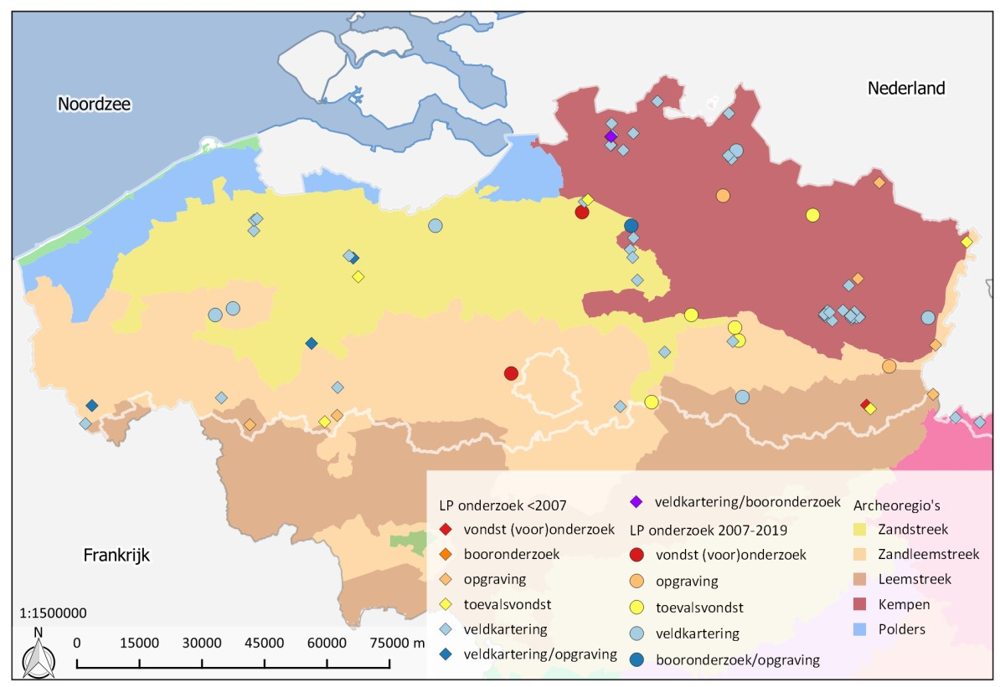{width="6.219722222222222in" height="4.277083333333334in"}

> Figuur 3: Verspreiding van de vindplaatsen met een laatpaleolithische component per onderzoeksmethode (toestand eind 2019).

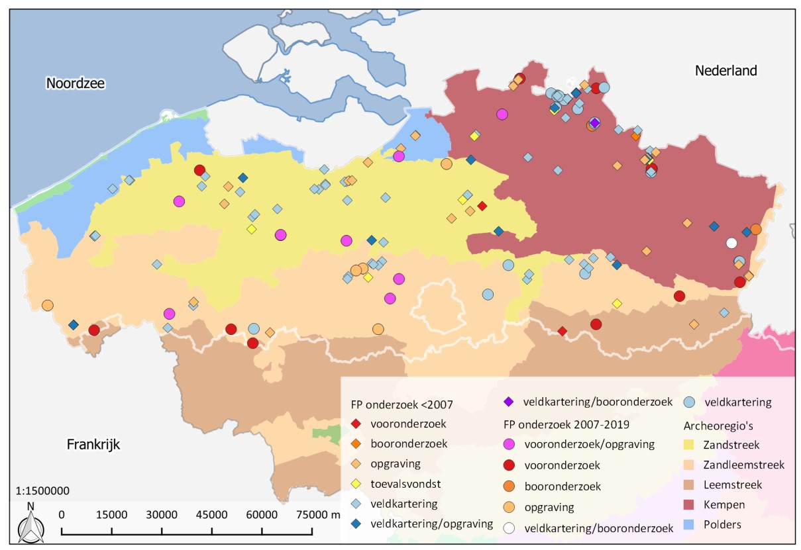{width="6.219722222222222in" height="4.277083333333334in"}

> Figuur 4: Verspreiding van de vindplaatsen met een finaalpaleolithische component per onderzoeksmethode (toestand eind 2019).

### Het finaalpaleolithicum 

Voor het finaalpaleolithicum is de toestand iets rooskleuriger. Toevalsvondsten uit deze periode zijn relatief zeldzaam, vermoedelijk ook omdat het materiaal niet gemakkelijk herkend wordt door nietspecialisten, maar dit geldt voor zowat de gehele prehistorie.

Bij amateurarcheologen zijn door veldkarteringen wel verschillende finaalpaleolithische sites ontdekt

(bijv. T. Caris, H. De Bock, A. Goossens, J. Carolus, M. De Meireleir, R. Maes, J. Semey, G. Van der Haegen, L. Van Vlaenderen, C. Verbeek), waarvan er sommige zijn geïnventariseerd in het kader van licentiaatsthesissen[^119], en in het kader van het AIV-project aan de UGent. Meermaals gaven ze ook aanleiding tot terreinonderzoek, bijvoorbeeld in Merksplas, Meer, Zolder, Zonhoven en Weelde. Sinds het opstellen van de eerste versie van de onderzoeksbalans werden op twaalf locaties finaalpaleolithische vondsten ingezameld door middel van veldkartering. Het gaat zowel om vindplaatsen waar in de nabije omgeving reeds eerder vondsten waren aangetroffen, als een beperkt aantal nieuwe vindplaatsen. Het valt op dat ze zich voornamelijk in het oosten van het land situeren. Naar datering toe dient ook voor deze vindplaatsen enig voorbehoud genomen te worden. Omwille van beperkte aantallen en/of beperkte diagnostische kenmerken geldt voor de meeste dat de datering onzeker blijft. Dit met uitzondering van de vindplaats Ravels -- Gilbert Mulliedreef[^120]. Het gaat in feite om een oudere collectie die pas na de publicatie van de eerste versie van de onderzoeksbalans werd ingegeven in de CAI. De omvangrijke verzameling (500 stuks) bevat diagnostische stuks zoals

federmesserspitsen. Daarnaast zijn er een aantal vindplaatsen waar het materiaal mogelijk kan gelinkt worden aan een Usselobodem, zoals te Maasmechelen -- Opgrimbie I[^121].

Daarnaast zien we dat voor deze periode toch relatief meer vindplaatsen gekend zijn dankzij vooronderzoek en/of opgravingen, dan voor de voorgaande periodes. Meer systematische prospectie met ingreep in de bodem van finaalpaleolithische sites vindt pas plaats sinds de jaren 1990, eerst door proefputten (bijv. in Ruilverkaveling Weelde), vanaf 1999 ook door boringen, eerst in Meer[^122], later meer systematisch in de Kempen[^123] en in de Scheldevallei[^124]. In datzelfde decennium start ook het booronderzoek op de site van Verrebroek[^125], weliswaar in hoofdzaak op mesolithische sites, maar met een systematische zoektocht naar paleobodems en paleolithische niveaus[^126]. Tijdens het vooronderzoek in Sint-Kruis-Winkel, Moervaart-Zuid en Evergem-Kluizendok is eerst gekeken naar bodemgesteldheid op basis van proefsleuven, waarna plaatsen met potentieel zijn uitgeboord, helaas steeds met beperkt resultaat[^127].

De afgelopen jaren wordt het steentijdluik steeds systematischer meegenomen tijdens vooronderzoeken in het kader van vergunningsplichtige maatregelen. Het resultaat van deze toenemende aandacht kan op dit moment nog niet goed ingeschat worden. Op basis van een eerste inschatting, lijken ze voornamelijk betrekking te hebben op mesolithische vindplaatsen en worden finaalpaleolithische vindplaatsen slechts in beperkte mate herkend. Sinds de eerste versie van de onderzoeksbalans blijken, naast de hierboven vermelde oppervlaktevindplaatsen, 27 nieuwe vindplaatsen bijgekomen. Echter achttien vindplaatsen hebben betrekking op vooronderzoeken waarbij (mogelijk) finaalpaleolithisch materiaal als losse vondst is aangetroffen tijdens een proefsleuvenonderzoek. Slechts twee[^128] vindplaatsen blijken het resultaat van een gericht archeologisch booronderzoek. Zo werden o.m. op diverse locaties te Lommel -- Kristalpark III finaalpaleolithische artefacten opgeboord[^129]. Daarnaast vermelden we Oud-Turnhout -- Bergstraat IV^138^. Nochtans neemt het aantal booronderzoeken dat zich richt op het detecteren van steentijdvindplaatsen stelselmatig toe sinds de eerste versie van de onderzoeksbalans. Deze lijken vaak heel erg gericht op de top van het bodemprofiel, terwijl de aandacht voor afgedekte, laatglaciale bodems en mogelijke sites daarin minder aan bod komt. Dit kan een mogelijke verklaring zijn.

De meeste *opgravingen* van finaalpaleolithische sites voor 2007 zijn beperkt gebleven tot kleine arealen, bijvoorbeeld in Merksplas, Meer I, Zolder, Helchteren, Harelbeke en Verrebroek Dok 2. Wat grotere opgravingen vonden plaats in Meer II, Meer IV, Doel Deurganckdok zone B en Zonhoven, terwijl zeer grootschalig werd opgegraven in Rekem, Weelde en Klein-Sinaai Baudeloo-abdij, Lommel en Tongeren. De opgravingsmethode op al deze sites varieerde naargelang de bewaringstoestand en de tijdsdruk, van nauwkeurige driedimensionele registratie van individuele stukken (Meer II en IV, Rekem, Klein-Sinaai, Verrebroek Dok 2, Doel, Lommel-Maatheide 1 en deels ook Zonhoven-Molenheide), over inzameling per kwart vierkante meter in Lommel-Maatheide, Tongeren-Plinius en ZonhovenMolenheide, tot vierkante meters in Weelde-Eindegoorheide.

Sinds de eerste versie van de onderzoeksbalans blijken slechts een beperkt aantal opgravingen uitgevoerd te zijn op finaalpaleolithische vindplaatsen. Het gaat o.m. om de finaalpaleolithische

clusters Ruien-Rosalinde[^130], Oudenaarde -- Markt[^131] en Ronse -- Pont West[^132]. In de bespreking van de laatpaleolithische vindplaatsen vermelden we tevens reeds het onderzoek te Kasterlee-Binnenpad[^133] en Bilzen -- Spelverstraat[^134] waar mogelijk finaalpaleolithische clusters werden aangetroffen. Het gaat hier weliswaar om vindplaatsen die eerder 'toevallig' aan het licht kwamen tijdens onderzoek naar jongere periodes. Een observatie die overigens ook opgaat voor de eerder opgegraven sites te KleinSinaai Baudeloo-abdij[^135], Tongeren-Plinius[^136], Rekem[^137], Gent-Tweekerkenstraat[^138]. Recent, gericht onderzoek naar finaalpaleolithische vindplaatsen dat in een opgraving resulteerde, blijkt eigenlijk enkel op te gaan voor Verrebroek -- Dok 2[^139], Doel -- Deurganckdok zone B[^140], Lommel -- Maatheide[^141] voor de periode voor 2007 en te Lommel-Kristalpark en Beveren -- Logistiek Park Waasland (hierna Beveren -- LPW genoemd) ^151^ voor de periode na 2007. Deze onderzoeken zijn echter nog niet volledige gerapporteerd.

## 2.3 EVOLUTIE VAN HET TERREINWERK OP SITES MET EEN PALEOLITHISCHE COMPONENT IN DE LAATSTE 40 JAAR 

### Inleiding 

In dit hoofdstuk wordt ingegaan op de evolutie van de onderzoekspraktijk en niet op inhoudelijke ontwikkelingen. Hiervoor werd de werkwijze zoals deze in de eerste versie van de onderzoeksbalans werd gehanteerd grotendeels overgenomen. Daarin werd beargumenteerd dat voor een 'objectieve' diachronische kijk op de ontwikkelingen van het paleolithische terreinwerk in Vlaanderen grotendeels gebruik kon gemaakt worden van de artikelen in het tijdschrift *Notae Praehistoricae*. Voor een periode van circa 30 jaar (1979-2007) geeft dit tijdschrift een goed beeld van het terreinwerk dat plaatsgevonden heeft op steentijdsites in België. Jaarlijks werd hierin immers een overzicht gegeven van de opgravingscampagnes van het voorbije seizoen (seizoenen 1979 en 1980 in volume 1 van 1981; seizoenen 1984 en 1985 samen in volume 5 van 1985, daarna valt de publicatiedatum meestal samen met het opgravingsjaar). Hoewel dit niet volledig exhaustief zal zijn, zijn hierin zeker de belangrijkste campagnes goed geregistreerd en kan deze bron tot hiertoe als representatief beschouwd worden. Voor de periode tussen 2007 en 2019 rapporteren bedrijven die werken binnen de projectarcheologie de meeste prehistorische opgravingen, maar er zijn ook enkele terreincampagnes waarvan de resultaten niet terug te vinden zijn in de *Notae Praehistoricae*. Bij enkele gevallen is dit te wijten aan de recente datum van uitvoering. Daarom worden de gegevens vanaf 2007 aangevuld met informatie uit de CAI, en zijn ook meerperiodensites met een belangrijke paleolithische component betrokken. Dit geldt evenwel niet voor de Waalse sites: voor de ontwikkelingen van het paleolithische terreinwerk in dit gewest hebben we ons enkel gebaseerd op de artikelen in het tijdschrift *Notae Praehistoricae*.

Voor deze analyse hebben we dus enkel verslagen van archeologische terreincampagnes bekeken. Zuiver *post-excavation* onderzoek werd uit de referenties geweerd, net als de artikelen die betrekking hebben op buitenlandse sites. Vervolgens is deze lijst geïndexeerd op gewest, archeoregio, periode,

subfase (vroeg/midden of laat/finaal paleolithicum), type project (prospectie, waardering, opgraving) en type uitvoerende instelling (onderwijsinstelling, overheidsinstelling, ...). Voor de bespreking van evoluties over de jaren heen hebben we gebruik gemaakt van vijfjaarlijkse periodes (zogenaamde jaarkwintetten), te beginnen in 1975. De recente prospectie op Lommel -- Kristalpark III uit 2020 is opgenomen in het jaarkwintet 2020-2024, maar deze is uiteraard nog niet afgerond. Vervolgens werd deze databank onderworpen aan een kleine kwantitatieve analyse.

### Bespreking van de onderzoeken per periode 

Misschien is het nuttig om het paleolithisch onderzoek in Vlaanderen eerst wat te kaderen binnen het algemene steentijdonderzoek in Belgische context (Figuur 5). Het aantal terreincampagnes op sites met een paleolithische of neolithische component wordt sterk beïnvloed door het grottenonderzoek in het zuiden van het land. Bij de sites met een mesolithisch component domineert het onderzoek op Vlaamse bodem.

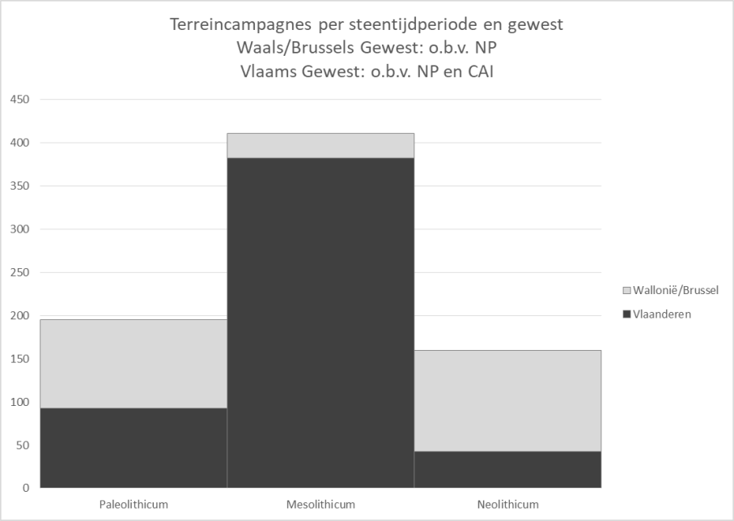{width="4.724306649168854in" height="3.3534722222222224in"}

> Figuur 5: Terreincampagnes gerapporteerd in Notae Praehistoricae tot 2007 per steentijdperiode en per gewest in België.

Wanneer we dit onderzoek uitzetten over de laatste 40 jaar worden opmerkelijke trends zichtbaar (Figuur 6). Terwijl voor Vlaanderen de hoeveelheid rapportages van terreincampagnes min of meer stabiel bleef (20 tot 30 per jaarkwintet), kende het zuiden van het land aanvankelijk een geleidelijke groei, met een piek in de jaren 90, maar met een duidelijke terugval daarna. Voor specifiek het paleolithicum is deze trend zeer uitgesproken. Na 2004 maken de rapportages m.b.t. paleolithische terreincampagnes in het zuiden van het land een zeer grote terugval: van 13 naar 7 tussen 2005 en 2009. De laatste 10 jaar zijn er zelfs amper steentijdcampagnes gemeld in Wallonië/Brussel (n=3). Het is natuurlijk hier niet de plaats om de balans voor Wallonië op te maken, laat staan er een verklaring voor te geven.

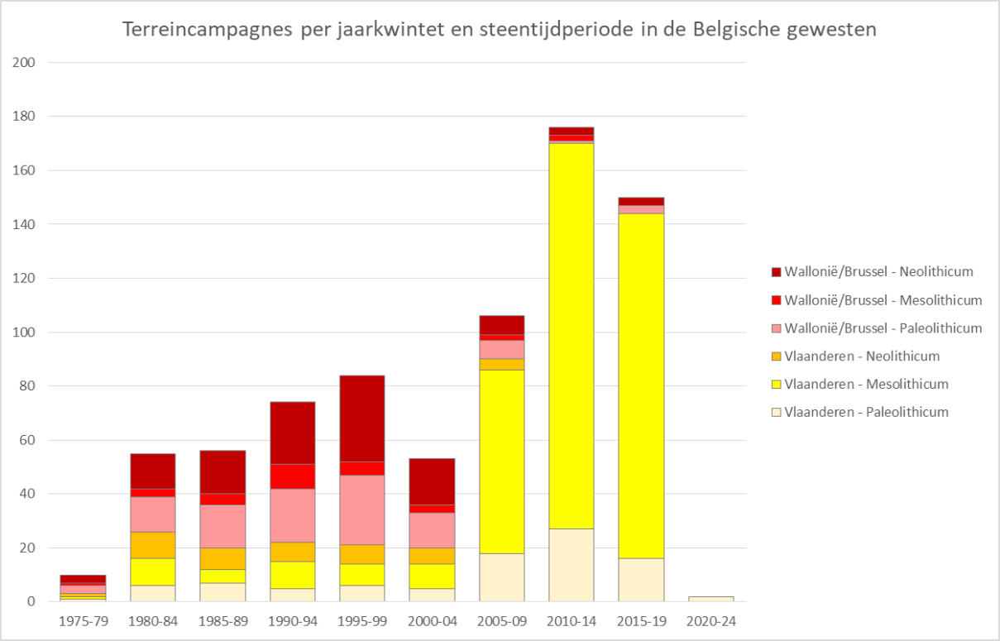{width="6.298611111111111in" height="4.039583333333334in"}

> Figuur 6: Terreincampagnes gerapporteerd in *Notae Praehistoricae* of CAI per jaarkwintet en per steentijdperiode in de Belgische gewesten.

Wanneer enkel naar het steentijdonderzoek in Vlaanderen wordt gekeken, en we dit binnen de grote periodes opsplitsen in subfases (vroeg-, midden-, laat-, ...), komt hieruit wel wat variatie naar voren, (Figuur 7). Algemeen gezien valt een sterke stijging op in het aantal sites sinds de opkomst van de

Malta-onderzoek (te merken in het jaarkwintet 2005-2009). Binnen de paleolithische subfases (Figuur 8) is er vanaf die periode een sterk overwicht van gerapporteerde sites met een finaalpaleolithische component, maar terreinwerk op midden- en laatpaleolithicum blijft doorheen de jaren vrij stabiel en deze zijn vooral het resultaat van academisch onderzoek. Omdat het hier om kleine aantallen gaat, zijn deze trends natuurlijk sterk afhankelijk van meerjarige campagnes op eenzelfde site in een bepaald jaarkwintet (Figuur 9). Voor een periode van ca. 25 jaar (1979-2005) zien we dat deze een groot percentage van het totaal uitmaken: hieronder vallen bijvoorbeeld de opgravingen in Rekem in het midden van de jaren 1980, in Veldwezelt rond de eeuwwisseling en in Lommel-Maatheide tussen 2003 en 2008. Sinds de opkomst van de Malta-archeologie is er een sterke stijging in de eenmalig gerapporteerde sites, die vanaf 2005-2009 dan weer een grote invloed op de grafiek uitoefenen. Uit de eerdere bespreking van de vindplaatsen en aard van het onderzoek per periode bleek echter dat het gros van deze vindplaatsen het resultaat is van 'toevallige' vondsten die tijdens onderzoek naar jongere periodes zijn aangetroffen, waarbij slechts bij een minderheid vervolgens de onderzoeksstrategie werd aangepast. De kwantitatieve toename impliceert dus niet meteen een toename aan gelijklopende toename aan (potentiële) inhoudelijke kennis.

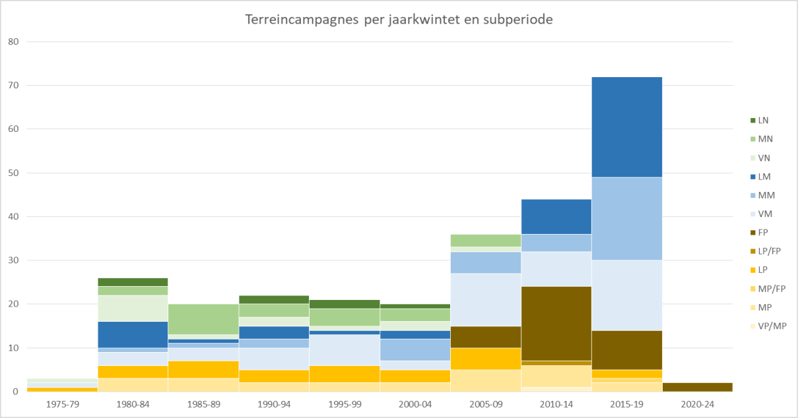{width="6.298611111111111in" height="3.3047222222222223in"}

> Figuur 7: Terreincampagnes in Vlaanderen per jaarkwintet per steentijdfase. Legende: VP/MP = vroeg- en middenpaleolithicum; LP = laatpaleolithicum; FP = finaalpaleolithicum; VM = vroegmesolithicum; MM = middenmesolithicum; LM = laatmesolithicum; VN = vroegneolithicum; MN = middenneolithicum; LN = laat- en finaalneolithicum.

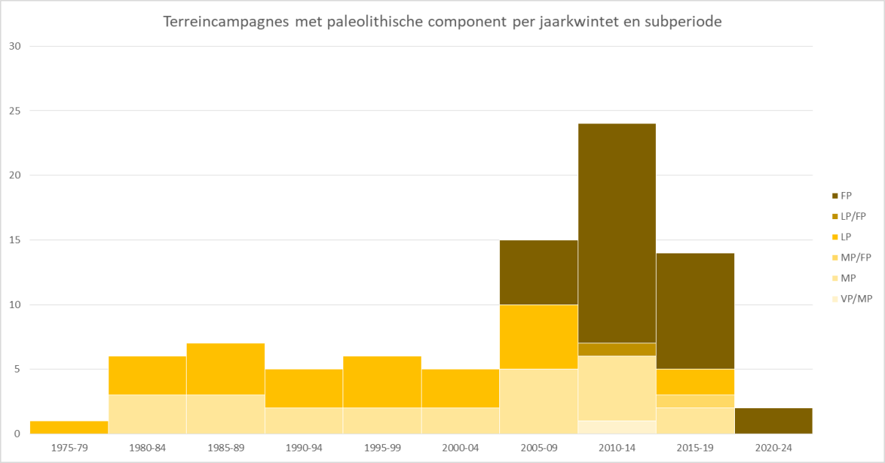{width="6.298611111111111in" height="3.3047222222222223in"}

> Figuur 8: Terreincampagnes in Vlaanderen per jaarkwintet per subfase binnen het paleolithicum. Legende: VP/MP = vroeg- en middenpaleolithicum; MP = middenpaleolithicum; LP = laatpaleolithicum; FP = finaalpaleolithicum.

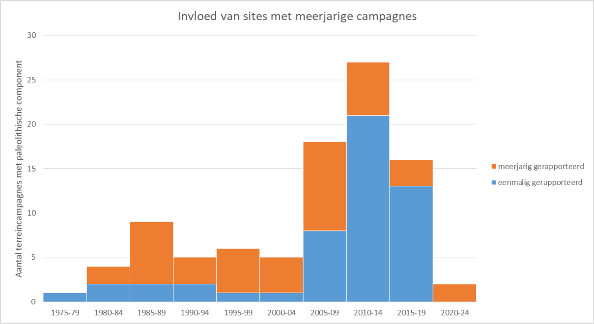{width="6.298055555555556in" height="3.4444444444444446in"}

> Figuur 9: De invloed van eenmalig en meerjarig gerapporteerde terreincampagnes op sites met een paleolithische component in Vlaanderen per jaarkwintet

### Bespreking van de onderzoeken per onderzoeksmethode 

Samen met de opkomst van de Malta-archeologie, zien we de laatste jaren een groeiende investering in prospectie- en waarderingscampagnes. Ook dit komt tot uiting in de rapporteringen in *Notae Praehistoricae* en de CAI (Figuur 10). De prospecties die tijdens de eerste helft van de jaren '80 gerapporteerd worden zijn vooral studies op grote collecties die door amateurarcheologen waren verzameld. Nadien zetten ook professionele archeologen verschillende prospectie- en waarderingscampagnes op, ondermeer in functie van inventarisatie- en beschermingsprojecten. Meestal gaat het daarbij om meerperiodeprojecten, waarbij het paleolithicum ook aan bod komt, maar niet uitsluitend. Het middenpaleolithicum in Vlaanderen is vooral bekend uit prospectie door vrijetijdsarcheologen, in het bijzonder in de Limburgse leemgroeves, bij opspuitingen in de Vlaamse Vallei of via veldprospectie, terwijl opgravingen en een meer systematische evaluatie grotendeels beperkt zijn tot het onderzoek van de KULeuven in het oosten van Vlaanderen.

> Figuur 10: Types van terreincampagnes op steentijdsites in Vlaanderen per jaarkwintet.

### Bespreking van de onderzoeken per type uitvoerder 

Als laatste oefening hebben we gekeken naar het type instelling die (hoofd)uitvoerder was van de projecten die zijn gerapporteerd (Figuur 11). Voor het middenpaleolithicum is dit duidelijk de KULeuven, en sinds 2005-2009 rapporteert ook de privésector over vondsten uit deze subfase. Zij het dat het dan enkel om geïsoleerde vondsten gaat. Prospecties of opgravingscampagnes gericht op vroeg- of middenpaleolithicum zijn nog niet uitgevoerd door de privésector, wat op zich verwonderlijk is gezien ook grootschalige ingrepen -- zoals ontginningsactiviteiten -- in het kader van het vergunningstraject onderworpen zijn aan de archeologische wetgeving. Dit lijkt er op te wijzen dat de impact van dergelijke werken op afgedekte paleolithische vindplaatsen onderbelicht wordt. Op basis van een navraag bij een aantal erfgoedconsulenten en screening van een aantal dossiers blijkt dat deze vraagstelling uitzonderlijk wel wordt meegenomen bij de start van een vooronderzoek. Maar dat er tijdens de uitvoering tegen praktische en economische problemen (bijv. de impact op de latere ontginning) worden aangelopen en het verdere prospectief onderzoek naar paleolithische niveaus wordt losgelaten.

Voor het laat- en finaalpaleolithicum zit de expertise meer verspreid. Terwijl dit tot in de jaren 80 ook hoofdzakelijk door de KULeuven werd onderzocht (en in Meer ook nog door het Museum voor middenAfrika in Tervuren), is dit in de jaren 1990 vooral door het IAP (later VIOE) overgenomen, weliswaar vaak in samenwerking met KULeuven. Ook de UGent voerde regelmatig finaalpaleolithisch terreinwerk uit, in combinatie met onderzoek naar het mesolithicum, waarbij altijd veel aandacht gaat naar de studie van het paleomilieu. De institutionele ontwikkelingen komen nog sterker tot uiting wanneer we kijken naar de evolutie van het steentijdonderzoek in het algemeen over de laatste 40 jaar (Figuur 12). De aanvankelijke dominantie van KULeuven is over de jaren heen duidelijk afgenomen, omgekeerd zien we het terreinwerk vanuit UGent sinds midden jaren 1980 toenemen. Tussen de jaren 1990 en begin jaren 2000 neemt ook de Vlaamse overheid (AOE) in toenemende mate initiatieven tot terreinwerk op paleolithische sites. De terreincampagnes van zowel de onderwijs- als de overheidsinstellingen zijn echter (zeer) fel afgenomen na de opkomst van de privésector: het gaat tegenwoordig voornamelijk over enkele onderzoeksprojecten.

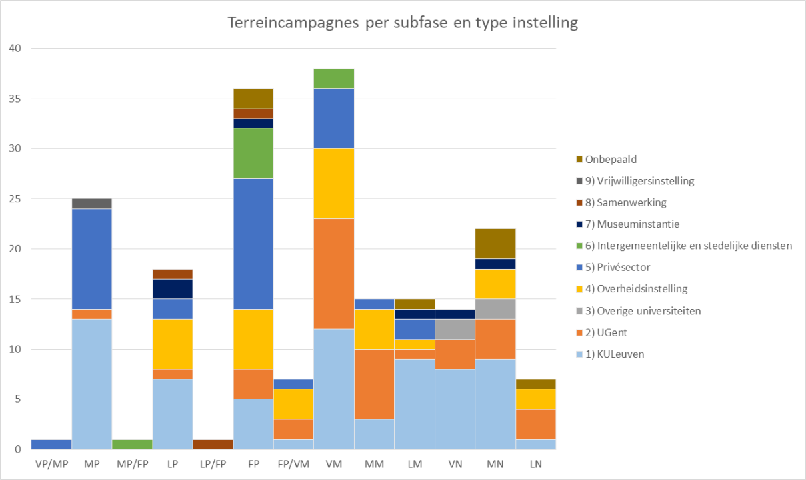{width="6.298333333333333in" height="3.759027777777778in"}

> Figuur 11: Gerapporteerde terreincampagnes op steentijdsites in Vlaanderen per steentijdfase en opgesplitst per type instelling die het project leidde of er de grootste inbreng in had. Legende: VP/MP = vroeg- en middenpaleolithicum; LP/FP = laat- en finaalpaleolithicum; VM = vroegmesolithicum; MM = middenmesolithicum; LM = laat- en finaalmesolithicum; VN = vroegneolithicum; MN = middenneolithicum; LN = laat- en finaalneolithicum.

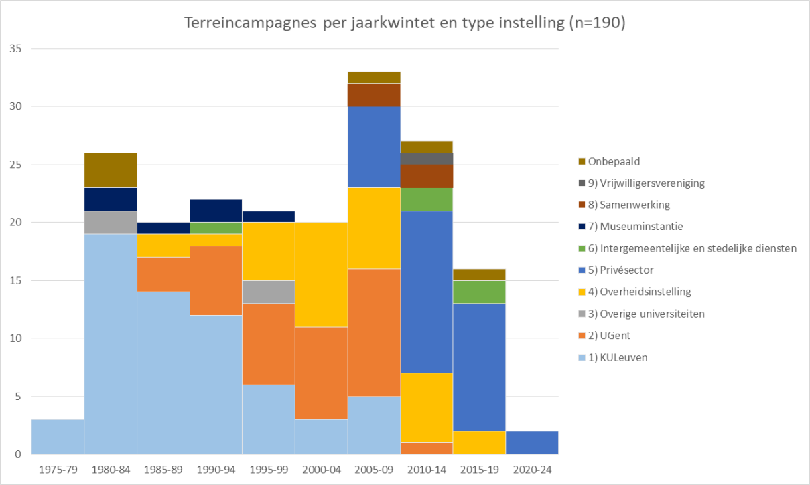{width="6.298055555555556in" height="3.779861111111111in"}

> Figuur 12: Gerapporteerde terreincampagnes op steentijdsites in Vlaanderen per jaarkwintet en opgesplitst per instelling die het project leidde of er de grootste inbreng in had.

# 3 BALANS VAN DE ONTSLUITING VAN HET ONDERZOEK 

##  3.1 INLEIDING 

Al het graaf- en onderzoekswerk wordt voor de wetenschap pas relevant wanneer de resultaten ervan ook behoorlijk gepubliceerd raken en opgepikt door de ruimere onderzoeksgemeenschap. In dit onderdeel gaan we na in hoeverre dit voor het onderzoek van het paleolithicum in Vlaanderen vlot verloopt. De gehanteerde opzet en werkwijze werd één op één overgenomen uit de eerste versie van de onderzoeksbalans en aangevuld met de nieuwe data.

Ook voor deze analyse werd terug vertrokken van de werkwijze zoals deze in de eerste versie van de onderzoeksbalans werd gehanteerd. Hierbij dient evenwel opgemerkt te worden dat bij de eerste analyse vooral een focus lag op het kwantificeren van wetenschappelijke publicaties, terwijl bij de actualisatie vooral onderzoeksrapporten werden gekwantificeerd.

Als basis voor deze analyse stelden we een zo exhaustief mogelijke lijst van de wetenschappelijke publicaties en rapporten over onderzoek van het paleolithicum in Vlaanderen samen. Om deze databank in dit hoofdstuk te laten fungeren als analyse-instrument hebben we er een aantal bewerkingen op toegepast en er vervolgens verschillende indexen in aangebracht.

De belangrijkste parameter om een idee te krijgen van de omvang van het gepubliceerde onderzoek is in dit geval, meer nog dan het aantal publicaties, de hoeveelheid nieuwe kennis. Deze trachten we uit te drukken in aantal bladzijden originele onderzoeksresultaten. Dit vergt natuurlijk wat evaluatie- en interpretatiewerk en verdient daarom enige toelichting. De volgende regels zijn hierbij in acht genomen:

-   Uitgangspunt en referentie is één pagina formaat A4 in een klassiek wetenschappelijk tijdschrift, genre *Relicta* of *Archeologie in Vlaanderen*. Voor de meeste referenties is bijgevolg effectief het aantal pagina's genomen.

-   Voor publicaties (bijv. synthesewerken) die ook andere periodes of andere regio's behandelen, is ingeschat hoeveel pagina's hierin daadwerkelijk het paleolithicum in Vlaanderen tot onderwerp hebben. Wanneer binnen het paleolithicum verschillende fases aan bod komen is dit gewoon vermeld, zonder verdere opsplitsing van het aantal pagina's.

-   Voor thesissen en andere ongepubliceerde manuscripten die openbaar toegankelijk zijn, hebben we een ingeschat hoeveel pagina's het werk zou omvatten mocht het omgezet zijn naar een deftige wetenschappelijke publicatie. Indien dit effectief ook is gebeurd (bijv. in *Terra Incognita*), namen we enkel de omvang van het gepubliceerde werk op. Dit geldt ook voor doctoraatsverhandelingen die naderhand als boek werden gepubliceerd.

-   De algemene regel is dat in geval van meerdere publicaties over hetzelfde onderwerp, dezelfde pagina's maar éénmaal werden geteld, in principe bij de hoofdpublicatie. Louter populariserende en vulgariserende werken over het onderwerp werden uitgesloten. Zij presenteren in de regel geen originele resultaten. Hetzelfde geldt voor cursussen en andere educatieve werken.

-   Zoals boven al vermeld, zijn zuiver geografische, geomorfologische, paleoklimatologische en andere natuurwetenschappelijke publicaties over deze periode niet opgenomen. Deze komen immers in andere hoofdstukken van de onderzoeksbalans aan bod. Wanneer het onderzoek wel direct in relatie staat tot de archeologische context (bijv. stratigrafie, datering), werd het wel opgenomen.

-   Evenmin geaccepteerd zijn loutere vondstmeldingen zoals die vroeger in *Archeologie* of in andere kronieken werden opgenomen. Aangezien deze de laatste jaren rechtstreeks aan de Centrale Archeologisch Inventaris worden doorgegeven, zou dit voor een scheeftrekking gezorgd hebben. Bovendien kunnen dergelijke signalementen meestal bezwaarlijk echt wetenschappelijk onderzoek genoemd worden.

Naast de omvang werd ook gekeken naar het jaar van publicatie. Om *outliers* enigszins te milderen, werkten we opnieuw met periodes van 5 jaar, voor de steentijd in het algemeen beginnend in 1870, voor het paleolithicum specifiek pas in 1905 (met de eerste publicatie van J. Hamal-Nandrin).

Voor het type van publicatie maakten we, zoals voorzien in de Bibliografie Onroerend Erfgoed Vlaanderen, een onderscheid tussen boeken, bijdragen in boeken ('boekdelen'), tijdschriftartikelen, *papers* gepubliceerd in de *proceedings* van een congres, thesissen en andere ongepubliceerde rapporten. Geëditeerde boeken zoals handelingen van een congres komen niet als geheel aan bod, aangezien de verschillende (relevante) bijdragen in principe apart zijn opgenomen.

Om een idee te krijgen van het internationale potentieel van het gepubliceerde onderzoek is ook de taal geregistreerd waarin het werk is geschreven. In principe zou een bibliometrisch onderzoek met analyse van impactfactoren de beste methode zijn om de ontsluiting binnen het internationale onderzoek te meten. Mogelijk kan dit bij de volgende versie van de onderzoeksbalans aan bod komen. Voorlopig proberen we hier enkel een inschatting te maken op basis van eigen kennis en ervaring.

## 3.2 OVERZICHT VAN GEPUBLICEERD ONDERZOEK 

Wanneer bovenstaande regels in acht genomen worden, beschikken we momenteel over een gegevensbank van ca. 440 wetenschappelijke publicaties en rapporten over paleolithicum in Vlaanderen.

Hoewel publicaties over steentijdvondsten in Vlaanderen al starten in de 19^de^ eeuw en voor het paleolithicum specifiek in het begin van de 20^ste^ eeuw, komt er pas na de Tweede Wereldoorlog enige regelmaat in het aantal publicaties, met een geleidelijke groei tot in de jaren 1970 (Figuur 13). Een plotse algemene toename treedt op in de jaren 1980, gevolgd door een duidelijke afname in de jaren 1990. Na de eeuwwisseling zien we opnieuw een lichte toename. De hoogste piek bevindt zich in het afgelopen decennium (2010-2019).

Hoewel het paleolithicum deze tendensen in het aantal publicaties in grote lijnen volgt, lijkt de groei hier iets vroeger te zijn gekomen (einde jaren 1970) en is de output voor deze periode sinds de jaren 1980 wat stabieler, zij het in lichtjes dalende lijn (Figuur 14). Deze relatieve stabiliteit kon hoger ook al worden opgemerkt in het aantal terreincampagnes sinds de jaren 1980 (Figuur 8). Sinds de opkomst van de archeologische privésector stijgt het aantal wetenschappelijke publicaties (in de vorm van rapporten) opnieuw. Vooral tussen 2010 en 2014 wordt een piek bereikt, die in het volgende jaarkwintet opnieuw afneemt. Hoe deze trend zal evolueren tussen 2020 en 2024 is onduidelijk.

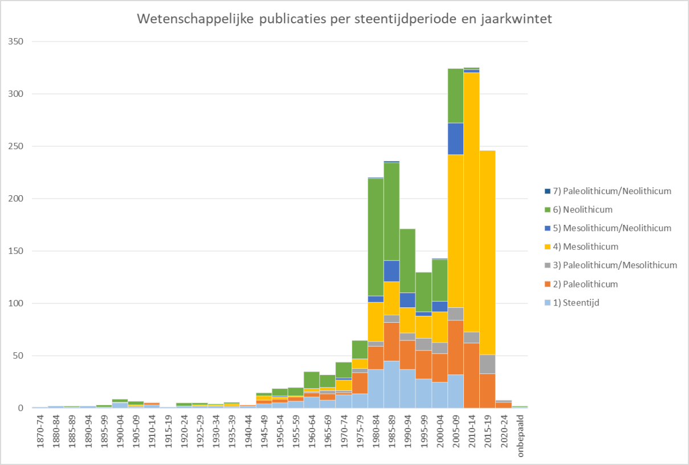{width="6.298611111111111in" height="4.255416666666667in"}

> Figuur 13: Aantal wetenschappelijke publicaties van steentijdonderzoek in Vlaanderen, per steentijdperiode en jaarkwintet.

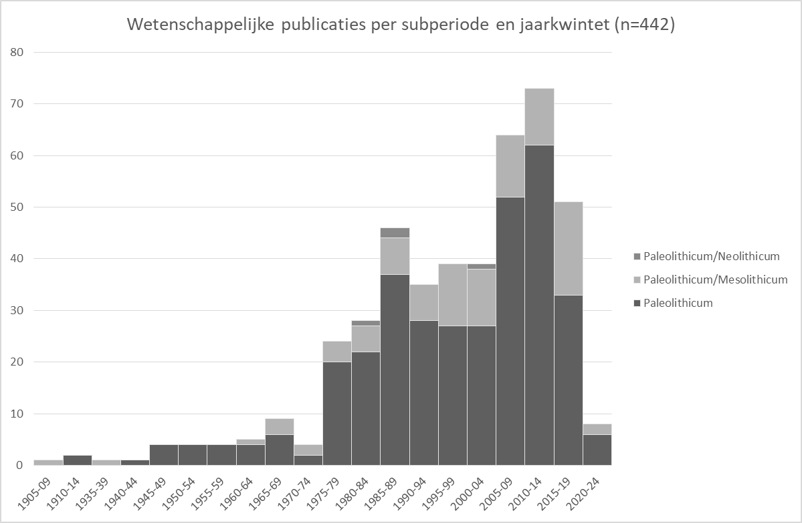{width="6.298611111111111in" height="4.118611111111111in"}

> Figuur 14: Aantal wetenschappelijke publicaties van (deels) paleolithisch onderzoek in Vlaanderen, per subperiode en jaarkwintet.

Zoals Figuur 15 doet blijken zijn de meeste publicaties van steentijdonderzoek in Vlaanderen in de vorm van tijdschriftartikels. Tijdschriftartikels vormen 55 % van de wetenschappelijke publicaties over het paleolithicum (Figuur 16). Ook het aantal rapporten met een paleolithische component is gestegen (ca. 17,5 %). Congrespapers, boekdelen en thesissen maken elk ongeveer 8 à 9 % van de publicaties uit.

Boeken (ca. 2,5 %) zijn duidelijk in de minderheid. Bovendien moet hierbij worden opgemerkt dat het meestal om synthesewerken gaat waarin ofwel de Vlaamse sites (bijv. in Schwabedissen[^142] of Rozoy[^143]), ofwel het paleolithicum zelf (bijv. in Narr[^144] of Van Gils & De Bie[^145]) maar in beperkte mate aan bod komen. De wetenschappelijke boeken die uitsluitend paleolithicum in Vlaanderen tot onderwerp hebben zijn tot hiertoe de monografieën over Meer[^146], Rekem[^147] en Zonhoven-

Molenheide[^148] en het overzichtswerk over het middenpaleolithicum in Noordwestelijk België boek[^149].

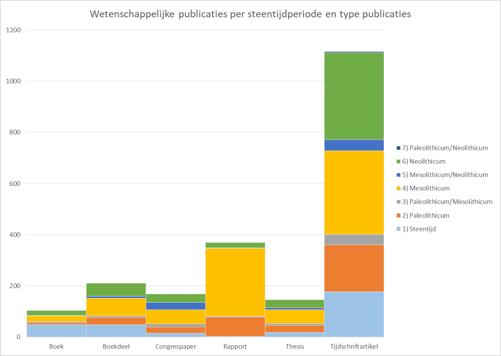{width="6.298611111111111in" height="4.480972222222222in"}

> Figuur 15: Aantal wetenschappelijke publicaties van steentijdonderzoek in Vlaanderen, per steentijdperiode en per type publicatie.

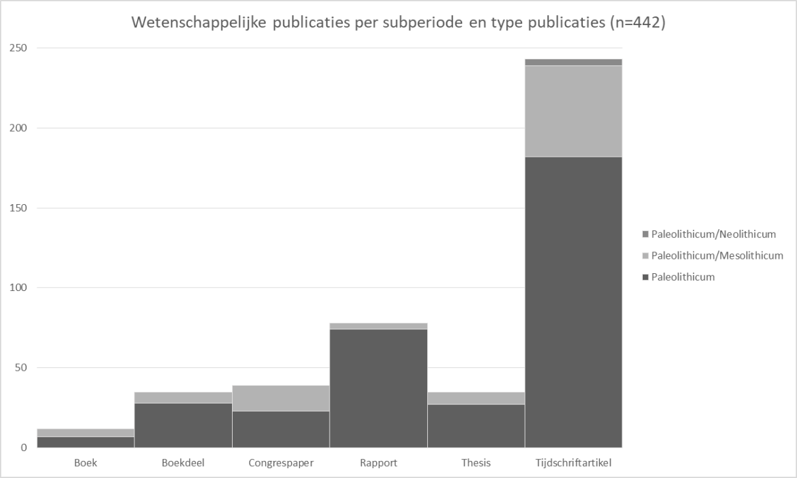{width="6.298611111111111in" height="3.7831944444444443in"}

> Figuur 16: Aantal wetenschappelijke publicaties van (deels) paleolithisch onderzoek in Vlaanderen, per type publicatie.

Voor het steentijdonderzoek in het algemeen hebben tijdschriftartikels doorheen de jaren altijd het gros van het publicatietype uitgemaakt, met opnieuw een opvallende piek in de jaren 1980, gevolgd door een al even opmerkelijke terugval in de loop van de jaren 1990. Vanaf 2005 is terug een stijgende lijn te onderscheiden (Figuur 17).

Voor het paleolithicum komt de plotse groei er al in de tweede helft van de jaren 1970, waarna het aantal tijdschriftartikels gedurende 30 jaar (1975-2005) vrij stabiel blijft rond 20 publicaties per half decennium, met één opvallende piek (van meer dan 30 artikels) in de tweede helft van de jaren 1980 (Figuur 18). Vanaf 2005 is opnieuw een stijging in het aantal artikels te zien, die tot op heden vrij stabiliseert rond 30 artikels per jaarkwintet. Vanaf de jaren 1980 gaan ook de thesissen, congrespapers en boekdelen regelmatig een substantieel deel van de wetenschappelijke werken uitmaken, en hoewel de aantallen van de laatste twee publicatietypes vrij stabiel blijven doorheen de jaren, zien we een sterke terugval van thesissen over het paleolithicum in Vlaanderen vanaf de periode 2010-2014. Sinds het doctoraat van Van Baelen[^150] in 2014 slechts enkele thesissen een Vlaamse site met paleolithische component als hun onderwerp of in hun onderzoeksgebied. Sinds eind jaren 1990 maken ook de rapporten er deel van uit, en logischerwijze is er een enorme toename in het aantal vanaf de privatisering van de archeologiesector. Het effect begint duidelijk te worden in het jaarkwintet 20052009, maar komt pas in 2010-2014 op gelijke hoogte als het aandeel van wetenschappelijke artikels.

Figuur 19 toont dan weer een eerder beperkte onderzoeksoutput van de rapporten. De stijgende lijn in het aantal rapporten vertaalt zich niet in een stijging van het aantal pagina's wetenschappelijk onderzoek voor dit publicatietype. Sinds de beginjaren 80 zijn de meeste pagina's aan wetenschappelijk onderzoek afkomstig van tijdschriftartikels, en dit blijft de dominante categorie tot een serieuze terugval in het eerste kwintet na de eeuwwisseling. Daarna stijgt het aantal pagina's tot de categorie tussen 2010-2014 opnieuw overheerst. Deze trend lijkt voort te duren. Boeken komen maar occasioneel uit, maar spelen natuurlijk wel een grote rol in de omvang van de onderzoeksoutput.

Dit komt het best tot uiting in het aantal gepubliceerde pagina's origineel onderzoek over de jaren

heen. Dan zijn er immers opvallende pieken eind jaren 1970 (publicatie van Meer[^151]) en rond de eeuwwisseling (publicatie van Rekem[^152]). Vooraan in de jaren 1990 is er ook nog een monografie over het middenpaleolithicum[^153], die zoals gezegd meer in boekdelen is opgebouwd. Ook doctoraten kunnen natuurlijk een substantiële bijdrage leveren in de onderzoeksoutput, voor de laatste jaren ondermeer deze van Y. Perdaen[^154], P. Bringmans[^155] en bovengenoemde A. Van Baelen[^156].

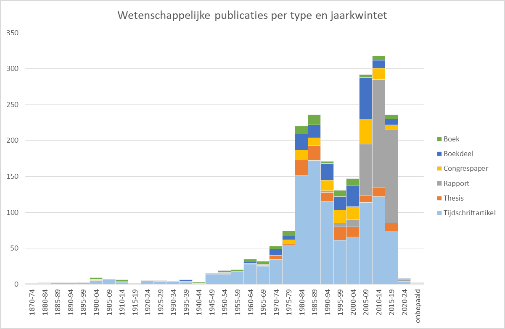{width="6.298611111111111in" height="4.111527777777778in"}

> Figuur 17: Aantal wetenschappelijke publicaties van steentijdonderzoek in Vlaanderen, per type publicatie en jaarkwintet.

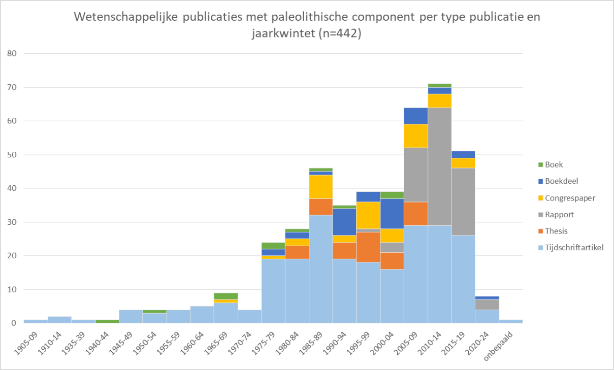{width="6.298611111111111in" height="3.7977777777777777in"}

> Figuur 18: Aantal wetenschappelijke publicaties van paleolithisch onderzoek in Vlaanderen, per type publicatie en jaarkwintet.

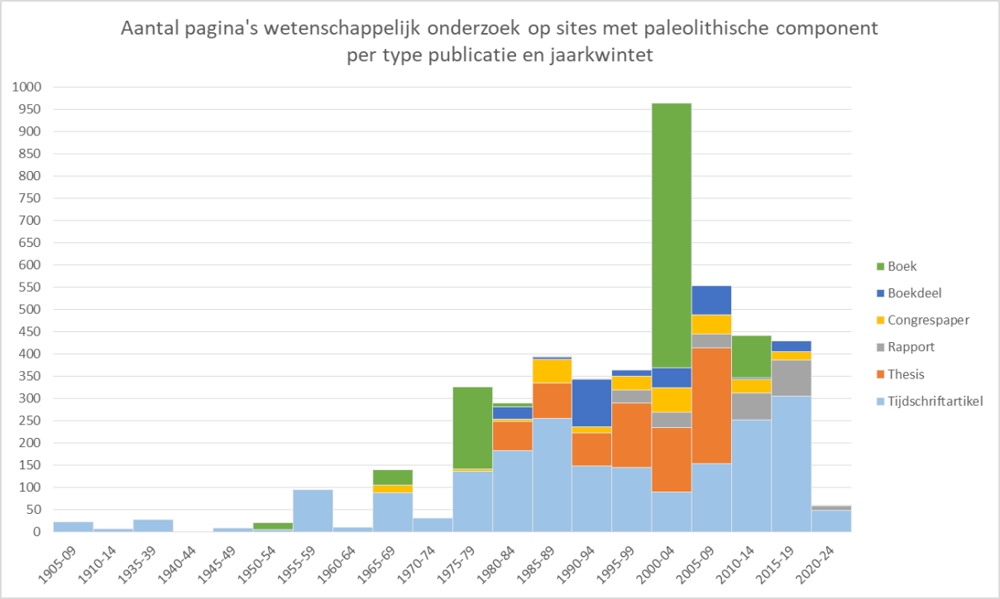{width="6.298611111111111in" height="3.7781944444444444in"}

> Figuur 19: Aantal wetenschappelijk gepubliceerde pagina's over paleolithisch onderzoek in Vlaanderen, per type publicatie en jaarkwintet.

Dergelijke éénmalige uitgaven beïnvloeden natuurlijk ook in sterke mate het beeld van de populariteit van publicatietypes binnen de verschillende paleolithische subfases (Figuur 20). De pas genoemde thesissen en boekdelen zijn duidelijk herkenbaar in het relatief hoger aantal gepubliceerde pagina's in dit type voor het middenpaleolithicum, terwijl de boeken zoals gezegd voornamelijk het finaalpaleolithicum behandelen. Hetzelfde geldt voorlopig voor de rapporten.

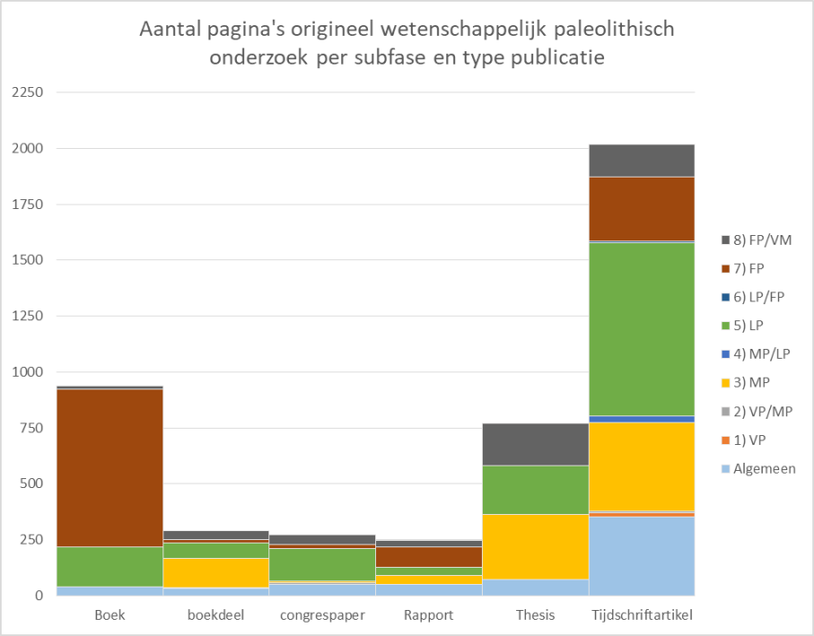{width="4.7243055555555555in" height="3.6944444444444446in"}

> Figuur 20: Aantal gepubliceerde pagina's origineel wetenschappelijk onderzoek over paleolithicum in Vlaanderen, per subfase en type publicatie. Legende: VP = vroegpaleolithicum; MP = middenpaleolithicum; LP = laatpaleolithicum; FP = finaalpaleolithicum; MP/LP = combinatie.

In ieder geval blijven de tijdschriftartikels voor alle fases, en zowel in totale omvang aan pagina's als zeker in aantal publicaties (Figuur 21) het belangrijkste kanaal voor de publicatie van onderzoeksresultaten over het paleolithicum in Vlaanderen.

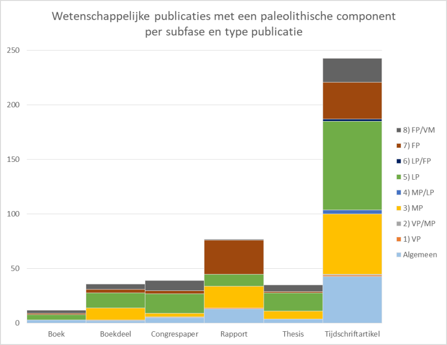{width="4.724166666666667in" height="3.6534722222222222in"}

> Figuur 21: Aantal wetenschappelijke publicaties van paleolithisch onderzoek in Vlaanderen, per subfase en type publicatie. Legende:  VP = vroegpaleolithicum; MP = middenpaleolithicum; LP = laatpaleolithicum; FP = finaalpaleolithicum; MP/LP = combinatie.

Als maatstaf voor de (potentiële) internationale verspreiding van het gepubliceerde onderzoek werd ook naar de taal van de werken gekeken. Daaruit blijkt dat ruim de helft (56,5 %) van alle wetenschappelijke publicaties over paleolithicum in Vlaanderen in het Nederlands uitgebracht zijn, een klein kwart in het Engels (24 %), een vijfde in het Frans (18 %) en een verwaarloosbaar klein percentage in het Duits (1,5 %; Figuur 22). Ook hier geeft dezelfde oefening een heel ander beeld voor het aantal gepubliceerde bladzijden originele onderzoeksresultaten. Dan blijken bijna evenveel pagina's in het Engels (39,3 %) als in het Nederlands (39,5 %) te zijn gepubliceerd en volgt het Frans pas op de derde plaats met slechts 19,7 % (Figuur 23).

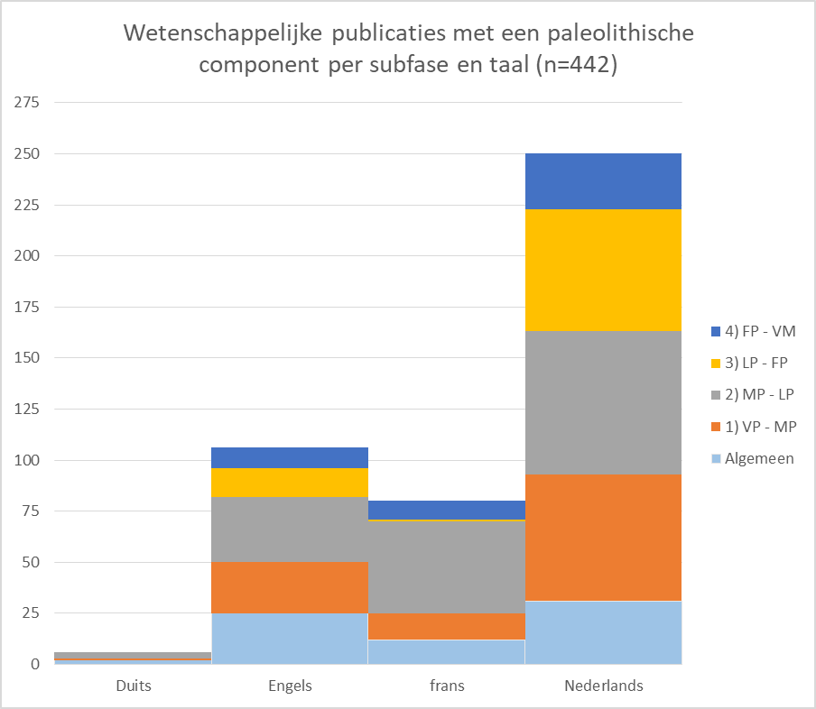{width="4.724306649168854in" height="4.107638888888889in"}

> Figuur 22: Aantal publicaties wetenschappelijk onderzoek over paleolithicum in Vlaanderen, per subfase en per taal waarin werd gepubliceerd.Legende: VP -- MP = vroeg- tot middenpaleolithicum; MP -- LP = midden- tot laatpaleolithicum; LP -- FP = laat- tot finaalpaleolithicum; FP -- VM = finaalpaleolithicum tot vroegmesolithicum.

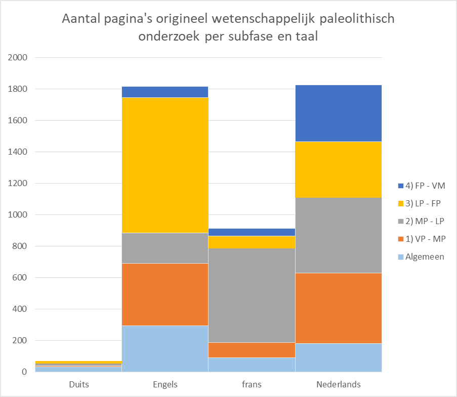{width="4.724027777777778in" height="4.095833333333333in"}

> Figuur 23: Aantal gepubliceerde pagina's origineel wetenschappelijk onderzoek over paleolithicum in Vlaanderen, per subfase en per taal waarin werd gepubliceerd. Legende: VP -- MP = vroeg- tot middenpaleolithicum; MP -- LP = (overgang midden- tot) laatpaleolithicum; LP -- FP = (overgang laat- tot) finaalpaleolithicum; FP -- VM = (overgang finaalpaleolithicum tot vroegmesolithicum.

In de pioniersjaren en tot in de jaren 1970 domineerde het Frans als wetenschappelijke taal het paleolithicumonderzoek in Vlaanderen in het aantal publicaties (Figuur 24). In de tweede helft van de jaren 80 kent het aantal Franstalige publicaties een piek. Na deze piek neemt de populariteit van het Frans echter af. Het aantal onderzoeken die in het Frans verschijnen blijft de laatste decennia klein. Het Engels komt pas schuchter opzetten vanaf einde jaren 1970, maar gaat vanaf de jaren 1990 het Frans domineren. In het jaarkwintet 2015-2019 is ook een plotselinge toename in Engelstalige publicaties te zien. Het spreekt voor zich dat, om internationaal enige relevantie te hebben en de kwaliteit te blijven bewaken, ook in de toekomst Engelstalige publicaties moeten worden aangemoedigd. In Figuur 24 zien we ook het effect van de opkomst van de privésector: na een graduele opkomst van Nederlandstalige publicaties tussen 1975 en 2004, stijgt het aantal abrupt vanaf 2005 om een piek te bereiken in het jaarkwintet 2010-2014. Sinds 2015 wordt echter weer een daling in het aantal publicaties in het Nederlands genoteerd.

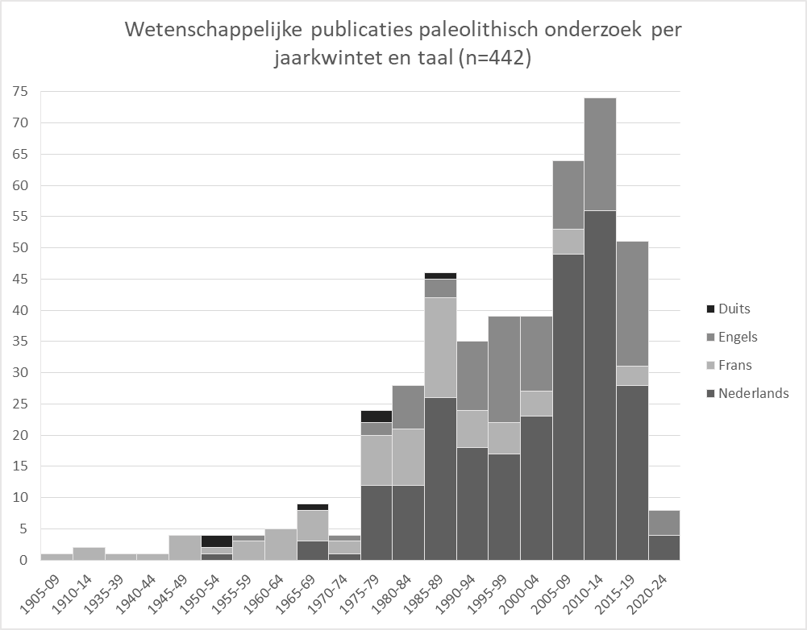{width="6.298472222222222in" height="4.920833333333333in"}

> Figuur 24: Aantal publicaties origineel wetenschappelijk onderzoek met een paleolithische component in Vlaanderen, per jaarkwintet en taal waarin werd gepubliceerd.

De tendenzen die in Figuur 24 te zien zijn vertalen zich niet helemaal in Figuur 25. In de periode tussen de pioniersjaren en 1980 domineerde het Frans ook in het aantal gepubliceerde pagina's duidelijk als wetenschappelijke taal het paleolithicumonderzoek in Vlaanderen. Het aantal Franstalige pagina's daalde daarna in het voordeel van Nederlandstalige literatuur.

Een trend die zich dan weer niet vertaalt, is de abrupte stijging in het aantal Nederlandstalige publicaties; deze is niet terug te vinden in het aantal pagina's. Hieruit is dus te concluderen dat paleolithische vondsten vaker gerapporteerd werden, maar dat er minder pagina's aan die rapportage werden gespendeerd. Dat is enigszins te verklaren door de reeds eerder aangehaalde observatie dat een groot deel van de nieuwe vindplaatsen uit losse vondsten bestaat die tijdens onderzoek naar jongere periodes is aangetroffen. Voor de vindplaatsen die wel verder onderzocht werden, dient rekening gehouden te worden met het feit dat het wettelijk kader voor Malta-archeologie enkel een basisassessment oplegt en dus geen opportuniteiten creëert voor een diepgaandere uitwerking van de onderzoeksresultaten. De output van dergelijk onderzoek blijft dan ook voorlopig beperkt.

De piek in het aantal Engelstalige pagina's rond de eeuwwisseling is te verklaren door de publicatie van het boek over Rekem.

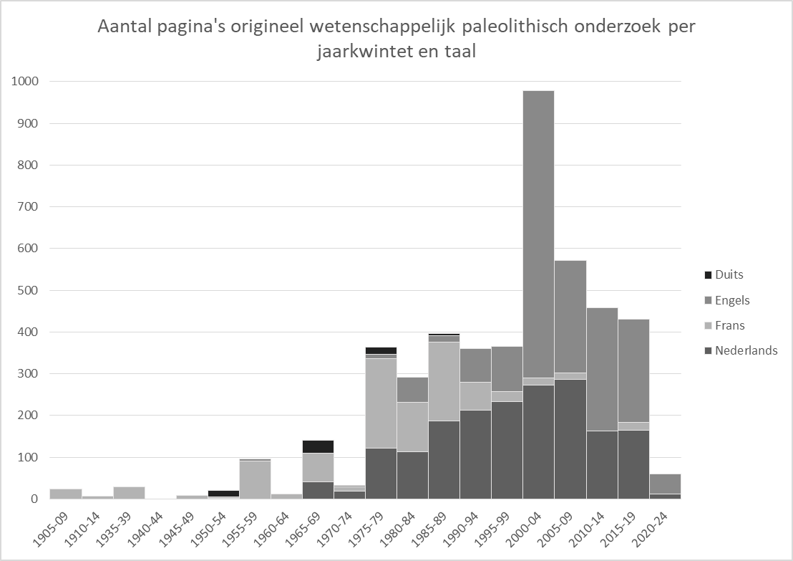{width="6.298611111111111in" height="4.450694444444444in"}

> Figuur 25: Aantal gepubliceerde pagina's origineel wetenschappelijk onderzoek over paleolithicum in Vlaanderen, per jaarkwintet en taal waarin werd gepubliceerd.

Algemeen kan worden aangenomen dat doorgedreven studie en publicatie voornamelijk door doctoraten mogelijk worden gemaakt (Crombé, De Bie, Perdaen, Bringmans, Van Baelen en recentelijk Vandendriessche). Daarbuiten blijft de wetenschappelijke ontsluiting te vaak beperkt tot basisrapportage of het publiceren van deelonderzoek. Bovendien stellen we vast dat de recente ontwikkelingen op vlak van preventieve archeologie in Vlaanderen deze tendens nog versterkt. De verplichte aanlevering van eindrapporten binnen een bepaalde termijn heeft weliswaar een positief effect. Echter, de minimale eisen, opgenomen in de code van goede praktijk, beperken zich tot een beknopt basisassessment. Binnen een commercieel gegeven is er dan ook geen hefboom meer voor meer doorgedreven onderzoek en blijft veel potentiële kenniswinst onontgonnen.

Daarnaast kunnen we zeker pleiten voor het ontwikkelen van *synthesewerken*. Voor het middenpaleolithicum in België focusten deze zich in de 20^ste^ eeuw zeer sterk op de grotsites in het bekken van de Maas[^157] en op de openluchtsites in de Hainevallei[^158]. De sites in Vlaanderen kwamen hierin nauwelijks aan bod. In het boek van Crombé & Van der Haegen[^159] is wel een synthese te vinden en ook P. Van Peer heeft in zijn overzicht naar aanleiding van het UISPP-congres in Luik^170^ wel enige aandacht voor Vlaanderen, maar het blijft al bij al vrij beperkt. Naar aanleiding van het onderzoek te

Kesselt, Veldwezelt en Oosthoven is er in de recente overzichten wel meer aandacht voor Vlaanderen. Zo werden heel wat Vlaamse sites opgenomen in het doctoraatsonderzoek en daaropvolgende publicaties van K. Di Modica (ULiège) dat handelde over grondstofgebruik en lithische technologie tijdens het middenaleolithicum in België[^160]. Daarnaast zijn er diverse bijdragen over het middenpaleolithicum opgenomen in het boek 'Le Paléolithique moyen en Belgique. Mélanges Marguérite Ulrix-Closset'[^161].

Voor de finaalpaleolithische vindplaatsen in de Kempen zijn een aantal overzichten gepubliceerd[^162]. Naar aanleiding van de diverse onderzoeken in zandig Vlaanderen naar finaalpaleolithische vindplaatsen zijn recent diverse overzichtsartikels verschenen met een sterke paleoecologische invalshoek^174^.

# 4 BALANS IN DE TIJD 

##  4.1 INLEIDING 

In dit hoofdstuk bespreken we de belangrijkste vindplaatsen in Vlaanderen binnen een diachrononisch perspectief en behandelen we de voornaamste dateringsproblematieken.

De kwantitatieve analyse gebeurde, naar analogie van de eerste versie van de onderzoeksbalans, op basis van de **Centrale Archeologische Inventaris** van Vlaanderen (CAI). Vooraf moeten in verband met de waarde en het gebruik van deze bron wel enkele zaken worden opgemerkt:

-   Voor de periode tot 2007 zijn enkel de sites waarvan de ligging enigszins bekend is (namelijk tot op 500 m nauwkeurig) in deze analyse in aanmerking genomen. Er is dus nog een (onbekend) aantal vindplaatsen niet opgenomen. Vindplaatsen die hierna zijn toegevoegd aan de CAI zijn bijna uitsluitend sites waarvan de ligging enigszins bekend is, waardoor van een vrij volledige dataset kan uitgegaan worden.

-   De eenheid 'site' - basis voor het unieke ID in de CAI en hier gebruikt als teller - is natuurlijk een problematisch begrip. In sommige gevallen zijn verschillende *loci* van één sitecomplex als aparte sites geteld (bijv. in Meer-Meirberg en Lommel-Maatheide), in andere gevallen als één site (bijv. in Rekem). Het viel buiten de opzet van deze balans om hier zelf éénvormigheid in aan te brengen. Wel is er bij het maken van kaarten (bij de ruimtelijke balans; zie verder) voor geopteerd om enkel de gemeenten te plotten waar vondsten zijn gerapporteerd, zonder enige kwantitatieve aanduiding. Verder gaan we ervan uit dat deze schommelingen in alle periodes voorkomen en dus worden uitgevlakt in de vergelijkingen.

-   De belangrijkste problematiek bij het gebruik van deze bron is de vraag naar de representativiteit. Bevat de CAI daadwerkelijk een inventaris van alle paleolithische vindplaatsen die in Vlaanderen bekend zijn of tenminste gepubliceerd of gemeld? We moeten er sowieso van uitgaan dat bepaalde collecties nog niet ontsloten zullen zijn, maar van de openbaar gemaakte zaken zouden we moeten kunnen aannemen dat ze hierin geregistreerd zijn. Ook deze screening gaat de opzet van de onderzoeksbalans te boven - het impliceert immers een aparte evaluatie van de CAI op zich - maar op basis van een kleine toets moesten we toch vaststellen dat er pertinente lacunes zijn. In de gebruikte referenties valt bijvoorbeeld op dat de Repertoria of de vroegere kroniek in Helinium een relatief beperkt aantal keren als bron zijn vermeld. Mogelijk zijn vele meldingen hierin niet voldoende precies gelokaliseerd en daardoor niet in onze lijst aanwezig, maar talrijke vondstmeldingen - in de Repertoria bijvoorbeeld - geven wel vaak de primaire literatuurbron aan waarin mogelijk betere lokalisatie te vinden is. De vraag is dus of alle lokale tijdschriften bijvoorbeeld ook volledig zijn geëxcerpeerd.

-   De CAI bevat, zoals ook in de versie van 2008 het geval was[^163], ook in zijn huidige vorm immers zeker niet het volledige bestand aan gekende gegevens over paleolithische (en andere) sites en vondsten. Daarbij werden de verslagen en rapporten van preventief onderzoek in het kader van het vroegere archeologiedecreet nagenoeg volledig verwerkt, maar is er een zekere achterstand in verwerking van de nota's en archeologienota's van de laatste jaren. De eindverslagen van archeologische opgravingen werden wel geheel (tot eind 2020) in de CAI verwerkt. De verwerking van verschenen literatuur (tijdschriften, boeken, etc.) sinds 2008 gebeurde, door tijdsgebrek, eerder *ad hoc*, zo bijvoorbeeld de artikels verschenen in de *Notae Praehistoricae*[^164]. Ook voor de verwerking van amateurarcheologische collecties kon in de laatste 10 jaar slechts zeer summier in het kader van de CAI aandacht geschonken worden.

> Een uitzondering zijn de verslagen van De Meireleir en De Bock, die tot 2019 werden verwerkt[^165].

Zolang deze vragen niet beantwoord zijn en lacunes in de verwerking van de gegevens aangevuld worden, is het evident dat we deze inventaris in kwantitatief onderzoek met enige omzichtigheid moeten gebruiken. Omdat het in zekere zin wel deel uitmaakt van een balans, hebben we toch in grote lijnen de inhoud van de CAI voor het paleolithicum onderzocht.

De kwalitatieve analyse gebeurde grotendeels op basis van een literatuurstudie, met een focus op de vindplaatsen die de laatste 40 jaar aan het licht gekomen zijn. Hierbij dient opgemerkt te worden dat de resolutie waarmee vindplaatsen chronologisch geplaatst worden sterk verschilt. Voor vindplaatsen vanaf het laatglaciaal ligt deze resolutie een stuk hoger en is gekozen om zoveel mogelijk de datering in BP (ofwel *before present*) aan te geven. Terwijl dit voor de oudere vindplaatsen vaak niet mogelijk is en hier is gekozen om de vindplaatsen (indien mogelijk) te plaatsen binnen het algemeen chronostratigrafisch kader met een opeenvolging van glaciale en interglaciale fases. Hierbij wordt enerzijds gereferreerd naar de chronostratigrafie op basis van de continentale afzettingen (traditioneel vernoemd naar specifieke rivieren, zoals de Eem en Weichsel) als naar de fases op basis van mariene isotopen (MIS, ofwel Marine Isotope Stage). De correlatie tussen beiden en chronologische begrenzing is echter niet altijd evident en wordt regelmatig herzien.

## 4.2 OVERZICHT VAN DE GEKENDE SITES PER PERIODE 

Het aantal CAI-registraties van sites met een steentijdcomponent is sinds de update van de onderzoeksbalans ruim verdubbeld (van 4824 in 2008 naar 10.469 records in 2020 om precies te zijn). Van de ruim 10.000 locaties is maar 4,3 % (N=449) in het paleolithicum gesitueerd (Figuur 26). Dit is beduidend minder dan in het mesolithicum (24,1 %) en zeker het neolithicum (27,8 %). De meerderheid van de registraties (43,8 %) heeft dus betrekking op lithisch materiaal waarvan de steentijdperiode niet gedetermineerd kon worden.

Binnen het paleolithicum (Figuur 27) domineren in deze inventaris de finaalpaleolithische sites (ca.

40%) boven de middenpaleolithische sites (ca. 24%).

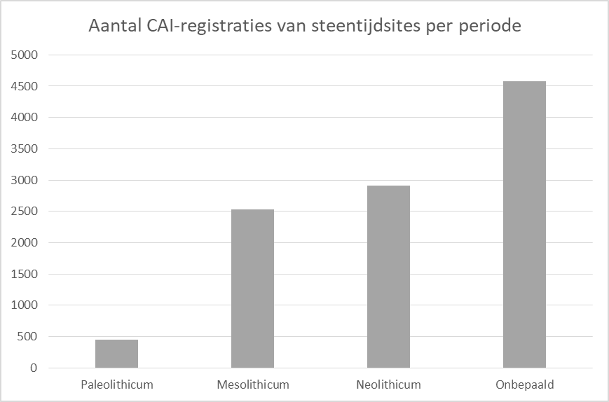{width="4.723472222222222in" height="3.120138888888889in"}

> Figuur 26: Aantal registraties in de CAI van steentijdsites per periode.

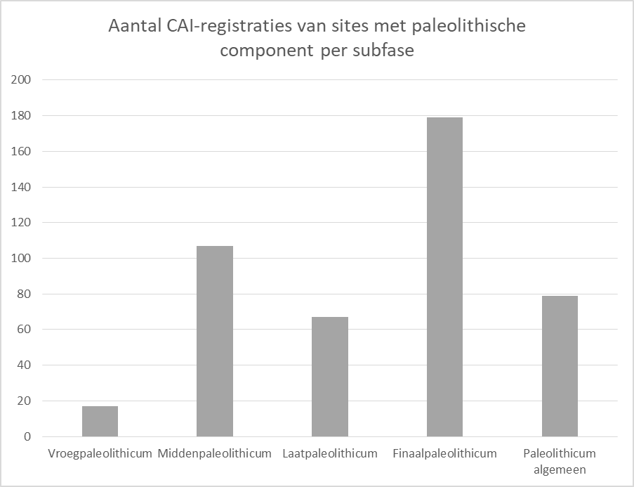{width="4.724027777777778in" height="3.625in"}

> Figuur 27: Aantal registraties in de CAI van sites met een paleolithische component, per subfase.

Zeer opmerkelijk is dat er niet minder dan 67 sites (ca. 15 %) in de CAI als laatpaleolithicum geregistreerd staan. Na de hogere beschouwingen roept dit aantal natuurlijk wel vragen op. Nadere inspectie van het bronnenmateriaal waarop deze toewijzingen in de CAI zijn gebaseerd, leert dan ook dat, op de bekende sites na (Kanne dus), de laatpaleolithische interpretaties met de grootste omzichtigheid moeten worden gehanteerd. Sommige opnames lijken gewoon een vergissing (slecht overgenomen uit de literatuur), andere zijn gebaseerd op oude publicaties, die zoals hoger al gesteld de gewoonte hadden finaalpaleolithische vondsten in het laatpaleolithicum te situeren, nog andere zijn gebaseerd op meldingen door amateurarcheologen of afkomstig uit prospectiethesissen, waar de kwaliteit van de interpretaties al eens kan variëren. Specifiek voor de periode na 2007 Het spreekt voor zich dat deze registraties in de eerste plaats een kritische evaluatie behoeven.

Hetzelfde geldt voor de 17 meldingen van vroegpaleolithicum. Vaak gaat het hier om middenpaleolithische sites die (ook) als vroegpaleolithicum geregistreerd werden. Hoe dan ook is geen enkele van deze sites, op Kesselt na, op één of andere wijze gedateerd. Tot slot zijn er nog 79 locaties (ca. 17,5 %) gemeld waarvan de paleolithische fase niet nader kon worden gespecificeerd.

## 4.3 VROEG- EN MIDDENPALEOLITHISCHE VINDPLAATSEN EN HUN DATERINGSPROBLEMATIEK 

Vindplaatsen uit het vroeg- en middenpaleolithicum blijken vaak moeilijk te dateren. Dit heeft voor een groot deel te maken met de context waarin ze aangetroffen werden. Het grootste deel van de gekende vindplaatsen uit deze periode betreft oppervlaktevindplaatsen. Ze bevinden zich in een geërodeerde context die geen datering op basis van chronostratigrafie, associatie met fauna of absolute dateringen toelaat. De toewijzing gebeurt in dat geval op basis van (een combinatie van) typologische, technologische of fysische kenmerken van het lithisch materiaal. Deze problematiek speelt bijvoorbeeld voor de talrijke vindplaatsen die doorheen de jaren zijn aangetroffen op een aantal getuigenheuvels in het Heuvelland en de Vlaamse Ardennen, zoals op de Kemmelberg[^166], Muziekberg[^167] en Kluisberg[^168].

Een tweede belangrijke verklaring heeft te maken met het ontbreken van een georganiseerde onderzoekscampagne tijdens het inzamelen van de vondsten. In de 19^de^ en 20^ste^ eeuw zijn een aantal gestratifieerde vindplaatsen aan het licht gekomen in groeves of bij ontginningswerken. Hierbij werden vaak in weinig gunstige omstandigheden vondsten en faunaresten ingezameld, maar ontbreekt grotendeels informatie met betrekking tot de stratigrafische context. Dat was bijvoorbeeld het geval voor de vindplaatsen Rotselaar -- Toren ter Heide[^169] of de groeve Maes te Uitbergen[^170]. Deze problematiek beperkt zich niet tot vindplaatsen binnen Vlaanderen. Uit een recente analyse van middenpaleolithische vindplaatsen in België blijkt dat van de 442 vindplaatsen die men analyseerde, slechts 28 (ofwel 6%) zich kenmerkt door een voldoende betrouwbare chronostratigrafische context[^171]. Deze vindplaatsen en hun chronostratigrafische toewijzingen worden weergegeven in Figuur 28.

Van uitzonderlijk belang voor Vlaanderen zijn de diverse vindplaatsen die ontdekt en systematisch onderzocht werden in en nabij leemgroeves te Kesselt[^172] en Veldwezelt[^173], aangezien het om één van de weinige regio's gaat waarin doorheen de jaren met een interdisciplinaire aanpak meerdere afgedekte, goed bewaarde vindplaatsen zijn onderzocht. Te Kesselt-Op de Schans gaat het oudste niveau, dat weliswaar herwerkt materiaal bevat, vermoedelijk minstens terug tot de aanvang van MIS 10 (ca. 390.000 BP).[^174] Dit is meteen ook de enige gedateerde vroegpaleolithische vindplaats in Vlaanderen. Daarnaast zijn op een beperkt aantal locaties zogenaamde vroegpaleolithische vondsten aangetroffen aan het oppervlak, maar blijkt de datering ervan over het algemeen weinig onderbouwd.

Uit het vroege midden-paleolithicum, een term doorgaans gehanteerd voor de periode van MIS 8 tot en met MIS 6 (300.000 -- 130.000 BP), zijn een aantal vindplaatsen gekend. Te Kesselt -- Nelissen werden zes niveaus met artefacten aangetroffen, waarvan de twee oudste niveaus dateren respectievelijk in MIS 7 en MIS 6 [^175]^.^ Aan de overzijde van het Albertkanaal zijn in Kesselt -- Op de Schans twee goed bewaarde niveaus met lithisch materiaal gedateerd in de Saale (MIS 7 en de overgang van MIS 9 naar 8)[^176]. Onmiddellijk ten noorden hiervan werden in Veldwezelt -- Hezerwater binnen de loess-sequentie 24 archeologische niveaus aangetroffen, waarvan een aantal clusters in de late Saale (MIS 6) gedateerd zijn[^177].

Uit het interglaciale Eem (MIS 5e, 128.000-116.000 BP) zijn voorlopig weinig data gekend. Oorspronkelijk werd voor één van de archeologische niveaus te Veldwezelt-Hezerwater een mogelijke datering in deze periode voorgesteld^190^, deze datering werd echter ondertussen weerlegd.[^178] . Naar aanleiding van de herevaluatie van de site te Rotselaar -- Toren ter Heide werd voor het ensemble van de verse artefacten onlangs eveneens een datering op de overgang van het Eem naar de laatste ijstijd voorgesteld. [^179] Uit deze periode komen vindplaatsen in noordwest-Europa slechts sporadisch voor. Tot eind vorige eeuw werd vaak verondersteld dat neanderthalers zich niet konden aanpassen aan deze warme periode, waarin de gemiddelde temperatuur tot 2 graden hoger lag in vergelijking met

het huidige interglaciaal. De laatste decennia komen echter steeds meer vindplaatsen uit het Eem aan het licht (bijv. de Franse site Caours in de Sommevallei[^180] en het Duitse Neumark-Nord[^181]). De recentste inzichten wijzen eerder op tafonomische processen evenals een gebrek aan kennis omtrent het interglaciaal paleolandschap als verklaring voor het lage aantal Eem-vindplaatsen[^182]. Dat is ook voor Vlaanderen het geval. Toch zijn er -- naast Rotselaar -- nog indicaties die wijzen op een belangrijk onderzoekspotentieel voor deze periode. Binnen de Vlaamse vallei zijn er op basis van de quartairgeologische kartering op diverse locaties Eem-afzettingen gekend. Deze worden af en toe bij een archeologisch onderzoek herkend, zoals te Aalter-Langevoorde[^183] en te Maldegem[^184]. Ook te VerAssebroek is een middenpaleolithische bifaciale schrabber mogelijk geassocieerd met waddenafzettingen uit het Eem[^185]. Echter, een systematische prospectie of evaluatie gericht op vindplaatsen uit deze periode werd nog niet uitgevoerd.

De meeste vindplaatsen lijken vooral in het laatste glaciaal voor te komen (Weichsel, vanaf MIS 5d ofwel 112.000 BP). Te Veldwezelt-Hezerwater is een niveau in MIS 3 gedateerd[^186]. Te Kesselt -- Op de Schans zijn twee niveaus met in situ materiaal gedateerd in het vroegglaciaal (MIS 5d?)[^187]. Voor de site te Zemst -- Bos van Aa wordt het faunamateriaal op basis van een ESR datering op tandemail van mammoet en de geologische context in het vroegglaciaal geplaatst[^188]. Op basis van de nieuwe observaties wordt het gerolde lithische materiaal uit de collectie van de site te Rotselaar -- Toren ter Heide geassocieerd met een grindterras dat in het midden pleniglaciaal wordt geplaatst (MIS 3)[^189]. Ook de site Oosthoven -- Heieinde, waar het materiaal geassocieerd is met een afgedekt *desert pavement*, wordt grofweg in het Weichsel gedateerd[^190]. Ook Vollezele - Congoberg[^191] wordt in het Weichsel gedateerd.

Ook voor een aantal van de vindplaatsen die gekend zijn op basis van beperkte observaties of oppervlaktekartering uit de vorige eeuw wordt soms een algemene datering in het Weichsel voorgesteld. Hierbij dient echter opgemerkt te worden dat dergelijke vindplaatsen vaak zijn gedateerd op basis van 'typische' mousteriaantechnologie en --werktuigen. Onderzoek heeft ondertussen niet alleen aangetoond dat die mousteriaankenmerken een ruimere chronologische spreiding hebben, maar eveneens dat de lithische technologie van neanderthalers een grotere complexiteit vertoont die vaak niet eenduidig met een chronologische periode kan vereenzelvigd worden. Bijvoorbeeld, het inzicht dat doorheen het middenpaleolithicum op diverse wijzen klingen werden geproduceerd is pas sinds de jaren '90 van vorige eeuw gegroeid[^192].

Voor het Waalse landsgedeelte zien we dat vondsten uit het vroeg- en middenpleistoceen er in beperkte mate voorkomen. Vindplaatsen zijn er eveneens vooral met het laatste glaciaal geassocieerd. Ook hier geldt dat voor het onbreken van vindplaatsen in interglaciale fases mogelijk een tafonomische verklaring aan de orde is. Wat het laatpleistoceen betreft, blijken middenpaleolithische vindplaatsen voornamelijk voor te komen in de vroege Weichsel. Vindplaatsen uit het midden pleniglaciaal komen

er voornamelijk voor in grotsites. Tijdens de tweede helft van het vroeg pleniglaciaal[^193] (MIS 4) lijkt bewoning, net als in Vlaanderen, afwezig te zijn. Ook de Noord-Franse gegevens uit het late middenpaleolithicum (MIS 5-3) wijzen erop dat in de allerkoudste fases van de ijstijden menselijke bewoning in het middenpaleolithicum afwezig lijkt[^194].We kunnen ons afvragen in welke mate dit patroon ook naar het vroege middenpaleolithicum (MIS 8 -- 6) kan worden uitgebreid. Aangezien de gegevens voor deze periode beperkter zijn, is het voorlopig moeilijk hierover met zekerheid uitspraken te doen.

In tegenstelling tot Vlaanderen is in het zuiden van het land de jongste fase van het middenpaleolithicum wel vertegenwoordigd, o.m. met vindplaatsen die dateren omstreeks 38.000 -- 35.000 BP (Scladina en Spy -- Betche au Rotches)[^195].

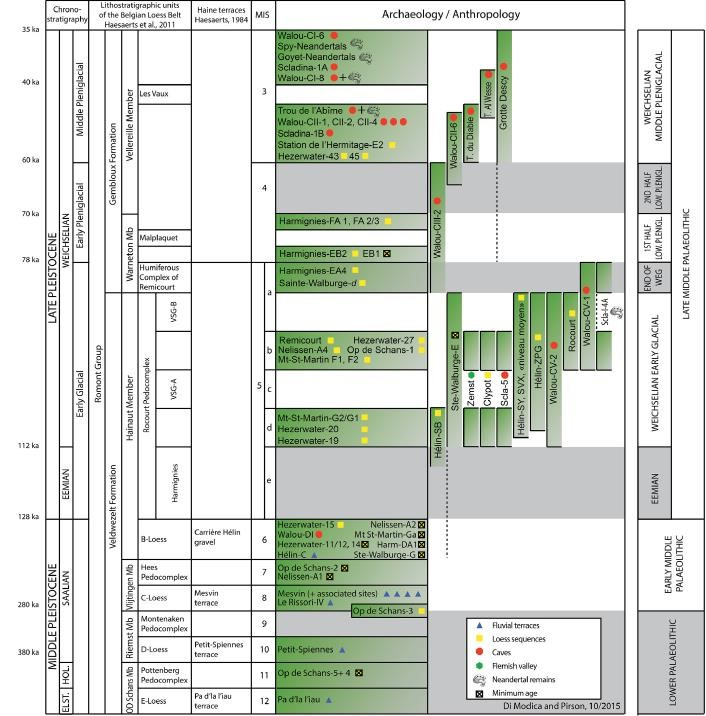{width="6.298611111111111in" height="6.3805555555555555in"}

> Figuur 28: Chronostratigrafisch overzicht van de belangrijkste Belgische vroeg- en middenpaleolithische vindplaatsen, opgesteld door Di Modica & Pirson 2016 (p. 8 -- fig. 5)

## 4.4 LAATPALEOLITHISCHE VINDPLAATSEN EN HUN DATERINGSPROBLEMATIEK 

Vindplaatsen uit het **laatpaleolithicum** (ca. 35.000 -- 14.000 BP) komen slechts met mondjesmaat voor in Vlaanderen. Het aurignaciaan (35.000 -- 29.000 BP) lijkt voorlopig enkel in de grotsites langs de Maas voor te komen, terwijl in Vlaanderen overtuigende vondslocaties uitblijven. Binnen de gemengde collectie van de Kemmelberg[^196] wordt voor bepaalde stukken een mogelijke datering in deze periode toegedicht. Sporadisch wordt op basis van bepaalde typologische affiniteiten een stuk als aurignaciaan bestempeld. Ook voor het gravettiaan (30.000 -- 23.000 BP) geldt dezelfde problematiek. Nochtans zijn openluchtvindplaatsen wel in de aangrenzende streken geattesteerd, zoals te Maisières-Canal in Henegouwen[^197]. Mogelijk is te Schulensbroek een gravettiaansite geïdentificeerd, maar ook daar blijven de indicaties beperkt[^198].

Met betrekking tot het magdaleniaan kan enkel de site te Kanne met voldoende zekerheid tot deze periode toegewezen worden. De site zou samen met Orp wel eens de vroegst bekende magdaleniaanoccupatie in de Benelux kunnen vertegenwoordigen[^199]. Hiervoor zijn niet alleen technotypologische argumenten aangehaald (door vergelijking met Duitse en Franse sites), maar ook de aanwezigheid van zware cryoturbatie en bijkomende loess-sedimentatie op de site na de menselijke aanwezigheid, een teken dat de ijstijd nog niet afgelopen was. Magdaleniaan vindplaatsen zijn eveneens bekend uit Nederland[^200] en Zuid-België. Ze bevinden zich aan de noordwestelijke rand van het verspreidingsgebied en worden over het algemeen rond 13.000 BP of iets vroeger gedateerd[^201]. De magdaleniaangroepen zijn met andere woorden de eerste kolonisators van onze streken na het glaciaal maximum[^202].

Hoewel dat door verschillende auteurs[^203] is geopperd, zijn er tot nu toe in Vlaanderen weinig indicaties van de aanwezigheid van creswelliaan[^204] zoals dat in het Verenigd Koninkrijk is gedefinieerd. Terwijl dit wel het geval is voor Nederland en Duitsland.

## 4.5 FINAALPALEOLITHISCHE VINDPLAATSEN EN HUN DATERINGSPROBLEMATIEK 

In het laatglaciaal is er wel duidelijke aanwezigheid van het finaalpaleolithicum, en dan vooral van de federmessergroepen die chronologisch vanaf de Oude Dryas (13.900 BP -- 14.000 BP), maar voornamelijk met het Allerød interstadiaal (12.850 BP -- 13.900 BP) worden geassocieerd. Absolute dateringen die onproblematisch geassocieerd zijn met laatglaciale archeologische contexten zijn in Vlaanderen echter nog steeds bijzonder schaars. Naast de datering van hars op een federmesser*s*pits in Rekem, waarvan de archeologische associatie niet ter discussie staat, zijn er enkele dateringen uitgevoerd op verbrand bot in Weelde-Eindegoorheide. De resultaten (ca. 11.900-10.800 BP) beslaan zowat de volledige Allerød^218^. De associatie met het lithisch materiaal staat er echter niet eenduidig vast. De site van Tongeren-Plinius werd op basis van de pijlbewapening typologisch als vrij oud

gedateerd. Het hoge percentage aan steilgeretoucheerde klingen zou wijzen op overeenkomsten met het magdaleniaan. Een ^14^C-datering op verbrand bot plaatst de vindplaats niet aan het begin van de Allerød, maar op het eind op de overgang naar Jonge Dryas[^205]. De site Verrebroek -- Dok 2 is op basis van paleo-ecologie en ^14^C-dateringen gesitueerd op de overgang van de Oude Dryas naar de Allerød[^206]. ^14^C-dateringen op houtskool zijn in deze periode meestal problematisch gebleken en leveren vaak een te jonge datering op, met uitzondering van Verrebroek -- Dok 2[^207]. Het heeft er ondermeer toe geleid dat de federmessergroepen foutief ook in het preboreaal en later werden gedateerd[^208]. Daarnaast is ook de houtskool van natuurlijke branden in de (top van de) Usselobodem moeilijk te onderscheiden van de 'culturele' houtskool. Thermoluminescentie datering van verbrande stenen kon meestal wel een laatglaciale ouderdom bevestigen (bijv. in Rekem[^209] en in Meer IV[^210]), maar blijft door de foutenmarge vrij breed. Recent onderzoek heeft uitgewezen dat ook het dateren van wit verbrand bot niet zonder risico's is, vooral op niet of heel laat afgedekte sites. De meeste dateringen blijken eveneens te jong uit te vallen als gevolg van infiltratie van jongere koolstof. Betere resultaten worden verkregen op sites die snel zijn afgedekt, zoals Verrebroek-Dok 2, waar de dateringen evenwel iets te oud te zijn omwille van de opname van koolstof van het brandhout[^211].

Vindplaatsen die op basis van hun associatie met een Usselobodem of organische paleobodem gedateerd zijn bevinden zich o.m. in het Landschap Liereman (Arendonk en Oud-Turnhout)[^212] en Lommel -- Maatheide[^213]. Deze Usselobodem wordt op het einde van de Allerød geplaatst en kenmerkt zich door de aanwezigheid van houtskoolfragmenten die wellicht het resultaat zijn van grootschalige bosbranden en dateren tussen 13.200-13.100 en 12.700-12.600 cal a BP. Deze bosbranden waren wellicht het gevolg van de koudere en drogere klimatologische condities die er toen optraden[^214]. Vaker nog worden vindplaatsen gedateerd op basis van het voorkomen van specifieke typotechnologische kenmerken, soms in combinatie van het voorkomen van bepaalde grondstoffen, bijv. zogenaamde Obourg-vuursteen, alhoewel deze grondstof ook geassocieerd is met andere culturen.

Ook de chronologische positie van de Ahrensburgsite van Zonhoven-Molenheide blijft onzeker. De ^14^Cdatering op houtskool komt in de buurt van de ouderdom van Usselobodem-houtskool en de vraag naar een associatie met het archeologische materiaal dient ook hier gesteld te worden. Daarnaast zijn in Vlaanderen nog een aantal vindplaatsen gekend waarvan de culturele toewijzing niet vaststaat. Bij de aanvang van de Jonge Dryas of mogelijk zelfs nog iets vroeger ontstaan in Europa een aantal culturen, kortweg Jonge Dryas culturen, die zich kenmerken door een verdere microlithisatie van de pijlbewapening (o.m. bromme, laboriaan of belloisiaan) en waarvan de invloed zich tot in Vlaanderen laat gelden. Ruien-Rosalinde is hiervan het mooiste voorbeeld. Het betreft een kortstondig bewoonde en snel afgedekte vindplaats waar o.m. een haardstructuur werd aangetroffen die gedateerd is op de overgang van de Allerød naar Jonge Dryas[^215]. De datering van de vindplaats Oudenaarde -- Markt sluit hierbij aan. Het lithisch materiaal bevindt er zich in de top van een zandige duin die zich heeft gevormd op het einde van het Pleniglaciaal. De artefacten zelf zijn geassocieerd met een eolische Jonge Dryas afgezettingen[^216]. Deze datering van het materiaal wordt verder ondersteund door de aanwezigheid van een *soil-cap*, een zandige korst, op een belangrijk deel van de artefacten wat wijst op intense vorstdooi activiteiten. Eenzelfde *soil-cap* is ook aangetroffen op het materiaal uit Gent-Tweekerkenstraat en lijkt ook deze vindplaats in de Jonge Dryas te plaatsen. Deze *soil-cap* is overigens ook geattesteerd

te Lommel-Maatheide en Landschap De Liereman, waar het materiaal was geassocieerd met de Usselobodem.

##  4.6 BALANS VAN HET ONDERZOEK PER CHRONOLOGISCHE FASE 

Voor een overzicht van het terreinwerk dat per paleolithische fase plaatsvond, verwijzen we naar hogere besprekingen van de historiek van het paleolithisch onderzoek in Vlaanderen en van de evolutie van het terreinwerk in de laatste veertig jaar. De bespreking van publicaties per chronologische fase is eveneens hoger terug te vinden in het overzicht van gepubliceerd onderzoek.

Hieruit kunnen we een opmerkelijke tendens waarnemen. Het onderzoek naar paleolithicum in Vlaanderen blijkt vooral gedreven door twee groepen van uitvoerders. Enerzijds spelen de amateurarcheologen een belangrijke rol. Ze hebben voornamelijk tal van oppervlaktevindplaatsen aan het licht gebracht, maar speelden -- vooral in de 20^ste^ eeuw - eveneens een belangrijke rol bij het in kaart brengen en verder opvolgen van toevalsvondsten bij bijv. bagger- en ontginningswerken. Anderzijds zien we dat er vooral vanuit academische hoek (tot enkele decennia terug vaak in samenwerking met de overheid) de belangrijkste kenniswinst voor het paleolithicum in Vlaanderen is gegenereerd. Voor het middenpaleolithicum zijn de onderzoeken die vanuit de KULeuven zijn geïnitieerd naar de verschillende vindplaatsen te Kesselt en Veldwezelt en Oosthoven-Heiende tekenend, evenals het prospectie-onderzoek in het oosten van de Vlaamse Vallei.

Voor het finaalpaleolithicum werd intensief onderzoek uitgevoerd in de Kempen door het toenmalige VIOE en de KULeuven, werden vindplaatsen binnen hun landschappelijke context onderzocht in de Schelde-vallei en Moervaart door de UGent en in het kader van het Sigma-plan een intensieve prospectie uitgevoerd door het toenmalige VIOE.

Voor het laatpaleolithicum ontbreekt vooralsnog systematisch onderzoek.

Ondanks de gestage toename aan Malta-archeologie en toenemende rol van commerciële archeologische uitvoerders, blijken ze een beperkte rol te spelen in de ontdekking of het onderzoek van paleolithische vindplaatsen. Indien vindplaatsen aan het licht komen, gaat het vaak om toevalsvondsten of losse vondsten bij onderzoek naar recentere periodes. Eerder uitzonderlijk wordt de onderzoeksstrategie dan aangepast en de context waarin de vondsten worden aangetroffen verder onderzocht. Het resultaat is dus vooral een toename aan stippen op de kaart, wat als een bevestiging voor het rijke paleolithische potentieel in gans Vlaanderen kan gezien worden. Maar het staat in schril contrast met archeologisch onderzoek naar post-steentijd periodes waar de Malta-archeologie net wel heeft geleid tot gericht onderzoek en een sterkte toename aan vindplaatsen. In het geval dat de onderzoeksstrategie wel wordt bijgesteld, merken we op dat het enkel om finaalpaleolithische vindplaatsen gaat. Die ontdekkingen hebben evenwel tot een belangrijke kenniswinst geleid en de dataset in sterke mate verrijkt. Voor een aantal vindplaatsen, zoals Ruien-Rosalinde en OudenaardeMarkt, is het terug de tussenkomst van een academische partner (in dit geval UGent) die meer doorgedreven onderzoek heeft toegelaten.

# 5 BALANS IN DE RUIMTE 

## 5.1 INLEIDING 

Conform de eerste versie van de onderzoeksbalans bespreken we in dit hoofdstuk de vindplaatsen per archeoregio. In hoofdstuk 1 werd reeds opgemerkt dat de archeoregio's, die afgebakend zijn op basis van het huidge landschap, voor het paleolithicum beperkt toepasbaar zijn. Doorheen het paleolithicum is het landschap immers in grote mate gewijzigd. Terwijl voor sommige archeoregio's wel kan beargumenteerd worden dat ze relevant zijn voor de bespreking van de finaalpaleolithische vindplaatsen (die zich vaak in de top van het vroegholocene landschap situeren), dient zelfs voor die periode opgemerkt te worden dat er binnen de regio's een grotere complexiteit aanwezig is en het landschap nog ingrijpend veranderde sindsdien, o.m. onder invloed van eolische als alluviale activiteiten.

We brengen het aantal bekende sites in kaart op basis van een kwantitatieve analyse van de CAI. Ook voor deze analyse gelden terug de opmerkingen die we met betrekking tot de voorgaande hoofdstukken hebben geschetst. Om een kwantitatief idee te krijgen van de verdeling van het paleolithische terreinwerk over de verschillende archeoregio's in Vlaanderen gedurende de laatste 40 jaar, maakte de eerste versie van de onderzoeksbalans voor de periode 1979-2007 opnieuw gebruik van de rapportage in *Notae Praehistoricae.* In het kader van de actualisatie werd deze bron na 2007 werd aangevuld met gegevens uit de CAI.

## 5.2 OVERZICHT VAN DE BEKENDE SITES PER ARCHEOREGIO 

De verspreiding van de paleolithische sites over de archeoregio's werd bekeken op basis van de gegevens in de CAI (Figuur 29). Het paleolithicum blijkt daarbij de verhoudingen van het mesolithicum te volgen, met het grootste aantal sites in de Kempen (48 %), gevolgd door de (zand)leemstreek (32 %) en ten slotte de Vlaamse zandstreken (15 %). In de Maasvallei en de duin- en poldergebieden bleven de vondsten voorlopig beperkt in aantal (samen ca. 5 %).

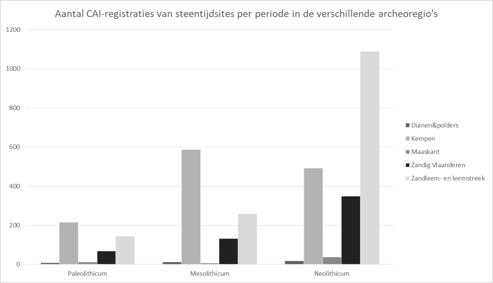{width="6.298611111111111in" height="3.618472222222222in"}

> Figuur 29: Aantal registraties in de CAI van steentijdsites per periode in de verschillende archeoregio's.

Het spreekt voor zich dat de kritische opmerkingen over (een deel van) de sites die in de CAI als paleolithicum geregistreerd staan, ook hun weerslag hebben op de waarde van de kaarten. Omdat dit inherent deel uitmaakt van de stand van zaken van het onderzoek en dus in deze balans thuishoort, geven we hier toch verspreidingskaarten van de sites waarin paleolithicum is gemeld.

Hieruit blijkt (Figuur 30) dat deze plaatsen in alle archeoregio's en over het hele gewest verspreid zijn, waarbij de oostelijke helft wel iets dichter bezaaid lijkt te zijn dan de westelijke. Figuur 31 toont dat ca. 17,5 % van het totaal aantal sites met een paleolithische component niet specifieker dan het paleolithicum gedateerd kunnen worden. Het gaat hierbij hoofdzakelijk om toevalsvondsten zonder of met een beperkte context.

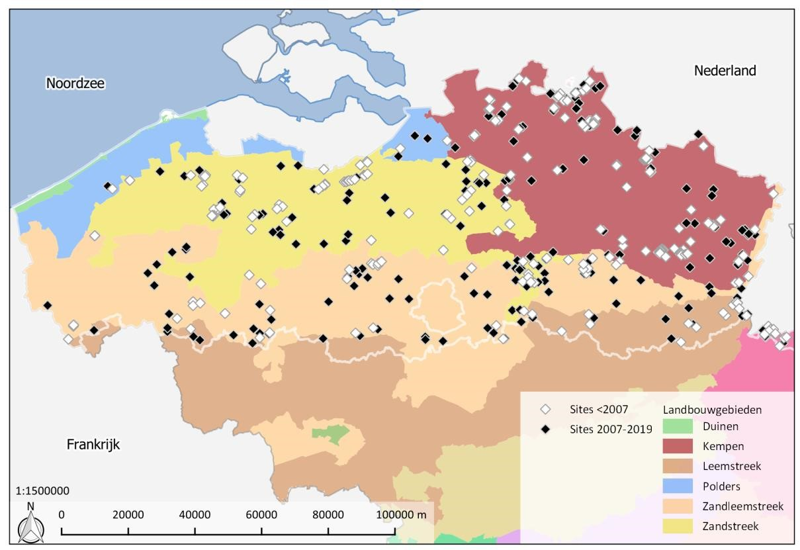{width="6.3005555555555555in" height="4.3326399825021875in"}

> Figuur 30: Verspreiding van sites in Vlaanderen waarin volgens de Centrale Archeologische Inventaris paleolithicum gekend is (toestand eind 2019).

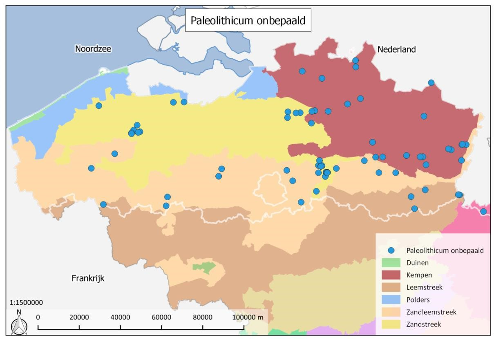{width="6.2975in" height="4.330555555555556in"}

> Figuur 31: Verspreiding van sites in Vlaanderen waar volgens de Centrale Archeologische Inventaris een algemene datering in het paleolithicum gekend is (toestand eind 2019).

Voor een deel kan de iets densere verspreiding in het oosten verklaard worden door de vermelding van vroegpaleolithische sites in de zuidoostelijke sector van het gewest (Figuur 30). Specifiek gaat het om het zogenaamde 'Hagelands clactoniaan'. Een revisie van deze vondsten dringt zich echter op.

Sinds de uitgave van de onderzoeksbalans in 2008 zijn enkele nieuwe sites met een vroegpaleolithische component aan het licht gekomen (Figuur 32). Deze bevinden zich terug grotendeels in de oostelijke (zand)leemzone van Vlaanderen. Echter ook bij de recentere vondstmeldingen blijkt de datering van de vondsten problematisch. Vaak gaat het om vuistbijlen ('Acheuleaan'), dewelke mogelijk ook in het middenpaleolithicum kunnen dateren, of om vondsten die gedateerd worden vanaf het vroegpaleolithicum maar deze datering niet in de CAI als dusdanig is overgenomen. Zoals we eerder vermelden is dit bijvoorbeeld het geval voor de vindplaats Gistel-Steenbakkerstraat die zich op de grens van het kustpoldergebied bevindt.

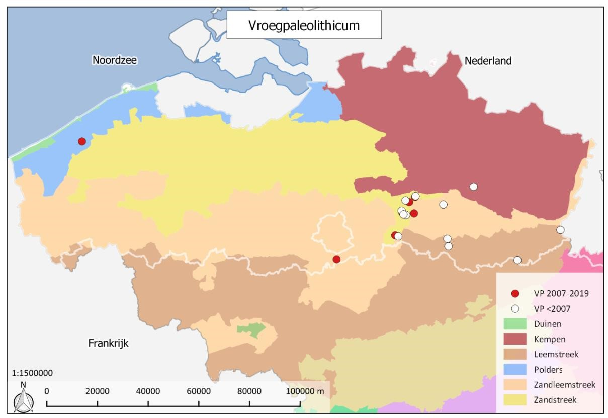{width="6.298472222222222in" height="4.33125in"}

> Figuur 32: Verspreiding van sites in Vlaanderen waarin volgens de Centrale Archeologische Inventaris vroegpaleolithicum gekend is (toestand eind 2019).

Het aantal sites met middenpaleolithische componenten is sinds 2007 gestegen, en ook qua verspreiding is een ander beeld te zien (Figuur 33). De huidige stand van zaken wijst erop dat deze sites niet enkel vooral in de Kempen en in de (zand)leemstreek gerapporteerd zijn, maar ook in de Vlaamse zandstreken steeds meer voorkomen. In de poldergebieden zijn sites nog steeds niet geattesteerd.

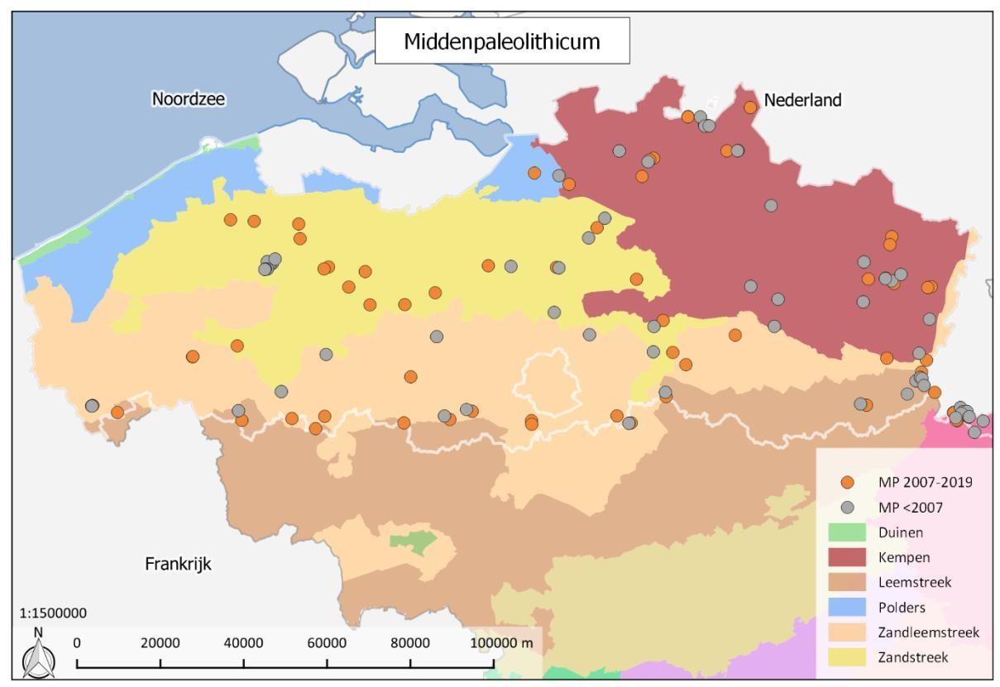{width="6.3005555555555555in" height="4.332638888888889in"}

> Figuur 33: Verspreiding van sites in Vlaanderen waarin volgens de Centrale Archeologische Inventaris middenpaleolithicum gekend is (toestand eind 2019).

De kaart met de verspreiding van de laatpaleolithische sites in Vlaanderen (Figuur 34) is wellicht de meest fictieve kaart en in de eerste plaats een artefact van de onderzoekshistoriek. Vele van de hier gekarteerde plaatsen vinden we trouwens ook terug op de andere kaarten. Onderzoek tussen 2007 en 2019 bracht meerdere vindplaatsen aan het licht, maar zoals we eerder aangaven gaat het voornamelijk om vindplaatsen met een algemene datering *vanaf* het laatpaleolithicum. Uitspraken over de verspreiding zijn nog steeds moeilijk. De nieuwe sites bevinden zich vaak in de buurt van reeds gekende vindplaatsen, maar deze verspreiding is waarschijnlijker nog steeds onderhevig aan onderzoekshiaten dan dat het een patroon in de activiteit uit het laatpaleolithicum aantoont.

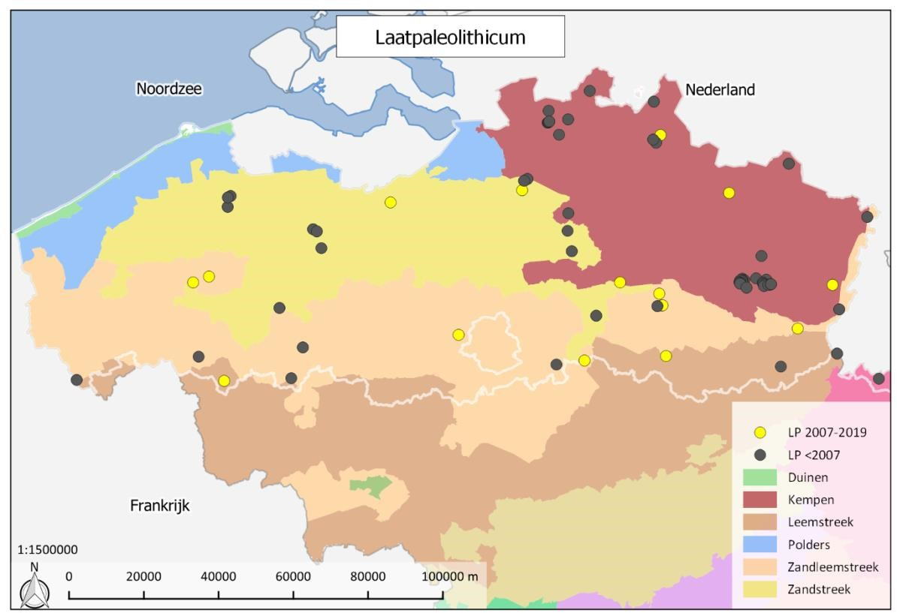{width="6.219722222222222in" height="4.277083333333334in"}

> Figuur 34: Verspreiding van sites in Vlaanderen waarin volgens de Centrale Archeologische Inventaris laatpaleolithicum gekend is (toestand eind 2019).

Voor het finaalpaleolithicum biedt de verspreidingskaart (Figuur 35) zeker een betere reflectie van de reële aanwezigheid van sites. Ruim 20 jaar aan recent onderzoek leverde voor deze subfase het grootste aantal nieuwe vindplaatsen op. Het verspreidingsbeeld van een dominantie in de Kempen en de Zandstreek lijkt bevestigd. Of dit ook overeenstemt met de archeologische realiteit, staat evenwel nog niet vast. Met name wanneer de Malta-onderzoeken in beschouwing genomen worden, blijkt er een sterke focus te zijn op steentijdverwachting in gebieden waar een podzolbodem voorkomt. Terwijl de aanwezigheid van een podzolbodem inderdaad als indicator kan gebruikt worden voor een goed bewaard bodemprofiel en dus ook gunstig voor de bewaring van artefacten die hierin voorkomen (bijv. finaalpaleolithische en jongere steentijdvindplaatsen), dient omzichtig omgesprongen te worden met de omgekeerde situatie. Steentijdvindplaatsen vanaf het finaalpaleolithicum zijn immers niet enkel geassocieerd met een podzolbodem. En het ontbreken van een podzolbodem hoeft niet altijd te wijzen op een slecht bewaard bodemprofiel. Deze sterke focus op podzolbodems kan deels verklaren waarom de meeste vindplaatsen ook aangetroffen zijn in de regio's waar dergelijke bodems voorkomen (in se de Kempen en Zandstreek). Voor de Leem- en Zandleemstreek blijkt het vaak lastiger om de bodemgaafheid goed in te schatten. Alhoewel daar ook nog andere verklaringen spelen, zoals bijvoorbeeld de impact van erosie en colluviale processen (zie verder). En voor de Kustpolders en Duinen merken we in het algemeen op dat de aandacht voor steentijdonderzoek heel lang ondermaats is gebleven, ondanks het gegeven dat er onder polderafzettingen een afgedekte, pleistoceen landschap deels bewaard bleef. Terwijl dit voor de polders ter hoogte van de Beneden-Schelde wel werd erkend en leidde tot de ontdekking van vindplaatsen te Doel, Verrebroek -- Dok 2 en Beveren -- LPW. In het algemeen moet wel rekening gehouden worden dat verschillende locaties ook gebaseerd zijn op loutere vondstmeldingen, zonder grondige evaluatie. In het bijzonder in de (zand)leemstreek zijn weinig betrouwbare sites bekend, alhoewel daar sinds de eerste versie van de onderzoeksbalans enige verandering is in gekomen met o.m. de vindplaatsen Ruien-Rossalinde en Oudenaarde -- Markt.

Een samenvatting per regio (Figuur 36) leert dat in de zandstreken van de Kempen en de Vlaamse provincies de finaalpaleolithische sites de middenpaleolithische domineren, terwijl in de (zand)leemstreek de middenpaleolithische sites met een nipte voorsprong het talrijkst zijn.

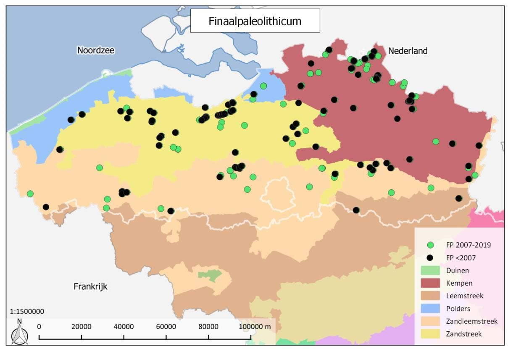{width="6.3005555555555555in" height="4.332638888888889in"}

> Figuur 35: Verspreiding van sites in Vlaanderen waarin volgens de Centrale Archeologische Inventaris finaalpaleolithicum gekend is (toestand eind 2019).

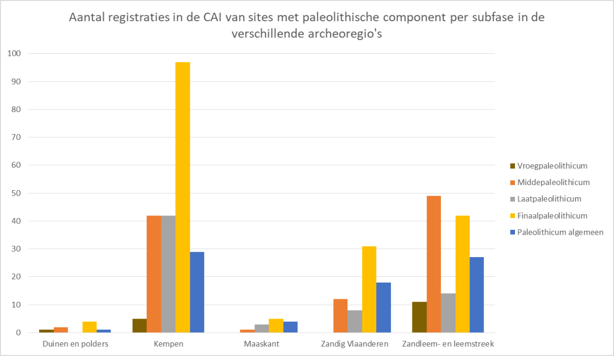{width="6.298194444444444in" height="3.6569444444444446in"}

> Figuur 36: Aantal registraties in de CAI van paleolithische sites per paleolithische fase in de verschillende archeoregio's.

##  5.3 HET PALEOLITHISCH POTENTIEEL VAN DE ARCHEOREGIO'S 

Zoals hoger al aangehaald hebben actuele archeoregio's in Vlaanderen niet noodzakelijk betekenis als landschappelijke parameters voor **middenpaleolithische** bewoning. Veel belangrijker zijn in dat verband paleolandschappelijke eenheden. Anderzijds hebben deze archeoregio's in het pleistoceen wel allemaal hun eigen dynamiek gekend en bieden ze daardoor verschillende tref- en bewaringskansen voor middenpaleolithicum.

Zo wordt Laag-België gedomineerd door de Vlaamse Vallei en haar zijrivieren. Deze vallei is het resultaat van afwisselende erosie- en opvullingsfases vanaf de Saale[^217]. Binnen de opgevulde vallei is er potentieel aanwezig voor goed bewaarde contexten die omwille van de geomorfologische evolutie van deze vallei voornamelijk dateren vanaf het laatpleistoceen[^218]. Over het algemeen bevinden deze niveaus zich onder een dik pakket sedimenten die tijdens het pleniglaciaal en laatglaciaal werden afgezet en kunnen ze enkel bij diepe ingrepen aan het licht komen. Bovendien hebben de opeenvolgende erosieve fases in belangrijke mate oudere niveaus weggevaagd en/of herwerkt. Dat betekent echter niet dat er geen goed bewaarde vindplaatsen meer aangetroffen kunnen worden. Zo blijkt bijvoorbeeld de impact van de getijdengeulen tijdens het Eem weliswaar voor een groot deel de eerder afgezette fluviatiele sedimenten weggewerkt te hebben, maar bleef deze impact beperkt ten zuiden van Gent en ter hoogte van enkele meer beschermde zones. De daaropvolgende insnijding tijdens de vroege Weichsel zorgde op zijn beurt voor de erosie van de Eemopvulling, maar ook nu weer bleven lokaal nog oudere sedimenten gevrijwaard[^219]. In welke mate deze niet-geërodeerde afzettingen vindplaatsen herbergen, vormde tot op heden nog niet het onderwerp van systematisch onderzoek. Dit met uitzondering van het reeds vermelde onderzoek door de KU Leuven ter hoogte van de oostelijke uitlopers van de Vlaamse vallei[^220]. Buiten deze regio kunnen we enkel terugvallen op een beperkt aantal oudere vondstmeldingen en onderzoeken die weliswaar getuigen van een rijk potentieel, maar waarbij informatie rond de chronostratigrafische context beperkt is (bijv. Gent-Port Arthur en Uitbergen -- Groeve Maes,[^221] zie bespreking verder in de tekst). Een recent, beperkt onderzoek in het westen van de Vlaamse vallei werd uitgevoerd ter hoogte van de groeve te Oekene Rennevoordestraat[^222]. In dit licht vermelden we tevens dat er sporadisch melding wordt gemaakt van oudere afzettingen tijdens archeologisch onderzoek gericht op jongere periodes, zoals de restanten van een Eem-wadgebied die in de Ver-Assebroekse meersen bij het onderzoek naar een middeleeuws kasteel werden gekarteerd en er geassocieerd is met enkele verspreide vondsten[^223], evenals een aantal onderzoeken in de regio van Maldegem waar een mogelijk Eemniveau werd aangetroffen, maar geen verdere evaluatie naar het steentijdpotentieel werd uitgevoerd[^224].

Buiten de Vlaamse vallei is het middenpaleolithicum in zandig en zandlemig Vlaanderen vooral gekend aan de hand van tal van oppervlaktevindplaatsen die zich vaak op dagzomende tertiaire opduikingen bevinden waar het in oorsprong dun kwartair dek geërodeerd is[^225]. Ook voor de vindplaatsen die zich op de getuigenheuvels van het Heuvelland en de Vlaamse Ardennen bevinden, geldt deze problematiek. Ze bevinden zich over het algemeen aan het oppervlak of zijn gevangen in verplaatste sedimenten, zoals bijv. te Vollezele-Congoberg waar het materiaal zich in colluviale afzettingen uit het Weichsel bevindt^240^.

Ten noorden van de Vlaamse Vallei, ter hoogte van de Kempen, kenmerken sites zich vooral aan de hand van oppervlaktevindplaatsen met een beperkt aantal vondsten. Onderzoek in het gebied van de Liereman heeft echter ook voor dat gebied het potentieel aangetoond voor beter bewaarde, afgedekte vindplaatsen[^226].

Het zandleem- en leemgebied van midden-België biedt dan weer potentieel op *in situ* bewaarde contexten, zoals het onderzoek op de diverse sites te Veldwezelt en Kesselt heeft aangetoond[^227]. Maar ook daar zijn vindplaatsen door de afdekking van een dik pakket (zand)leem weinig zichtbaar. Ze getuigen van het bijzonder rijk potentieel dat aanwezig is in het loessgebied zowel voor alle fases van het middenpaleolithicum. Wat overigens ook aangetoond wordt aan de hand van goed bewaarde en gedocumenteerde vindplaatsen in Nederland (bijv. Maastricht-Belvédère[^228]) en Wallonië (zoals Remicourt -- En Bia Flo I[^229]). Onderzoek net over de taalgrens, langs de Kleine Gete[^230], toont overigens aan dat ook ondiep bewaarde vindplaatsen in de beekvalleien kunnen aangetroffen worden.

In de kustpolders ontbreken vindplaatsen. In principe verschilt het middenpaleolithisch potentieel weinig van het zand(leem)gebied net ten westen ervan, maar zorgt de holocene geomorfologische ontwikkeling van het landschap hier voor een extra complexiteit omwille van de afdekking door veen en polderklei enerzijds en erosieve werking van getijdengeulen anderzijds. Op de huidige kaart wordt de kustlijn als begrenzing aangegeven, maar voor het paleolithicum gaat deze begrenzing uiteraard niet op. Terwijl tijdens koudere periodes de kustlijn verderaf lag of zelfs helemaal niet bestond, getuigen mariene afzettingen uit het Eem landinwaarts net van een omgekeerde beweging tijdens het interglaciaal. Onderzoek naar het potentieel van het pleistocene landschap ter hoogte van de litorale en sublitorale zones bleef echter lange tijd uit in België. Ter hoogte van het strand zijn weliswaar enkele vindplaatsen gekend, maar het betreffen voornamelijk oude vondstmeldingen waarvan het materiaal ondertussen deels verloren is gegaan. Deze collecties zijn niet opgenomen in de CAI. Ter hoogte van het strand van Walraversijde is materiaal aangetroffen dat onlangs werd geherevalueerd en deels in het finaalpaleolithicum kan geplaatst worden. Voor het middenpaleolithicum blijken vooralsnog enkel faunaresten gerapporteerd te zijn die op diverse locaties voor de kust zijn aangetroffen[^231]. Dit staat in schril contrast met de rijkdom aan vondsten voor de kust van Nederland waar naast talrijke lithische en benen artefacten en faunaresten, ook een schedelfragment van een Neanderthaler werd gevonden[^232]. Voor de Belgische sector wijst Pieters in zijn recent overzicht op een mogelijke relatie tussen de vondstlocaties en de aanwezigheid van verschillende opgevulde, pleistocene paleovalleien, die naar analogie van de Vlaamse vallei, aldus een bijzonder rijk onderzoekspotentieel bieden[^233].

Ook voor het **laat- en finaalpaleolithicum** is het onderscheid in verschillende archeoregio's ook vooral in die zin relevant. De variatie in sedimenten, topografie en historisch landgebruik zorgen er immers voor duidelijke verschillen in bewaringstoestand en vondstkansen.

In de *Maasvallei* bieden laatglaciale duinen en oeverwallen nabij de pleistocene Maasbedding duidelijk potentieel op de aanwezigheid van federmessersites, zoals in Rekem is gebleken[^234]. De bewaring ervan hangt af van latere eolische of alluviale afdekking en recent landgebruik. Ook aan de voet van het Kempisch Plateau kunnen sites bewaard zijn (Opgrimbie[^235]). Voorlopig zijn in de Maasvallei nog weinig sites echt bekend. Gerichte prospectie is hier pas zinvol na gedetailleerd paleolandschappelijk onderzoek.

Voor de *Kempen* is er in de zandcontexten en omwille van het relatief vlakke terrein sinds het laatglaciaal weinig watererosie en --sedimentatie. Finaalpaleolithische sites zijn er daardoor bij het huidige oppervlak of in het geval van jonge dryaszanden in vrij ondiepe toestand begraven. Dit maakt ze toegankelijker voor onderzoek, maar ook kwetsbaar voor processen van bioturbatie en verploeging. Begraven finaalpaleolithische sites geassocieerd met een paleobodem zijn er geattesteerd te Arendonk/Oud-Turnhout in het het landschap De Liereman[^236] en langs de Molse Nete te Lommel[^237]. Op deze locaties zijn uitgestrekte sitecomplexen uit het finaalpaleolithicum en mesolithicum waarin zowel afgedekte als oppervlaktevindplaatsen voorkomen. Oppervlaktesites zijn talrijker. Door de arme Kempische bodem zijn er nog steeds zones over in bos- en heidegebieden (de vroegere zogenaamde woeste gronden) waar de sites in de (podzol)bodem goed bewaard zijn. Zelfs in de jongere landbouwontginningen kunnen de ensembles nog duidelijk geconcentreerd aanwezig zijn (cf. Weelde- Eindegoorheide[^238]). In beide gevallen kunnen ze wel vermengd geraakt zijn met latere mesolithische occupaties (cf. Meer II[^239]) en zijn er door de droge zure bodems nauwelijks bewaringskansen voor organisch materiaal. Er is daarom geen informatie over de organische component van de materiële cultuur en ook goede dateringsmogelijkheden zijn gelimiteerd. Het moet ook gezegd dat de druk op de ruimte enorm blijft en mogelijke goed bewaarde contexten in snel tempo verdwijnen[^240].

Paleolithische vondsten in alluviale context zijn in de Kempen voorlopig nog beperkt, maar het onderzoek in de vallei van de Kleine Nete (Nijlen-Varenheuvel[^241]) heeft aangetoond dat ook deze gebieden onderzoeksperspectieven bieden.

Voor *Zandig Vlaanderen* geldt in enige mate ook wat al voor de Kempen is aangehaald, alleen is hier heel wat minder oppervlakte buiten landbouw gebleven en zijn de landbouwactiviteiten ook veel intenser geweest. Niettemin zijn ook hier enkele ongestoorde finaalpaleolithische sites opgegraven, zoals te Klein-Sinaai[^242] en in Adegem-Berlaars (opgraving Vanmoerkerke[^243]). Alleen al in de Scheldevallei zijn minstens 30 federmesservindplaatsen gekend[^244]. Op basis van onderzoek in de Scheldevallei en Moervaart stelt Crombé dat federmessergroepen in deze regio een voorkeur hadden voor de droge oevers van meren en vennen en de grote riviervalleien leken te vermijden.[^245] Dat wijkt enigszins af van wat we zien in de andere regio's (bijv. het hierboven vermelde Rekem ligt langs een oude Maasarm) en in het buitenland (zie verder).

De laatste decennia is er intensief steentijdonderzoek gebeurd in de Scheldevallei. Met betrekking tot het laatglaciaal zijn vooral onderzoeksresultaten geboekt in de Beneden-Schelde. Voornamelijk vanuit academische hoek en het toenmalige VIOE werd sinds het einde van de 20^ste^ eeuw gestart met onderzoek naar de riviervalleien, wat resulteerde tot tal van afgedekte vondstlocaties langs de Schelde en de zijrivieren[^246]. Zo zijn er in het Waasland onder de Scheldepolders bij de uitbreiding van het havengebied al op verschillende locaties goed bewaarde finaalpaleolithische sites aangetroffen en onderzocht, zoals te Verrebroek-Dok 2, Doel[^247] en Beveren - LPW^263^. Organisch materiaal bewaard in een natte context ontbreekt er voorlopig nog, de vernatting van de poldergebieden kwam voor het finaalpaleolithicum te laat, maar dit biedt zeker perspectieven voor toekomstig onderzoek vooral voor de recentere steentijd. Vanwege hun doorgaans diepe ligging zijn deze poldersites iets moeilijker te

prospecteren dan in de Kempen (er is uitgebreid paleolandschappelijk onderzoek nodig), maar ze zijn er in principe wel beter bewaard.

Systematische oppervlaktekartering door een aantal amateur-archeologen heeft geleid tot de ontdekking van tal van vindplaatsen die zich voornamelijk op dekzandruggen bevinden[^248]. Deze zijn vaak aangeploegd. Een uitgestrekt sitecomplex is bijvoorbeeld aangetroffen in en langs de Moervaartvallei[^249]. Mogelijk is rond de depressie te Ver-Assebroek een gelijkaardig patroon aanwezig[^250]. Opmerkelijk zijn ook enkele oudere vondsten op de westelijke rand van de zandstreek nabij Brugge[^251].

Recent onderzoek toont ook de aanwezigheid aan van vindplaatsen die afgedekt zijn met eolisch of colluviaal materiaal zoals te Ruien-Rosalinde[^252] en Oudenaarde-Markt[^253].

Voor de kustpolders, mariene duingebieden en submariene gebieden geldt dezelfde vaststelling als voor het middenpaleolithicum. Het potentieel voor steentijdvindplaatsen werd hier lange tijd niet onderkend, noch vanuit academische hoek, noch in het kader van preventief archeologisch onderzoek. Zoals hierboven vermeld leidde te herevaluatie van vuursteenmateriaal dat ter hoogte van het strand van Raversijde werd ingezameld midden de 20^ste^ eeuw tot de identificatie van enkele federmesserspitsen[^254] Ook voor deze periode contrasteert het gebrek aan vondsten met de situatie in de buurlanden[^255].

In tegenstelling tot de zandstreken zijn de *lemige gebieden* wel zwaar onderhevig geweest aan watererosie, mede onder invloed van de intensieve landbouw. In de zandleemstreek zijn door erosie van plateauranden en hellingen ongetwijfeld heel wat sites verdwenen of diep begraven. Onze kennis van het finaalpaleolithicum in het Hageland is voorlopig beperkt tot siterestanten die in de ploeglaag zijn achtergebleven (bijv. Assent-Luienberg[^256]). In de Leemstreek is de toestand nog dramatischer en zijn op de toppen en hellingen vaak meters sediment verdwenen, terwijl lagere delen diep onder colluvium zitten. 'Sites' zijn hier maar geïsoleerde vondsten (bijv. Tjongerspits in Bierbeek[^257]). Bijzonder was dan ook de ontdekking en opgraving van de finaalpaleolithische site in Tongeren - Plinius in 2006[^258]. Hoewel de lokale geografische context op deze plaats wat specifiek is, opent het zeker perspectieven voor nieuw onderzoek in deze regio. Een speciale vermelding verdient hier uiteraard ook de laatpaleolithische site in Kanne, voorlopig de enige opgegraven magdaleniaansite in het Vlaamse Gewest[^259], maar die wel aansluiting vindt bij de site van Orp in Waals Brabant[^260] en de sites in het Nederlandse loessgebied^277^. In hoeverre hiervan in de toekomst meerdere voorbeelden gevonden kunnen worden, blijft voorlopig moeilijk inschatten. Ondanks enige waakzaamheid zijn er de voorbije 40 jaren nauwelijks signalen in deze richting. In ieder geval zitten deze sites aan de meest noordelijke uitbreiding van het magdaleniaan in West-Europa en blijft het een uitdaging om in Vlaanderen meer vindplaatsen uit deze periode te kunnen onderzoeken.

##  5.4 EVOLUTIE VAN HET TERREINWERK IN DE ARCHEOREGIO'S 

Zeer opvallend hierbij is de dominantie aan finaalpaleolithisch terreinwerk: zowel in de Kempen, de Maasvallei als Zandig Vlaanderen is dit de grootste categorie (Figuur 37). In de (zand)leemstreek is er nog een licht overwicht aan middenpaleolithisch terreinwerk. Er moet natuurlijk wel rekening gehouden worden dat de variërende bewarings- en trefkansen van sites in deze verschillende regio's, zoals hierboven besproken, effect hebben op deze cijfers.

De stijging van het aantal terreincampagnes in Zandig Vlaanderen heeft te maken met verschillende recente opgravingen (Klein-Sinaai, Maldegem, Verrebroek, Doel, Gent), en bovendien was deze regio het toneel van heel wat prospectief onderzoek waarin ook het finaalpaleolithicum aan bod kwam, zoals het grootschalige onderzoek in de Moervaartdepressie en het Waasland. In de kustpolders en het duingebied langs de kust ontbreken paleolithische terreincampagnes helemaal. Terwijl het potentieel voor de Scheldepolders wel al langer onderkend wordt en dit potentieel ook in de preventieve archeologie wordt meegenomen (bijv. Beveren-LPW).

 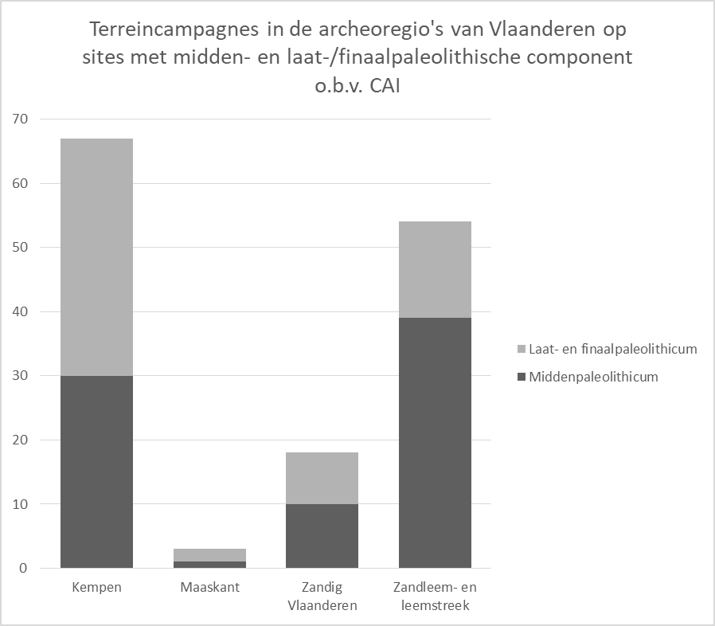{width="4.724306649168854in" height="4.134722222222222in"}

> Figuur 37:Terreincampagnes (19792019) in de archeoregio's in Vlaanderen op sites met middenpaleolithische en laat-/finaalpaleolithische component, gerapporteerd in CAI.

Wanneer we een onderscheid maken tussen eenmalig gerapporteerde en meerjarige terreincampagnes, dan zien we in de Kempen voornamelijk meerjarig onderzoek (op de finaalpaleolithische sites in Meer, Weelde, Zonhoven en Lommel) (Figuur 38). In de overige archeoregio's overheersen de eenmalig gerapporteerde sites. Toch is er in de (zand)leemstreek ook nog een groot deel meerjarig onderzoek: hier vallen bijvoorbeeld de verschillende middenpaleolithische sites te Veldwezelt en Kesselt onder.

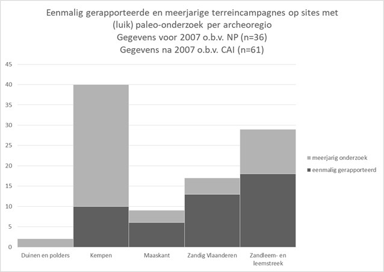{width="4.724027777777778in" height="3.339583333333333in"}

> Figuur 38: Eenmalig gerapporteerde en meerjarige terreincampagnes (19792020) op sites met een paleolithische component in de verschillende archeoregio's in Vlaanderen, gerapporteerd in *Notae Praehistoricae* of CAI.

De evolutie per vijfjaarlijkse interval van het paleolithische terreinonderzoek per archeoregio toont een algemene piek tussen 2010 en 2014 (Figuur 39). Campagnes die in de CAI opgenomen worden eindigen dus niet (meer) automatisch in een bijdrage in de *Notae Praehistoricae*. Ook zien we hier opnieuw het effect van de opkomst van de privéarcheologie.

Wanneer we op het niveau van de archeoregio's focussen, dan is er een dominantie in de Kempen in het eerste deel van de jaren 1990 en vooral de jaren 2005-2009 te zien. In de jaarkwintetten nadien wordt wel een daling van het aantal campagnes ingezet, maar er blijft nog steeds een groot aandeel voor Kempens onderzoek. De (zand)leemstreek kende tussen de jaren '70 en de eeuwwisseling een relatief hoog aantal campagnes, en vanaf 2010 komt het bijna op gelijke voet met de andere archeoregio's. Voor de Maasvallei is het geleden van de opgravingen in Rekem halverwege de jaren '80 dat de archeoregio een grote invloed op de grafiek had, maar in het voorbije kwintet 2015-19 is opnieuw een algemene heropleving op te merken. Zandig Vlaanderen begon in de jaren 1990 aan bod te komen, en kende een enorme piek aan terreincampagnes tussen 2010 en 2014. In het laatste afgesloten jaarkwintet (2015-2019) is er een quasi gelijke verdeling tussen de grootste archeoregio's.

Een blik op de archeoregionale verdeling van de type instellingen die (hoofd)uitvoerder waren van de projecten die zijn gerapporteerd (Figuur 40) lijkt aan te geven dat de privésector in bijna alle archeoregio's nu een belangrijk deel van het terreinwerk uitvoert. Echter wanneer we dit terugkoppelen met de balans van het terreinonderzoek (zie hoger), blijkt dat dit terreinwerk voornamelijk betrekking heeft op vondsten die als losse vondst of per toeval aan het licht kwamen bij onderzoek naar jongere periodes. Binnen de klassieke instellingen zit de terreinexpertise van de Scheldepolders en Zandig Vlaanderen vooral bij UGent. Vanuit de Sigma-prospecties en --opgravingen was ook het agentschap Onroerend Erfgoed voor de Scheldepolders toonaangevend. In de (zand)leemstreek en de Maasvallei bezit de KULeuven een groot deel terreinexpertise: in de eerstgenoemde regio domineert de KULeuven zelfs nog. Ook intergemeentelijke en stedelijke diensten hebben in Zandig Vlaanderen en de (zand)leemstreek terreinervaring opgebouwd. De invloed van de campagnes door overheidsinstellingen in de archeoregio's is, met uitzondering van de Kempen, verkleind. In de Kempen wordt de terreinexpertise namelijk nog gedeeld tussen het agentschap Onroerend Erfgoed en KULeuven, en vroeger ook met het Koninklijk Museum voor midden-Afrika in Tervuren.

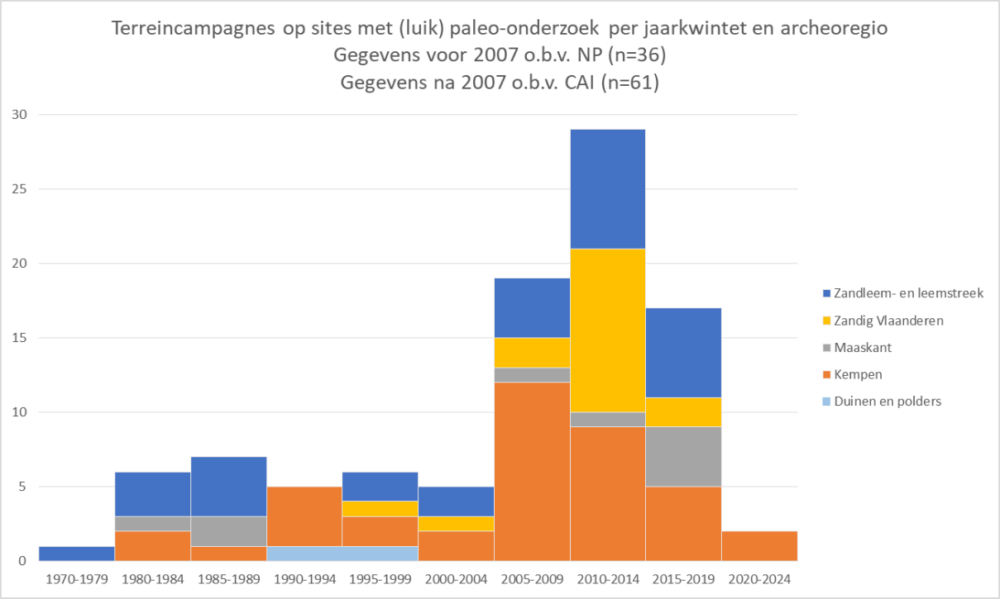{width="6.298611111111111in" height="3.7781944444444444in"}

> Figuur 39: Overzicht per jaarkwintet en archeoregio van de terreincampagnes (1979-2020) op sites met een paleolithische component in Vlaanderen, gerapporteerd in *Notae Praehistoricae* of CAI.

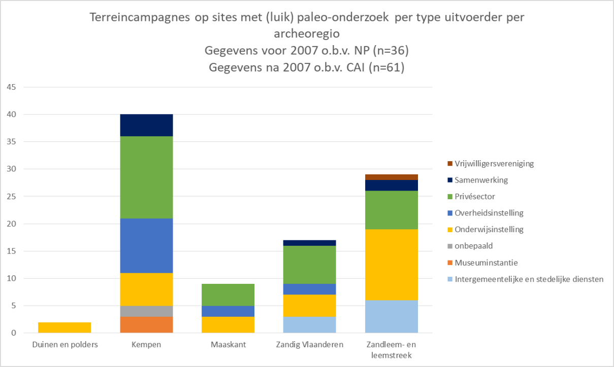{width="6.2983344269466315in" height="3.775in"}

> Figuur 40: Terreincampagnes (1979-2020) op sites met een paleolithische component in de verschillende archeoregio's in Vlaanderen, gerapporteerd in *Notae Praehistoricae* of CAI.

# 6 BALANS VAN DE BRONNEN 

## 6.1 INLEIDING 

Op dit moment valt nauwelijks in te schatten wat de 'voorraad' is van paleolithisch erfgoed in Vlaanderen. Terwijl altijd geldt dat een archeologische inventaris - in dit geval de CAI - maar een fractie omvat van het reëel aanwezige archeologische erfgoed (per definitie de tot hiertoe bekende sites), geldt deze beperking in nog veel grotere mate voor het paleolithicum. Door de soms diepe begraving van pleistocene oppervlakken zijn hier veel minder vaak kijkvensters op gericht dan op de latere periodes, die in principe allemaal het (huidige) holocene oppervlak hebben gebruikt en dus een veel grotere zichtbaarheid genieten.

De CAI laat daarnaast slechts een beperkte evaluatie toe van de geïnventariseerde sites. Zaken die van belang zijn voor steentijdonderzoek zoals het type site (bewoning, jachtkamp, grondstofextractie,...), de gaafheid, stratigrafische verbanden, aanwezigheid structuren (bijv. haarden), zijn niet systematisch ingevoerd en dus uit de CAI te halen. Het overzicht die we in de volgende paragrafen is opgemaakt, baseert zich dan ook grotendeels op basis van gepubliceerde data.

Tot slot zijn nog heel wat amateur-collecties niet opgenomen in de CAI en dus onbekend.

## 6.2 BALANS VAN DE SITES 

Terwijl we, zoals hierboven gesteld, de voorraad aan paleolithisch erfgoed nauwelijks kennen, is het nog veel slechter gesteld met onze kennis van de toestand ervan. We gaven boven al een schets van algemene kansen op (goede) bewaring in de verschillende archeoregio's, maar echte validatie hiervan is voorlopig erg beperkt. De laatste decennia zijn vanuit academische hoek wel projecten opgestart die systematisch prospecteren naar goed bewaarde vindplaatsen en daarbij ook het

(paleo)landschappelijke kader mee in overweging nemen (bijv. Scheldepolders, laatglaciale duinen, Moervaartdepressie, Limburgse leemgroeves). Deze methodiek wordt enigszins ook binnen maltaonderzoek doorgetrokken, maar de toepassing ervan hangt sterk af van de draagkracht van specifieke projecten en expertise van de uitvoerder. Er is een sterke toename aan onderzoeken, met name sinds 2016, waarbij ook grootschalige en diepe ingrepen minstens aan een archeologisch vooronderzoek worden onderworpen. Toch valt op dat hierbij nauwelijks afgedekte paleolithische vindplaatsen zijn ontdekt, ondanks het aangetoonde potentieel in Vlaanderen. Dit lijkt er op te wijzen dat dit aspect onderbelicht wordt binnen Malta-archeologie. Nieuwe vindplaatsen blijken vooral eerder toevallig aan het licht te komen (bijv. Ruien -- Rosalinde[^261]). En indien er een systematische prospectie wordt uitgevoerd, is ze voornamelijk gericht op de top van laatglaciale afzettingen en richt ze zich zowel op de detectie van finaalpaleolithische als mesolithische vindplaatsen.

Voorlopig beperken we ons hier tot een korte schets van de algemene kenmerken en bewaringscondities van de sites zoals we die tot hiertoe in de verschillende periodes kennen.

### Vroeg- en middenpaleolithicum 

Door de zeer lange tijdsduur enerzijds en het beperkte aantal opgravingen anderzijds, kan ons beeld op deze periode alleen maar anekdotisch zijn.

We bespreken hieronder de belangrijkste referentievindplaatsen.

Ter hoogte van Kesselt en Veldwezelt zijn een reeks vindplaatsen aangetroffen in een voormalige

Maasarm die werd opgevuld met een loess sequentie en waarin verschillende paleolsols bewaard zijn

[^262]^.^ Concreet gaat het om volgende vindplaatsen: Kesselt-Nelissen[^263], Kesselt-Albert Kanaal[^264], Kesselt-Op de Schans (in sommige publicaties als Veldwezelt-Op de Schans benoemd)[^265] en Veldwezelt-Hezerwater[^266]. Te Kesselt -- Op de Schans gaat het oudste niveau met artefacten tenminste terug tot de aanvang van M.I.S. 10 voor 390.000 BP, het jongste niveau dateert uit MIS 5b. Daar waar bepaalde archeologische niveaus uitsluitend herwerkte lithische artefacten bevatten, zijn andere veel beter bewaard gebleven. Zo'n 10 meter onder het huidige maaiveld werd een in situ archeologisch niveau aangetroffen met vier lithische concentraties (ODS 1 tot en met 4), gedateerd op de overgang van MIS 9 naar MIS 8, die de neerslag vormen van enkele kortstondige fases van vuursteenbewerking. De ensembles tonen aan dat in deze periode verschillende reductiemethodes werden toepast: zowel discoïde, levallois als *simple prepared core* technologie. Naast lokaal geproduceerd materiaal werden ook geïmporteerde grote afslagen, schrabbers en levallois afslagen in vuursteen aangetroffen. Daarnaast bleken bepaalde lokaal geproduceerde producten geëxporteerd[^267].

Ook te Kesselt --Nelissen werd in een dikke loess sequentie een reeks stratigrafische eenheden aangetroffen die geassocieerd zijn met paleolithische vindplaatsen en dateren in respectievelijk MIS 5, MIS 6 en MIS 7[^268].

De vindplaats Veldwezelt -- Hezerwater werd eveneens aangetroffen in een leemgroeve. Er werden binnen de loess sequentie 24 archeologische niveaus aangetroffen, waarvan er vijf *in situ* bewaarde vindplaatsen materiaal bevatten dat in detail bestudeerd is[^269]. Ze dateren uit de late Saale (MIS 6) en de vroege midden-Weichsel (MIS 3). Er werden tevens verschillende niveaus behorende tot het vroegglaciaal onderzocht. De vindplaatsen vertonen een grote diversiteit in, zowel op vlak van technologische en typologische kenmerken van het materiaal, de aanwezigheid van fauna, aanwijzingen voor vuurbewerking, als in de activiteiten die er werden uitgevoerd. De oudste vindplaatsen (de zogenaamde VLL- en VLB-sites[^270], daterend in de Saale) kenmerken zich respectievelijk door de aanwezigheid van een verzorgde klingentechnologie samen met de aanwezigheid van kleine werktuigen, en een levalloistechnologie. De jacht- en slachtvindplaatsen daterend uit de vroege midden-Weichsel kenmerken zich dan weer door een levalloistechnologie en *oversized* heraangescherpte quina-werktuigen[^271]. De neanderthalers beschikten met andere woorden over een heel divers repertoire aan reductiemethodes, die afhankelijk van de context en aard van het materiaal werd toegepast^289^.

In de Maasregio zijn eveneens oppervlaktevindplaatsen gekend, waarvan we omwille van zijn omvang,

's Gravenvoeren -- Snauwenberg vermelden. Het gaat om een oppervlaktecollectie met een 1000-tal

stukken en een heel diverse samenstelling. Er zijn o.m. Levallois- en discoïdekernen ingezameld. Binnen de werktuigen valt het relatieve hoge aantal bifaciale werktuigen op, waaronder zogenaamde *Keilmesser* en bifaciale werktuigen[^272].

Voor de noordelijke Kempen vermelden we het onderzoek te Oosthoven -- Heieinde waar zowel lithisch materiaal aan het oppervlak is aangetroffen als geassocieerd met grindhoudende zandige sedimenten die tijdens een koude fase (laat glaciaal maximum?) afgezet werden door rivierwerking. In de daaropvolgende fase werden de fijne sedimenten weggeblazen waardoor het grind, inclusief de vuurstenen artefacten, achterbleven. Het lithisch ensemble van de diverse campagnes vertoont een combinatie aan mousteriaan en micoquieaan aspecten en kenmerkt zich door de aanwezigheid van kleine discoïdale, klingen- en een beperkt aantal levalloiskernen naast voornamelijk schrabbers en kleine bifaciale werktuigen met ongeretoucheerde basis[^273]. Een aantal oppervlaktevondsten in de ruimere omgeving van De Liereman[^274] tonen aan dat het gebied niet alleen voor het finaalpaleolithicum en mesolithicum van belang is, maar ook voor de oudere periodes.

De oostelijke uitloper van de Vlaamse vallei is eveneens gekend omwille van haar hoog potentieel voor middenpaleolithische vindplaatsen[^275]. Zemst -- Bos van Aa bevindt zich in de Zennevallei. Er werden tijdens zandontginningswerken in twee groeves artefacten aangetroffen. Fluviatiele afzettingen zijn er afgedekt door eolisch materiaal. Er werden zowel faunaresten als lithisch materiaal aangetroffen, waarvan het merendeel uit het opgespoten sediment werd ingezameld. Vier artefacten werden in hun stratigrafische positie ontdekt. Op basis van diverse elementen (fauna, stratigrafie en ESR) wordt een datering in een koude fase van de vroege Weichsel voorgesteld[^276]. Rotselaar -- Toren ter Heide is een gestratifieerde vindplaats, maar het materiaal werd ingezameld door amateur-archeologen in weinig gunstige omstandigheden waardoor de associatie met de stratigrafische eenheden niet kon vastgesteld worden. Er werden zowel lithische vondsten (gerold en vers) als faunaresten aangetroffen. Oorspronkelijk werd het ensemble toegewezen aan het mousteriaan met acheuleaan traditie omwille van het voorkomen van vuistbijlen[^277]. Nieuw onderzoek op basis van boringen in de onmiddellijke nabijheid van de groeve lijkt te wijzen enerzijds op de aanwezigheid van een herwerkt ensemble, geassocieerd met een grindterras. Mogelijk komt ook het botmateriaal hier vandaan. Het vers materiaal is anderzijds mogelijk geassocieerd met een ouder, beter bewaard niveau dat gelinkt wordt aan de overgan van het Eem naar de laatste ijstijd[^278]. Vooralsnog blijft het bij sterke aanwijzingen maar nog geen direct bewijs. Het hernieuwd onderzoek bracht eveneens Micoquiaan invloeden in het lithisch ensemble onder de aandacht[^279]. Een derde belangrijke vindplaats bevindt zich te Schulensbroek, waar bij ontginningsactiviteiten een beperkt ensemble werd ingezameld, evenals faunaresten. Ook deze vindplaats wordt momenteel opnieuw geëvalueerd[^280].

Andere vindplaatsen binnen de Vlaamse vallei zijn slechts gekend aan de hand van oudere vondstmeldingen en werden minder uitgebreid onderzocht. Ze duiden er echter op dat het potentieel zich niet beperkt tot de oostelijke uitlopers. Zo werd bij de aanleg van de recreatievijver 'Blaarmeersen' te Gent naast ijstijdfauna ook lithische artefacten ingezameld uit het opgespoten sediment. Er werd

o.m. een fragment van een vuistbijl en een reeks levalloisafslagen (evenwel zonder voorbereide hiel) aangetroffen.[^281] Te Uitbergen, in de groeve 'Maes', is de stratigrafische opbouw[^282] en het faunamateriaal[^283] dan weer wel uitgebreid bestudeerd maar is er onduidelijkheid omtrent de

vondstomstandigheden van het ingezameld materiaal. Door J. de Heinzelin werden Solutreaan elementen herkend, maar Crombé en Van der Haegen zien eerder affiniteiten met het middenpaleolithicum[^284].

In de Vlaamse Ardennen zijn een aantal vindplaatsen gekend met zowel levallois componenten als bifaciale werktuigen. Over het algemeen gaat het om geërodeerde contexten waarbij het materiaal niet meer *in situ* bewaard is, zoals te Ronse-Hoogerlucht[^285], Ruien -- Pontweg[^286], Muziekberg^305^ en Ronse-Pontweg[^287]. Een omvangrijk ensemble werd ingezameld op de top van de Kluisberg (op het grondgebied van de gemeentes Orroir, Amougies en Ruien). Ook hier betreft het materiaal dat grotendeels verplaatst lijkt. Echter omtrent de mogelijke stratigrafische context is er nog onduidelijkheid. Op basis van typo-technologische kenmerken wordt het ondergebracht onder het 'typisch Mousteriaan van Levallois-faciës'[^288]. Ook op de Kemmelberg te Heuvelland is een omvangrijke vindplaats gekend, waar zowel levallois als discoïdekernen en een heel diverse set aan werktuigen (schrabbers, spitsen, messen, getande en gekerfde werktuigen) zijn aangetroffen. Maar er werden ook enkele bifaces en bifaciaal bewerkte afslagen ingezameld[^289].

De vindplaats Vollezele -- Congoberg maakt deel uit van een aantal getuigenheuvels langs de Dender.

Het materiaal werd er aangetroffen in colluviale sedimenten die wellicht dateren uit het Weichsel. Binnen het ensemble komen zowel levallois als klingendebitage voor. Op basis van typotechnologische kenmerken werd het als Mousteriaan met Levallois-faciës gedetermineerd[^290].

Te Aalter zijn twee omvangrijke oppervlaktecollecties ingezameld. Het gaat om de vindplaats AalterNieuwendam en Aalter-Hageland. Beide vindplaatsen bevinden zich ter hoogte van tertiaire opduikingen. Ze kenmerken zich o.m. door het 'opportunistisch' gebruik van de minder kwalitatieve, lokale grondstoffen. Dit bestaat vooral uit kwartair basisgrind, maar eveneens uit fossiel hout. Het gebruik van fossiel hout als grondstof is buiten Europa gekend, o.m. bij de Noord-Amerikaanse Clovis- en Folsomculturen[^291], maar is binnen een Europese context uitzonderlijk. Op basis van typotechnologische kenmerken werd het materiaal als 'Charentiaan met enige Micoquiaan-invloeden' omschreven[^292].

Sites lijken zich dus in de nabijheid van waterlopen te bevinden (bijv. Kesselt en Veldwezelt), maar eveneens vaak geassocieerd te zijn met uitgesproken reliëfelementen zoals getuigenheuvels en plateaus (Kluisbergen, Vollezele, ...). Daarnaast heeft ook de aanwezigheid van grondstoffen wellicht een bepalende rol gespeeld (bijv. te Veldwezelt -- Hezerwater en Oosthoven -- Heieinde). Echter, omwille van de beperkte kennis omtrent het pleistocene paleolandschap en het gefragmenteerd beeld op de locatie van vindplaatsen, is een verdere analyse vooralsnog niet mogelijk.

### Het laatpaleolithicum 

####  6.2.1.1 Gravettiaan 

Vindplaatsen uit het gravettiaan zijn nauwelijks gekend in Vlaanderen. In de collectie van het Schulensbroek komt mogelijk 1 vuurstenen werktuig voor (zie verder). Uit de collectie is eveneens een gegraveerd botfragment van een mammoet gekend. Vijf radiokoolstofdateringen werden door het

Koninklijk Instituut voor het Kunstpatrimonium uitgevoerd op verschillende steekproeven van het geëxtraheerde collageen. De gemiddelde waarde (ongecalibreerd) komt uit op 27417 [+]{.underline} 225 BP[^293].

#### 6.2.1.2 Magdaleniaan 

Het aantal vindplaatsen dat met de nodige zekerheid aan het magdaleniaan kan worden toegewezen is beperkt. Voorlopig is Kanne de enige onderzochte magdaleniaansite in Vlaanderen[^294]. De site werd ontdekt tijdens de uitbreiding van het Albert-kanaal in de vallei van de Jeker. Verschillende zones zijn onderzocht, die op hun beurt verschillende lithische vondstconcentraties opleverden. De locatiekeuze moet hier waarschijnlijk worden verklaard door de aanwezigheid van kwalitatief goede vuursteen. Indicaties van echt residentieel verblijf in de regio ontbreken tot dusver.

Op basis van morfo-technologische kenmerken worden naast Kanne nog enkele andere vindplaatsen als mogelijk magdaleniaan bestempeld. Dit geldt voor enkele vondsten van de Kluisberg, onder meer een schrabber met een hiel 'en éperon'[^295]. Vermeersch en Symens maken melding van een magdaleniaan klingenkern met een dikke patina en verschillende vorstvlakken afkomstig van de oppervlaktevindplaats Oedelem-*Maandagse*[^296]*.*

### Het finaalpaleolithicum 

#### 6.2.1.3 Federmesser 

In Vlaanderen zijn verschillende tientallen federmessersites gekend[^297]. Deze liggen gespreid over de verschillende archeoregio's en wijzen in tegenstelling tot het magdaleniaan op een min of meer permanente aanwezigheid. Ze bevinden zich systematisch op een drogere verhevenheid (in de zandstreken meestal (dek)zandruggen) nabij open water, en in het bijzonder de droge oevers van de ondiepe laatglaciale meren (bijv. Moervaartdepressie[^298]), duinpannen of brongebieden ( bijv. LommelMaatheide). Binnen de overstromingsvlakte van de rivieren, en met name de Schelde, zijn de aanwijzingen voor nederzettingen beperkt[^299]. Een mogelijke verklaring is dat het landschap binnen de overtromingsvlaktes in het Scheldebekken te dynamisch was en minder aantrekkelijk voor bewoning. Ook op het einde van de Allerød, wanneer door een abrupte klimaatschommeling drinkwater schaars wordt, lijkt te bewoning zich niet te gaan verplaatsen naar de oevers van de rivieren [^300]. Maar, mogelijk heeft de stand van het onderzoek een belangrijke hand in huidig verspreidingspatroon. Enkele ontdekkingen in stedelijke context (Aalst-Oud Hospitaal[^301], Antwerpen-Burchtzone[^302], LierSionsplein[^303]), maar ook uit het onderzoek naar Rekem[^304] lijken er op te wijzen dat de oevers van de rivieren vermoedelijk wel werden bezocht, dat is ook het patroon in de buurlanden. Mogelijk bevinden zich eveneens vindplaatsen dieper in de fossiele beddingen, omdat in het laatglaciaal die breed uitgeschuurde beddingen een mini-vallei vormden met een *underfit* rivier aan de basis. In dat geval zitten die sites dieper, op de randen of in de vroegere beddingen van de breed meanderende rivieren, en zijn ze moeilijker te detecteren^324^.

Het merendeel van de gekende federmesservindplaatsen zijn oppervlaktevindplaatsen die enkel door middel van veldkartering zijn onderzocht[^305]. Het aantal opgegraven sites is beperkt. De belangrijkste zijn:

Meer -- Meirberg[^306]: De duinrug Meirberg in Meer herbergt een hoge densiteit aan zowel finaalpaleolithische als mesolithische vindplaatsen, bewaard in een podzolbodem. Het grootste deel van de duinrug werd gewaardeerd door intensief booronderzoek, en verschillende vondstlocaties werden opgegraven. De vindplaats leverde zowel finaalpaleolithische als mesolithische clusters op. Meer II leverde veruit het grootste federmesser-ensemble op en vormde in de jaren 1970 het onderwerp van een toen baanbrekende combinatie van functioneel onderzoek (microwear analyse) en ruimtelijke analyse[^307]. De site werd beschermd als monument[^308].

Harelbeke -- Gavermeersen[^309]: De vindplaats is onderzocht in het kader van zandwinningswerken. Op de zuidelijke flank van een zandrug zijn zo'n 2.200 artefacten ingezameld. Een belangrijk deel hiervan was reeds in de bouwvoor opgenomen. Duidelijke verspreidingspatronen zijn niet herkend.

Klein-Sinaai -- Boudelo[^310]: Tussen de resten van een middeleeuwse abdij werden de resten van minimaal vijf vuursteenconcentraties ontdekt (ca. 1.750 artefacten). Bijzonder aan de vindplaats is dat de resten zijn ingezameld in een zandig pakket zo'n 10 cm boven een laag die gekenmerkt wordt door de aanwezigheid van houtskoolskoolpartikels, mogelijk een Usselo-bodem. Recent onderzoek in de onmiddellijke nabijheid leverde het bewijs dat eolische activiteiten zich ook voorgedaan hebben tijdens het warmere Allerod, en dus niet enkel tijdens de koudere stadialen (Oude en Jonge Dryas)[^311].

Rekem[^312]: De vindplaats werd ontdekt midden jaren '80 van de vorige eeuw bij onderzoek van een Romeinse nederzetting. Over de loop van de daaropvolgende jaren zijn een vijftiental clusters opgegraven (ca. 24.000 artefacten) die in de jaren '90 aan een grondige typo-technologisch en ruimtelijke analyse zijn onderworpen. Ook microwear kreeg tijdens dit onderzoek de nodige aandacht.

Weelde -- Eindegoorheide[^313]: In het kader van ruilverkavelingswerken zijn in Weelde-Eindegoorheide verschillende finaalpaleolithische en mesolithische vuursteenconcentraties onderzocht. Verschillende van deze vindplaatsen waren reeds langere tijd gekend door oppervlaktekartering en bevonden zich grotendeels in de bouwvoor. Beperkt refittingonderzoek heeft duidelijk gemaakt dat enkele van deze concentraties mogelijk gelijktijdig zijn. Naast vuursteen is op een aantal vindplaatsen ook verbrand bot ingezameld. Enkele van deze fragmenten zijn gedateerd (ca. 11.900-10.800 BP), echter de associatie met de vuursteenclusters staat niet vast.

Verrebroek -- Dok 2[^314]: Bij controle van dijkwerken in het kader van de havenuitbreiding op de linker Scheldeoever werd in een humeuze horizont een kleine vuursteenconcentratie aangetroffen met daarin de debitageresten van een drietal kleine vuursteenknollen. Kenmerkende werktuigtypes ontbreken, maar de technologische analyse wijst in de richting van de federmessergroepen. Paleoecologisch- (pollen, macroresten, houtskool) en radiokoolstofonderzoek wees uit dat de bodem en de vindplaats op de overgang van de Oude Dryas naar de Allerød dient te worden gedateerd.

Doel -- Deurganckdok zone B^335^: Bij onderzoek van een dekzandrug in het tracé van het Deurganckdok werden naast Swifterbantresten ook de resten van federmessergroepen aangetroffen. Minimaal 600

artefacten, behorende tot drie vondstconcentraties, kunnen aan deze occupatie worden toegewezen, waaronder een dertigtal werktuigen (spitsen, schrabbers, stekers, geretoucheerde klingen, ...). Wegens de tijdsdruk en de uitgesproken verticale spreiding van de artefacten was het niet mogelijk het ensemble integraal te bergen.

Lommel -- Maatheide[^315]: Dit is één van de vroegst gekende paleolithische sites in Vlaanderen; HamalNandrin zamelde er reeds in de jaren 1930 uitgebreid vondsten in. In het kader van grootschalige zandwinning werd het terrein begin jaren 2000 aan een grondige prospectie onderworpen. Daarbij werden tientallen vuursteenconcentraties ontdekt. Verschillende van deze vondstconcentraties kunnen met een Federmesseraanwezigheid in verband worden gebracht (o.m. LB25). De voornaamste occupatie uit deze periode bevond zich op een laatglaciale duin ten noorden van de Blokwaters en de Rietreienloop. Deze deflateerde echter tijdens de Jonge Dryas waardoor de vondsten minder goed bewaard bleven in de holocene podzolbodem. In de periferie van deze duin werd echter één vondstconcentratie uitstekend bewaard in directe associatie met een Usselobodem aangetroffen. Twee anderen waren ook geassocieerd met de Usselbodem maar minder goed bewaard. Het onderzoek van deze laatglaciale bodem en de evolutie van het paleolandschap kreeg de nodige aandacht.

Lommel -- Kristalpark[^316]: Deze vindplaats maakt deel uit van het sitecomplex Lommel -- Molse Nete en bevindt zich (grotendeels) op de noordelijke valleirand van de Molse Nete. Verschillende boorcampagnes, proefputtenonderzoeken en opgravingen leverden naast mesolithische en neolithische sites, op diverse locaties finaalpaleolithische artefacten op al dan niet in associatie met een Usselobodem. In 2010 werden 3 kleine clusters opgegraven die op basis van het lithisch materiaal en de associatie met de Usselobodem tot de federmessergroepen worden gerekend.

Tongeren -- Plinius[^317]: Naast resten uit het middenpaleolithicum, neolithicum en ijzertijd zijn tijdens het onderzoek ook vijf finaalpaleolithische vondstclusters aangetroffen, elk met een oppervlakte tussen ca. 25 en 50 m². Enkele hiervan zijn in het bezit van een haard. Op basis van het voorkomen van enkele steilgeretoucheerde spitsen worden de ensembles tot de federmessergroepen gerekend. Of de verschillende vondstclusters gelijktijdig zijn is vooralsnog niet duidelijk. Eén locatie (cluster 4) wordt op basis van een datering op verbrand bot op de overgang van Allerød naar Jonge Dryas gedateerd.

Arendonk -- Korhaan[^318]: Tijdens een waarderend archeologisch booronderzoek in het Landschap Liereman werden ter hoogte van Korhaan een aantal vondsten op relatief grote diepte aangetroffen. Aangezien de aanwezigheid van een Usselobodem in het gebied gekend was, is een eventuele associatie met deze bodem verder onderzocht en bevestigd door middel enkele testputten. Het materiaal bleek zich daarbij vooral in het topgedeelte van de Usselobodem te bevinden, waardoor de vindplaats op de overgang van de Allerød naar de Jonge Dryas wordt gedateerd. Op basis van enkele fragmenten van steilgeretoucheerde klingen wordt het ensemble aan de federmessergroepen toegeschreven. Ook op andere locaties in het landschap de Liereman is vondstmateriaal in associatie met de Usselobodem aanwezig. Op een akker hierlangs werden bij herhaaldelijke oppervlakteprospectie meer dan 50.000 vondsten ingezameld, waaronder een groot aantal federmesserspitsen. De volledige duinrug werd in 2013 beschermd[^319].

Beveren -- LPW^341^: Tussen de resten van een mesolithisch sitecomplex werden een aantal finaalpaleolithische spitsen aangetroffen evenals één kleine vondstconcentratie. De vondsten wijzen op een federmesseraanwezigheid aan de voet van de dekzandrug Maldegem-Stekene.

Ten slotte zijn er nog een aantal stadscontexten waar in de natuurlijke bodem, onder puinpakketten of middeleeuwse resten, Federmessermateriaal is ingezameld. De belangrijkste zijn:

Aalst -- Oud Hospitaal[^320]: vlak naast de Dender werd bij onderzoek begin jaren '80 van vorige eeuw in een glauconietrijke zandige laag onder de middeleeuwse resten een kleine vondstconcentratie aangetroffen bestaande uit 35 artefacten waaronder drie schrabbers, drie stekers op afknotting, twee stekerafslagen, een bek, een boor en twee kernen. Hoewel de kenmerkende federmesserspitsen ontbreken, wijst het grondstofgebruik (een kwaliteitsvolle, fijnkorrelig zwarte vuursteen die enige gelijkenissen vertoont met de zgn. Obourg-vuursteen), de manier van vuursteen bewerken en het hoge aandeel aan stekers op afknotting in de richting van de federmessergroepen.

Antwerpen -- Burchtzone[^321]: op de rechteroever, op korte afstand van de Schelde werden bij het onderzoek van de burchtzone in 2008-2009 61 lithische artefacten ingezameld waaronder mogelijk ook enkele artefacten van de federmessergroepen. Verschillende artefacten zijn vervaardigd uit een kwaliteitsvolle zwarte vuursteen. Naast een mogelijk fragment van een federmesserspits gaat het onder meer om een kern, een kernrandkling en een schrabber/steker.

Lier -- Sionsplein[^322]: een artefactenvindplaats uit de steentijd werd er aangetroffen onder een puinpakket. Landschappelijk bevindt de site zich op de linkeroever van de Nete. Het gaat om een gemengde context waarvan een aantal spitsen en (micro)klingen met afgestompte boord, een typische steker en schuin afgeknotte kling wijzen op een finaalpaleolithische component. De vier spitsen kunnen als ferdermesserspitsen worden beschouwd. Ook het gebruik van de Obourg-achtige vuursteen sluit hier mogelijk bij aan.

Hoewel de omvang van de opgegraven ensembles sterk varieert, lijkt het er op dat ze vaak deel uitmaken van grotere sitecomplexen die waarschijnlijk meermaals opgezocht zijn (o.m. Klein-Sinaai, Doel). Refitonderzoek op enkele van deze vindplaatsen maakt duidelijk dat vaak meerdere clusters met elkaar in verband staan (o.m. Meer, Rekem, Weelde)[^323]. Wel dient opgemerkt te worden dat dit beeld mogelijk het resultaat is van de prospectiestrategie die de laatste decennia wordt toegepast. Deze bestaat namelijk grotendeels uit archeologisch booronderzoek. Recent onderzoek naar steentijd prospectietechnieken in Vlaanderen en Nederland heeft echter aangetoond dat de klassieke boorstrategie weinig geschikt is voor het treffen van lage densiteit vindplaatsen[^324]. Kleinere vindplaatsen worden met andere woorden vaak gemist en zijn wellicht ondervertegenwoordigd. Organisch materiaal is op deze sites niet of nauwelijks bewaard en beperkt zich grotendeels tot verbrand bot (Weelde, Verrebroek). Ook evidente haarden zijn slechts uitzonderlijk geregistreerd (voorlopig enkel te Tongeren -- Plinius), maar in plaatsen waar voldoende lithisch materiaal aanwezig is, zijn wel structurele patronen te herkennen. Samen geven ze een indruk van georganiseerde kampplaatsen.

####  6.2.1.4 Ahrensburgiaan 

In vergelijking met de federmesseroccupatie, is het Ahrensburgiaan opnieuw veel minder goed gekend in Vlaanderen. Zonhoven -- Molenheide is de enige vindplaats die hieraan met zekerheid kan worden toegewezen. Van enkele andere vindplaatsen wordt aangenomen dat ze mogelijk ook tot het Ahrensburgiaan behoren of mogelijk gelijktijdig hiermee zijn (late Federmesser/Belloisiaan/ Laboriaan). De belangrijkste vindplaatsen zijn:

Zonhoven -- Molenheide[^325]: De vindplaats is gelegen op een voormalig militair domein en werd ontdekt bij controle van een door soldaten gegraven kuil. In de loop van de jaren '90 van vorige eeuw werden alles bij elkaar zo'n vijf vuursteenconcentraties opgegraven (ca. 11.600 artefacten). Op basis van refittingonderzoek blijkt dat ze wellicht gelijktijdig in gebruik waren. Het werktuigspectrum bestaat uit schrabbers, stekers, afgeknotte werktuigen, steilgeretoucheerde microklingen en groot aantal spitsen waaronder enkele kenmerkende steelspitsen.

Gent -- Tweekerkenstraat[^326]: Nabij de top van de Blandijnberg, hoog boven de Schelde, zijn tussen de graven van een voormalige parochiekerk de resten van twee kleine vuursteenconcentraties ontdekt. Bij gebrek aan kenmerkende artefacten is een chrono-culturele toewijzing van de vindplaats niet eenduidig. De aanwezigheid van protogeometrische microlieten, de technologische kenmerken evenals het grondstofgebruik (chalcedoon) wijzen op enige affiniteiten met het ahrensburgiaan. De aanwezigheid van een zgn. *soil-cap* op een belangrijk deel van het materiaal wijst op periglaciale omstandigheden en plaatst de vindplaats in de Jonge Dryas.

Ruien -- Rosalinde[^327]: De vindplaats werd bij toeval ontdekt tijdens het onderzoek van een nederzetting uit de metaaltijden en Romeinse tijd en ligt op de rechteroever van de Schelde aan de voet van de Kluisberg. Een haardstructuur en zo'n 3.500 vuursteenartefacten werden ingezameld. Ook op deze vindplaats ontbreken kenmerkende werktuigtypes, maar de microlithische elementen, de technologische kenmerken en het grondstofgebruik (chalcedoon) sluiten wederom eerder aan bij vindplaatsen uit het Ahrensburgiaan of (Epi)Laboriaan/Belloissiaan. Een radiokoolstof aan houtskool uit de haardstructuur plaatst de vindplaats op de overgang van de Allerød naar de Jonge Dryas.

Oudenaarde -- Markt[^328]: Het gaat hier om een klein lithisch ensemble dat is aangetroffen tussen de middeleeuwse resten in de top van een rivierduin. Kenmerkende werktuigen ontbreken, maar de beperkte technologische inzichten wijzen in de richting van het finaalpaleolithicum. Vergelijkbaar met Gent-Tweekerkenstraat is ook hier de aanwezigheid van een *soil-cap* op een deel van het materiaal vastgesteld. Op basis van een reeks OSL-dateringen kan een datering in de Jonge Dryas vooropgesteld worden.

Wichelen -- Bergenmeersen[^329]: Bij het onderzoek van een middeleeuws en postmiddeleeuws kasteelsite kwam een grote hoeveelheid vuursteen (ca. 7000 vondsten) aan het licht. De oudste vondsten dateren in het middenpaleolithicum, de jongste in de tweede helft van het neolithicum. De meerderheid van de vondsten hoort echter thuis in het mesolithicum en finaalpaleolithicum, waaronder enkele vondstclusters. Een culturele toewijzing was op basis van het beperkte werktuigspectrum niet mogelijk, maar een datering op het eind van het finaalpaleolithicum is op basis van de technologische kenmerken het meest waarschijnlijk.

### Balans van het archeologische materiaal 

Opnieuw beperken we ons tot een algemene schets van de bekende archeologische ensembles in de verschillende periodes.

### Vroeg- en middenpaleolithicum 

Het vroegpaleolithicum is slecht gekend in Vlaanderen. Enkel te Kesselt-op de Schans bevindt zich een gedateerde vindplaats (daterend voor 390.000 BP)^352^. Verder zijn er een aantal oppervlaktevondsten gedateerd in deze periode omwille van de aanwezigheid van een zogenaamde 'Acheuleaan-vuistbijl'.

Alhoewel het Acheuleaan zich inderdaad vaak kenmerkt door de aanwezigheid van vuistbijlen, komt deze technologie ook in de daaropvolgende periode voor en is een onderscheid op basis van typologische kenmerken niet altijd te maken. Sommige oppervlaktecollecties worden ook op basis van de aanwezigheid van eenvoudige afslagen (vaak sterk gepatineerd) tot deze periode gerekend. Dat is bijvoorbeeld het geval voor het zogenaamde 'Hagelands clactoniaan'^353^. Maar ook hier geldt dat een dergelijke toewijzing onvoldoende onderbouwd is.

Het middenpaleolithicum kenmerkt zich door de aanwezigheid van een aantal gestandaardiseerde en gecontroleerde productiemethodes gericht op afslagen, spitsen en klingen. Het gaat om de levallois^354^, discoïde[^330] en diverse vormen van klingentechnologie (waaronder volumetrische klingentechnologieën[^331]).[^332] Dit betekent evenwel niet dat de bifaciale technologie verloren gaat. Terwijl deze technologie voor het vroege middenpaleolithicum aan belang inboet, blijkt ze tijdens het Weichsel weer sterk aanwezig (zie verder).[^333] Opvallend is dat doorheen het middenpaleolithicum neanderthalers beschikten over een divers repertoire aan technologieën voor het vervaardigen van werktuigen. Onderzoek op goed bewaarde vindplaatsen zoals te Kesselt[^334], Veldwezelt[^335] maar ook in Wallonië (o.m. Remicourt-En Bia Flo[^336]) hebben aangetoond dat deze verschillende reductiemethodes gelijktijdig werden toegepast en o.m. gelinkt zijn aan een gediversifieerd grondstofgebruik en mobiliteitsstrategieën.

De oudste middenpaleolithische vindplaatsen in Vlaanderen (en bij uitbreiding België) zijn schaars en bevinden zich op de overgang van het vroeg- naar middenpaleolithicum. Zo werden in de goed bewaarde vroeg middenpaleolithische ensembles van Kesselt-Op de Schans (overgang MIS 9 naar MIS 8) zowel levallois, discoïde, als eenvoudig voorbereide reductiestrategieën naast elkaar toegepast.[^337] Een reeds volledig ontwikkelde levalloistechnologie werd eveneens geattesteerd op de Henegouwse site Mesvin IV (MIS 8).[^338] Beide vindplaatsen getuigen reeds van een volledig ontwikkelde middenpaleolithische technologie. Binnen de noordwest-europese context nemen ze daarom een uitzonderlijke positie in[^339].

Vanaf MIS 8 zal de levalloismethode de meeste middenpaleolithische ensembles gaan domineren in

Noordwest-Europa en zien we eveneens voor het eerst een volumetrische klingentechnologie

353. Vermeersch 1973.

354. De levalloistechnologie is een specfieke reductiemethode waarbij door middel van een verzorgde voorbereiding (van het slag- en productievlak) de nodige convexiteit en scherpe hoeken gecreëerd worden voor de productie van regelmatige afslagen, spitsen of klingen. Deze technologie kent een ruime chronologische en geografische verspreiding (Afrika, Eurasië en Australië), maar wordt in onze contreien voornamelijk met neandaerthalers geassocieerd. De technologie wordt beschouwd als marker voor de aanvang van het middenpaleolithicum (tegen het eind van MIS 9, alhoewel er indicaties zijn dat de technologie al vroeger aanwezig was in Europa).

verschijnen op een aantal sites, o.m. in Noord-Frankrijk (bijv. Saint-Valéry-sur-Somme)[^340], maar eveneens in Vlaanderen te Veldwezelt-Hezerwater^366^.

Zoals hierboven aangehaald, zal de bifaciale technologie nog slechts sporadisch voorkomen in de vroege ensembles, om vanaf het laatste glaciaal terug sterk aan belang te winnen. Binnen Europa worden momenteel twee grote groepen onderscheiden waarbinnen bifaciale werktuigen courant voorkomen: het gaat om het 'Mousteriaan met Acheuleaan traditie' (MTA) enerzijds en de zogenaamde 'Keilmessergruppen' (KMG, vroeger ook als 'micoquiaan' aangeduid) anderzijds. Binnen deze groepen komen nog heel wat varianten voor, vaak gelieerd aan hun regionale verspreiding.[^341] Vlaanderen neemt hierin een interessante positie in aangezien de regio zich op de grens van beide invloedsferen bevindt. Op basis van de aanwezigheid van 'klassieke', symmetrische vuistbijltypes met (sub)driehoekige of hartvormige vorm worden o.m. de vindplaatsen te Rotselaar -- Toren ter Heide[^342] en Gent-Port Arthur[^343] tot het MTA gerekend. Het KMG kenmerkt zich dan weer door diverse types van asymmetrische bifaces en bifaciaal bewerkte werktuigen. Voor Vlaanderen neemt de vindplaats Oosthoven-Heieinde[^344] hierin een belangrijke positie in. Binnen het ensemble van 107 artefacten komen 18 bifaciale werktuigen voor. De kernen tonen aan dat er verschillende debitagemethodes werden toegepast (levallois, discoïde en klingen). De bifaciale werktuigen worden vooral gedomineerd door zogenaamde *Keilmesser* en kenmerken zich door kleine dimensies (\< 6 cm), een fijn, continu geretoucheerde spits en onbewerkte basis.[^345] 'Micoquieaan' of KMG elementen zijn eveneens herkend te Vollezele -- Congoberg (De twee vuistbijlen en bifaciale spitsen met bladvormige morfologie)[^346], Veldwezelt-Hezerwater (VBLB, gedateerd in MIS 5, met o.m. een bifaciale bladvormige spits en een

*Kostienki* mes)[^347], te Aalter (o.m. bladvormige spitsen)[^348], te 's Gravenvoeren-Snauwenberg, op de Kemmelberg[^349] en te Ronse Pont-West[^350]. Een relatief recente herevaluatie van bifaciale werktuigen lijkt er op te wijzen dat deze werktuigtypes in België vooral voorkomen op vindplaatsen daterend in het late middenpaleolithicum en dan specifiek het vroege Weichseliaan (MIS 5d t.e.m. MIS 5a) en de middenpleniglaciale fase van het Weichseliaan (MIS 3). Omdat de Belgische vindplaatsen met bifaciale componenten zich onderscheiden van de zuidelijke MTA vindplaatsen en noordoostelijke KMG sites stelt Ruebens voor om deze ensembles als een aparte groep te beschouwen en ze aan te duiden als MBT ofwel *Mousterian with bifacial tools*[^351]*.*

Verder kenmerken de vindplaatsen uit het Weichseliaan zich vaak door een belangrijke aanwezigheid van levalloisproducten, naast discoïde en minder georganiseerde reductiestrategieën, in combinatie met diverse werktuigen.

Te Vollezele -- Congoberg zijn levallois- en discoïdekernen aangetroffen en worden de werktuigen gedomineerd door schrabbers. Daarnaast komen ook mousteriaanspitsen, '*limaces'*, gekerfde en getande werktuigen evenals messen met natuurlijke rug voor. De twee vuistbijlen en bifaciale spitsen met bladvormige morfologie wijzen op een micoquiaan/KMG invloed^378^.

Te Heuvelland -- Kemmelberg komen zowel Levallois- als discoïdekernen voor. Het werktuigenensemble bestaat uit schrabbers, spitsen, messen, getande en gekerfde werktuigen. Maar ook enkele bifaces en bifaciaal bewerkte afslagen zijn er geattesteerd[^352].

De vindplaatsen te Aalter -- Hageland en Nieuwendam kenmerken zich vooral door het hoge aantal onregelmatige kernen. Mogelijk is dit gerelateerd aan de lokale grondstof met beperkte kwaliteit en afmetingen. In mindere mate komen ook discoïde- en levalloiselementen voor. De werktuigen bestaan er uit schrabbers, messen met natuurlijke rug, *limaces* en bifaciale werktuigen (met KMG affiniteiten, zie boven)[^353].

Ook te 's Gravenvoeren -- Snauwenberg werd een divers ensemble, dat o.m. Levallois- en discoïdekernen bevat, ingezameld. Binnen de werktuigen valt het relatieve hoge aantal bifaciale werktuigen op, waaronder zogenaamde *Keilmesser* en bifaciale werktuigen[^354].

Dit betreffen uiteraard minder goed bewaarde vindplaatsen, die ongetwijfeld ook meerdere occupaties vertegenwoordigen. De diversiteit binnen deze collecties is dus wellicht eerder het resultaat van het gemengde karakter ervan. Wederom bieden de vindplaatsen te Kesselt en Veldwezelt een beter inzicht.

Te Kesselt -- steengroeve Nelissen is in het archeologisch niveau A5 een lithisch ensemble aangetroffen in associatie met resten van paard (*Equus caballus*) en wolharige neushoorn (*Coelodonta antiquitatis*). Op basis van chronostratigrafie wordt dit niveau in het pleniglaciaal gedateerd. Binnen het lithisch ensemble komt o.m. een bifaciaal bewerkte schrabber (met rug) voor[^355].

Te Kesselt -- Albertkanaal is een collectie van lithisch materiaal (700 stuks) geassocieerd met fauna. Het lithisch materiaal wijst op een dominantie van de levalloismethode, maar lijkt er sprake dat er in de laatste fases van de exploitatie van de kern werd overgeschakeld naar een discoïdemethode. Binnen het ensemble komt een gevarieerde groep van werktuigen voor (o.m. bifaciale werktuigen)[^356].

Veldwezelt -- Hezerwater is één van de weinige vindplaatsen uit het Weichsel waar een volumetrische klingendebitage is aangetroffen (niveau VBLB, gedateerd in MIS 5). Daarnaast komt ook levalloisdebitage voor. Het werktuigenensemble omvat o.m. een bifaciale bladvormige spits en een *Kostienki* mes[^357].

Middenpaleolithische klingendebitage lijkt in Vlaanderen minder vaak gerapporteerd. Dat is mogelijk het resultaat van een selectieve inzameling. Het inzicht dat volumetrische klingendebitage reeds in het middenpaleolithicum een rol speelde, is in onze contreien immers pas gegroeid vanaf de jaren '90 van vorige eeuw. Het is dus goed mogelijk dat bij het inzamelen of determineren ervan een middenpaleolithische datering niet als mogelijk geacht werd.

De meeste vindplaatsen kenmerken zich door het gebruik van diverse soorten vuursteen, zowel lokaal gewonnen als aangevoerd, voor het vervaardigen van artefacten. Ook andere grondstoffen worden echter aangewend. Zo zijn kernen en een vuistbijl vervaardigd in Wommersomkwartsiet te Wommersom -- Steenberg aangetroffen en is een vuistbijl vervaardigd in tertiaire zandsteen aangetroffen te Kuringen-Larestraat[^358]. Te Rotselaar -- Toren ter Heide blijkt een grote diversiteit aan grondstof gebruikt te zijn, bestaande uit Wommersomkwartsiet, micahoudend kwartsiet, verschillende soorten vuursteen en ftaniet[^359]. Opvallend is het mogelijk gebruik van fossiel palmhout te Aalter, wat een uitzonderlijk gegeven is binnen Europa en daardoor ook moeilijk te plaasten. Te

Aalter wordt, naast het lokale vuursteen van beperkte kwaliteit, ook lokale zandsteen aangewend.[^360] Te Zemst-Bos van Aa werd een klopper in bitumen aangetroffen waarvan de petrografische analyse een herkomst uit zuidelijk Engeland aangeeft[^361]. Dit hoeft niet te verwonderen aangezien transport over lange afstanden al vaker werd vastgesteld voor het middenpaleolithicum en de Noordzee bovendien gedurende de koude fases van het laatste glaciaal een open vlakte was.

Uitgezonderd faunaresten met snij- of slachtsporen (o.m. te Veldwezelt-Hezerwater[^362] en te ZemstBos van Aa[^363]) zijn uit het middenpaleolithicum nauwelijks vindplaatsen gekend met bewerkt bot. In de groeve van Oekene - Rennevoordestraat straat is een mogelijk gepolijst botfragment aangetroffen, maar verder onderzoek is noodzakelijk om het intentionele karakter ervan te verifiëren[^364].

### Laatpaleolithicum 

#### 6.2.1.5 Gravettiaan 

In de collectie van het Schulensbroek komt mogelijk één vuurstenen werktuig voor uit deze periode.

Oorspronkelijk werd het op basis van typologische kenmerken als een Aurignac-kling gedetermineerd. Op basis van de specifieke voorbereiding van de hiel, die enige overeenkomsten vertoont met de zgn. *en éperon*-voorbereiding, wordt het artefact nu iets jonger gedateerd. De *en éperon*-voorbereiding verschijnt namelijk pas ten vroegste tijdens het gravettiaan[^365], maar deze manier van voorbereiden is vooral kenmerkend voor het laatmagdaleniaan en gerelateerde groepen[^366]. Het gaat hier dus louter om een toewijzing op basis van typo-technologische kenmerken. Te Schulensbroek werd eveneens een gegraveerd fragment van een lang been van mammoet aangetroffen. In eerste instantie werd het tot het middenpaleolithische ensemble toegewezen en als mogelijk muziekinstrument geïnterpreteerd[^367]. Een heranalyse, aan de hand van 14C dateringen en 3D-scan, lijkt het antropogene karakter ervan te bevestigen maar plaatst het stuk qua ouderdom in het gravettiaan (gemiddelde waarde (ongecalibreerd) komt uit op 27417 [+]{.underline} 225 BP)[^368].

#### 6.2.1.6 Magdaleniaan 

Het magdaleniaan in Noordwest-Europa en het Maas-Rijngebied in het bijzonder (met o.m. Kanne) onderscheidt zich van de andere laat- of finaalpaleolithische culturen door het (grotendeels) ontbreken van spitsen. De artefacten die met de jacht in verband kunnen worden gebracht zijn kleine klingen voorzien van één of twee steil geretoucheerde boorden. Deze steilgeretoucheerde klingen werden vermoedelijk lateraal op assegaaien (werpsperen) gemonteerd en in combinatie met een speerdrijver gebruikt. Hun aandeel in het werktuigspectrum schommelt sterk van vindplaats tot vindplaats. In Kanne bezitten ze slechts een beperkt aandeel.

Andere kenmerkende werktuigtypes zijn bekken, bekstekers en Lacanstekers. Bekken en bekstekers worden gekenmerkt door een relatief lange, stevige punt, aangebracht door tweezijdige retouches. Wanneer ventraal één of meerdere kleine stekerafslagen zichtbaar zijn spreekt men van een beksteker. Lacanstekers zijn te herkennen aan de hand van een zeer schuine afknotting die is aangebracht na het afhaken van de stekerafslag. Hierdoor is het proximale deel van het negatief van de stekerafslag niet meer aanwezig.

Ten slotte zijn er nog de grote eindschrabbers op kling. De voorkeur voor relatief grote klingen is trouwens kenmerkend voor alle werktuigtypes. Exemplaren met een lengte boven 10cm zijn daarbij geen uitzondering. Alleen de steilgeretoucheerde klingen wijken af van dit patroon. Voor de productie van dit werktuigtype zijn relatief kleine klingen geselecteerd, afkomstig uit de eindfase van de reductiesequentie of van kernen die specifiek voor dit doel zijn bestemd.

Voor het vervaardigen van de werktuigen viel de keuze op kwaliteitsvolle vuursteen. Het merendeel van de magdaleniaanvindplaatsen in het Maas-Rijn-gebied ligt dan ook in de onmiddellijke nabijheid van vuursteenontsluitingen. Dit kan terrasvuursteen zijn, maar ook eluviale vuursteen zoals Rullen-, Orsbach-, Simpelveld-, Valkenburg- of Rijckholt-vuursteen. Daarnaast worden af en toe ook exotische grondstoffen aangetroffen zoals zoetwaterkwartsiet uit het Duitse midden-Rijngebied.

Het magdaleniaan staat bekend voor zijn verzorgde klingtechnologie. Er werd dan ook veel tijd en energie geïnvesteerd in de voorbereiding en het onderhoud van de kernen. Kernrandklingen en kernvernieuwingsproducten komen dan ook regelmatig voor. Bijzonder is de individuele voorbereiding van de hiel bij een belangrijk deel van de klingen uit de *plein débitage*, daarbij wordt de slagvlakrand in de richting van het slagvlak zo bijgewerkt dat de plaats waar moet worden geslagen om de kling af te haken als het ware uit het slagvlak omhoog komt, de zgn. *en éperon*-voorbereiding. Op basis van het voorkomen van deze specifieke voorbereiding wordt een mogelijke datering in het magdaleniaan gesuggereerd voor onder meer een deel van het materiaal op de Kluisberg[^369].

### Finaalpaleolithicum 

####  6.2.1.7 Federmesser 

In vergelijking met het magdaleniaan is materiaal van de federmessergroepen goed vertegenwoordigd in Vlaanderen. Verschillende tientallen vindplaatsen zijn gekend, het merendeel oppervlaktevindplaatsen. Kenmerkend zijn de steilgeretoucheerde spitsen die sporadisch reeds opduiken op het eind van het magdaleniaan. Deze spitsen zijn vervaardigd op kleine klingen en voorzien van steile retouches en minimaal één spitse punt. Al naargelang de positie van het spitse uiteinde, de retouches en de morfologie van het artefact worden verschillende spitstypes onderscheiden. Het meest voorkomende type is de federmesserspits, een spits voorzien van een asymmetrisch convex geretoucheerde boord. Maar daarnaast komen in federmesservindplaatsen ook nog aziliaan-, gravette-, creswell-, cheddar, kremser, malaurie-, blanchère-, p*enknife*-, kerf- en steelspitsen[^370].

De federmessergroepen vormen geen homogeen blok maar kennen een zekere evolutie doorheen hun bestaansperiode. Op basis van de huidige inzichten kunnen ruwweg een drietal fases worden onderscheiden. De oudste federmesservindplaatsen verschijnen reeds op het eind van de Bølling of de Oude Dryas en vormen als het ware de verderzetting van het magdaleniaan (zuiden) en/of hamburgiaan (noorden). Ze worden in hun werktuigspectrum gekenmerkt door het voorkomen van aziliaan-, kerf- en creswellspitsen. Technologisch sluiten ze nog nauw aan bij hun voorgangers. Hun klingentechnologie wordt nog steeds gekenmerkt door een grondige voorbereiding en onderhoud van de kernen. Ook de hiel wordt nog regelmatig individueel voorbereid door middel van facettering, maar van een voorbereiding '*en éperon*' is nog zelden sprake. Op andere vindplaatsen geeft men eerder de voorkeur aan het grondig afschuren en retoucheren van de slagvlakrand. Tijdens de *plein débitage* wordt ook niet langer gebruik gemaakt van een geweihamer zoals tijdens het magdaleniaan, men prefereert vanaf nu een zachte stenen hamer.

Tijdens de middenfase verdwijnen de aziliaan-, kerf- en creswellspitsen en nemen de federmesserspitsen het over. Daarnaast is onder de spitstypes een grotere typologische variabiliteit zichtbaar dan in voorgaande fase. Op technologisch vlak is er sprake van een verdere vereenvoudiging. De kernvoorbereiding wordt meer en meer afgesteld op de grootte en de morfologie van de knol. Een individuele voorbereiding van de hiel komt nog zelden voor. Ook de kwaliteit van de ingezamelde vuursteen vertoont grote verschillen. Wanneer deze klassieke federmessergroepen verschijnen is onduidelijk, vermoedelijk pas tegen het midden van de Allerød.

De jonge federmesserfase valt samen met de laatste fase van het Allerød-interstadiaal en het begin van de Jonge Dryas. In het werktuigspectrum verschijnen naast federmesserspitsen nu ook malaurie- en blanchèrespitsen, ook de eerste microlieten duiken op. De productie van malauriespitsen gebeurt op klingen, voor de vervaardiging van blanchèrespitsen dragen microklingen de voorkeur weg. Beide spitstypes vertonen een grote mate van standaardisering wat zich vertaalt in het gebruik van een kwalitatief hoogstaande grondstof en een grondige kernvoorbereiding waarbij het regulariseren van de tafel een grote rol speelt. Net zoals in het magdaleniaan is er een tweedeling in de productie: grote knollen voor klingen; kleine knollen en (vorst)afslagen voor microklingen, hoewel in een aantal gevallen de reductiesequentie na het afhaken van de klingen gewoon worden verdergezet.

Het aantal vindplaatsen dat aan de vroege federmessergroepen kan worden toegewezen is vooralsnog beperkt. Er is de vindplaats van Verrebroek-Dok 2 die op basis van een 14C-datering op de overgang van de Oude Dryas naar de Allerød wordt gedateerd en gekenmerkt wordt door een verzorgde klingendebitage (hoog aandeel aan individueel voorbereide hielen, frequent onderhoud van de tafel)[^371]. Ook Doel-Deurganckdok sluit technologisch aan bij deze vroege fase. Daarnaast zijn op deze vindplaats ook enkele aziliaanspitsen aangetroffen. Andere mogelijke voorbeelden zijn MaldegemTegelhoogte, Oedelem-Maandagse, St-Michiels-Steenbrugge, Zolder-Terlamen, Meer IV en enkele clusters in Weelde[^372]. Vindplaatsen waar malaurie- of blanchèrespitsen zijn aangetroffen zijn respectievelijk Merendree[^373], Oedelem-Maandagse, Klein-Sinaai-Baudelo[^374], en MaldegemPrinsenveld[^375] en Evergem-Nest[^376].

Voor het finaalpaleolithicum zijn er maar drie sites met botmateriaal: Weelde-Eindegoorheide, Verrebroek *Dok 2*[^377] en Tongeren-Plinius^405^. Het gaat steeds om zwaar verbrande en dus deels ge(her)mineraliseerde resten die door de hoge fragmentatiegraad bijzonder moeilijk te determineren zijn. Voorlopig konden hierin enkel fragmenten van wild varken herkend worden. Verder is er, op de hars na die in Rekem op een spits was bewaard, voorlopig geen organisch archeologisch materiaal gekend.

#### 6.2.1.8 Ahrensburgiaan 

Het meest kenmerkende artefact voor het ahrensburgiaan is de steelspits. Op basis van de vorm, grootte en bewerkingswijze kunnen verschillende types worden onderscheiden. De exemplaren die in ahrensburgcontexten voorkomen zijn over het algemeen vrij klein, met een lengte onder de 50mm. Daarnaast komen heel vaak microlithische spitsen voor, met name van het type schuine afknotting. Deze zijn in het algemeen in het bezit van een relatief stompe en vaak zwak concave afknotting. Deze spitsen worden nog niet vervaardigd door middel van het kerfhalveringsprocedé. Andere microliettypes zijn driehoeken en zgn. zonhovenspitsen. Deze laatste bezitten naast een afknotting ook een geretoucheerde basis. Eindschrabbers, stekers en boren lijken minder talrijk te worden, in de

plaats komen afgeknotte klingen. De grens met de oudste mesolithische ensembles is in een aantal gevallen zeer vaag.

De lithische technologie laat een zekere tweedeling zien tussen een eerder opportunistische aanpak op grondstoffen van mindere kwaliteit en een zeer verzorgde klingendebitage op kwaliteitsvolle vuursteen. Bepaalde klingen uit deze sequenties halen lengtes tot 150mm wat aangeeft dat voor de bewerking grote vuursteenknollen zijn geselecteerd.

Naast een aantal losse steelspitsen is alleen in Zonhoven-Molenheide[^378] voor het ahrensburgiaan kenmerkend materiaal aangetroffen. Een belangrijke waarneming op deze vindplaats is het lage aantal ahrensburgsteelspitsen. Bovendien blijven deze spitsen beperkt tot één sector. In de overige sectoren zijn enkel microlithische spitsen aanwezig. Refitting toont echter aan dat de verschillende sectoren vermoedelijk gelijktijdig zijn. Door veel onderzoekers wordt het ontbreken van steelspitsen gezien als een recente ontwikkeling binnen het ahrenburgiaan, vermoedelijk op de overgang naar het Preboreaal

(zgn. Epi-Ahrensburgiaan). Het onderzoek in Zonhoven lijkt er echter op te wijzen dat beide assemblagetypes naast elkaar in gebruik waren.

# 7 BALANS VAN ONDERZOEKSVRAGEN EN INTERPRETATIES 

## 7.1 INLEIDING 

Bij het opstellen van de vorige versie van de onderzoeksbalans werd gesteld dat om dit overzicht enigszins objectief te kunnen onderbouwen, opnieuw een analyse van de bibliografie aan de orde was. Men merkte op dat de trefwoorden die gekozen werden in functie van deze nulversie van de onderzoeksbalans (ecologie, economie, materiële cultuur, sociale structuren, geestesleven), niet allemaal even goed van toepassing op het onderzoek van het paleolithicum en dus een relevante analyse in de weg staan. Onderzoeksvragen die daar aan de orde zijn sluiten meer aan bij thema's als technologie, functionaliteit, nederzettingsdynamiek, landgebruik, mobiliteit, populatieprocessen, adaptatie, regionaliteit, etniciteit, ritueel gedrag, etc. Onderhavige bespreking focust aldus eerder op deze thema's.

## 7.2 HET MIDDENPALEOLITHICUM 

Voor het **middenpaleolithicum** komen bovenstaande thema's in de synthesewerken wel enigszins aan bod, maar hebben met name met betrekking tot de oudere publicaties toch met een overwegend descriptieve teneur: een eerder klassieke cultuurhistorische vraagstelling vanuit een chronologischregionaal perspectief. Op basis van de kwaliteit van het toenmalige databestand was het ook moeilijk om hier voorlopig ver op in te gaan. Vaak werd hierbij nog terug gegrepen naar de culturele faciës zoals deze omschreven werden door Bordes[^379] en in grote mate op basis van het werktuigenspectrum is gebaseerd. Sinds de jaren 90 van vorige eeuw wordt deze klassificaties steeds minder toegepast.

Met de onderzoeken te Kesselt en Veldwezelt is daar enigszins verandering in gekomen. De doctoraatsonderzoeken in de eerste decennia van de jaren 2000 en daaruit vloeiende publicaties hebben geleid tot aanvullende inzichten omtrent de lithische variabiliteit en complexiteit (met sterke focus op het technologische aspect), o.m. in relatie tot grondstofgebruik, functie van de site en chronostratigrafie[^380]. Lithische variabiliteit in relatie tot grondstofgebruik in België was tevens de focus van het onderzoek van Di Modica. Uit zijn analyse blijkt dat middenpaleolitische vindplaatsen in LaagBelgië zich vaak kenmerken door het gebruik van lokale grondstof, maar aangevuld werden met lithische materialen van goede kwaliteit uit midden-België[^381].

Deze werken hebben aangetoond dat lithische technologie vaak wordt aangepast aan de kwaliteit en beschikbaarheid van grondstof. Binnen studies rond mobiliteit en grondstofvoorziening, gaat er vaak specifieke aandacht uit naar de rol van vuistbijlen of bifaciale werktuigen. Ze worden beschouwd als multifunctionele werktuigen die vaak heraangescherpt werden, lang in gebruik bleven en een hoge mobiliteit kennen. Omwille van hun specifieke typotechnologische eigenschappen worden ze bovendien als een culturele '*marker'* aangewend[^382]. Een analyse van de bifaciale technologie in België, Nederland, Noord-, Oost- en West-Frankrijk heeft aangetoond dat Vlaanderen zich op de grens bevindt van respectievelijk het verspreidingsgebied van de MTA groep en de KMG groep (zie hoger). Niet alleen resulteert dit in een grote variatie aan types van vuistbijlen en bifaciale werktuigen die hier te vinden zijn, maar mogelijk is ook sprake van een afzonderlijke groep gedefinieerd als het MBT ofwel *Mousterian with bifacial tools*[^383]*.*

Binnen een internationaal kader, spelen de belangrijkste Vlaamse vindplaatsen ook een rol in discussies rond het verschijnen van technologische innovaties, evenals bijvoorbeeld eventuele

correlatie tussen (de evolutie van) hominide types en complexe reductietechnologieën[^384]. Een belangrijk internationaal onderzoeksthema is hoe het neanderthalernederzettingsysteem georganiseerd werd en op welke wijze gebruik gemaakt werd van het landschap, dit vaak vanuit een diachronisch perspectief.[^385]

##  7.3 HET LAAT- EN FINAALPALEOLITHICM 

Ook voor het **laat- en finaalpaleolithicum** kenmerken zich heel wat werken door een focus op een beschrijvende materiaalstudie. Thema's als regionale variatie en etniciteit kregen doorheen de tijd wisselende aandacht[^386]. Vragen rond populatieprocessen en culturele adaptatie in de overgang van pleistoceen naar holoceen waren altijd al aan de orde[^387]. Recent onderzoek in de Moervaartdepressie maar ook ruimer in het Scheldegebied focust zich sterk op het paleo-ecologisch kader en de impact van het veranderend klimaat op het landschap[^388]. Dit heeft geleid tot nieuwe inzichten op vlak van (re)kolonisatie en adaptatie door de finaalpaleolithische groepen[^389]. De laatste decennia komen voor de federmessergroepen ook nogal wat vragen rond mobiliteit en gebruik van het landschap aan bod[^390], waar de focus tot dan vooral *intrasite* gericht was[^391]. Hoewel bij dit onderzoek naar nederzettingsorganisatie en --dynamiek vooral functionele activiteiten als verklaring naar voren gebracht worden, kan grondige analyse soms ook leiden tot een glimp van ritueel gedrag[^392]. Het sterkst bestudeerd zijn wellicht thema's als technologie en functionaliteit[^393]. Opmerkelijk is wel dat een systematische technologische en economische vergelijking tussen de grote ensembles (Kanne, Meer, Rekem, Lommel, Zonhoven, ...), op een kleine aanzet na[^394], tot hiertoe niet heeft plaatsgevonden, terwijl er bijvoorbeeld toch heel wat materiaal gerefit is. Wel hebben verschillende individuele sites een technologische analyse ondergaan waardoor vergelijkingen in de toekomst mogelijk zijn. Periodeoverschrijdend onderzoek werd bijvoorbeeld voor het finaalpaleolithicum en vroegmesolithisch materiaal tot op heden in beperkte mate uitgevoerd[^395]. Deze analyses, die zich o.m. baseren op refitting van finaalpaleolithische (ahrensburg) en vroegmesolithische clusters, suggereren tot op zeker niveau een continuïteit in lithische technologie[^396]. De periodespecifieke methodologie die vaak gehanteerd wordt, maakt vergelijking moeilijk.

Binnen de thema's van mobiliteit en gebruik van het landschap is er ook al enkele decennia aandacht voor de locatiekeuze van sites. Voor de Kempen wordt een relatie gelegd tussen het voorkomen van finaalpaleolithische bewoningssites op eolische (dek)zandruggen nabij open water, zoals in Landschap de Liereman^425^, Meer-Meirberg en Lommel-Maatheide. Het is een aspect dat uiteraad ook aan bod komt in de hoger vermelde studies in de Scheldevallei. Op basis van de huidige stand van het onderzoek is mogelijk sprake van een verschuiving van bewoning, waarbij federmessergroepen een voorkeur hadden voor de droge oevers van meren en vennen. Terwijl tijdens de Jonge Dryas eerder de

riviervalleien werden gefrequenteerd, dit onder invloed van het drogere en koudere klimaat en het droogvallen van de meeste meren en vennen[^397].

Tot slot moet als lacune nog worden meegegeven dat onderzoek naar voedselvoorziening en consumptie door gebrek aan bronnenmateriaal voor alle periodes van het paleolithicum uitermate beperkt is gebleven.

8 BALANS VAN METHODOLOGISCH WERK:

##  8.1 INLEIDING 

In de eerste versie van de onderzoeksbalans werd in dit hoofdstuk een historische schets opgemaakt van de belangrijkste methodologische ontwikkelingen. Deze inzichten werden voor de huidige versie verplaatst naar de historiek van het onderzoek. Onderhavige tekst biedt een kort overzicht van de meest courante onderzoeksmethodes en hun toepassing. Een groot aantal toont sterke gelijkenissen met de methodes die worden beschreven in het hoofdstuk mesolithicum en die daar exhaustief worden toegelicht. We verwijzen dan ook expliciet naar het hoofdstuk mesolithicum voor een uitgebreide bespreking.

##  8.2 PROSPECTIEMETHODES 

Voorafgaand aan, of als startpunt van, een steentijdtraject wordt vaak een (paleo)landschappelijk onderzoek opgestart. Om de bewarings- en trefkans van steentijdvindplaatsen in te schatten, is een goed begrip van de evolutie van het (paleo)landschap immers noodzakelijk. Meestal bestaat een dergelijk onderzoek uit het uitvoeren van landschappelijk boringen (manueel of mechanisch) in een regelmatig grid of d.m.v. gerichte boorraaien. In functie van grootschalig onderzoek, werd de laatste decennia ook gebruik gemaakt van geofysische methodes, met name door gebruik te maken van elektromagnetische inductie of EMI, zoals bijvoorbeeld ter hoogte van de Moervaartdepressie[^398]. Ugent ontwikkelde de afgelopen jaren de *Cone Penetration Testing* methode gericht op het in kaart brengen van de laatglaciale paleotopografie, dat in combinatie met landschappelijke boringen en geofysisch onderzoek werd ingezet in de Scheldepolders[^399].

Vooronderzoeken gericht op steentijdvindplaatsen omvatten veldkartering, booronderzoek en proefputtenonderzoek. Deze methodes worden o.m. behandeld in de in 2006 opgestelde handleiding opgesteld voor het prospecteren naar steentijd artefactensites door het agentschap Onroerend Erfgoed[^400].

Veldkarteringen zijn geschikt voor het in kaart brengen van sites nabij of aan het oppervlak. Het succes van de methode hangt vaak vast aan het herhaaldelijk prospecteren van een vindplaats en dit onder de juiste omstandigheden. Wellicht is dat ook de reden dat ze binnen het kader van malta-archeologie niet zo vaak worden toegepast. De tijdsdruk die vaak op dergelijk onderzoek zit, laat vaak niet toe om met deze factoren rekening te houden. Nochtans mag het belang van deze prospectiemethode niet onderschat worden aangezien ze informatie kan verschaffen over de ruimtelijke omvang en samenstelling van oppervlaktevindplaatsen.

Terwijl veldkartering in de 20^ste^ eeuw een belangrijk aandeel innam, gebeurt de laatste jaren opvallend veel surveywerk plaats via booronderzoek, ook in gebieden die voorheen niet prospecteerbaar waren (bijv. bos- en heidegebied^430^). Het archeologisch booronderzoek richt zich op het steekproefsgewijs inzamelen van bodemmonsters uit sediment waarin steentijdvindplaatsen kunnen voorkomen. Deze methode wordt zowel toegepast voor vindplaatsen die afgedekt zijn door antropogene, alluviale en/of eolische sedimenten en daardoor niet zichtbaar of opspoorbaar zijn aan het oppervlak. Maar evenzeer voor zogenaamde niet-afgedekte vindplaatsen, waarvan het materiaal onder invloed van bio- en faunaturbatie dieper in de bodem is gemigreerd en daardoor (deels) bewaard. Sinds het invoege treden van de gewijzigde wetgeving inzake archeologie in 2016 en de daaraan gekoppelde Code van

Goede Praktijk zien we een sterke toename van prospecties d.m.v. booronderzoek. Vaak wordt in eerste instantie een landschappelijk booronderzoek uitgevoerd gericht op het in kaart brengen van de aardkundige situatie. Waarna een archeologisch booronderzoek (volgens de wettelijke bepalingen maximaal in een grid van 10 x 12 m) volgt waarbij het sediment wordt ingezameld en nat uitgezeefd. Bij het aantreffen van indicatoren (vuursteen, verbrand bot, hazelnoot,...) dient vervolgens overgegaan te worden tot een verdicht grid (5 x 6 m) zodat de vindplaats verder kan gewaardeerd worden. Deze opeenvolging van beide methodes biedt het voordeel dat vrij snel grote gebieden gekarteerd kunnen worden. Er zijn echter ook wat nadelen aan verbonden[^401]. Zo is de bodemopbouw in het beperkte (en soms geroerde) staal niet altijd duidelijk te interpreteren en worden paleobodems soms niet opgemerkt of de bodemgaafheid niet altijd correct ingeschat. Ook blijkt de methode van archeologisch boren weinig geschikt voor vindplaatsen met een lage densiteit aan vondsten en/of beperkte omvang. Onderzoek naar de omvang van finaalpaleolithische en mesolithische vuursteenclusters heeft aangetoond dat ze vaak beperkt zijn in omvang, in de orde van 20-30 m². Een recente evaluatie van steentijdprospectietechnieken in Vlaanderen en Nederland wijst uit dat de klassieke boorstrategie weinig geschikt is voor het treffen van lage densiteit vindplaatsen[^402]. Concreet gaat het om vindplaatsen die een lagere vondstdichtheid hebben dan 80 vondsten per m² (bij zeven over 3 mm), en die kleiner zijn dan 200 m². Dit betekent dat de kans groot is dat dergelijke kleine en/of lage densiteit vindplaatsen gemist worden met deze prospectiemethode. Tot slot verwijzen we naar de eerder aangehaalde problematiek rond selectiecriteria om over te gaan tot verkennend en vervolgens waarderend onderzoek[^403].

Bovendien zien we dat deze strategie in de praktijk vaak te ondiep wordt uitgevoerd en slechts een partieel beeld van de bodemopbouw- en evolutie wordt verkregen. Op die manier wordt voornamelijk ingezet op de detectie van niet-afgedekte finaalpaleolithische en mesolithische vindplaatsen. Terwijl de systematische opsporing van zowel ondiep als diep afgedekte paleolandschappen en eventuele vindplaatsen in mindere mate gebeurt. En ook in die gevallen focust het onderzoek zich over het algemeen op de top van het pleistoceen. Het is een problematiek die reeds eerder werd aangekaart[^404]. Voor het finaalpaleolithicum merken we een traag groeiende bewustwording voor de mogelijke aanwezigheid van een ondiep afgedekte Usselobodem en eventueel daarmee geassocieerde vindplaatsen. Echter, finaalpaleolithische vindplaatsen zijn niet enkel met deze bodem geassocieerd. Dus de afwezigheid (of onzichtbaarheid) van een Usselobodem impliceert niet dat er geen finaalpaleolithische vindplaats kan voorkomen. In de rivierduinen langsheen de Schelde bijvoorbeeld bevinden sites zich in het eolisch zand los van enige paleosol. Om dergelijke contexten te vinden is een continue bemonstering van de top tot het contact met de pleniglaciale sedimenten noodzakelijk.

Terwijl met name voor de evaluatie van de steentijdvindplaatsen in de Kempen tot enkele decennia terug nog regelmatig gebruik werd gemaakt van proefputtenonderzoek, lijkt het belang van deze methode af te nemen in de huidge praktijk. Nochtans bieden proefputten het voordeel dat er een groter staal kan ingezameld worden en beter zicht verkregen op de aardkundige situatie.

Aandacht voor het opsporen van afgedekte laat- en middenpaleolithische vindplaatsen ontbreekt nagenoeg volledig in de huidige (en vroegere), preventieve archeologische praktijk. Een basismethodiek of concrete richtlijnen om dergelijk onderzoek te integreren in een preventief traject is momenteel niet voor handen. Vanuit academische hoek worden in Vlaanderen wel initiatieven genomen om bijv. door middel van diepe mechanische sonderingen (bijv. het Flemish Valley Survey project) of nieuwe technieken (bijv. de hierboven vermelde *cone penetration testing*[^405]) hieraan tegemoet te komen. Ook in Wallonië zet men ondertussen in op deze methodiek voor het opsporen

van middenpaleolithische vindplaatsen zoals o.m. te Rocourt[^406] en Remicourt[^407]. In Frankrijk zet men daan weer volop in op systematisch mechanisch proefputten en/of -sleuvenonderzoek voor de detectie van paleolithische niveaus bij grootschalige ontwikkelingen[^408]. Wat deze onderzoeken bindt, is de integratie van de geomorfologische expertise en de inzet op pale-ecologisch en dateringsonderzoek reeds tijdens het vooronderzoek gericht op het opstellen van een voldoende betrouwbaar chronostratigrafisch kader.

### Opgravingsmethodes 

Terwijl in het pre-Maltatijdperk het opgraven in 3D de norm was, wordt dit de afgelopen decennia nauwelijks nog toegepast. Voor finaalpaleolithische (en mesolithische) opgravingen wordt standaard opgegraven in artificiële vakken van ¼ m² en niveaus van 5 cm, waarbij het sediment nat wordt uitgezeefd. De methodiek werd in Vlaanderen voor het eerst toegepast in het kader van het grootschalig onderzoek in de Antwerpse haven (Verrebroek -- Dok[^409]). Deze methodiek is gericht op een efficiënte en snelle berging van de prehistorische resten, terwijl door het toepassen van relatief kleine zeefeenheden (namelijk 50 cm x 50 cm x 5cm) nog 'voldoende' zicht wordt behouden op de horizontale en verticale spreiding van het archeologisch materiaal. Maar uiteraard is de resolutie minder fijn in vergelijking met een 3D registratie. Bovendien houdt deze mechanische werkwijze in dat er mogelijke beschadigingen optreden op het lithisch materiaal die verdere analyses bemoeilijken. Beschadigingen kunnen zowel optreden tijdens het inzamelen van de vondsten (bij gebruik van metalen opgraafmateriaal) als tijdens het zeven (met name wanneer metalen zeefdraad wordt gebruikt)[^410]. Ook de detectie van grondsporen (natuurlijk een antropogene) wordt door deze werkwijze bemoeilijkt. Het aanleggen van een sporenvlak blijft dan ook essentieel.

In de praktijk zien we dat er over het algemeen een waarderend testputtenonderzoek direct voorafgaand aan de opgraving wordt gerealiseerd. Deze testputtenfase heeft tot doel om de clusters verder te waarderen en af te bakenen en zo de zone van de opgraving te bepalen. Vaak is er immers op basis van het voorafgaand archeologisch booronderzoek onvoldoende zicht op de ruimtelijke spreiding van het materiaal. Een testputtenonderzoek wordt vaak vanuit praktische overwegingen net voorafgaand aan de opgraving geprogrammeerd.

Een bijzonder gegeven voor de steentijdopgravingen die binnen een maltacontext verliepen, is dat ze over het algemeen niet in hun totaliteit worden onderzocht. Voor de vindplaats Beveren -- LPWW werd aan de hand van archeologisch booronderzoek een zone van 6ha afgebakend, maar werd slechts 1ha geselecteerd voor de opgraving[^411]. De overige steentijdvindplaatsen gingen verloren bij de daaropvolgende ontwikkeling van het gebied. Deze selectie wordt vooral ingegeven vanuit de bezorgheid dat de kostprijs voor het steentijdonderzoek te hoog zou oplopen.

De hierboven geschetste opgravingsmethodiek heeft betrekking op opgravingen waarbij systematisch onderzoek zowel gericht op mesolithische als finaalpaleolithische vindplaatsen. Het merendeel van de recent opgegraven finaalpaleolithische vindplaatsen werd echter eerder 'per toeval' ontdekt. Ze kenmerken zich over het algemeen door hun eerder beperktere omvang, alhoewel we hierbij direct opmerken dat in de meeste gevallen geen gericht vooronderzoek werd uitgevoerd naar de steentijdaanwezigheid en dus ook niet met zekerheid kan gesteld worden dat ze geïsoleerd voorkomen. De manier waarop ze opgegraven zijn, varieert, maar over het algemeen werd eveneens overgegaan tot onderzoek in vakken. Te Tongeren-Plinius werden zeefvakken van 50cm x 50cm

toegepast en kon het materiaal niet volledig worden opgegraven omwille van tijdsdruk[^412]. Ook te Ruien-Rosalinde werd overgeschakeld naar een methode van zeefvakken van 50cm x 50cm x 5cm, maar de haardstructuur wel in 3D opgegraven. Aanvullend werden bovendien in een ruimere zone archeologische boringen geplaatst, die evenwel geen extra clusters opleverden[^413].

Recente opgravingen naar de oudere periodes werden tot op heden in Vlaanderen enkel vanuit een academische vraagstelling uitgevoerd. De opgravingsmethodes variëren er, afhankelijk van de vraagstelling en middelen, van het inzamelen van materiaal uit het geologisch profiel tot een gedetailleerde vlakopgraving in 3D. Een standaard aanpak voor Vlaanderen is er dus niet. Maar wanneer de naburige regio's bekijken waar wel onderzoek gebeurt naar middenpaleolithische vindplaatsen binnen het preventieve traject dan zien we vaak een keuze voor een gedetailleerde 3D registratie per stratigrafische eenheid voor artefacten, terwijl kleiner materiaal wordt ingezameld in zeefeenheden van ¼ m² [^414].

### Absolute dateringen 

Bij de bespreking van de dateringsproblematiek gaven we reeds aan dat absolute dateringen die rechtstreeks gelinkt kunnen worden aan steentijdclusters uitzonderlijk zijn. Dit heeft onder meer te maken met de afwezigheid van evidente haardstructuren op de meeste vindplaatsen. Uitzonderingen hierop zijn bijv. Ruien-Rosalinde[^415] en Tongeren -- Plinius[^416]. In het geval van haardstructuren bieden hiermee geassocieerde houtskoolresten en verbrand bot mogelijkheden tot 14C-dateringen. Latente structuren of een losse spreiding van verkoold materiaal tussen de lithische vondsten komen iets vaker voor, maar in dergelijke gevallen is de associatie met de artefacten moeilijker vast te stellen. Het uitvoeren van voldoende dateringen is in dat geval van belang, evenals een kritische selectie van de stalen. Houtskoolresten komen bijvoorbeeld van nature (bijv. door bosbranden) voor in de grond, ook in concentraties, en zijn dus minder geschikt voor dateringsonderzoek. Dateringen op wit verbrand bot stellen eveneens problemen, met name wanneer het om contexten gaat die niet of heel laat afgedekt werden[^417].

Dateringen rechtstreeks op het archeologisch materiaal zijn enkel mogelijk indien beschikbaar residue aanwezig is, maar dat lijkt uitzonderlijk het geval. In Vlaanderen werd enkel te Rekem het hars op een spits gedateerd[^418]. Wanneer bewerkt bot wordt aangetroffen, biedt dit uiteraard ook dateringsmogelijkheden. Maar ook die situatie is eerder uitzonderlijk voor Vlaanderen. Een voorbeeld hiervan is het gegraveerd laatpaleolithisch bot dat te Schulensbroek werd gevonden en door middel van radiokoolstofdateringen werd onderzocht[^419].

Thermoluminiscentiedateringen zijn mogelijk op anorganische materialen die verhit werden, maar biedt over het algemeen een minder grote resolutie in vergelijking met 14C-dateringen. Dergelijke dateringen werden uitgevoerd op verbrande stenen in Rekem[^420] en in Meer IV^451^, maar konden er enkel de laatglaciale ouderdom bevestigen.

Indien een vindplaats in stratigrafische verband voorkomt, biedt de datering van de geassocieerde bodemhorizonten of -afzettingen mogelijkheden. Finaalpaleolithische vindplaatsen die in een

Usselobodem voorkomen, zoals Arendonk -- Liereman[^421] en Lommel -- Maatheide[^422], werden o.m. gedateerd op basis van het houtskoolmateriaal in de Usselobodem. De houtskoolresten die over het algemeen in de Usselobodem zijn aangetroffen, zijn het resultaat van natuurlijke bosbranden. Ook hier dient de belangrijke kanttekening geplaatst te worden dat ze niet direct de vindplaats zelf dateren. Organische paleosols worden beter gedateerd d.m.v. AMS-dateringen, maar hierbij is het belangrijk dat enkel terrestrische plantenresten (en geen waterplanten) geselecteerd worden[^423].

Ook OSL-dateringen (Optical Stimulated Luminescence) kunnen aangewend worden voor de datering van sedimenten, zoals bijvoorbeeld te Ruien-Rosalinde[^424], Oudenaarde-Markt[^425], Arendonk-Korhaan en Lommel-Maatheide[^426]. Op basis van het onderzoek van deze laatste site, onderstrepen de auteurs het belang van voldoende en een continue sequentie van staalname, met name wanneer de stratigrafische opeenvolging van de sedimenten niet zichtbaar is.

### Paleo-ecologie 

Paleo-ecologie tracht aan de hand van organische resten zoals macroresten, pollen, fauna en diatomieeën het landschap te reconstrueren. Voor dergelijk onderzoek zijn niet enkel de resten van belang die direct met de antropogene resten geassocieerd zijn, maar zijn ook van belang om het omringende landschap in beeld te brengen. De situatie waarbij plantaardige of dierlijke resten direct geassocieerd zijn met antropogene sporen komt overigens niet zo vaak voor in Vlaanderen en kan terug gevonden worden in stratigrafisch bewaarde vindplaatsen binnen een alluviale context. Maar zoals meermaals aangegeven, krijgen deze vindplaatsen net minder aandacht binnen de preventieve archeologie.

Paleo-ecologisch onderzoek wordt in Vlaanderen vooral vanuit een bredere, regionale vraagstelling uitgevoerd en is gericht op de diachrone reconstructie van het landschap tijdens het laatglaciaal en (vroeg)holoceen, vaak in combinatie met sedimentologische studies. Vanuit de UGent werd intensief onderzoek uitgevoerd in de Scheldevallei, met onder meer focus op de Moervaartdepressie[^427] en de Wase Scheldepolders[^428]. Voor de Kempen vermelden we o.m. het paleo-ecologisch onderzoek ter hoogte van de verveende depressies in het landschap De Liereman[^429] en langs de Grote Nete[^430].

Voor het middenpaleolithicum vormden de rijke fauna-assemblages die o.m. werden aangetroffen te Zemst-Bos van Aa[^431], te Uitbergen -- Groeve Maes[^432] en meer recentelijk te Oekene-Groeve Maes[^433] aanleiding tot gedetailleerde studies. Ze gaven bovendien indicaties omtrent de relatieve ouderdom van de artefacten die er werden gevonden. Te Veldwezelt-Hezerwater werden een aantal niveaus aangetroffen waar het lithisch materiaal direct geassocieerd is met glaciale fauna[^434]. Voor deze types van vindplaatsen blijkt een gedetailleerde studie waarbij geomorfologische, bodemkundige en ecologische data worden geïntegreerd binnen hun stratigrafisch kader essentieel voor de interpretatie van de menselijke resten[^435].

### Vormtypologische analyses 

In de 19^de^ eeuw en een groot deel van de 20^ste^ eeuw werd het onderzoekskader in Vlaanderen sterk beïnvloed door het schema dat in Frankrijk werd opgesteld vanuit de evolutionistische theorieën. Lange tijd blijkt deze theorie van een unilineaire, voor de hele wereld gelijk lopende evolutie, tot de grondbeginselen van het Belgisch prehistorisch denken behoren en werden vindplaatsen in het bestaande kader ingepast op basis van specifieke 'gidsfossielen' of types.

In de decennia na WOII valt vooreerst de opkomst van de statistiek in het archeologisch onderzoek op. Nieuwe typologieën en bijhorende statistische methodes ontwikkeld werden door Bordes[^436] ontwikkeld voor het middenpaleolithicum. Hij creëerde een lijst van acheuleaan en middenpaleolithische types naast een basisomschrijving voor kernreductiestrategieën. De focus op de zogenaamde gidsfossiel verschoof hiermee naar een kwantitatieve en kwalitatieve analyse van een reeks types. Bovendien resulteerde deze analyse tot de beschrijving van enkele culturele groepen. Zijn werk imponeerde een groot aantal prehistorici, ook in België. De Sonneville-Bordes en Perrot[^437], stelden een typologische lijst op voor het jongpaleolithicum en verschaften daarmee een werkinstrument om ook sites waar enkel lithisch materiaal bewaard was op een degelijke wijze te bestuderen. Ten slotte werd voor \"l\'Epipaléolithique\" (finaalpaleolithicum en mesolithicum) in de tweede helft van de jaren zestig een gelijkaardige typologie uitgewerkt door G. Rozoy en de \"*Groupe d\'Etude de l\'Epipaléolithique*\"[^438].

In België werden deze Franse kwantitatieve analysetechnieken vrij snel door enkele Belgische vorsers geaccepteerd[^439]. In 1960 publiceerde J. De Heinzelin zijn eigen \"*Principes de diagnose numérique en typologie*\". Daarin evalueerde hij de mogelijkheden van de statistiek voor het typologisch onderzoek. Iets later publiceerde dezelfde auteur ook een typologisch handboek[^440], waarin hij poogde de tot op dat moment geconcipieerde types te inventariseren (uitsluitend lithische artefacten). Het was de bedoeling daarmee een einde te maken aan de heersende verwarring ten gevolge van de verschillende typologieën. Concreet leverde dat voor het finaalpaleolithicum echter geen ernstige statistische analyses op. Door K. Narr[^441] werd de methode zelfs vrij expliciet in vraag gesteld. Ook cumulatieve grafieken werden voor paleolithische ensembles in Vlaanderen uiteindelijk zelden opgesteld (bijv. in Kanne). Van Noten, die voor Meer II wel een cumulatieve grafiek uittekende, vond dat die een verkeerd beeld gaf van de nederzetting[^442].

In Nederland werd in de jaren 1950 en 1960 overigens wel een groot wetenschappelijk project uitgewerkt (o.l.v. A. Bohmers), waarbij ook het finaalpaleolithicum statistisch ontleed werd. Het project is echter om praktische redenen grotendeels in zijn opbouwfase blijven steken en de daaropvolgende publicaties vielen grotendeels op de 'gidsfossielen' terug. Vooral discussie over de juiste toewijzing van de sites aan één of andere groep en de plaats van die groep in een groter geheel bleven centraal staan.

Intussen waren in de theoretische geschriften uit de Verenigde Staten de eerste oproepen tot nieuwe benaderingswijzen te vinden, de zogenaamde *New Archaeology*. Voor de kleine finaalpaleolithische opgravingen in de jaren 1960 en 1970 bleef de verwerking echter vaak beperkt tot typochronologische studie van het materiaal en beschrijving van de terreincontext.

Voor het middenpaleolithicum vormen (vorm)typologische classificaties, die teruggaan op het werk van Bordes[^443], nog steeds een basis van lithische analyses, maar deze worden over het algemeen op minder rigide wijze en in combinatie met technologische aspecten gehanteerd.

Voor het laat- en finaalpleolithicum wordt eveneens teruggegrepen naar oude classificaties[^444]. Bij onze noorderburen verschijnen regelmatig synthesestudies met aanvulling en nieuwe inzichten in de chronologie[^445].

### Technologische analyses 

Technologische analyses focussen zich op de analyse van het productieproces en gebruik van artefacten. Dergelijk onderzoek werd vanaf de tweede helft van vorige eeuw vanuit verschillende hoeken ontwikkeld en resulteerde ondertussen in een heel breed scala aan methodes, waartoe ook refitting, gebruikssporenanalyse en grondstofanalyse horen (zie verder). Een belangrijk concept binnen technologische studies is de zogenaamde *chaîne opératoire*, oorspronkelijk gedefinieerd door Leroi-Gourhan en kan omschreven worden als de reconstructie van de organisatie van een lithisch reductieproces waarbij zowel de opeenvolgende mentale als technische handelingen in kaart worden gebracht. Vooral vanaf de jaren '80 en '90 van de 20^ste^ eeuw heeft de aandacht voor lithische technologie een nieuwe dimensie gegeven binnen het onderzoek naar paleolithische ensembles.

Lithische technologie kan o.m. aan de hand van een attributenalyse onderzocht worden. Een dergelijke attributenanalyse richt zich op morfologische kenmerken (afmetingen, breuken, vorm,...), impactkenmerken (bijv. aanwezigheid van een slagbult, lip,...) en dorsale patronen (ribben, afslagrichting van de negatieven,...) van de individuele artefacten in beeld en tracht op die manier de verschillende reductiestrategieën te reconstueren. Een attributenanalyse biedt het voordeel dat er op een relatief snelle en eenvoudige wijze inzicht kan verkregen worden omtrent een aantal technologische aspecten, maar deze methode bereikt niet het detailniveau zoals deze met refitting kan bekomen worden.

Dergelijke attributenanalyse werd in Vlaanderen voor het finaalpaleolithicum eerst te Rekem[^446] en later te Verrebroek -- Dok 2[^447], Doel, Gent-Tweekerkenstraat[^448], Weelde-Eindegoorheide[^449] en Ruien[^450]. toegepast. Ze wordt ondertussen ook in heel wat malta-onderzoeken geïntegreerd. Ook voor de vindplaatsen de Kesselt-Op de Schans[^451] en Veldwezelt- Hezerwater^483^ werd een attributenanalyse uitgevoerd.

### Refitting 

Bij refitting worden de individuele, stenen artefacten terug op elkaar gepast. Refitting levert gedetailleerde informatie op over de lithische technologie, maar ook over de ruimtelijke organisatie binnen en tussen clusters en transport van grondstof of artefacten. Tot slot levert refitting inzicht over de mogelijke gelijktijdigheid van clusters en tafonomische processen.

Een reflectie over het nut en de opportuniteit van deze methode is regelmatig expliciet naar buiten gebracht[^452].

In Vlaanderen werd refitting toegepast op een aantal middenpaleolithische ensembles te Kesselt-Op de Schans[^453] en Veldwezelt - Hezerwater[^454]. Ook het laatpaleolithisch materiaal te Kanne werd gerefit. Voor het finaalpaleolithicum werd dit toegepast te Meer en Rekem[^455], Verrebroek-Dok 2[^456], ZonhovenMolenheide[^457] en recentelijk op Ruien-Rosalinde[^458].

### Gebruikssporen, projectielanalyse en residuanalyse 

Gebruikssporen- of microwearanalyse tracht door middel van microscopisch onderzoek van slijtage- en impactsporen en vergelijking met experimenteel materiaal te achterhalen op welke wijze lithische artefacten gebruikt werden. Het succes van de methode is sterk afhankelijk van de postdepositionele processen die een impact gehad hebben op het lithisch materiaal[^459], maar tevens van de wijze waarop ze ingezameld en behandeld werden nadien.

In Vlaanderen werd voor het eerst op de site van Meer-Meirberg 2 een combinatie van refitting, microwearanalyse en ruimtelijke analyse toegepast, wat internationaal heel wat weerklank kreeg[^460]. Aangevuld met een uitgebreide attributenanalyse kreeg deze benadering later ook in Rekem een doorgedreven toepassing[^461].

Tot 2012 beschikt de Eenheid Prehistorische Archeologie van de KULeuven over expertise in functioneel onderzoek (microwearanalyse) (Caspar, V. Rots) en in experimenteel werk met oog op de opbouw van *middle range theory*. Ondertussen is V. Rots verbonden aan het Luikse Tracéolab (Universiteit Luik). Sinds kort wordt ook aan de UGent expertise op vlak van microwearanalyse uitgebouwd (E. Hallbrucker).

Microwear analyses op paleolithische ensembles in Vlaanderen bleef voorlopig beperkt. Ook binnen het kader van malta-onderzoek wordt de methode nauwelijks toegepast. Een uitzondering hierop vormt het recent afgeronde sythese-onderzoek uitgevoerd door Tracéolab op een selectie van het materiaal van Beveren-LPW, Lommel-Maatheide, Meeuwen-Monnikswijer en Tongeren-Plinius.^494^ De studie bracht o.m. informatie aan het licht omtrent bewerking van planten (op schrabbers, maar ook op microklingen) en aanwezigheid van montagesporen. Daarnaast formuleert de studie een aantal praktische richtlijnen naar inzamelings- en opgravingsstrategie toe (o.m. impact van gebruik van metalen opgravingsmateriaal). Uit de studie bleek ook dat op een aantal artefacten nog residusporen bewaard waren (met name van plantaardig materiaal) en dat ook deze methode tot interessante resultaten kan leiden.

In tegenstelling tot microwearanalyse, stelt projectielanalyse minder eisen op vlak van bewaring van het materiaal. Deze analyse focust zich vooral op breuken en afsplinteringen die het resultaat zijn van de impact van het projectiel op het geschoten wild. Uit de hierboven vermelde synthesestudie blijkt dat de methode enkel zinvol is indien voldoende elementen kunnen geanalyseerd worden.

### Ruimtelijke analyse 

Ingeburgerd is ook het gebruik van ruimtelijke analyse en GIS-toepassingen, zowel op de site-niveau[^462], als voor verspreidingsanalyse van sites in studies van paleolithisch landgebruik en mobiliteit[^463]. Het gebruik van ruimtelijke statistiek is daarbij voorlopig wel beperkt gebleven[^464].

### Grondstofanalyse 

Grondstofanalyse focust zich op de herkomst van het materiaal waaruit artefacten zijn gemaakt. Dergelijke analyses geven o.m. inzichten op de adaptie van technologie naargelang de grondstofvereisten, mobiliteit, territorialiteit en culturele aspecten.

De bulk van het archeologisch materiaal uit het paleolithicum in Vlaanderen bestaat uit lithisch materiaal. Daarbij neemt vuursteen het belangrijkste aandeel in, maar ook andere grondstoffen zoals Wommersom, kwartsieten en ftaniet werden gebruikt. In mindere mate wordt het gebruik van zandsteen en uitzonderlijk fossiel hout of bitumen vermeld[^465]. Over het algemeen worden de analyses op macroscopisch niveau uitgevoerd, waarbij zaken als kleur, korrelgrootte, inclusies, ... vergeleken worden met gekende ontsluitingen. Voorbeelden hiervan zijn het zogenaamde spiennevuursteen of wommersomkwartsiet. Teneinde enige uniformiteit in de determinatie van de talloze types gesteenten, in het bijzonder vuursteen, na te streven is het wenselijk om regionale referentiecollecties of lithotheken aan te leggen. Een eerste aanzet daartoe is gezet aan de Gentse universiteit met de uitbouw van een (vooralsnog niet openbaar toegankelijke) referentiecollectie van gesteenten en kleien, onder de naam Flepostore (Flemish pottery and stone reference collection)[^466], waarin voorlopig voornamelijk referentiestukken uit de Scheldevallei zijn opgenomen. Naast macroscopische kenmerken, worden ook in de mate van het mogelijke mineralogische en geochemische kenmerken opgenomen. Tevens werd onlangs aan de UGent ook een protocol uitgewerkt om geochemische herkomstanalyses (aan de hand van µXRF) mogelijk te maken van de in Vlaanderen gebruikte vuursteensoorten. Daarbij konden, in een eerste fase van het onderzoek, reeds artefacten van verschillende sites uit de Scheldevallei (e.g. Kerkhove, Bazel, Ruien, Verrebroek Aven Ackers) onder andere succesvol gekoppeld worden aan ontsluitingen van Turoniaan vuursteen uit de regio Doornik-

Rijssel^500^.

# 9 BALANS VAN THEORETISCH WERK 

*Overzicht van theoretische ontwikkelingen (reflecties over de discipline)*

Zoals uit het historische overzicht is gebleken, is het paleolithisch onderzoek in Vlaanderen traag op gang gekomen. Tot halfweg de twintigste eeuw heeft het zeker geen bijdrage gehad in ontwikkelingen op theoretisch vlak.

Voor de jaren 1950 kunnen we stellen dat minstens S.J. De Laet in Gent zeker op de hoogte was van de internationale methodologische en theoretische ontwikkelingen in de archeologie. Hij publiceerde als enige Vlaamse auteur een standaardwerk over de aard en de problemen van de archeologie, waarbij hij -- aan de ene kant - de kritiek niet spaarde op de traditionele benaderingen, ongefundeerde etnische interpretaties en het gevaar voor politiek misbruik. Aan de andere kant formuleerde hij ook bedenkingen bij de positivistische benadering van de Amerikaanse archeologie[^467] (later in vele talen vertaald).

Helaas heeft deze actie niet kunnen leiden tot bestendige theoretisch reflectie in de Vlaamse archeologie, die, in tegenstelling tot Nederland bijvoorbeeld, nooit actief heeft meegespeeld in de snelle epistemologische ontwikkelingen die zich vanaf de jaren 1960 internationaal hebben afgespeeld, in het bijzonder in de Angelsaksische wereld. Deze inzichten drongen maar sporadisch en in verdunde vorm door in projecten van paleolithisch onderzoek, in Meer of in Rekem bijvoorbeeld.

Recentere publicaties in Vlaanderen die expliciet handelen over theoretische ontwikkelingen in de archeologie van jagers-verzamelaars of over theorievorming in de archeologie, kennen we enkel in de vorm van licentiaatsverhandelingen[^468].

# 10 KENNIS EN HIATEN 

## 10.1 ALGEMEEN 

Hoewel het paleolithicum in het Vlaamse gewest bij het begin van de 20^ste^ eeuw voor het eerst aan het licht komt, komt er in Vlaanderen zélf pas in de tweede helft van die eeuw ernstig paleolithisch onderzoek op gang. Het duurt dan nog tot het laatste kwart van die eeuw eer dit enig volume aanneemt, zowel in terreinonderzoek als in publicaties. Fundamenteel toegenomen is het onderzoeksvolume sindsdien in feite niet meer, maar er zijn wel accentverschuivingen, zowel op het terrein (grootschaliger en de laatste jaren ook gericht op prospectie en waarderingsonderzoek), als in publicaties (meer volume in het Engels bijvoorbeeld).

Met betrekking tot het **vroegpaleolithicum** is de kennis in Vlaanderen bijzonder beperkt. Nochtans kan -- op basis van vondsten in de omringende regio's -- verwacht worden dat ook hier bewoning plaatsvond. Algemeen wordt aangenomen dat noordwest-Europa al tussen 800.000 en 500.000 jaar geleden bewoning kende. Vondsten uit de Noordzee lijken zelfs een ouderdom tot 1 miljoen jaar geleden te suggereren. In Vlaanderen is enkel te Kesselt-Op de Schans lithisch materiaal gedateerd voor 390.000 jaar BP. De overige vondsten in Vlaanderen zijn louter op basis van hun morfologische kenmerken in deze periode geplaatst. Ondertussen weten we dat de typotechnologische variatie in het paleolithicum een grote complexiteit vertoont en vaak niet eenduidig met een specifieke periode in verband kan gebracht worden. Dateringen die puur op basis van de vorm of het type gebeuren zijn dan ook weinig betrouwbaar.

Deze vaststelling geldt in principe ook voor het **middenpaleolithicum**. In de vorige eeuw werden vindplaatsen voornamelijk op basis van het werktuigenspectrum (schrabbers, messen met natuurlijke rug, diverse spitsen, getande en gekerfde werktuigen, bifaciale werktuigen) ingedeeld in culturele faciës. Daarnaast was er eveneens een sterke focus op de rol van de levalloismethode. Dankzij een beter begrip van het chronostratigrafisch kader en onder impuls van het technologisch onderzoek, weten we ondertussen dat zogenaamde typische mousteriaankenmerken al aan het begin van de Saale voorkomen. Hiermee doelen we o.m. op het voorkomen van een volledig ontwikkelde levalloistechnologie, al dan niet in combinatie met een gevarieerd werktuigenspectrum, zoals dit ook op de site te Kesselt-Op de Schans is vastgesteld. Daarnaast is er doorheen de jaren ook meer aandacht gekomen voor andere reductiemethodes, naast de levalloistechnologie, die alleen of in wisselende verhoudingen binnen ensembles kunnen voorkomen. Naast eenvoudige productiesystemen waarbij weinig energie wordt gestoken in de voorbereiding en onderhoud van de kern, kenmerken middenpaleolithische ensembles zich eveneens door het voorkomen van discoïdemethodes en verschillende klingenmethodes. Wat deze laatste betreft, is het onderscheid met laat- of finaalpaleolithische strategieën niet altijd evident. Het ziet er naar uit dat zaken als grondstofvoorziening (locatie van de bronnen, kwaliteit), mobiliteit en functionele aspecten een invloed hadden. Een glimp van deze strategieën werd opgevangen op de sites te Veldwezelt en Kesselt. Maar momenteel zijn nog onvoldoende vindplaatsen gekend om een goed begrip te hebben over het gedrag van neanderthalers doorheen de tijd en in wisselende klimatologische omstandigheden.

Het is opvallend dat de dataset aan goed bewaarde middenpaleolithische vindplaatsen beperkt blijft. Nochtans heeft het onderzoek de afgelopen 40 jaar aangetoond dat er binnen Vlaanderen een belangrijk potentieel aanwezig is. Vooral binnen de Vlaamse vallei en zijn uitlopers, maar eveneens in de zandleem- en leemstreek van midden-België mag men verwachten dat er afgedekte vindplaatsen voorkomen. Het kan gaan van kleine, kortstondig bewoonde clusters met een goede in situ bewaring, tot ensembles die weliswaar verplaatst zijn maar door hun afdekking en/of associatie met fauna eveneens perspectieven bieden op kenniswinst.

Deze problematiek gaat eigenlijk ook op voor het **jong- of laatpaleolithicum**, waarvan slechts in beperkt mate indicaties zijn in Vlaanderen. Uitgezonderd te Kanne, gaat het voornamelijk om oppervlaktevindplaatsen waarvan de toewijzing niet altijd onderbouwd is. Laatpaleolithische culturen kenmerken zich door de productie van verzorgde klingen, vaak op vuursteen van goede kwaliteit. Er wordt over het algemeen verondersteld dat omwille van het koude klimaat bewoning in Vlaanderen in deze periode nauwelijks voorkwam en daarom sites zo goed als ontbreken. Terwijl dit zeker voor de koudste fases plausibel is, valt niettemin op dat in de omringende regio's (Noord-Frankrijk, Wallonië en Nederland) wel een sterkere laatpaleolithische compontent aanwezig is. We dienen er dus rekening mee te houden dat de beperkte aanwezigheid van laatpaleolithische vindplaatsen eerder het resultaat is van het ontbreken van gericht onderzoek tot op heden.

Uit het **finaalpaleolithicum** zijn in Vlaanderen voornamelijk vindplaatsen gekend die tot de federmessergroep wordt gerekend en in mindere mate tot het ahrensburgiaan. Het creswelliaan lijkt afwezig. Aan de hand van enkele goed bewaarde vindplaatsen en een doorgedreven analyse (o.m. refitting en technologische attributenanalyse) zijn voor deze periode belangrijke inzichten verkregen met betrekking tot de lithische technologie. Deze kenmerkt zich door een productie gericht op kleinere klingen en afslagen en de productie van kenmerkende spitstypes en 'algemene' werktuigen. Ook voor deze periode zijn de meeste vindplaatsen echter gekend aan de hand van oppervlaktecollecties, waarbij de toewijzing dus louter op basis van typotechnologische kenmerken en het gebruik van specifieke grondstoftypes gebeurt. Daarnaast baseert een belangrijk deel van onze kennis over deze periode zich op basis van vindplaatsen of complexen die louter aan de hand van boor- of testputtenonderzoek in kaart gebracht zijn en waarvan een deel op basis van de associatie met een afgedekte paleobodem (vaak een Usselobodem) is gedateerd. De voorbije decennia is er een rijk potentieel geopenbaard van sites met een enorme omvang als Weelde, Meer en Lommel, van de rijke paleo-ecologische contexten in Lommel en Arendonk, van sites in de Leemstreek (Tongeren-Plinius), van gestratifieerde contexten in alluviale gebieden (Verrebroek, Doel) tot het recent aangeboorde potentieel van afgedekte vindplaatsen in zuidoost-vlaanderen (Ruien-Rosalinde, Oudenaarde-Markt). Ondanks deze verschoven aandacht voor de landschappelijke context, blijft het verbinden van de archeologie met de omgeving vaak problematisch. Sites waar directe links voorkomen zijn nog steeds eerder zeldzaam.

Aansluitend hierbij lijkt een voor de hand liggende opdracht een grondige evaluatie door specialisten van de duizenden sites die op dit moment in de Centrale Archeologische Inventaris zijn geregistreerd als 'steentijd' zonder verdere specificatie. Dit zal vooral moeten duidelijk maken of het hier een gebrek aan expertise van de vinder of inventariseerder betrof dan wel reële afwezigheid van diagnostisch materiaal. Daarnaast verdient het aanbeveling ook de wel toegewezen vindplaatsen aan een kritische *screening* te onderwerpen. In het bijzonder de sites die nu als vroeg- of als laatpaleolithicum geregistreerd staan, verdienen een kritische evaluatie. Om dit naar behoren te kunnen vervullen zal ook werk moeten worden gemaakt van een registratie van de collecties zelf. Tot slot dient ook de volledigheid van deze inventaris te worden nagegaan. Naast verdere controle van de literatuur kan een actieve 'prospectie' naar ongeregistreerde paleolithische collecties in Vlaanderen hierbij nuttig zijn.

## 10.2 DE IMPACT VAN MALTA-ONDERZOEK OP DE PALEOLITHISCHE DATASET 

De actualisatie van de onderzoeksbalans, waarvan de huidige tekst het resultaat is, biedt de opportuniteit om de impact na te gaan van Malta-onderzoek op zowel de onderzoekspraktijk als de kenniswinst die vergaard werd. Hoewel het Verdrag van Malta reeds in 1992 werd vastgelegd, duurde het tot 2002 vooraleer België het verdrag tekende en ging het in de praktijk in Vlaanderen in 2011 van kracht. De implementatie van Malta ging in Vlaanderen gepaard met een liberalisering en de opkomst van commerciële bedrijven, dit terwijl voor die tijd het onderzoek voornamelijk in handen was van overheden, academische instellingen en amateurverenigingen. Sinds het nieuwe erfgoeddecreet, dat in 2016 van kracht ging, zet deze liberalisering zich nog door. De eerste versie van de onderzoeksbalans (2008) schetste dus de situatie uit het pre-Maltatijdperk en bood een goede basis om na te gaan in welke zin het onderzoek wijzigde.

Wanneer we puur de kwantitatieve data bekijken, zien we dat er heel wat nieuwe vindplaatsen aan het licht gekomen zijn. Wanneer echter kritisch wordt gekeken naar de bronnen en de wijze waarop ze werden onderzocht, blijkt de oogst een stuk minder groot. Met betrekking tot de oudste periodes (vroeg-, midden- en laatpaleolithicum) stellen we vast dat de toename aan Malta-onderzoek slechts heeft geleid tot een beperkte kenniswinst voor deze periodes. Dit in tegenstelling tot bijvoorbeeld de situatie in Noord-Frankrijk. Hier gaat men systematisch door middel van een dicht grid aan profielputten en -- sleuven op zoek naar afgedekte paleolithische niveaus.[^469] Sinds de implementatie van Malta zijn er in Vlaanderen weliswaar nieuwe vindplaatsen aan het licht gekomen. Maar het gaat vaak om één of enkele stukken die als losse vondst tijdens onderzoek naar jongere vindplaatsen aan het licht kwamen en waarvoor geen bijkomende waardering werd uitgevoerd. Door amateurarcheologen werden nog hier en daar prospecties uitgevoerd. Deze vondsten zijn van belang aangezien ze inzicht geven over de geografische verspreiding van vindplaatsen binnen een bepaalde (sub)periode. Ze getuigen bovendien van het rijke potentieel voor het paleolithicum in Vlaanderen, ook in regio's waar in het pré-Malta tijdperk nauwelijks onderzoek was verricht.

Enkel vanuit academische hoek zijn initiatieven genomen voor een meer doorgedreven onderzoek, weliswaar vooral gericht op de evaluatie van reeds gekende vindplaatsen zoals te Schulensbroek, Oosthoven -- Heieinde en Rotselaar - Toren ter Heide. Hiervoor zijn een aantal verklaringen. Ten eerste vereist onderzoek naar middenpaleolithische contexten een specifieke expertise, zowel op vlak van archeologie als geo(morfo)logie, die over het algemeen niet aanwezig is bij de uitvoerders van Maltaarcheologie. Ten tweede leidt de manier waarop Malta geïmplementeerd is in Vlaanderen tot een projectgebonden aanpak waarbij enerzijds de onderzoeksvragen heel lokaal gericht zijn, maar het onderzoek ook de draagkracht van een individueel project niet mag overstijgen. Tot slot ontbreekt een overkoepelende onderzoeksagenda waarbij prioriteiten uitgestippeld worden en daaraan gekoppelde onderzoeksstrategieën zodat stelselmatig kennislacunes opgevuld worden. Eén van die kennislacunes is ongetwijfeld de beperkte kennis die we hebben over de evolutie van het paleolandschap doorheen de tijd. Die paleolandschappelijke kennis is noodzakelijk om doelgericht paleolithische vindplaatsen op te sporen.

In tegenstelling tot de oudere periodes zien we dat de implementatie van Malta voor het finaalpaleolithicum wel heeft geleid tot de ontdekking en opgraving van nieuwe vindplaatsen. De meeste vindplaatsen kwamen eveneens eerder toevallig aan het licht tijdens onderzoek naar jongere periodes, tijdens het proefsleuvenonderzoek of de opgraving. Enkel ter hoogte van Beveren -- LPW was de opgraving van de finaalpaleolithische clusters het resultaat van een doelgerichte prospectie. Ook voor deze periode vermoeden we dat de beperkte expertise op vlak van paleolithische archeologie en het paleolandschap de systematische opsporing van finaalpaleolithische vindplaatsen in de weg staat, met name wanneer ze zich in een afgedekte context bevinden. In dat geval worden ze soms wel als bijvangst bij onderzoek naar recentere periodes aangetroffen. Het valt op dat dit vaak voorkomt bij stedelijk onderzoek (bijv. Lier -- Sionsplein, Oudenaarde -- Markt en Gent-Tweekerkenstraat).

Er is echter nog een ander aspect dat inherent verbonden is aan de Vlaamse Malta-archeologie en tot nu toe niet werd aangestipt, maar zowel impliciet als expliciet valt te traceren in de verschillende rapporten, archeologienota's en nota's. En dat heeft te maken met de keuzes die gemaakt worden in functie van de kostprijs van archeologie. Sinds het invoeren van het 'verstoordersprincipe' is het debat naar wat een aanvaardbare kostprijs is voor het veiligstellen van archeologische waarden steeds actueel geweest. Door de keuze om de archeologische markt te liberaliseren en de projectgebonden aanpak in Vlaanderen wordt dit debat nog aangescherpt. In de huidige praktijk is het immers aan de

erkend archeoloog om telkens een verwachting op te stellen en kosten-batenafweging te maken over welke onderzoeken zinvol zijn. De druk om het steentijdpotentieel te minimaliseren is dan ook groot. In de praktijk zien we dat steentijdtrajecten vaak enkel worden opgestart wanneer een gekende of hoge verwachting geldt. Dit contrasteert fel met archeologisch onderzoek naar jongere periodes. Daar zien we dat een archeologisch traject wordt opgestart wanneer de afwezigheid van sporen niet kan uitgesloten worden.

Die druk vinden we ook terug in de selectie die doorgevoerd wordt bij vlakdekkend onderzoek. Momenteel is het de norm in Vlaanderen dat steentijdvindplaatsen slechts gedeeltelijk (vaak 30 à 40%) worden opgegraven.

De beperkingen van Malta-archeologie hebben ook een impact op de graad aan uitwerking van het materiaal, dat enkel aan een beperkt assessment wordt ontworpen, terwijl er geen mogelijkheden zijn tot financiering van attributen-, refitting-, microwear- of residuenanalyse en gedetailleerd paleolandschappelijk onderzoek. Terwijl net op dat vlak belangrijke kenniswinst valt te halen. Ze laten immers toe om op verschillende niveaus inzicht te krijgen over de materiële cultuur: op het niveau van de site, op het niveau van de cultuur of chronologische fase en globaal met betrekking tot idiosyncratisch gedrag. Dat de projectsubsidies die sinds 2018 jaarlijks worden toegekend hier enigzins kunnen remidiëren, werd aangetoond met de reeds eerder vermelde studie van Tracéolab. Ook zien we een belangrijke rol weggelegd voor de academische sector, bijvoorbeeld wanneer het gaat om onderzoek naar de regionale paleo-ecologische context of dateringsonderzoek, of detailanalyses van het materiaal. Het zijn zaken die, ondanks dat ze essentieel zijn om de sites naar behoren te interpreteren, blijkbaar de mogelijkheden van de huidige Malta-archeologie overstijgen. Helaas kampt het academisch onderzoek ook onder een nijpend tekort aan onderzoeksmiddelen, waardoor veel data uit het Malta-onderzoek niet verder kunnen uitgediept worden.

Terwijl het debat rond wat archeologie aan de maatschappij en een individuele ontwikkelaar of bouwheer mag kosten zeker terecht is, dient hiertegenover toch afgewogen te worden wat we als maatschappij bereid zijn om op te geven. Het probleem voor het paleolithicum in Vlaanderen, is dat we voor deze periode - ondanks het duidelijke potentieel -bijzonder weinig kennis hebben. Scherp gesteld wordt in het kader van Malta-archeologie het minst ingezet op de periode waar we het minst over weten en dus ook de meeste kenniswinst kunnen behalen. Dat is geen nieuwe conclusie. Ook in de vorige versie van de onderzoeksbalans werd een stagnerende 'omzet' opgemerkt en vastgesteld dat de paleolithische archeologie voorlopig niet mee profiteerde van het groeiende preventieve terreinwerk dat plaatsvond als gevolg van de Malta-conventie.

Een positief aspect dat vervat zit in het verdrag van Malta, heeft betrekking tot het streven naar in situ bewaring. In de praktijk gebeurt dit bij een minderheid van dossiers, maar met name voor ontwikkelingen binnen grootschalige gebieden, zoals in het kader van het Sigmaplan of natuurontwikkelingen, wordt op basis van voorafgaandelijke prospecties rekening gehouden met de (potentiële) aanwezigheid van steentijdwaardes. Door het bijstellen van de plannen of werkwijze kan op die manier het archeologisch erfgoed bewaard blijven en de kostprijs van het archeologisch onderzoek beperkt worden.

Een tweede positief effect die we vaststelden, heeft betrekking met de ontsluiting van de data. Naar aanleiding van de wijziging van het decreet in 2016, werd in Vlaanderen de mogelijkheid gecreëerd om alle onderzoeksrapporten (archeologienota's, nota's en eindverslagen) online te consulteren. Tevens zijn deze gekoppeld aan een geoportaal. Op een laagdrempelige en eenvoudige manier kan dus inzage verkregen worden omtrent de onderzoeksresultaten. Ook voor de onderzoeksrapporten uit de preventieve archeologie daterend voor 2016 is een grote inhaalbeweging gerealiseerd door het agentschap Onroerend Erfgoed en zijn deze voor een groot deel beschikbaar via het open archief ofwel OAR(Open Access (digital) Repository). Daar tegenover staat echter dat de doorstroming van de onderzoeksdata naar wetenschappelijke publicaties sterk gedaald is. Wetenschappelijke publicaties blijken vooral door academische onderzoekers geschreven, terwijl uitvoerders die verbonden zijn aan

commerciële instellingen veel minder publiceren. Dit heeft wellicht deels te maken met het feit dat de uitwerking van onderzoeken vaak beperkt blijft tot een basisassessment (zoals we hoger reeds opmerkten). Maar tevens is het inherent aan het feit dat het archeologisch onderzoek momenteel door de individuele bouwheer of 'verstoorder' wordt betaald en dat deze geen baat heeft bij het bekostigen van meer doorgedreven onderzoek of een publicatie. We dienen de vraag te stellen of hier geen verantwoordelijkheid weggelegd is voor de overheid. Dit wordt ten dele ingevuld door de jaarlijkse subsidies voor syntheseonderzoek, maar blijkt evenwel onvoldoende.

Een laatste aspect dat we wensen te belichten, heeft betrekking op de kaart met gebieden waar geen archeologisch erfgoed verwacht wordt, ofwel de zogenaamde GGA-kaart. Deze wordt o.m. opgesteld op basis van reeds uitgevoerd (voor)onderzoek. Indien een vooronderzoek negatief was of een opgraving afgerond, wordt daarbij verondersteld dat er geen archeologische verwachting meer geldt. Zoals we hierboven aankaartten, wordt het paleolithisch potentieel echter vaak niet onderzocht. In die gevallen is de aanduiding met andere woorden niet correct, aangezien de paleolithische verwachting onbekend is.

# 11 ACTUELE ONDERZOEKSTHEMA'S EN -VRAGEN 

## 11.1 INLEIDING 

Op basis van de huidige onderzoeksbalans formuleren we hieronder een aantal onderzoeksthema's en bijhorende vragen die momenteel actueel zijn. Sommige zijn heel algemeen, andere specifiek geformuleerd op basis van lopend onderzoek. Het hoeft geen betoog dat dit een tijdsopname is en thema's en onderzoeksvragen continu aan herziening toe zijn.

## 11.2 PROSPECTIE EN WAARDERING VAN VINDPLAATSEN 

Binnen de context van Malta archeologie is er een dringende noodzaak tot de ontwikkeling van aangepaste terreinmethodieken voor de opsporing en waardering van vindplaatsen. Terwijl in het algemeen de aandacht voor steentijd weliswaar is toegenomen, zien we dat het prospectief onderzoek vooral gebeurt aan de hand van booronderzoek en een focus heeft op het holocene landschap. Er zijn echter een aantal nadelen aan deze methodiek verbonden. Zo zijn archeologische boringen weinig geschikt voor vindplaatsen met een lage densiteit. Daarnaast laten ze niet altijd toe om afgedekte bodems te herkennen en wordt dit aspect overigens ook vaak niet meegenomen in de vraagstelling. Tot slot merken we op dat veldkartering en de bemonstering van de ploeglaag nauwelijks wordt toegepast in het kader van Malta-archeologie. Voor aangeploegde vindplaatsen betekent dit dat ze worden gewaardeerd op basis van een beperkt deel van het materiaal. Terwijl de wetenschappelijke waarde van ploeglaagsites zeker in vraag mag gesteld worden[^470], dient deze echter ook steeds afgewogen worden ten opzichte van de hoeveelheid bronnen die er voor een bepaalde periode voorhanden is. Met name voor het paleolithicum is dit bijzonder schaars.

Er is in Vlaanderen een hoog potentieel aan goed bewaarde vindplaatsen die afgedekt zijn door een dik pakket aan alluviale, colluviale en/of eolische sedimenten. Bij ontginningsactiviteiten (bijv. groeves) bagger- en waterinfrastructuur en diepe bouwputten (bijv. in stedelijke contexten) worden deze aangesneden en kunnen waardevolle sites verloren gaan. Om na te gaan of er potentieel is voor de bewaring van paleolithische vindplaats is in de eerste plaats een goed begrip van het paleolandschap nodig. Dat impliceert de kartering van het landschap door middel van boringen, profielputten of geofysisch en -technisch onderzoek (of een combinatie van deze methodes), maar eveneens dient een staalname en analyse gericht op dateringen, paleoecologie en geomorfologie in de prospectieve fase overwogen te worden.

Van belang is dat er niet enkel gefocust wordt op de grote riviervalleien, maar ook erkend wordt dat beekdalen waardevol kunnen zijn. Dat dergelijke beekvalleien ook potentieel kunnen bieden voor oudere vondsten, wordt aangetoond door de ontdekking van talrijke mousteriaanvindplaatsen, geassocieerd met pleistoceen bot langs de Kleine Gete net over de grens ter hoogte van Orp-jauche en Hannut (Waals Brabant)[^471]. Daarnaast is het van belang dat het onderzoek zich niet enkel richt op mogelijke bewoningslocaties maar dat er ook oog is voor watergebonden archeologie, zoals de aanwezigheid van afvaldumps, deposities, visfuiken en infrastructuur.

Het opsporen en waarderen van dergelijke vindplaatsen vergt echter een specifieke expertise en aanpak en blijkt vaak moeilijk te realiseren binnen de huidige Malta-praktijk. Samenwerkingen met de academische sector en het uitrollen van een (supra)regionale aanpak/afwegingskader en onderzoeksagenda kan soelaas bieden, maar zal weinig zoden aan de dijk brengen indien geen extra middelen worden voorzien voor dit type van onderzoek.

Vanuit deze problematiek stellen we ook de beleidskeuze in vraag waarbij in de huidige archeologische praktijk niet ingezet wordt op prospectieve kenniswinst. Binnen de preventieve archeologie wordt (omwille van de projectgebonden aanpak) onderzoek dat inzichten kan bieden in het potentieel van het omringende gebied, niet of nauwelijks uitgevoerd. Maar net die prospectieve kennis is noodzakelijk om onze kennis omtrent de evolutie van het (paleo)landschap in kaart te brengen en via voortschrijdend inzicht het paleolithisch potentieel beter te begrijpen.

Los van bovenstaande bedenkingen, formuleren we hierbij een aantal mogelijke onderzoeksvragen die tijdens de prospectie en waardering van vindplaatsen kunnen gebruikt worden:

*Landschap:*

Wat is de algemene paleolandschappelijke evolutie en in welke eenheden kunnen vindplaatsen voorkomen? Kan op basis van de paleolandschappelijke eenheden waarbinnen ze verwacht worden, uitspraken gedaan worden omtrent de ouderdom? Indien niet, welke stappen dienen ondernomen te worden om daar duidelijkheid over te verschaffen?

Wat is de impact van erosie- en sedimentatieprocessen binnen het gebied op de gaafheid en zichtbaarheid van potentiele vindplaatsen?

In welke zin bieden bodemkundige aspecten inzicht over de gaafheid van de vindplaats? Impliceert de afwezigheid van macroscopisch zichtbare pedologische processen ook dat er geen vindplaats aanwezig kan zijn? Zijn er andere verklaringen voor het ontbreken van bodemontwikkeling? Indien deze afwezig is, maar de aanwezigheid van vindplaatsen niet uitgesloten kan worden, hoe kan hier tijdens de prospectiefase mee omgegaan worden?

Kunnen de eenheden gedateerd worden? En op welke wijze?

Zijn er mogelijkheden tot de reconstructie van het paleolandschap?

*Archeologische resten:*

In welke eenheden en op welke dieptes bevinden zich de archeologische vindplaats(en)? Zijn de resten geassocieerd met een paleobodem?

In het geval van niet-afgedekte vindplaatsen: Wat is de verhouding tussen artefacten in de bouwvoor en artefacten die zich nog *in situ* (onder de bouwvoor) bevinden?

Hoe kunnen archeologische resten zich manifesteren (sporen, artefactenconcentraties, botanische resten ...)?

Zijn er indicaties omtrent de vondstdichtheid en eventuele clustering? Kunnen clusters afgebakend worden?

Kunnen reeds uitspraken gedaan worden omtrent de aard en datering van de vindplaats(en)? Zijn er elementen aan het licht gekomen omtrent een eventuele fasering van de archeologische vindplaats?

Op welke wijze kan omgegaan worden met verschillende densiteit en grootte van de te prospecteren clusters?

In welke zin heeft de prospectiemethode impact op de trefkans op artefacten? Wat impliceert dit voor de interpretatie en waardering van de vindplaats?

Welk afwegingskader wordt gebruikt voor het verder onderzoek? Op basis van welke wetenschappelijke inzichten is dit onderbouwd?

Komen de resultaten overeen met de archeologische verwachting die voorafgaandelijk werd opgesteld?

## 11.3 EVOLUTIE VAN DE BEWONINGSGESCHIEDENIS IN FUNCTIE VAN HET PALEOLANDSCHAP 

Voor het vroegpaleolithicum zijn betrouwbare signalen van menselijke aanwezigheid voorlopig beperkt. Elke valideerbare vondst uit deze periode lijkt op dit moment van gewestelijk belang.

Voor het middenpaleolithicum is er een onevenwicht tussen intrinsieke mogelijkheden van het aanwezige erfgoed enerzijds en de feitelijke onderzoekstoestand anderzijds. Om die verhouding recht te trekken is er in feite behoefte aan een soort 'masterplan'. Drie regio's in het bijzonder hebben een groot paleolithisch potentieel. Enerzijds zijn er de loessgebieden in het oosten en zuidwesten van het gewest, vooral voor stratigrafisch onderzoek, maar potentieel ook met unieke in situ condities zoals in Kesselt-Op De Schans. Anderzijds is er de Vlaamse Vallei, een grote 'sedimentval' waarin naast lithisch materiaal ook bot is aangetroffen. Tot slot wijst recent onderzoek in het kustgebied en de Noordzee op een rijk, maar nog beperkt in kaart gebracht potentieel[^472]. In andere regio's zijn dergelijke contexten minder voorhanden, maar a priori uitgesloten zijn ze nergens. Van belang in het middenpaleolithicum lijkt dan ook elke vindplaats die, óf zich in context bevindt, óf dateerbaar is, óf met organisch materiaal geassocieerd kan worden.

Voor het laatpaleolithicum is de toestand moeilijker in te schatten. Ook hier kan, zoals voor het vroegpaleolithicum, worden geargumenteerd dat élke valideerbare vindplaats van belang is.

Voor het finaalpaleolithicum is de verhouding tussen de 'voorraad' bronnenmateriaal en het hierop gevoerde onderzoek wellicht iets evenwichtiger. Alle overwegingen in acht genomen, lijken voor het finaalpaleolithicum sites die aan één van de volgende criteria voldoen van belang: archeologisch in situ, stratigrafisch in situ, dateerbaar, aanwezigheid van organisch materiaal, mogelijkheid tot paleoecologisch onderzoek.

Bovenstaande oplijsting betekent niet dat vindplaatsen die grotendeels of volledig opgenomen zijn in de bouwvoor geen wetenschappelijke waarde hebben. Ze bieden inzichten over de bewoningsgeschiedenis in gebieden waar geen of weinig kansen zijn tot *in situ* bewaring en vullen dus in belangrijke mate de paleolithische dataset aan. Ze verdienen met andere woorden de nodige aandacht, maar via een aangepaste onderzoeksstrategie.

*Onderzoeksvragen:*

Wanneer, waar en onder welke landschappelijke en klimatologische omstandigheden verschijnen de verschillende paleolithische culturen en culturele tradities op het toneel? Wat is hun geografische en chronologische reikwijdte, en wat zijn de onderlinge relaties?

Waar zijn afzettingen uit het midden- en laatpleistoceen bewaard?

Wat is de aard en diepte van deze afzettingen? En wat zeggen deze over een mogelijke aanwezigheid van archeologische en paleo-ecologische resten?

Wat is de ouderdom en het afzettingsmilieu van de voorkomende formaties en hoe zag het paleoreliëf eruit?

Welke tafonomische processen hebben ingegrepen op de vindplaats? Hoe snel werd de vindplaats afgedekt? Wat betekent dit voor de verdere analyse en interpretatie van de archeologische resten?

Wanneer en op welke wijze zijn gebieden die nu onder water staan door en mens gebruikt, wat zijn de karakteristieken van die landschappelijke zones en hoe verhoudt dit gebruik zich tot dat wat we van het land kennen?

## 11.4 GEBRUIK VAN HET LANDSCHAP EN NEDERZETTINGSSYSTEMEN 

Binnen welke landschappelijke eenheden bevinden de vindplaatsen zich? In welke zin sluit dit aan bij het gekende nederzettingspatroon?

Bijv. in welke mate speelt de aanwezigheid van water en/of (micro)topografie een rol?

Kan informatie vergaard worden omtrent het landschap ten tijde van de menselijke bewoning? Hoe ontwikkelde zich dit?

Wat is de functie en datering van de vindplaatsen?

Is er een relatie tussen de functie van de vindplaats en landschappelijke ligging?

Zijn er mogelijkheden tot absolute dateringen? Zo ja, op welk materiaal en met welke methode? Zijn er aspecten die de betrouwbaarheid van de datering(en) beïnvloed hebben?

In hoeverre wijzen de gegevens op continuïteit of juist onderbreking of abrupte beëindiging van bewoning?

Is er een nederzettingssysteem in beekvalleien aanwezig, en zo ja, hoe verhoudt dit zich tot andere regio's?

In welke zin is er een relatie met gekende paleovalleien? Relatie met tafonomie of nederzettingspatroon?

Sitecomplexen: wat is de reden waarom op deze plek een zogenaamd sitecomplex voorkomt? Aantrekkelijk landschap, tafonomie, resultaat van prospectiestrategie? Gaat het hier om zogenaamde 'persistent places' en wat zijn daarvan de kenmerken en context?

Op welke wijze maakte men gebruik van de biotische en abiotische grondstoffen in de onmiddellijke nabijheid van de vindplaats? Geven deze inzichten omtrent seizoenaliteit?

Op welke wijze gaan paleolithische groepen om met wijzigende klimatologische omstandigen, zowel op lange termijn (bijv. neanderthalergedrag in functie van de afwisseling van warme en koude periodes tijdens het midden- en laat-pleistoceen) als in periodes van snelle klimatologische veranderingen (bijv. de finaalpaleolithische groepen op het einde van het glaciaal)?

## 11.5 RUIMTELIJKE ORGANISATIE BINNEN DE VINDPLAATS/CLUSTER 

Werden sporen aangetroffen (al dan niet latent)? Hoe kunnen ze geïnterpreteerd worden en wat is hun relatie tot de artefactenspreiding?

Op basis van welke kenmerken kan er een onderscheid worden gemaakt tussen antropogene en natuurlijke sporen? Welke rol kan micromorfologisch onderzoek hierin spelen?

Is er sprake van configuraties van grondsporen of stenen die duiden op structuren, zoals hutten, tenten of andere faciliteiten (bijv. windschermen, droogrekken, opslagkuilen)?

Zijn er oppervlaktehaarden, kuilhaarden en andere stookplaatsen aanwezig en wat zijn hun kenmerken? Wat is de archeologische neerslag in de directe omgeving van de haarden?

Wat zijn de ruimtelijke en chronologische relaties tussen (verschillende categorieën) vondstmateriaal?

Welke archeologische verschijnselen bevinden zich in de 'lege' zones en in de periferie van vondstrijke zones en hoe dienen deze verschijnselen te worden geïnterpreteerd?

Hoe manifesteert zich de horizontale spreiding van de vondsten? Gaat het om een hoge of lage densiteit? Tekenen zich afzonderlijke clusters af? Zo ja, wat is de onderlinge relatie tussen die verschillende clusters?

Is er op één en dezelfde locatie sprake van meerdere fasen? Op welke manier kan dit onderbouwd worden? Zo ja: welke?

Is er sprake van specifieke activiteitenzones (jacht, slacht, vuursteenbewerking, mergextractie, ... ) ? Op welke wijze kan dit achterhaald worden?

Hoe manifesteert de verticale spreiding van de vondsten zich? Hoe kan deze geïnterpreteerd worden? Is er sprake van een (fantoom)stratigrafie?

## 11.6 VOEDSELECONOMIE, RELATIE MENS EN MILIEU 

Zijn er aanwijzingen dat de mens reeds in het paleolithicum ingreep in het landschap en de vegetatie en/of fauna? Voorbeelden hiervan kunnen zijn: het creëren van artificiële bosbranden en impact op het faunabestand door jachttechnieken.

Zijn er macroresten aanwezig die als potentiële voedselresten kunnen worden geïnterpreteerd?

In welke mate zijn er residuen op het lithisch materiaal bewaard en bieden deze potentieel voor verder onderzoek?

## 11.7 MATERIËLE CULTUUR 

In welke mate bieden de typotechnologische kenmerken van het materiaal inzichten omtrent de datering en eventuele fasering binnen het lithisch ensemble? In welke zin sluiten deze aan (of niet) bij eventueel beschikbare absolute of relatieve dateringen van de vindplaats?

Welke voorwerpen van organisch materiaal maakten deel uit van de materiële cultuur, wat zijn de kenmerken ervan en waarvoor werden ze gebruikt? Welke informatie biedt het voorwerp over de functie en levensloop (productie, onderhoud, afdanking) van het artefact?

Hoe werd met afval omgegaan?

Op welke wijze werden plantaardige en dierlijke bronnen gebruikt in het levensonderhoud en als grondstof voor voorwerpen en welke rol speelden deze bronnen in uitwisseling en ruil?

Wat zijn de technologische en typologische kenmerken en welke technieken van (vuur)steenbewerking (*chaîne opératoire*) zijn op de vindplaats toegepast?

Wat is de datering, functie en levensloop van werktuigen?

Wat is de herkomst van de gebruikte grondstofsoorten? Zijn er verschillen op vlak van reductiemethode, werktuigproductie of import/export?

## 11.8 CULTURELE TRADITIES, SOCIALE RELATIES EN INTERACTIE 

Wat is de herkomst, mobiliteit en territoriumomvang van de paleolithische groepen en welke relaties zijn aantoonbaar met andere regio's binnen en buiten Vlaanderen?

Welke culturele elementen zijn herkenbaar binnen de materiële cultuur?

In welke mate kunnen de typochronologische kenmerken en samenstelling van microlieten binnen finaalpaleolithische culturen inzichten bieden omtrent de aanwezigheid en interactie van de verschillende culturele groepen (creswell-, federmesser-, ahrensburggroepen)? In welke mate zijn hier chronologische tendensen in te zien?

## 11.9 MENSELIJKE RESTEN 

Momenteel zijn er geen menselijke resten gekend binnen Vlaanderen die dateren uit het paleolithicum. De bewaring van dierlijk botmateriaal (verbrand en onverbrand) op diverse locaties toont aan dat er wel degelijk dient rekening gehouden te worden met deze mogelijkheid.

Onderzoeksvragen die -- naast het standaardassessment (leeftijd, sexe, pathologieën, \...) - in dat geval kunnen gesteld worden zijn:

Op welke wijze werd in de vroege prehistorie omgegaan met de overledenen (context en kenmerken van het 'dodenbestel')?

Biedt het menselijk bot mogelijkheden tot dieetreconstructies? Welke analyses zijn aangewezen (bijv. isotopenonderzoek)? In welke zin sluiten ze aan bij de paleolandschappelijke context of geven ze aanvullende/nieuwe inzichten?

Wat is de ouderdom van het bot? Op welke manier kan het bot gedateerd worden (direct of indirect)?

# 12 REFERENTIES 

S.N. *Federmessersite Meirberg* \[online\][. [https://id.erfgoed.net/erfgoedobjecten/302887]{.underline}](https://id.erfgoed.net/erfgoedobjecten/302887) (geraadpleegd op 27 mei 2021).

S.N. *Finaalpaleolithisch en mesolithisch sitecomplex De Liereman* \[online\]. [[https://id.erfgoed.net/erfgoedobjecten/140136]{.underline} (](https://id.erfgoed.net/erfgoedobjecten/140136)geraadpleegd op 26 maart 2021).

S.N. Genk Kattevennen I \[online\]. [[https://id.erfgoed.net/waarnemingen/980453]{.underline}](https://id.erfgoed.net/waarnemingen/980453) (geraadpleegd 11 mei 2021).

S.N. Gilbert Mulliedreef \[online\] [[https://id.erfgoed.net/waarnemingen/980551]{.underline} (](https://id.erfgoed.net/waarnemingen/980551)geraadpleegd op 12 mei 2021).

S.N. Heirweg I \[online\] [[https://id.erfgoed.net/waarnemingen/162320]{.underline}](https://id.erfgoed.net/waarnemingen/162320) (geraadpleegd op 11 mei 2021).

S.N. Kikbeek 4 \[online\] https://id.erfgoed.net/waarnemingen/209008 (Geraadpleegd op 12 mei 2021).

S.N. Opgrimbie 1 \[online\] https://id.erfgoed.net/waarnemingen/50086 (geraadpleegd op 12 mei 2021).

S.N. Ven Onder De Berg \[online\] [[https://id.erfgoed.net/waarnemingen/160764]{.underline} (](https://id.erfgoed.net/waarnemingen/160764)geraadpleegd op 11 mei 2021).

ALLEMEERSCH L., BATS M., CRUZ F. & DE BRANT R. 2013: *NIR Liereman Archeologische studie. Eindrapport - Deel I: doelstellingen, methodiek en resultaten van de inventarisatie en prospectie. 58*, GATE.

AMEELS V. 1993: *Een epipaleolithisch en mesolithisch site op de Mont de la Hutte te Ploegsteert*, onuitgegeven licentiaatsverhandeling, Universiteit Gent.

AMEELS V. & VAN VLAENDEREN L. 1995: Epipaleolithische en Vroeg-Mesolithische sites langsheen de Moervaart (Oost-Vlaanderen), *Notae Praehistoricae* 15, 35-44.

AMKREUTZ L., BROUNEN F., DEEBEN J., MACHIELS R., VAN OORSOUW M.F. & SMIT B. 2016: *Vuursteen verzameld. Over het zoeken en onderzoeken van steentijdvondsten en -vindplaatsen*, NAR 50, Amersfoort.

AMKREUTZ L., VERPOORTE A., WATERS-RIST A., NIEKUS M., VAN HEEKEREN V., VAN DER MERWE A., & JOHANSEN L. 2018: What lies beneath \... Late Glacial human occupation of the submerged North Sea landscape, *Antiquity*, 92(361), 22-37.

ANGELROTH H. 1956: Mise au point sur la question du Périgordien et de l\'Aurignacien, *Bulletin de la Société Royale Belge d\'Anthropologie et de Préhistoire* 67, 26-30.

ANTOINE P., LIMONDIN-LOZOUET N., AUGUSTE P., LOCHT J., GALHEB B., REYSS J., ESCUDE É., CARBONEL P., MERCIER N., BAHAIN J., FALGUERES C. & VOINCHET P. 2006: Le tuf de Caours (Somme, France): mise en évidence d\'une séquence eemienne et d\'un site paléolithique associé, *Quaternair* 17, 281-320.

ARTS N. & DEEBEN J. 1981: Prehistorische jagers en verzamelaars te Vessem: een model, *Bijdrage tot de studie van het Brabants heem deel* 20, Eindhoven.

BARTON N. 1990: The en éperon technique in the British Late upper Palaeolithic, *Lithics* 11, 31-33.

BATS M., BASTIAENS J. & CROMBÉ P. 2006: Prospectie en waardering van alluviale gebieden langs de BovenSchelde, CAI-Project 2003-2004, in: COUSSERIER K., MEYLEMANS E. & IN \'T VEN I. (Red.), *Centrale Archeologische Inventaris (CAI) II. Thematisch inventarisatie- en evaluatieonderzoek*, VIOE-rapporten 2, Brussel, 75-100.

BATS M. & DE REU J. 2006: Evaluerend onderzoek van boringen in de Kalkense Meersen (Oost-Vlaanderen, België)*,* *Notae Praehistoricae* 26, 171-176.

BATS M. 2007: The Flemish Wetlands: an archaeological survey of the valley of the River Scheldt, *Archaeology from the wetlands. Recent perspectives. Proceedings of the 11^th^ WARP conference (Edinburgh 2005)*, 93-100.

BATS, M., DE REU, J., DE SMEDT, P., ANTROP, M., BOURGEOIS, J., COURT-PICON, M., DE MAEYER, P. 2009:

Geoarchaeological research of the large palaeolake of the Moervaart (municipalities of Wachtebeke and Moerbeke-Waas, East Flanders, Belgium): from Late Glacial to Early Holocene, *Notae Praehistoricae* 29, 105-- 112.

BATS M, DE SMEDT P, WERBROUCK I, ZWERTVAEGHER A, COURT-PICON M, DE REU J. 2010: Continued geoarchaeological research at the Moervaart palaeolake area (East Flanders, Belgium): preliminary results, *Notae Praehistoricae*, 30, 55--61.

BEECKMANS L., DE BROUWER N. & VAN LIEFFERINGE N. 2010: Een middenneolithische site bij het \'Hof te Put\' in Vollezele (Galmaarden), *Archeologie 2010: Recent archeologisch onderzoek in Vlaams-Brabant*.

BEUKER J. 2010: *Vuurstenen werktuigen. Technologie op het scherp van de snede*, Leiden.

BINK M. 2007: *Tongeren Plinius-terrein. Archeologisch onderzoek van resten uit het laat paleolithicum, de ijzertijd en de nieuwe tijd*, BAAC-rapport 06.177, s\'Hertogenbosch.

BOGEMANS F. & CASPAR J.P. 1984: Bois de A, Site des Artefacts, *Bulletin van de Belgische Vereniging voor Geologie* 93/3, Brussel, 245-248.

BOGEMANS F., MEYLEMANS E., JACOPS J., PERDAEN Y., STORME A., VERDURMEN I. & DEFORCE K. 2012: The evolution of the sedimentary environment in the lower River Scheldt valley (Belgium) during the last 13,000 a BP, *Geologica Belgica* (1-2), 105-112.

BOHMERS A. 1947: Jong-Paleolithicum en Vroeg-Mesolithicum, in: VAN GELDER H. E., GLAZEMA P., BONTEKOE G. A., HALBERTSMA H. & GLASBERGEN W. (Red.), *Een kwarteeuw Oudheidkundig Bodemonderzoek in Nederland, Gedenkboek A.E. Van Giffen*, Meppel, 129-201.

BOHMERS A. 1956: Statistics and Graphs in the Study of Flint Assemblages. I. Introduction. II. A Preliminary Rapport on the Statistical Analysis of the younger Palaeolithic in Northern Europe, *Palaeohistoria* 5, 1-26.

BORDES F. 1950: Principes d\'une méthode d\'étude des techniques de débitage et de la typologie du Paléolithique ancien et moyen*,* *L\'Anthropologie* 54, 17-34.

BOS J.A.A., DE SMEDT P., DEMIDDELE H., HOEK W.Z., LANGOHR R., MARCELINO V., VAN ASCH N., VAN DAMME D., VAN DER

MEEREN T., VERNIERS J., BOECKX P., BOUDIN M., COURT-PICON M., FINKE P., GELORINI V., GOBERT S., HEIRI O., MARTENS K., MOSTAERT F., SERBRUYNS L., VAN STRYDONCK M. & CROMBE, P. 2017: Multiple oscillations during the Lateglacial as recorded in a multi-proxy, high-resolution record of the Moervaart palaeolake (NW Belgium), *Quaternary Science Reviews* 162, 26-41.

BOS J.A.A., DE SMEDT P., DEMIDDELE H., HOEK W.Z., LANGOHR R., MARCELINO V., VAN ASCH N., VAN DAMME D., VAN DER MEEREN T., VERNIERS J. & CROMBE P. 2018a: Weichselian Lateglacial environmental and vegetation development in the Moervaart palaeolake area (NW Belgium); implications for former human occupation patterns, *Review of Palaeobotany and Palynology* 248, 1-14.

BOS J.A.A., GELORINI V., VAN DER MEEREN T., PELEMAN J., COURT-PICON M., DEMIDDELE H., DE SMEDT P., BOUDIN M.,

VERNIERS J., BOECKX P. & CROMBÉ P. 2018b: The Younger Dryas and Preboreal landscape in the Moervaart area (northwestern Belgium) and the apparent decrease in human occupation, *Vegetation History and Archaeobotany* 27*,* 697--715.

BOSQUET D., HAESAERTS P., DAMBLON F., JARDON GINER P. & RYSSAERT C. 2011 : Legisement paléolithique de Remicourt-En BiaFlo I. In: TOUSSAINT M., DI MODICA K. & PIRSON S. (Red.), *Le Paléolithique moyen en Belgique*.

*Mélanges Marguerite Ulrix-Closset, Bulletin de la Société Belge d'études Géologiques et Ar-chéologiques « Les Chercheurs de la Wallonie » (hors-série, n° 4) et Études et Recher-ches archéologiques de l'Université de Liège* (ERAUL, 128), Luik, 375-384.

BRINGMANS P. 2006: *Multiple Palaeolithic Occupations in a Loess-soil Sequence at Veltwezelt-Hezerwater, Limburg, Belgium*, onuitgegeven doctoraatsverhandeling, Katholieke Universiteit Leuven.

BRINGMANS P., BUBEL S., GROENENDIJK A., MEIJS E., DE WARRIMONT J., GULLENTOPS F. & VERMEERSCH P. M. 2000: The Middle palaeolithic Valley Settlements at Veldwezelt-Hezerwater, Belgian Limburg: Excavation Campagne 2000*,* *Notae Praehistoricae* 20, 7-19.

BRINGMANS P., VERMEERSCH P. M., GULLENTOPS F., GROENENDIJK A., MEIJS E., DE WARRIMONT J.-P. & CORDY J.-M. 2003: Preliminary Excavation Report on the Middle Palaeolithic Valley Settlements at Veldwezelt-Hezerwater (prov. of Limburg)*,* *Archeologie in Vlaanderen* 7, 9-30.

BUBEL S. 2003: Detecting the Effects of Faunaturbation. A Close Look at the Prehistoric Sites of Meeuwen, Meer 6 and Brecht-Moordenaarsven 2*,* *Notae Praehistoricae* 23, 39-44.

BUCHANAN B., ANDREWS B., KILBY J., & EREN M. 2019: Settling into the country: comparison of Clovis and Folsom lithic networks in western North America shows increasing redundancy of toolstone use. *Journal of Anthropological Archaeology* 53, 32-42.

CAHEN D. 1976: Das Zusammensetzen Geschlagener Steinartefakte, *Archäologisches Korrespondenzblatt* 6, 8193.

CAHEN D. 1984: Paléolithique inférieur et moyen en Belgique, in: CAHEN D. & HAESAERTS P. (Red.) *Peuples chasseurs de la Belgique préhistorique dans leur cadre naturel*, Brussel, 133-155.

CAHEN D., HAESAERTS P., SZABO B.J., VAN NEER W. & WANET P. 1983: An early Middle Palaeolithic site at Mesvin IV (Mons, Belgium). Its significance for stratigraphy and palaeontology, *Bulletin de l\'Institut Royal des Sciences Naturelles de Belgique - Bulletin van het Koninklijk Belgisch Instituut voor Natuurwetenschappen* 55, 1-20.

CAHEN D., KARLIN C., KEELEY L. H. & VAN NOTEN F. 1980: Méthodes d\'analyse technique, spatiale en fonctionelle d\'ensembles lithiques*,* *Helinium* 20, 209-259.

CAHEN D. & KEELEY H. 1980: Not less than two, not more than three (Meer)*,* *World Archaeology* 12, 166-180.

CAHEN D., KEELEY H. & VAN NOTEN F. 1979: Stone tools, toolkits and human behaviour in prehistory*,* *Current Anthropology* 20, 661-672.

CAMPBELL J.B. 1977: *The Upper Palaeolithic of Britain. A Study of Man and Nature in the Late Ice Age*, Oxford.

CASPAR J.-P. & DE BIE M. 1996: Preparing for the Hunt in the Late Paleolithic Camp at Rekem, Belgium*,* *Journal of Field Archaeology* 23**.**4, 437-460.

CASPAR J.-P. & DE BIE M. 2000: Le travail de la peau dans un campement des groupes à Federmesser. Analyse spatio-fonctionnelle des grattoirs de Rekem (Belgique), In VALENTIN B., BODU P. & CHRISTENSEN M. (Red.), *L'Europe centrale et septentrionale au Tardiglaciaire,* Mémoires du Musée de Préhistoire d'Ile de France 7, Nemours, APRAIF, 341-355.

CAUWE N., HAUZEUR A. & VAN BERG P.-L. (Red.) 2001: Prehistory in Belgium, *Anthropologica et Praehistorica* 112, Brussel.

CELIS D., DRIESEN P., STEEGMANS J. & VAN DE STAEY I. 2016: *Prospectie met ingreep in de bodem aan het Heilderveld te Dilsen,* Aron-rapport 277.

CHARLES R. 1994: Towards a new chronology for the Lateglacial archaeology of Belgium part II: recent radiocarbon dates from the Oxford AMS system, *Notae Praehistoricae* 13, 31-39.

CNUTS D., TOMASSO S., COPPE J. & ROTS V. 2021: Functioneel onderzoek van Laat-Paleolithische en VroegMesolithische sites in Vlaanderen, *SYNTAR Synthese-onderzoek op archeologisch materiaal uit Vlaanderen* 1, Brussel: Agentschap Onroerend Erfgoed.

CROMBÉ P. 1989: Oude vuursteenvondsten op de Muziekberg te Ronse: Paleo-, Meso- en Neolithicum, *Vobovinfo* 34/35, 1-27.

CROMBÉ P. 1994: Een Midden-Paleolithische site op de Kluisberg (Amougies, Orroir, Ruien), in: CROMBÉ P. & VAN DER HAEGEN G. (Red.), *Het Midden-Paleolithicum in Noordwestelijk België*, Archeologische Inventaris Vlaanderen, Buitengewone Reeks 3, Zingem, 7-42.

CROMBÉ P. 1996: *Epaleolithicum en Vroeg- en Midden-Mesolithicum in zandig Vlaanderen. Bijdrage tot de studie van de typo-chronologie en de nederzettingsstructuur*, onuitgegeven doctoraatsverhandeling, Universiteit Gent.

CROMBÉ P. 1998a: *The Mesolithic in Northwestern Belgium. Recent excavations and surveys*, British Archaeological Reports, International Series 716, Oxford.

CROMBÉ P. 1998b: Noodonderzoek van een uitgestrekte vroeg-mesolithische nederzetting in de Wase

Schekdepolders, gemeente Verrebroek (provincie Oost-Vlaanderen, België), in: DEEBEN J. & DRENTH E. (Red.), *Bijdragen aan het onderzoek naar de Steentijd in Nederland. Verslagen van de \"Steentijddag\" 1*, Rapportage Archeologische Monumentenzorg 68, 1200, 29-40.

CROMBÉ P. (red.) 2005: *The Last Hunter-Gatherer-Fishermen in Sandy Flanders (NW Belgium). The Verrebroek and Doel Excavation Projects. Volume 1: Palaeo-environment, chronology and features*, Archaeological Reports Ghent University 3, Gent.

CROMBÉ P. 2006: The Wetlands of Sandy Flanders (Northwest Belgium): Potentials and prospects for prehistoric research and management, in: RENSINK E. & PEETERS M. (red.), *Proceedings of the international symposium \"Preserving the Early Past. Investigation, Selection and Preservation of Palaeolithic and Mesolithic Sites and Landscapes\" (Amersfoort, 2002)*, Nederlandse Archeologische Rapporten 31, 41-54.

CROMBÉ P. 2018: Abrupt cooling events during the Early Holocene and their potential impact on the environment and human behaviour along the southern North Sea basin (NW Europe). *Journal of Quaternary Science* 33/3, 353--367.

CROMBÉ P. 2019: The impact of environmental changes on the human occupation of the Scheldt basin during the Younger Dryas, *Préhistoire de l'Europe du Nord-Ouest: mobilités, climats et identités culturelles: volume 2: Paléolithique supérieur ancien, Paléolithique final -- Mésolithique*, 407-416.

CROMBÉ P. 2020: The environmental setting for the Lateglacial recolonization of the Scheldt basin (North-west Europe) by the Federmesser Gruppen. *RGZM-TAGUNGEN* 40, 51-66.

CROMBÉ P., BOS J., CRUZ F. & VERHEGGE J. 2020: Repeated Aeolian deflation during the Allerød /GI-&a-c in the coversand lowland of NW Belgium, *Catena* 188.

CROMBÉ P., BOUDIN M. & VAN STRYDONCK M. 2021: Can calcined bones be used to date final palaeolithic and mesolithic open-air sites? A case-study from the Scheldt basin (NW Belgium), *Journal of Archaeological Science* 131*.*

CROMBÉ P., CRUZ F., DE GRAEVE A., DE GRAVE J., DE MAEYER W., HALBRUCKER E., TEETAERT D., VANDENBERGHE D. &

VANDENDRIESSHE H. 2018: Optically stimulated luminescence dating of an aeolian dune, occupied during the Final Palaeolithic an Neolithic, along the Upper Scheldt valley at Oudenaarde "Markt" (prov. of East Flanders, BE), *Notae Praehistoricae* 38, 49-70.

CROMBÉ P., DEEBEN J., & VAN STRYDONCK M. 2014: Hunting in a changing environment: the transition from the Younger Dryas to the (Pre)boreal in Belgium and the southern Netherlands. In MICHEL S., NAUDINOT N., (Red.), *Congrès Préhistoriques de France*, Bordeaux-Lez Eyzies, France, 583--604.

CROMBÉ P., DE SMEDT P., DAVIES N., GELORINI V., ZWERTVAEGHER A., LANGOHR R., VAN DAMME D., DEMIDDELE H., VAN

STRYDONCK M., ANTROP M., BOURGEOIS J., DE MAEYER P., DE REU J., FINKE P., VAN MEIRVENNE M. & VERNIERS J. 2013:

Hunter-gatherer responses to the changing environment of the Moervaart palaeolake (Nw Belgium) during the Late Glacial and Early Holocene, *Quaternary International* 308--309, 162-177, https://doi.org/10.1016/j.quaint.2013.05.035.

CROMBÉ P. & MEGANCK M. 1996: Results of an auger survey research at the Early Mesolithic site of Verrebroek \"Dok\"*,* *Notae Praehistoricae* 16, 101-115.

CROMBÉ P., PERDAEN Y. & SERGANT J. 1999a: The Early Mesolithic site of Verrebroek \"Dok 1\": Preliminary results of the 1999 excavation campaign*,* *Notae Praehistoricae* 19, 71-74.

CROMBÉ P., PERDAEN Y., SERGANT J., LANGOHR R., LOUWAGIE G., VERBRUGGEN C. & DEFORCE K. 1999b: A small FinalPalaeolithic knapping site at Verrebroek \"Dok 2\" (Flanders, Belgium): preliminary results on the litho- and biostratigraphy and the lithic industry*,* *Notae Praehistoricae* 19, 63-68.

CROMBÉ P., PERDAEN Y. & SERGANT J. 2008: La Transition du Mésolithique ancien au Mésolithique moyen/récent dans le nord-ouest de la Belgique: quelques réflexions concernants l\'occupation du territoire, in: FAGNART J.-P., THEVENIN A., DUCROCQ T., SOUFFI B. & COUDRET P. (Red.), *Le debut du Mésolithique en Europe du Nord-Ouest. Actes de la table ronde d\'Amiens (octobre, 2004)*, Mémoires de la Société Préhistorique Française 45, Amiens, 195205.

CROMBÉ P., ROBINSON E., & VAN STRYDONCK M. 2014: Sychronizing a late glacial abrupt cooling event with paleoenvironmental and population changes: case study of the Moervaart paleolake area (NW Belgium), *Radiocarbon* 56, 899--912.

CROMBÉ P. & VAN DER HAEGEN G. 1994a: Een midden-paleolithische vindplaats te Aalter \"Nieuwendam\" (OostVlaanderen)*,* *Notae Praehistoricae* 14, 29-37.

CROMBÉ P. & VAN DER HAEGEN G. 1994b: *Het Midden-Paleolithicum in Noordwestelijk België*, Archeologische Inventaris Vlaanderen, Buitengewone Reeks 3, Zingem.

CROMBÉ P. & VAN DER HAEGEN G. 1994c: Inventaris van de Midden-Paleolithische vindplaatsen in Noordwestelijk België, in: CROMBÉ P. & VAN DER HAEGEN G. (Red.), *Het Midden-Paleolithicum in Noordwestelijk België*, Archeologische Inventaris Vlaanderen, Buitengewone Reeks 3, Zingem, 103-130.

CROMBÉ P. & VAN DER HAEGEN G. 1994d: Twee Midden-Paleolithische vindplaatsen te Aalter (O-Vl.), in: CROMBÉ P. & VAN DER HAEGEN G. (Red.), *Het Midden-Paleolithicum in Noordwestelijk België*, Archeologische Inventaris Vlaanderen, Buitengewone Reeks 3, Zingem, 49-95.

CROMBÉ P., VAN ROEYEN J.-P., SERGANT J., PERDAEN Y., CORDEMANS K. & VAN STRYDONCK M. 2000: Doel \"Deurganckdok\" (Flanders, Belgium): settlement traces from the Final Palaeolithic and the Early to Middle Neolithic*,* *Notae Praehistoricae* 20, 111-119.

CROMBÉ P., VAN STRYDONCK M., BOUDIN M., DERESE C., VANDENBERGHE D., VAN DEN HAUTE P., COURT-PICON M. & VERNIERS

J. 2011: Absolute dating (14C and OSL) the formation of coversand ridges occupied by prehistoric man in NW Belgium. In: *Radiocarbon and Archaeology, 6th International symposium, Abstracts. Presented at the 6th International symposium on Radiocarbon and Archaeology*, Pafos, Griekenland.

CROMBÉ P. & VERBRUGGEN C. 2002: The Late Glacial and Early Post Glacial occupation of northern Belgium: the evidence from Sandy Flanders, in: ERIKSEN B. V. & BRATLUND B. (Red.), *Recent studies in the Final Palaeolithic of the European plain, Proceedings of a U.I.S.P.P. Symposium (Stockholm, october 1999)*, Jutland Archaeological Society Publications 39, Arhus, 165-180.

CROMBÉ P. & VERHEGGE J. 2015: In search of sealed palaeolithic and mesolithic sites using core sampling: the impact of grid size, meshes and auger diameter on discovery probability, *Journal of Archaeological Science* *53*, 445--458.

DEPAEPE P. & SÉARA F. 2010: Le diagnostic des sites paléolithiques et mésolithiques. Inrap. Séminaire méthodologique, Dec 2006, Parijs, *Les Cahiers de l'Inrap*, doi: 2-915816-12-9.

DE BIE M. 1988: '*Tjongeriaan'. Kritische terugblik op conceptie en gebruik in de archeologische literatuur*, onuitgegeven licentiaatsverhandeling, Katholieke Universiteit Leuven.

DE BIE M. 1998: Late Palaeolithic tool production strategies: technological evidence from Rekem (Belgium), in:

MILLIKEN S. & PERESANI M. (Red.), *Proceedings of the XIIIthe International Congress of Prehistoric and*

*Protohistoric Sciences (Forli, september 1996). Workshop 12: Lithic technology: from raw material procurement to tool production*, Forli, 818-823.

DE BIE M. 1999: Knapping techniques from the Late Palaeolithic to the Early Mesolithic in Flanders (Belgium): preliminary observations, in: THÉVENIN A. & BINTZ P. (Red.), *l\'Europe des derniers chasseurs, Epipaléolithique et Mésolithique. Peuplement et paléoenvironnement de l\'Epipaléolithique et du Mésolithique. Actes du 5e Colloque International U.I.S.P.P. (Grenoble, septembre 1995)*, Parijs, 179-188.

DE BIE M. 2000: *Het Steentijdmonument te Meer-Meirberg (Hoogstraten). Archeologisch waarderingsonderzoek, campagne 1999*, Intern IAP-rapport, Asse-Zellik.

DE BIE M. 2005a: Het onderzoek van de steentijden. Synthese en reflectie, in: IN \'T VEN I. & DE CLERCQ W. (Red.), *Een lijn door het landschap. Archeologie en het vTn-project 1997-1998*, Archeologie in Vlaanderen 5, Brussel, 229-234.

DE BIE M. 2005b: Case-studies archeologie in bos- en natuurgebied. In: BASTIAENS J. (Ed.) *Archeologisch en paleoecologisch erfgoed*, Inverde & VIOE, Hoeilaart, 6.1-6.10.

DE BIE M. 2006: La dynamique des burins dans les industries à *Federmesser* (aziliennes): observations sur le site de Rekem (Belgique). In: DE ARAUJO IGREJA M., BRACCO J.-P. & LE BRUN-RICALENS F. (red.) *Burins préhistoriques: formes, fonctionnements, fonctions*. (ArchéoLogiques 2), Luxembourg, Musée national d'histoire et d'art, 277295.

DE BIE M. 2007: Benefitting from refitting in Intra-Site Analysis: Lessons from Rekem. In: SCHURMANS U. & DE BIE M. (red.): *Fitting Rocks. Lithic Refitting Examined*, BAR International Series 1596, Oxford: Archaeopress, 31-44.

DE BIE M. & CASPAR J.-P. 2000: Rekem, A Federmesser Camp on the Meuse River Bank, *Archeologie in Vlaanderen 3 & Acta Archaeologica Lovaniensa* 10, Asse-Zellik & Leuven.

DE BIE M., GULLENTOPS F. & VAN GILS M. 2003: Een laat-paleolithische concentratie in een Usselo-bodem op de Maatheide in Lommel, *Notae Praehistoricae* 23, 33-37.

DE BIE M., HUYGE D. & VERMEERSCH P. M. 1992: Laat-Paleolithicum op de Luienberg te Assent (gem. Bekkevoort, prov. Brabant)*,* *Archeologie in Vlaanderen* 2, 11-20.

DE BIE M., SCHURMANS U. & CASPAR J.P. 2002: On knapping spots and living areas: intrasite differentiation at Late Palaeolithic Rekem. In: ERIKSEN B.V. & BRATLUND B. (red.) *Recent studies in the Final Palaeolithic of the European plain. Proceedings of a U.I.S.P.P. Symposium, 14.-17. October 1999*. Jutland Archaeological Society Publications 39, Århus, Aarhus University Press, 139-164.

DE BIE M. & VAN GILS M. 2004: Steentijdsites op de Maatheide te Lommel. Archaeologisch waarderingsonderzoek 2003*,* *Te Lommele op die Campine* 30.2, 13-21.

DE BIE M. & VAN GILS M. 2005: Steentijdsites op de Maatheide te Lommel. Archaeologische opgravingen 2004, *Te Lommele op die Campine* 31.2, 3-13.

DE BIE M. & VAN GILS M. 2006a: Federmessersites te Lommel-Maatheide: opgravingscampagne 2005, in: CALLEBAUT D. (Ed.), *Vlaams Instituut voor het Onroerend Erfgoed. Een nieuw perspectief voor erfgoedonderzoek*, Brussel, 118-119.

DE BIE M. & VAN GILS M. 2006b: Les habitats des groupes à *Federmesser* (aziliens) dans le Nord de la Belgique, *Bulletin de la Société Préhistorique Française* 103, 781-790.

DE BIE M., VAN GILS M. & DEFORCE K. 2009: Human occupation in a Late Glacial Landscape: the Federmesser site complex at Lommel (Belgium). In: STREET M., BARTON N.R.E. & TERBERGER T. (Eds), *Humans, Environment and Chronology of the Late Glacial of the North European Plain. Proceedings of workshop 14 (Commission XXXII) on the 15th U.I.S.P.P. congress, Lisbon, September 2006*, RGZM-Tagungen 6, Mainz, 77-87.

DE BIE M. & VERMEERSCH P. M. 1998: The Pleistocene-Holocene transition in the Benelux*,* *Quarternary International* 49/50, 29-43.

DE CLERCQ W., BATS M., BOURGEOIS J., CROMBÉ P., DE MULDER G., DE REU J., HERREMANS D., LALOO P., LOMBAERT L., PLETS G., SERGANT J. & STICHELBAUT B. 2012: Development-led archaeology in Flanders: An overview of practices and results in het period 1990-2010. In: WEBLEY L., VANDER LINDEN M., HASELGROVE C. & BRADLEY R. (Red.). *Developmentled Archaeology in Northwest Europe. Proceedings of a Round-Table at the University of Leicester, 19^th^-21^st^ November 2009*. Oxbbow Books, Oxbow, 29-55.

DEEBEN J., DRENTH E., VAN OORSOUW M.F. & VERHART L. 2005: De steentijd van Nederland, *Archeologie* 11/12, Meppel.

DEEBEN J. & RENSINK E. 2005: Het Laat-Paleolithicum in Zuid-Nederland. In: DEEBEN J., DRENTH E., VAN OORSOUW M.F. & VERHART L. 2005: De steentijd van Nederland, *Archeologie* 11/12, Meppel, 171-199.

DEFLEUR A. R. & DESCLAUX E. 2019: Impact of the last interglacial climate change on ecosystems and Neanderthals behavior at Baume Moula-Guercy, Ardèche, France, *Journal of Archaeological Science* 104, 114-124.

DÉBENATH A. & DIBBLE H. 1993: *Handbook of Paleolithic typology. Volume One. Lower and Middle Paleolithic of Europe*, Philadelphia: University of Pennsylvania.

DELVOIE S. 2017: *Caracteérisation multiéchelle du loess de Hesbaye (Belgique) par une approche couplé géologique et géotechnique*, onuitgegeven doctoraatsverhandeling, Faculté des Sciences Appliquées Université de Liège, Luik.

DELVOIE S., BOULVAIN F., CAHRLIER R. & COLLIN F. 2016: Detailed characterization of the Late Pleistocene loess sequence stratigraphy of Remicourt (Hesbaye Region, Belgium) with cone penetration tests, *Geologica Belgica* 19 (3/4), 281-289.

DELVOIE S., PIRSON S., CHARLIER R. & COLLIN F. 2016: Étude de la séquence stratigraphique des loess de la carrière de Romont (Eben-Emael, Belgique) par une campagne géotechnique. *Notae Praehistoricae* 36, 5-21.

DEMARS P.-Y. & LAURENT P. 2000: *Types d'outils lithiques du paléolithique supérieur en Europe*, Parijs.

DEMEY, D. 2011: *Opgravingen aan de Steenbakkersstraat te Gistel. Een brandrestengraf uit de Romeinse tijd en sporen van vol- en laatmiddeleeuwse landelijke bewoning*, onuitgegeven rapport Ruben Willaert bvba.

DERESE C., VANDENBERGHE D., VAN GILS M., MEES F., PAULISSEN E. & VAN DEN HAUTE P. 2012: Final Palaeolithic settlements of the Campine region (NE Belgium) in their environmental context: Optical age constraints, *Quaternary International* 251, 7--21.

DEVRIENDT I., MESSIAEN L., DECONYNCK J., LALOO P., SERGANT J. & BATS M. 2011: *Evergem -- De Nest: Rapportage van het archeologisch onderzoek van enkele steentijdvindplaatsen en van een laatmiddeleeuws greppelsysteem*, GATE rapport 13, Gent.

DEWERTE E. & CROMBÉ P. 2018: The ethnography of prehistoric forest fires, *Notae Praehistoricae* 39, 5-14.

DE HEINZELIN J. 1949: Présentation des gisements Paléolithiques de la Belgique dans le cadre des régions naturelles*,* *Koninklijk Belgisch Instituut Voor Natuurwetenschappen*, 1-18.

DE HEINZELIN J. 1962: *Manuel de typologie des industries lithiques*, Brussel.

DE HEINZELIN J. & SPITAELS P. 1962: Moustérien, Tjongérien et Mésolithique à Mol*,* *Helinium* 2, 244-251.

DE LAET S. J. 1957: *Archaeology and its Problems*, Londen.

DE LAET S. J. 1958: *The Low Countries*, Londen.

DE LAET S.J. 1963: Un gobelet campaniforme à Huise (Flandre orientale) et la distribution des vases campaniformes en Belgique*,* *Helinium* 3, 235-241.

DE LAET S. J. 1974 (2^de^ Ed. 1979): *Prehistorische Kulturen in het Zuiden der Lage Landen*, Wetteren.

DE LAET S. J. 1982: *La Belgique d\'avant les Romains*, Wetteren.

DE LAET S. J. & GLASBERGEN W. 1959: *De Voorgeschiedenis der Lage Landen*, Groningen.

DE LOECKER D. 2005: Beyond the Site: The Saalian Archaeological Record at Maastricht-Belvédère, The Netherlands, *Analecta praehistorica Leidensia* 35-36.

DE MOOR G. & HEYSE I., 1974: Lithostratigrafie van de quartaire afzettingen in de overgangszone tussen Kustvlakte en de Vlaamse Vallei in Noordwest-België, *Natuurwetenschappelijk Tijdschrift* 56, 85-109.

DE NUTTE G. 2008: *Het Magdaleniaan gedurende het Laat-Glaciaal in Noordwest-Europa. Een lithische, fauna, prospectie en topografische analyse in functie van (herkolonisatie)nederzettingspatronen*, onuitgegeven licentiaatsverhandeling, Katholieke Universitiet Leuven.

DE SONNEVILLE-BORDES D. 1961: Le Paléolithique supérieur en Belgique*,* *l\'Anthropologie* 65, 421-443.

DE SONNEVILLE-BORDES D. & PERROT J. 1956: Lexique typologique du Paléolithique supérieur*,* *Bulletin de la Société Préhistorique Française*, 327-335.

DE SMEDT PH., VAN MEIRVENNE M., MEERSCHMAN E., SAEY T., BATS M., COURT-PICON M., DE REU J., ZWERTVAEGHER., ANTOP M., BOURGEOIS J., DE MAEYER P., FINKE, P.A., VERNIERS J., CROMBÉ PH. 2011: Reconstructing palaeochannel morphology with a mobile multicoil electromagnetic induction sensor, *Geomorphology* 130, 3-4, 136-141.

DE SMEDT PH., VAN PARYS V., VAN MEIRVENNE M. 2011: *Geofysisch bodemonderzoek. Electromagnetische inductie. Moervaart Noord (Sint-Kruis-Winkel/ Mendonk)*, onderzoeksrapport UGent.

DE WILDE B. 2011: Pleistocene Zoogdieren Uit De Kleigroeve Van Oekene. *West-Vlaamse Archaeologica* 24, 5056.

DIJKSTRA P., BINK M. & DE BIE M. 2007: Sporen, structuren en vondsten uit de steentijden. In: BINK M. (Red.) *Tongeren-Pliniusterrein. Archeologisch onderzoek van resten uit het laat paleolithicum, de ijzertijd en de nieuwe tijd*, BAAC-rapport 06.177, 16-47.

DI MODICA K. 2010: *Les productions lithiques du Paléolithique moyen de belgique: variabilité des systèmes d'acquisition et des technologies en réponse à une mosaïque d'environnements contrastés*, Luik: Université de Liège.

DI MODICA K. 2011a : La documentation du Paléolithique moyen en Belgique aujourd'hui, état de la question. In:

TOUSSAINT, M., DI MODICA, K., PIRSON, S. (Red.), *Le Paléolithique moyen en Belgique*. *Mélanges Marguerite UlrixClosset*, Luik, 75-104.

DI MODICA K. 2011b : Variabilité des systèmes d'acquisition et de production lithique en réponse à une mosaïque d'environnements contrastes dans le Paleolithique moyen de Belgique. In: TOUSSAINT M., DI MODICA K., PIRSON S. (Red.), *Le Paleolithique moyen en Belgique. Mélanges Marguerite Ulrix-Closset*, Luik, 213-228.

DI MODICA K., TOUISSAINT M., ABRAMS G. & PIRSON S. 2016: The Middle Palaeolithic from Belgium:

Chronostratigraphy, territorial management and culture on a mosaic of contrasting environments, *Quaternary International* 411A, 77-106.

DYSELINCK T. 2015: *Archeologische opgraving Wevelgem Zuid*, BAAC Vlaanderen Rapport 137, Gent.

FIERS G., HALBRUCKER E., DE KOCK T., LAFORCE B., VANDENDRIESSCHE H., MESSIAEN L., VINCZE L., CROMBÉ P. & CNUDDE V.

2017: Preliminary characterization of flint raw material used on prehistoric sites in NW Belgium. *Geoarchaeology* 34*,* 400-412, doi: 10.1002/gea.21719.

GAFFNEY V., *Europe\'s Lost Frontiers* \[online\][, https://lostfrontiers.teamapp.com/ (](https://lostfrontiers.teamapp.com/)geraadpleegd op 31 mei 2021).

GEERTS F. 1984: The Caris collection of Lommel*,* *Notae Praehistoricae* 4, 17-22.

GEERTS F., DEFORCE K., VAN GILS M. & DE BIE M. 2006: Federmessersites te Lommel-Maatheide (prov. Limburg). Opgravingscampagne 2006 en eerste resultaten van het paleo-ecologisch onderzoek*,* *Notae Praehistoricae* 26, 125-128.

GEERTS F., VAN GILS M. & DE BIE M. 2008: Federmessersites te Lommel-Maatheide (prov. Limburg, B). De opgravingscampagne van 2008, *Notae Praehistoricae* 28, 43-45.

GELORINI V., MEERSSCHAERT L., BATS M., BOUDIN M., CALJON L., VAN STRYDONCK M., CROMBÉ P., THOEN E. 2007: Archeologisch en paleoecologisch onderzoek in het landinrichtingsproject Grote Netegebied voor de inrichtingsplannen Kempisch Plateau en open ruimte tussen Hechtel en Eksel. UGent Archeologische Rapporten 6, Gent.

GERMONPRÉ M. & ERVYNCK A. 1988: Pleistocene zoogdierresten te Uitbergen (Oost-Vlaanderen, België), *Cranium* 5/1, 5-7.

GERMONPRÉ M. 1999: Mammoth taphonomy of two fluvial sites from the Flemish Valley, Belgium. *Advances in Mammoth Research*, 171-184.

GERMONPRÉ M., BOGEMANS F. & VAN NEER W. 1993: The Dating of two Pleistocene Mammal Assemblages from the Flemish Valley (Belgium)*,* *Contributions Tertiary and Quaternary Geology* 30, 147-153.

GIERTS I. & CORNELIS L. 2014: Archeologische opgraving Maldegem, Oude Staatsbaan, *BAAC Vlaanderen Rapport,* doi: 90 2013/004.

GIJSELINGS G. & DOPERÉ F. 1983: Een midden-paleolithisch site te Lauw*,* *Notae Praehistoricae* 3, 4-24.

GODERIS J. & HAMEEUW H. 2011: Roeselare-Oekene Archeologisch onderzoek op vondsten uit het Paleotithicum, *West-Vlaamse Archeologica 24*, 40-49.

GORDON CHILDE V. 1956: *Man makes Himself*, Londen.

GOVAL, E. 2012 : *Peuplements néandertaliens dans le nord de la France*, Inrap CNRS Éditions, Recherches archéologiques 4.

GROENENDIJK A., MEIJS E., GULLENTOPS F., BRINGMANS P. & VERMEERSCH P. M. 2001: Overview of the Stratigraphy and the Archaeological Levels in the Nelissen Brickyard Quarry at Kesselt (Belgium), in: BRINGMANS P. (red.), *Stratigraphy and Prehistory of the River Maazs Valley in Limburg. Excursion guide*, 15-20.

GROUPE D\'ETUDE DE L\'EPIPALEOLITHIQUE ET DU MESOLITHIQUE 1969: Epipaléolithique-Mésolithique. Les microlithes géometriques*,* *Bulletin de la Société Préhistorique Française* 66, 355-366.

GROUPE D\'ETUDE DE L\'EPIPALEOLITHIQUE ET DU MESOLITHIQUE 1972: Epipaléolithique-Mésolithique. Les armatures non géométriques (1)*,* *Bulletin de la Société Préhistorique Française* 69, 364-375.

GROUPE D\'ETUDE DE L\'EPIPALEOLITHIQUE ET DU MESOLITHIQUE 1975: Epipaléolithique-Mésolithique. L\'outillage du fonds communs (1)*,* *Bulletin de la Société Préhistorique Française* 72, 319-332.

GULLENTOPS F. 1956: Etude stratigraphique et géologique du gisement paléolithique de Lommel 3, in:

VERHEYLEWEGHEN J. (Ed.) Le Paléolithique final de culture périgordienne du gisement préhistorique de Lommel (Province de Limbourg-Belgique), *Bulletin de la Société Royale Belge d\'Anthropologie et Préhistoire* 57, 54-62.

Habermehl D., Boreel G., Van Beurden L., Chtcheglov M., Hebinck K., Van Kampen J., Kubistal P., Van Renswoude J., Sinke A., Smits L., De Vos K. & Wesdorp M. 2014: *Opgravingen aan de Spelverstraat te Bilzen.*

*Een nederzetting uit de Ijzertijd,* Zuidnederlandse Archeologische Notities 324, Amsterdam: VUhbs Archeologie.

HAMAL-NANDRIN J. & SERVAIS J. 1909: Contribution à l\'étude du préhistorique dans la campine Limbourgeoise*,* *Annales de la Fédération Archéologique et Historique de la Belgique* 21, 202-225.

HAMAL-NANDRIN J., SERVAIS J. & LOUIS M. 1935: Nouvelle contribution à l\'étude du préhistorique dans la Campine limbourgeoise (Belgique)*,* *Bulletin de la Société Préhistorique Française* 32, 175-203.

HAMEEUW, H., ANDRIES, G., GODERIS, J. & HANTSON, W. 2012: Some preliminary notes on the Late Pleistocene contexts and Middle Palaeolithic finds in Oekene (West Flanders, B). *Notae Praehistoricae* 32, 141--145.

HAESAERTS P. & DE HEINZELIN J. 1979: *Le site paléolithique de Maisières-Canal*, Brugge.

HERISSON D., BRENET M., CLIQUET D., MONCEL M-H., RICHTER J., SCOTT B., VAN BAELEN A., DI MODICA K., DE LOECKER D.,

ASHTON N., BOURGUIGNON L., DELAGNES A., FAIVRE J-P., FOLGADO-LOPEZ M., LOCHT J-L., POPE M., RAYNAL J-P., ROEBROEKS W., SANTAGATA C., TURQ A. & VAN PEER, P. 2016: The emergence of the Middle Palaeolithic in north-western Europe and its southern fringes, *Quaternary International* 411, 233-283.

HEYSE I. & DEMOULIN A. 2018: The Flemish Valley: response of the Scheldt drainage system to climatic and GlacioEustatic oscillations. In: DEMOULIN A. (red.), *Landscapes and landforms of Belgium and Luxembourg*, 297-311.

HEYSE I. & DE MOOR G. 1979: Fysische aspekten van Binnen-Vlaanderen. Verslag van de excursie van 26 oktober 1977, *De aardrijkskunde* 1979-1, 25-49.

HUBLIN J., WESTON D., GUNZA P, RICHARD M., ROEBROEKS W., GLIMMERVEEN J. & ANTHONIS L. 2009: Out of the North Sea: the Zeeland Ridges Neandertal, *Journal of Human Evolution* 57.6, 777-785.

HUYGE D. 1990: Mousterian skiffle? Note on a Middle Palaeolithic engraved bone from Schulen, Belgium*,* *Art Rock Research (AURA)* 7, 125-132.

JACOPS J., MEYLEMANS E., PERDAEN Y., BOGEMANS F., DEFORCE K., STORME A. & VERDURMEN I. 2010: Prospectie- en evaluatieonderzoek in het kader van het Sigmaplan, deel 3, *Notae Praehistoricae* 30, 101-109.

JACQUIER J., VANDENDRIESSCHE H. & CROMBÉ P. 2018: Ruien \'Rosalinde\' (comm. de Kluisbergen, BE): étude fonctionnelle de l'industrie lithique du Paléolithique final, *Notae Praehistoricae* 38, 5-14.

JANSSENS P. 1965: Een paleolithische vindplaats te Merksplas*,* *Noordgouw* 5, 169-182.

JANSSENS M. 2013: *IJzertijdsporen langs de Koude Beek. Onderzoeksgebied Park Groot Schijn te Deurne, gemeente Antwerpen; archeologische opgraving*, RAAP-RAPPORT 2695.

JARRY M., BOURGUIGNON L., BRENET M., FOLGADO M., LELOUVIER L., ORTEGA I. 2007 : L\'enregistrement des données issues de sites paléolithiques : principes et méthodes à partir de quelques exemples, *Séminaire méthodologique de l'Inrap (Nîmes 25-27 septembre 2007).*

KOLEN J., DE LOEKER D., GROENENDIJK A. & DE WARRIMONT J.P. 1999: Middle Palaeolithic surface scatters: how informative? A case study from Southern Limburg (The Netherlands). In: ROEBROEKS W. & GAMBLE C. (Red.), *The Middle Palaeolithic Occupation of Europe,* Leiden: University of Leiden Press, 77-191.

LAARMAN F. 2007: Archeozoölogisch onderzoek, in: BINK M. (Ed.), *Tongeren Plinius-terrein. Archeologisch onderzoek van resten uit het laat paleolithicum, de ijzertijd en de nieuwe tijd*, BAAC-rapport 03.177, s\'Hertogenbosch, 88.

LAFORCE B., FIERS G., VANDENDRIESSCHE H., CROMBÉ P., CNUDDE V. & VINCZE L. 2021: Monte Carlo Simulation Aided Quantitative Laboratory X-ray Fluorescence Analysis and Its Application in Provenancing Studies for GeoArchaeological Samples, *Analytical Chemistry* 93, 3898--3904, doi: 3898-3904.

LAUWERS R. 1985a: Découverte d\'un vaste campement du Paléolithique final dans la vallée de la Meuse, Belgique*,* *L\'Anthropologie* 89, 557-559.

LAUWERS R. 1985b: Eerste opgravingscampagne op de Tjongeriaannederzetting te Rekem*,* *Archaeologia Belgica* I (2), 7-12.

LAUWERS R. 1985c: Het Tjongeriaansite van Rekem: De campagne 1985*,* *Notae Praehistoricae* 5, 135-136.

LAUWERS R. 1985d: Tjongeriaannederzetting te Rekem (Limburg): Eerste opgravingscampagne*,* *Notae Praehistoricae* 5, 43-50.

LAUWERS R. 1986a: Een tweede opgravingscampagne op de Tjongeriaannederzetting van Rekem*,* *Notae Praehistoricae* 6, 33-42.

LAUWERS R. 1986b: Verder onderzoek op de Tjongeriaannederzetting te Rekem(gem. Lanaken)*,* *Archaeologia Belgica* II (1), 9-14.

LAUWERS R. 1988: Le gisement Tjongerien de Rekem (Belgique). Premier bilan d\'une analyse spatiale, in: OTTE M. (Ed.) *De la Loire à l\'Oder. Les civilisations du Paléolithique final dans le nord-ouest européen, Actes du Colloque (Liège, décembre 1985)*, British Archaeological Reports, International Series 444, Oxford, 217-234.

LAUWERS R. & MEIJS E. 1985: Ein Mittelpaläolitischer Fundplatz in Kesselt (prov.Limburg, Belgien). Erste Ergebnisse*,* *Archäologisches Korrespondenzblatt* 15, 123-129.

LEYSEN N. 2003: *De nuchtere en pragmatische houding van de Vlaamse archeologie ten opzichte van theorievorming. Een zegen of een vloek?*, onuitgegeven licentiaatsverhandeling, Universiteit Gent.

MEIJS E.P.M. 2011: The Veldwezelt site (province of Limburg, Belgium): environmental and stratigraphical interpretations, *Netherlands Journal of Geosciences* 90, 73-94.

MEIJS E.P.M. VAN PEER P. & DE WARRIMONT J.P.L.M.N. 2012: Geomorphologic context and proposed chronostratigraphic position of Lower Palaeolithic artefacts from the Op de Schans pit near Kesselt (Belgium) to the west of Maastricht, *Netherlands Journal of Geosciences* 91, 137-157: doi: 10.1017/S0016774600001554 (geraadpleegd op 31 mei 2021).

MEIRSMAN E., VANMONTFORT B. & VAN PEER P. 2008: *Waardering van de site Bergstraat te Oud-Turnhout (OudTurnhout, provincie Antwerpen) in het kader van een eventuele toekomstige bescherming, Evaluatie- en waarderingsonderzoeken archeologie*, Onroerend Erfgoed.

MEYLEMANS E., BASTIAENS J., DEFORCE K., DE SMEDT P., STORME A., VAN DEN BREMT P., VAN DRIESSCHE T. & VAN MEIRVENNE M. 2011: *Pro-actief onroerend erfgoedonderzoek in de Moervaart- en Kalevallei in het kader van de natuurcompensatie voor de ontwikkeling van de Gentse Zeehaven. Eindverslag*, Rapport Agentschap Onroerend Erfgoed.

MEYLEMANS E., DE SMEDT P., STORME A., BASTIAENS J., DEFORCE K., DESLOOVER D. & MEIRVENNE M. 2011: A multidisciplinary palaeoenvironmental survey in the western Moervaart-depression (Ghent, prov. Oost-Vlaanderen, B), *Notae Praehistoricae* 31, 191-200.

MEYLEMANS E., BOGEMANS F.,STORME A.,PERDAEN Y.,VERDURMEN I. & DEFORCE K. 2013: Lateglacial and Holocene fluvial dynamics in the Lower Scheldt basin (N-Belgium) and their impact on the presence, detection and preservation potential of the archaeological record, *Quaternary International* 308--309, 148-161, https://doi.org/10.1016/j.quaint.2013.03.034.

MEYLEMANS E., PERDAEN Y. VANHOLME N., COOREMANS B., DEFORCE K., DE GROOTE K., ERVYNCK A., HANECA K., LENTACKER A. & VERDURMEN I., 2021: *Archeologische opgraving van een meerperiodensite in de 'Bergenmeersen'in het kader van het sigmaplan (Gem. Wichelen, prov. Oost-Vlaanderen)*, Onderzoeksrapporten agentschap Onroerend Erfgoed 185.

MISSIAEN T., EVANGELINOS D., CLAERHOUT C., DE CLERCQ M., PIETERS M. & DEMERRE, I. 2018: Archaeological prospection of the nearshore and intertidal area using ultra-high resolution marine acoustic techniques: Results from a test study on the Belgian coast at Ostend-Raversijde, *Geoarchaeology* 33.3, 386-400, https://hdl.handle.net/10.1002/gea.21656

MONCEL M., ASHTON N., ARZARELLO M., FONTANA F., LAMOTTE A., SCOTT B., MUTTILLO B., BERRUTI G., NENZIONI G., TUFFREAU A. & PERETTO C. 2020: Early Levallois core technology between Marine Isotope Stage 12 and 9 in Western Europe, *Journal of Human Evolution* 139, https://doi.org/10.1016/j.jhevol.2019.102735.

MOREAU G. 1986: *Studie van het lithische en het ceramische materiaal van drie prehistorische sites, gelegen in Bierbeek (Brabant)*, onuitgegeven licentiaatsverhandeling, Katholieke Universiteit Leuven.

NARR K. 1968: Studien zur Älteren und Mittleren Steinzeit der Niederen lande, *Antiquitas* 2.7, Bonn.

NICHOLSON C. 2017: Eemian paleoclimate zones and Neanderthal landscape-use: A GIS model of settlement patterning during the last interglacial, *Quaternary International* 438, 144-157.

NIJS K. 1986a: Epipaleolithicum te Meer: Het onderzoek op Meer IV*,* *Notae Praehistoricae* 6, 95-102.

NIJS K. 1986b: *Meer IV, een nederzetting van Epi-pleolitisch jagers-verzamelaars. Refitting en de*

*Paleoetnografische onderzoeksmethode*, onuitgegeven licentiaatsverhandeling, Katholieke Universiteit Leuven.

NIJS K. 1990: A Tjonger and a Mesolithic site at Meer, Belgium, in: CZIESLA E., EICKHOFF S., ARTS N.& WINTER D. (red.), *The big puzzle. International Symposium on refitting Stone Artefacts*, Studies in Modern Archaeology 1, Bonn, 493-506, 10 fig.

NOENS G. & LALOO P. (red.) 2013: NIR Liereman. Archeologische studie, *GATE rapport* 58, 2 delen, Gent.

NOENS G., VAN BAELEN A., DECONYNCK J. & RENIERE S. 2013: Vondstmelding: een paleolithisch bifaciaal bewerkt lithisch artefact ('vuistbijl') uit een middeleeuws grachtspoor te beernem (prov. West-Vlaanderen, B), *Notae Praehistoricae* 33, 139-145.

NOENS G. 2018: The use of auger survey to detect prehistoric artefact distributions in Flanders (1996-2017), *Notae Praehistoricae* 38, 191-220.

NOENS G. 2019: Steentijdprospectie via verkennende archeologische boringen in het kader van de huidige Vlaamse regelgeving, *Notae Praehistoricae* 39, 59-87.

OPHOVEN C. 1938: L'Aurignacien en Belgique. Quelques pointes de Gravette inédites, *Bulletin de la Société Préhistorique Française* 35, 90-105.

OPHOVEN C. 1939: L'Aurignacien en Belgique. Les burins de Lommel, Zonhoven et Zolder, *Bulletin de la Société Préhistorique Française* 36, 454-465.

OPHOVEN C. 1943: L'Aurignacien en Belgique. Les perçoirs de Lommel, Zonhoven et Zolder, *Bulletin de la Société Préhistorique Française* 40, 181-188.

OPHOVEN C. 1947: L\'Aurignacien en Belgique. Les grattoirs de Lommel, Zonhoven et Zolder*,* *Bulletin de la Société Préhistorique Française* 44, 91-96.

OPHOVEN M. 1943: *Quarantes années de Préhistoire du professeur Hamal-Nandrin, 1903-1943*, Luik.

OTTE M., VANDERMOERE N., HEYSE I. & LEOTARD J.-M. 1984: Maldegem et le paléolithique récent du nord-ouest européen*,* *Helinium* XXIV, 105-126.

PEETERS J.H.M., FLEMMING N. & MURPHY P. 2009: *North Sea prehistory research and management framework (NSPRMF) 2009*, Amersfoort: Rijksdienst voor het Cultureel Erfgoed/English Heritage.

PEETERS, J.H.M., AMKREUTZ L.W.S.W., COHEN K.M. & HIJMA M.P. 2019: *North Sea Prehistory Research and Management. Retuning the research and management agenda for prehistoric landscapes and archaeology in the Dutch sector of the continental shelf*, Nederlandse Archeologische Rapporten 63, Amersfoort: Cultural Heritage Agency of the Netherlands.

PELEMAN C., VERMEERSCH P. M. & LUYPAERT I. 1994: Ahrenburgnederzetting te Zonhoven-Molenheide-2*,* *Notae Praehistoricae* 14, 73-80.

PERDAEN Y. 2004: *De lithische technologie van het finaal Paleolithicum en vroeg Mesolithicum: een studie aan de hand van enkele recent opgegraven vindplaatsen in de Wase Scheldepolders*, onuitgegeven doctoraatsverhandeling, Universiteit Gent.

PERDAEN Y., CROMBÉ P. & SERGANT J. 2008: Lithic Technology and the Cultural Identity of Early Mesolithic groups*,* *Current Anthropology* 49**.**2, 317-327.

PERDAEN Y., DEPAEPE I. & WOLTINGE I. in voorbereiding: *Archeologische Opgraving Beveren, Logistiek Park Waasland fase West*, BAAC Vlaanderen Rapport, Bassevelde.

PERDAEN Y., MEYLEMANS E., VANHOLME N. 2013: Preventief onderzoek in het kader van het Sigmaplan te WichelenBergenmeersen (Oost-Vlaanderen, B), *Notae Praehistoricae* 33, 75-89.

PERDAEN Y. & RYSSAERT C. 2002: The Final Palaeolithic site of Verrebroek Dok 2: a confrontation between debitage-typology, attribute analysis and refitting*,* *Notae Praehistoricae* 22, 75-81.

PERDAEN Y., SERGANT J. & CROMBÉ P. 2004: Early Mesolithic Landscape-Use and Site-Use in Northwestern Belgium:

The Evidence from Verrebroek \"Dok\", in: CROMBÉ P. (Ed.), *Proceedings of the XIVth Congress of the \"Union*

*International de Sciences Pré- et Protohistoriques\" (Belgium, September 2001). Proceedings of the symposium \"Landscape-Use during the Final Palaeolithic and Mesolithic in NW Europe; The Formation of Extensive Sites and Site-Complexes*\", British Archaeological Rapports, International Series 1302, 11-18.

PERDAEN Y., WOLTINGE I., DE LOECKER D., VANDER CRUYSSEN M. & OPBROEK M. 2015: *Archeologische opgraving Beveren LPWW. Evaluatierapport fase 2*, BAAC Vlaanderen rapport*,* Bassevelde*.*

PEYRONY D. 1933: Les industries 'aurignaciennes' dans le bassin de la Vézère, *Bulletin de la Société Préhistorique Française* 30, 543-559.

PIETERS M., DEMERRE I., LENAERTS T., ZEEBROEK I., DE BIE M., DE CLERCQ W., DICKINSON W. & MONSIEUR P. 2010: De Noordzee: een waardevol archief onder water. Meer dan 100 jaar onderzoek van strandvondsten en vondsten uit zee in België: een overzicht, *Relicta* 6, 177-218.

PIETERS M., MISSIAEN T., DE CLERCQ M., DEMERRE I., VAN HAELST S. 2020: prehistoric and protohistoric archaeology in the intertidal and subtidal zones of the North Sea, in: *The archaeology of Europe's drowned landscapes,* Cham: Springer, 175--187.

PIRSON ST., SPAGNA P., DELVOIE S., BOSQUET D., DI MODICA K., HAESAERTS P., JUVIGNÉ É. & VAN DER SLOOT P. 2019: Nouvelles recherches à l'ancienne sablière Gritten à Rocourt (comm. de Liège, BE), *Notae Praehistoricae* 38, 99137.

PRILAUX G. & TALON M. 2012: Le programme archéologique du canal Seine-Nord Europe: une opportunité hors normes pour l'étude de la Préhistoire dans le Nord de la France, *Notae Praehistoricae* 32, 99-114.

RENSINK E. 1993: *Moving into the North: Magdalenian Occupation and Exploitation of the Loess Landscapes of Northwestern Europe*, onuitgegeven doctoraatsverhandeling, Rijksuniversiteit Leiden.

RENSINK E. 2010: Eyserheide. A Magdalenian Open-Air Site in the Loess Area of the Netherlands and its Archaeological Context, *Analecta Praehistorica Leidensia* 42, Leiden.

RENSINK E. 2016: Magdalénien, in: AMKREUTZ L., BROUNEN F., DEEBEN J., MACHIELS R., VAN OORSOUW M.-F. & SMITH B. (rred.): *Vuursteen verzameld. Over het zoeken en onderzoeken van steentijdvondsten en -vindplaatsen*, Nederlandse Archeologische Rapporten 50, Amersfoort, 78-85.

RÉVILLION S. 1995: Technologie du débitage laminaire au Paléolithique moyen en Europe septentrionale : état de la question, *Bulletin de la Société préhistorique française* 92/4, 425-442.

ROZOY J.-G. 1968: Typologie de l\'Epipaléolithique (Mésolithique) franco-belge, Issoudun.

ROZOY J.-G. 1978: *Les Derniers Chasseurs. L\'Epipaléolithique en France et en Belgique. Essai de synthèse*, Bulletin de la Société archéologique Champenoise, numéro spécial, Charleville.

RUEBENS K. 2005: Het *Midden-Paleolithisch ensemble van Oosthoven (België). Een techno-typologische en vergelijkende analyse*, onuitgegeven licentiaatsverhandeling, Katholieke Universiteit Leuven.

RUEBENS K. 2006: A typological dilemma: Micoquian elements in continental Northwestern Europe during the last glacial cycle (MIS 5d-3), *Lithics. The Journal of the Lithic Studies Society* 27, 58-73.

RUEBENS K. 2014: Late Middle Palaeolithic bifacial technologies across northwest Europe: Typo-technological variability and trends, *Quaternary International* 350, 130-146.

RUEBENS K. & DI MODICA K. 2011: Les productions bifaciales du Paléolithique moyen sur le territoire belge. Présentation d\'industries entre deux mondes. In: Toussaint M., Di Modica K., Pirson S., (Red.), *Le Paléolithique moyen en Belgique*. *Mélanges Marguerite Ulrix-Closset*, Luik, 239-260.

RUEBENS K. & VAN PEER P. 2011: A Middle Palaeolithic site with small bifaces at Oosthoven-Heieinde (Northern Belgium). In: TOUSSAINT M., DI MODICA K. & PIRSON S. (Red.), *Le Paléolithique Moyen en Belgique*. *Mélanges Marguerite Ulrix-Closset,* Luik, 353-358.

RUEBENS K., SMITH G. & VAN PEER P. 2014: *Contextualisering van het Midden Paleolithisch ensemble van Oosthoven (Noord-België)*: Veldwerkrapport, Leuven.

RYSSAERT C. 2004: Het Midden-Paleolithicum in Vlaams-Brabant. Neanderthalers aan de rand van de Vlaamse Vallei, *Archeologie 2004: Provinciale infodag. Recent archeologisch onderzoek in Vlaams-Brabant*, 15-18.

RYSSAERT C. 2006: Lithische technologie te Mesvin IV: selectiecriteria voor geretoucheerde werktuigen en hun relatie met Levalloiseindproducten. *Anthropologia et Praehistorica* 117, 13-34.

RYSSAERT C., DEGRYSE J., TYS D., BAETEMAN C., ORBONS J., PYPE P. & PERDAEN Y. 2010: Steentijdvondsten te VerAssebroek (Brugge, West-Vlaanderen): hoe het onderzoek naar een middeleeuws kasteel naar een steentijdlandschap kan leiden, *Notae Praehistoricae*, 43-48.

RYSSAERT C., PERDAEN Y. & VAN DEN BREMT A. 2003: Een verrassende steentijdvondst te Gent-Tweekerkenstraat*,* *Notae Praehistoricae* 23, 45-53.

RYSSAERT C., PERDAEN Y., DE MAEYER W., LALOO P., DE CLERCQ W. & CROMBÉ P. 2007: Searching for the Stone Age in the harbour of Ghent. How to combine test trenching and Stone Age Archaeology*,* *Notae Praehistoricae* 27, 6974.

SCHWABEDISSEN H. 1954: *Die Federmesser-Gruppen des nordwesteuropaïschen Flachlandes. Zur Ausbreitung des Spät-Magdalénien*, Neumunster.

SCOTT B. & ASHTON N. 2011: The Early Middle Palaeolithic: The European Context. In: ASHTON N., LEWIS S., STRINGER C. (Red.) *Developments in Quaternary Sciences* 14, 91-112.

SERGANT J. 1995: *Een onderzoek naar de steentijd in het Aalsterse*, onuitgegeven licentiaatsverhandeling, Universiteit Gent.

SERGANT J. 2004: Steentijdvondsten in de regio Aalst (Oost-Vlaanderen en Brabant, België). Inventaris en geografische analyse, *Archeologische Inventaris Vlaanderen. Buitengewone reeks* 8, Gent.

SEVENANTS W. 2009: *Archeologische prospectie met ingreep in de bodem. Wijk Wolsemveld (fase 1) Zuurweidestraat te Dilbeek*, 16-17.

SMITH, G., GARCÍA-MORENO, A., KINDLER, L., GAUDZINSKI-WINDHEUSER, S. 2014: The Middle Palaeolithic site of Neumark Nord 2: Neanderthal adaptation and behaviour within an Eemian lakeland environment. *Conference paper XVII World Congress UISPP*.

STORME A., LOUWYE S., CROMBÉ P., & DEFORCE K. 2017: Postglacial evolution of vegetation and environment in the Scheldt Basin (northern Belgium), *Vegetation History and Archaeobotany*, 26, 293--311.

TOUSSAINT M., DI MODICA K. & PIRSON S. (Red.) 2011: Le Paleolithique moyen en Belgique. Mélanges Marguerite Ulrix-Closset, *Bulletin de la Société Belge d'études Géologiques et Archéologiques « Les Chercheurs de la Wallonie » (hors-série, n° 4) et Études et Recher-ches archéologiques de l'Université de Liège* (ERAUL, 128), Luik.

ULRIX-CLOSSET M. 1975: *Le paléolithique moyen dans le bassin mosan en Belgique*, Wetteren: Éditions Universa.

ULRIX-CLOSSET M., OTTE M. & GOB A. 1981: *Paléolithique et mésolithique au Kemmelberg*, Luik.

VANDENDRIESSCHE H. 2009: *Klimaat, landschap en lithische productie in het vroege Midden-Paleolithicum van Noordwest-Europa*, onuitgegeven thesis, UGent.

VANDENDRIESSCHE H. 2021: *Flintknapping in a Changing World : The Organization of Lithic Technology during the Lateglacial and Early Holocene in the Belgian Scheldt Valley*, onuitgegeven doctoraatstudie, Universiteit Gent, Faculteit Letteren en Wijsbegeerte.

VANDENDRIESSCHE H. & CROMBÉ P. 2019a: Flint knapping at the end of an era: final palaeolithic and early mesolithic technological traditions in northwestern Belgium. *25th EAA annual meeting* (Bern, 2019), 430.

VANDENDRIESSCHE H. & CROMBÉ P. 2019b: L'occupation préhistorique de l'Escaut belge et son cadre paléoenvironnemental: les sites de Ruien et de Kerkhove, *Actes de la journée d'étude : la Vallée de l'Escaut: de l'histoire aux projets de territoire.*

VANDENDRIESSCHE H. & CROMBÉ P. 2019c: Steentijden. Aalter Woestijne: een geschiedenis van meer dan 5000, *Relicta Monografieën* 18, 57-80.

VANDENDRIESSCHE H. & CROMBÉ P. 2020: Formalized reduction sequences from the site of Kerkhove, Belgium: new perspectives on early Mesolithic flint knapping, *Lithic Technology* 45.2, 110-124.

VANDENDRIESSCHE H., VERBRUGGE A., DEGRAEVE A., CHERRETTÉ B. & CROMBÉ P. 2016: De midden- en finaalpaleolithische vondsten van Ronse-Pont West (Oost-Vlaanderen, BE), *Notae Praehistoricae* 36, 91-102.

VANDERBEKEN T. 1998: *De Federmessercultuur in België en Zuid-Nederland: een technologische fasering?*, onuitgegeven licentiaatverhandeling, Katholieke Universiteit Leuven.

VANMOERKERKE J. 1983: Epipaleolithicum onder het Onze-Lieve-Vrouw-Hospitaal te Aalst, in: *Conspectus MCMLXXXII, Archeologia Belgica* 253, 14-16.

VANMOERKERKE J. & DE BELIE A. 1984: Epipaleolithicum en Laat-Neolithicum te Klein-Sinaai*,* *Vobov-info* 14, 1-13.

VANMONTFORT, B., VAN GILS, M., PAULISSEN, E., BASTIAENS, J., DE BIE, M. & MEIRSMAN, E. 2010: Human occupation of the Late and Early Post- Glacial environments in the Liereman Landscape (Campine, Belgium), *Journal of Archaeology in the Low Countries* 2.2, 21.

VANMONTFORT B., VERMEERSCH P. M., GROENENDIJK A. J., MEIJS E. P. M., DE WARRIMONT J.-P. & GULLENTOPS F. 1998: The Middle Palaeolithic Site of Hezerwater at Veldwezelt, Belgian Limburg*,* *Notae Praehistoricae* 18, 5-11.

VANMONTFORT B., YPERMAN W., LAMBRECHTS B., VAN GILS M. & GEERTS F. 2010: Een finaalpaleolithisch en mesolithisch sitecomplex te Lommel, Molse Nete. Opgravingscampagne 2010, *Notae Praehistoricae* 30, 29-34.

VAN ACKER R. 1986: Prehistorische vondsten ten oosten van Brugge*,* *Westvlaamse Archaeologica* 2, 91-103.

VAN BAELEN A. 2014: *Kesselt-Op de Schans (Limburg, Belgium) and the Lower-Middle Palaeolithic transition*. Katholieke Universiteit Leuven.

VAN BAELEN A. 2016: Kesselt‐Op de Schans: een vroeg midden‐paleolithische vindplaats in de löss. In: AMKREUTZ

L., BROUNEN F., DEEBEN J., MACHIELS R., VAN OORSOUW MF. & SMIT B (Red.): *Vuursteen verzameld. Over het zoeken en onderzoeken van steentijdvondsten en ‐vindplaatsen* *Vol.* 50, 314 -- 315.

VAN BAELEN A., MEIJS E., VAN PEER P., DE WARRIMONT J.-P. & DE BIE M. 2007: An Early Middle Palaeolithic site at Kesselt-Op de Schans (Belgian Limburg): Preliminary results*,* *Notae Praehistoricae* 27, 19-26.

VAN BAELEN A., MEIJS E., VAN PEER P., DE WARRIMONT J.-P. & DE BIE M. 2008: The Early Middle Palaeolithic Site of Kesselt - Op de Schans (Belgian Limburg). Excavation Campaign 2008, *Notae Praehistoricae* 28, 5-9.

VAN BAELEN A. & NOENS G. in voorbereiding: *Zoeken naar steentijdartefactensites... of niet? Criteria voor de advisering van een steentijdvervolgtraject in de preventieve archeologie in Vlaanderen*, Rapport synthesestudie.

VAN BAELEN A. & RYSSAERT C. 2011: The Early Middle Palaeolithic of Belgium, in: TOUSSAINT, M., DI MODICA, K. & PIRSON, S. (Red.), *Le Paléolithique moyen en Belgique*. *Mélanges Marguerite Ulrix-Closset*, Luik, 197-212.

VAN BAELEN A., VROOMANS, J.-M. & VAN PEER, P. 2011: A diachronic perspective on the Palaeolithic occupations at Kesselt-Op de Schans, in: TOUSSAINT, M., DI MODICA, K., PIRSON, S. (Red.), *Le Paléolithique moyen en Belgique*. *Mélanges Marguerite Ulrix-Closset*, Luik, 395-398.

VAN DER SLOOT P., PIRSON S. & HAESAERTS P. 2009: Campagne de fouilles 2009 sur le site paléolithique moyen de la Cour Saint-Hubert à Liège (Belgique). Résultats préliminaires, *Notae Praehistoricae* 29, 23-35.

VAN DER VEKEN B. (red.) 2019: *Kasterlee, Binnenpad, Parking. Een archeologische opgraving*, Vlaams Erfgoed Centrum.

VAN DER WAA M. & WILLEMS M. 2019: *Nota Lommel Kristalpark III -- Vario Food Group. Fase 3,* Rapport Archeoworks, Leuven.

VAN DIJCK F. & OTTE M. 2019: Paléolithique en général, et spécialement Moustérien, à Orp-Jauche et Hannut (Prov. Du Brabant wallon, BE). Etat en 2017, *Notae Praehistoricae 39,* 103-112.

VAN GILS M., BELLENS T. 2013: Lithische artefacten uit de burchtzone te Antwerpen (B), *Notae Praehistoricae* 33, 27-31.

VAN GILS M. & DE BIE M. 2001: Prospectie en kartering van laat-glaciale en vroeg-holocene sites in de Kempen: resultaten van de boorcampagne 2001*,* *Notae Praehistoricae* 21, 77-78.

VAN GILS M. & DE BIE M. 2002: Prospectie en kartering van laat-glaciale en vroeg-holocene sites in de Kempen, Boorcampagne 2001, IAP-rapporten 12, Asse-Zellik.

VAN GILS M. & DE BIE M. 2003: Een uitgestrekt Laat-Mesolithisch site-complex langs de Molse Nete in Lommel. *Notae Praehistoricae* 23, 71-73.

VAN GILS M. & DE BIE M. 2006: Steentijd in de Kempen. Prospectie, kartering en waardering van het laatpaleolithisch en mesolithisch erfgoed, in: COUSSERIER K., MEYLEMANS E. & IN \'T VEN I. (Red.), *Centrale*

*Archeologische Inventaris (CAI) II. Thematisch inventarisatie- en evaluatieonderzoek*, VIOE-rapporten 2, Brussel, 7-16.

VAN GILS M. & DE BIE M. 2007: *Kartering en waardering van een nieuw mesolithisch site-complex te Wuustwezel - Het Moerken,* Intern VIOE-rapport, Brussel.

VAN GILS M., DE BIE M., PAULISSEN E. & DEFORCE K. 2009: Katering en waardering van een finaalpaleolithsich/mesolitisch sitecomplex te Arendonk-Korhaan (prov. Antwerpen). Boorcampagne 2003, *Relicta* 4, 9--22.

VAN GILS M., DE WILDE D. & DE BIE M. 2010: Lithic scatters in the plough zone: variability and value, in ARIAS P. (Ed.) *Proceedings of the Eighth International Conference of the Mesolithic in Europe*, *Santander, Spain, September 13-17, 2010*.

VAN GILS M., PAULISSEN E., VANMONTFORT B., DE BIE M., BASTIAENS J. & GEERTS F. 2012: The impact of Late Glacial landscape changes on settlement locations in coversand areas. The evidence for northeastern Belgium. In:

RENSICK E., PEETERS H., VERPOORTE A. (Red.), *Pioneers at the end of the last ice age. Recent studies on Late Palaeolithic hunter-gatherers in Northern and Central Europe. Union Internationale des Sciences Préhistoriques et Protohistoriques, Meeting of Commission XXXII 'The Final Palaeolithic of the Great European Plain', 22nd25th may, 2012*, *Program and abstracts*. Amersfoort: Cultural Heritage Agency, 12-13.

VAN GILS M. & MEYLEMANS E. 2019: *Prospecteren naar steentijd artefactensites -- versie 1*, Agentschap Onroerend Erfgoed.

VAN LIEFFERINGE N. 2007. Jager-verzamelaars op de Grote Buizemont te Geraardsbergen. *Handelingen van het Zottegems genootschap voor Geschiedenis en Oudheidkunde* XIII-2, 5-17.

VAN NEER W., ERVYNCK A. & LENTACKER A. 2005: Archaeozoological analyses, in: CROMBÉ P. (Ed*.), The Last HunterGatherer-Fishermen in Sandy Flanders (NW Belgium). The Verrebroek and Doel Excavation Projects. Volume 1: Palaeo-environment, chronology and features*, Archaeological Reports Ghent University 3, Gent, 279-294.

VAN NESTE T., YPERMAN W., VANMONTFORT B., VAN GILS M. & GEERTS F. 2009: Nieuw onderzoek op het sitecomplex langs de Molse Nete te Lommel, *Notae Praehistoricae* 29, 87-91.

VAN NOTEN F. 1963: *De Tjongercultuur in België*, onuitgegeven verhandeling, Universiteit Gent.

VAN NOTEN F. 1967a: Een Tjongervindplaats te Meer*,* *Archaeologia Belgica* 98, 5-25.

VAN NOTEN F. 1967b: Le Tjongerien en Belgique, *Bulletin de la Société Royale Belge d\'Anthropologie et de Préhistoire* 78, 197-236.

VAN NOTEN F. 1968: Quelques outils Tjongeriens remarquables*,* *Helinium* 8, 149-153.

VAN NOTEN F. (Ed.) 1978: *Les Chasseurs de Meer*, Dissertationes Archaeologicae Gandenses 18, Brugge.

VAN PEER P. 1979: Midden-Paleolithicum te Schulen*,* *Acta Archaeologica Lovaniensia* 18, 1-10.

VAN PEER P. 1982a: A Middle paleolithic industry from Rotselaar (Brabant)*,* *Helinium* 22, 238-254.

VAN PEER P. 1982b: Rotselaar and Schulen. Two Middle Palaeolithic sites from Lower Belgium*,* *Notae Praehistoricae* 2, 11-21.

VAN PEER P. 1986: Le Paléolithique moyen dans le nord-est de la Belgique*,* *Helinium* 26, 157-176.

VAN PEER P. 1991: Epipaleolithicum te Weelde-Eindegoorheide*,* *Notae Praehistoricae* 11, 33-35.

VAN PEER P. 2001: A Status report on the Lower and Middle palaeolithic of Belgium, in: CAUWE N., HAUZEUR A. & VAN BERG P.-L. (Red.), *Prehistory in Belgium. Special issue on the occasion of the XIVth Congress of the International Union of Prehistoric and Protohistoric Sciences*, *Anthropologica et Praehistorica* 112, 11-20.

VAN PEER P. 2020: Het Schulensbroek (Demervallei, BE): een uniek paleolandschappelijk en archeologisch archief. *Notae Praehistoricae* 40, 129-144.

VAN PEER P., JANSSEN J. & VERMEERSCH P. M. 1984: Opgrimbie-De Zijp: deux concentrations lithiques a affinités epipaléolithiques et mésolithiques*,* *Notae Praehistoricae* 4, 9-16.

VAN PEER P., MEYLEMANS E., VAN GILS M. & VERBRUGGE A. 2007: Nijlen-Varenheuvel: Laat-Pleistocene en Holocene occupaties in fluviatiele context uit de vallei van de Kleine Nete*,* *Notae Praehistoricae* 27, 51-59.

VAN PEER P. & SMITH R. 1990: Zemst,\'Bos van AA\': un site du Paléolithique moyen de la partie orientale de la Vallée flamande*,* *Helinium* 30, 157-171.

VAN PEER P. & VERBEEK C. 1994: A middle palaeolithic site at Oosthoven (Northern Campine)*,* *Notae Praehistoricae* 13, 3-11.

VAN PEER P., WILLEMS M., DEGRYSE P., CLAEYS P. & MARINOVA E. 2017: A reconstruction of the stratigraphic position of a former Middle Palaeolithic surface site at Rotselaar -- Toren ter Heide (Flemish Valley, Belgium) using mechanical sounding and geochemical fingerprinting, *Journal of Archaeological Science* 16, 83-93.

VAN REYBROUCK D. 1993: *Theoretische archeologie. Betekenis en relevantie voor het jagers/verzamelaarsonderzoek in de periode 1960-1990*, onuitgegeven licentiaatsverhandeling, Katholieke Universiteit Leuven.

VAN STRYDONCK M. & CROMBÉ P. 2005: Radiocarbon dating, in: CROMBÉ P. (Ed.), *The Last Hunter-GathererFishermen in Sandy Flanders (NW Belgium). The Verrebroek and Doel Excavation Projects. Volume 1: Palaeoenvironment, chronology and features*, Archaeological Reports Ghent University 3, Gent, 180-212.

VAN VLAENDEREN, L., SERGANT, J., DE BOCK, H., DE MEIRELEIR, M. 2006: *Steentijdvondsten in de Moervaart*, Archeologische Inventaris Vlaanderen, Buitengewone reeks 9, Gent.

VERBEEK C. 1994: *Epipaleolithicum en Mesolithicum te Weelde, Eindegoorheide I en II*, onuitgegeven licentiaatsverhandeling, Katholieke Universiteit Leuven.

VERBEEK C. 1997: Epipaleolithische en Mesolithische concentraties in het \"Ruilverkavelingsblok Weelde\" (prov. Antwerpen)*,* *Notae Praehistoricae* 17, 81-84.

VERBEEK C. 1998: Recente opgravingen in het \"Ruilverkavelingsblok Weelde\". Nieuwe epipaleolithische en mesolithische concentraties te Weelde-Eindegoorheide (prov. Antwerpen)*,* *Notae Praehistoricae* 18, 93-99.

VERBEEK C. 1999: *Ruilverkavelingsblok Weelde, preventief noodonderzoek van bedreigde steentijdsites, administratief eindverslag*, Intern IAP-rapport, Asse-Zellik.

VERBEEK C. & VERMEERSCH P. M. 1993: Epipaleolithicum en Mesolithicum te Weelde-Eindegoorheide 2, *Notae Praehistoricae* 12, 77-81.

VERBRUGGE A., DE GRAEVE A., GUILLAUME V., CHERRETÉ B., SERGANT J. & CROMBÉ P. 2012: Een afgedekt finaalpaleolithische site langs de Bovenschelde te Ruien \"Rosalinde\" (gem. Kluisbergen, O-Vl., B): voorlopige resultaten, *Notae Praehistoricae* 32, 151-157.

VERBRUGGE A. & LOMBAERT L. 2008: *De Centrale Archeologische Inventaris (CAI). Evaluatierappport van de redactie op de provincie Oost-Vlaanderen*, UGent-Rapport.

VERBRUGGE A., VANDENDRIESSCHE H., DE GRAEVE A. GUILLAUME V. & CHERRETÉ B. 2021. *Ruien Rosalinde. Archeologisch onderzoek. Eindrapport,* Solva Archeologie Rapport 26.

VERBRUGGEN C., DENYS L. & KIDEN P. 1996: Belgium, IN BERGLUND B., BIRKS H., RALSKA-JASIEWICZOWA M. & WRIGHT H. (Red.), *Palaeoecological events during the last 15,000 years : regional syntheses of palaeoecological studies of lakes and mires in Europe*, Chichester, UK: John Wiley & Sons, 453--474.

VERBRUGGEN F. 2013: *Oud-Turnhout in het veen. Een laat-glaciale en holocene vegetatiegeschiedenis*, BIAX rapport 685.

VERBRUGGEN F., BOURGEOIS I., CRUZ F., BOUDIN M. & CROMBÉ P. 2019: Holocene vegetation dynamics in the Campine coversand area (Liereman, N Belgium) in relation to its human occupation. *Review of Palaeobotany and Palynology* 260, 27--37.

VERHAGEN J.W.H.P., RENSINK E., BATS B. & CROMBE P. 2011: *Optimale strategieën voor het opsporen van Steentijdvindplaatsen met behulp van booronderzoek. Een statistisch perspectief*, Rapportage Archeologische Monumentenzorg 197.

VERHEGGE, J. 2015: *Spatial and Chronological Prehistoric Landscape Reconstruction Using Geo-Archaeological Methods in the Lower Scheldt Floodplain (NW Belgium)*, Ghent University, Faculty of Arts and Philosophy.

VERHEGGE, J., VAN DEN WIJNGAERT, M., & CROMBÉ, P. 2018: Prehistoric landscape mapping along the Scheldt by camera- and conductivity CPT-E, in: HICKS M., PISANÒ F. & PEUCHEN J. (Red.), *Cone Penetration Testing 2018: Proceedings of the 4th International Symposium on Cone Penetration Testing (CPT\'18), 21-22 June, 2018, Delft, The Netherlands.* CRC Press, Londen, 663-668.

VERHEGGE J., STORME A., CRUZ F. & CROMBÉ P. 2021: Cone penetration testing for extensive mapping of deeply buried Late Glacial coversand landscape paleotopography, *Geoarchaeology - an International Journal* 36.1, 130148.

VERHEGGE J. & DELVOIE S. 2021: Direct push, in situ video imaging of buried prehistoric landscapes in soft soils: First results in the polders, coversands, and loess belt of Belgium, *Geomorphology* 373, doi: 107483.

VERHEYLEWEGHEN J. 1956: Le Paléolithique final de culture périgordienne du gisement préhistorique de Lommel (prov. de Limbourg, Belgique)*,* *Bulletin de la Société Royale belge d\'anthropologie et de préhistoire* 67, 179-258.

VERMEERSCH P. M. 1974: De steentijd in het Hageland, *Meer Schoonheid* 20, 1-10.

VERMEERSCH P. M. 1974: Epipaleolithicum en Mesolithicum te Helchteren, Sonnisse Heide*,* *Archaeologia Belgica* 169.

VERMEERSCH P. M. 1976: Un site Tjongérien à Harelbeke, Gavermeersen*,* *Westvlaamse Archaeologica* 4, 33-71.

VERMEERSCH P. M. 1979: Epipaleolithicum te Achel, De Waag*,* *Limburg* 57, 117-129.

VERMEERSCH P. M. 1999: Postdepositional Processes on Epipalaeolithic and Mesolithic Sites in the Sandy Area of

Western Europe, in: THÉVENIN A. & BINTZ P. (Red.), *l\'Europe des derniers chasseurs, Epipaléolithique et Mésolithique. Peuplement et paléoenvironnement de l\'Epipaléolithique et du Mésolithique. Actes du 5e Colloque International U.I.S.P.P. (Grenoble, septembre 1995)*, Parijs, 159-166.

VERMEERSCH P. M. 2006: Reliability of the Stratigraphy and Spatial Structures of Late Pleistocene and Holocene Sites in Sandy Areas -- Mesolithic-Neolithic Contacts in Central Benelux?, in: KIND C.-J. (Ed.) *After the Ice Age: Settlements, subsistence and social development in the Mesolithic of Central Europe*, Materialhefte zur Archäologie in Baden-Württemberg, Stuttgart, 297-303.

VERMEERSCH P. M. 2015: An Ahrensburgian site at Zonhoven-Molenheide (Belgium), *British Archaeological Reports International Series* 2471, Oxford.

VERMEERSCH P. M. & CAROLUS J. 1975: L\'Epipaléolithique de Zolder, Terlamen (Limbourg belge)*,* *Bulletin de la Société Royale belge d\'anthropologie et de préhistoire* 86, 163-176.

VERMEERSCH P. M., LAUWERS R. & VAN PEER P. 1985: Un site Magdalénien à Kanne*,* *Archaeologia Belgica* 1, 17-54.

VERMEERSCH P. M., SYMENS S., VYNCKIER P., GIJSELINGS G. & LAUWERS R. 1987: Orp, Site Magdalénien de plein air (Comm. de Orp-Jauche)*,* *Archaeologia Belgica* 3, 7-56.

VERMEERSCH P. M. & SYMENS N. 1988: Le Magdalénien de plein air en Belgique, in: OTTE M. (Ed.), De la Loire à l\'Oder. Les civilisations du Paléolithique final dans le nord-ouest européen, Actes du Colloque (Liège, décembre 1985), *British Archaeological Rapports*, *International Series* 444, Oxford, 243-258.

VROOMANS J.-M., GULLENTOPS F., VANDERBEKEN T., GROENENDIJK K. & VAN PEER P. 2006: De Midden-Paleolithische vindplaats Veldwezelt-Op de Schans (Limburg): een voorlopig rapport, *Anthropologica et Praehistorica* 117, 512.

VYNCKIER P. & VERMEERSCH P. M. 1988: Paléolithique moyen de Vollezele-Congoberg (Brabant, Belgique), in: *Actes du Colloque (Amiens, 1986)*, 133-139.

VYNCKIER P., VERMEERSCH P. M. & BEECKMANS L. 1988: Le Paléolithique moyen de Vollezele-Congoberg (Brabant, Belgique)*,* *Revue archéologique de Picardie, n° spécial*, 133-140.

[^1]: Chronostratigrafische opdeling waarbij de wisselende verhoudingen van isotopen van zuurstof binnen diepzeekernen worden gebruikt als proxies voor klimatologische schommelingen.

[^2]: Meijs *et al.* 2012; Van Baelen *et al.* 2007, 19-26.

[^3]: Vermeersch *et al.* 1985, 17-54.

[^4]: De Bie 1998, 818-823.

[^5]: Cf. het "[[Europe's Lost Frontiers]{.underline}"](https://lostfrontiers.teamapp.com/)-project; Missiaen *et al.* 2018; Pieters *et al.* 2020.

[^6]: e.g. Crombé *et al.* 2013; Meylemans *et al.* 2013.

[^7]: De Moor & Heyse 1974; Verbruggen *et al.* 1996; Bats *et al.* 2010; Crombé *et al.* 2013 & 2020; Bos *et al.* 2017; 2018a & b.

[^8]: Ophoven 1943, 181-188.

[^9]: Otte *et al.* 1984, 105-126.

[^10]: Cf. Hamal-Nandrin & Servais 1919, 202-225.

[^11]: laatpaleolithische cultuur die vanuit Zuidwest-Europa zich verspreidde naar Centraal- en West-Europa en grosso modo kan gedateerd worden tussen 17000 en 14000 BP.

[^12]: Vroegmesolithische traditie (technocomplex?) die voorkomt in West-Europa en zich o.m. kenmerkt door trapeziumvormige pijlpunten. Begin 20^ste^ eeuw (en in feite nog tot in het laatste kwart van de 20^ste^ eeuw) werd deze nog als finaalpaleolithisch beschouwd.

[^13]: Hamal-Nandrin & Servais 1935, 175-203. Het aurignaciaan is een laatpaleolitische cultuur die zowel in het Midden-Oosten als Europa voorkomt en in onze contreien dateert tussen 35.000 en 29.000 BP.

[^14]: Ophoven 1938, 90-105; Ophoven 1939, 454-465; Ophoven 1943, 181-188; Ophoven 1947, 91-96.

[^15]: Ophoven 1938, 90-105.

[^16]: Een finaalpaleolithische cultuur die chronologisch vanaf de Oude Dryas (13.900 BP -- 14.000 BP), maar voornamelijk met het Allerød interstadiaal (12.850 BP -- 13.900 BP) worden geassocieerd.

[^17]: Lange tijd werd de Franse indeling van de prehistorie in Vlaanderen als dé referentie beschouwd. De onderliggende opvatting, geënt op het biologisch evolutionisme, was dat er over de hele wereld een gelijkaardige algemene opeenvolging in de prehistorische materiële cultuur had plaatsgevonden.

[^18]: Bohmers 1947, 129-201. ^19^ Schwabedissen 1954.

[^19]: De Heinzelin 1949, 1-18.

[^20]: Angelroth 1956, 26-30.

[^21]: Peyrony 1933, 543-559.

[^22]: Verheyleweghen 1956, 179-258.

[^23]: De Sonneville-Bordes 1961, 421-443.

[^24]: De Sonneville-Bordes 1961, 421-443.

[^25]: Bodem die zich ontwikkelde tijdens het Allerød-interstadiaal (ca. 13.900 tot 12.850 jaar BP) ^27^ Gullentops 1956, 54-62.

[^26]: De Laet 1958; De Laet 1974; De Laet 1979; De Laet 1982.

[^27]: Bohmers 1947, 129-201.

[^28]: De Laet 1958.

[^29]: De Laet 1958.

[^30]: De Laet 1958.

[^31]: Bohmers 1947, 129-201.

[^32]: Schwabedissen 1954.

[^33]: De Laet & Glasbergen 1959.

[^34]: Janssens 1965, 169-182.

[^35]: De Laet 1963, 235-241.

[^36]: De Heinzelin & Spitaels 1962.

[^37]: Bodem die zich ontwikkelde tijdens het Allerød-interstadiaal (ca. 13.900 tot 12.850 jaar BP). ^40^ Van Noten 1963; Van Noten 1967a, 197-236.

[^38]: Van Noten 1967b.

[^39]: Van Noten 1967b; Van Noten 1968; Van Noten 1978.

[^40]: Cahen *et al.* 1979, 661-672; Cahen *et al.* 1980, 209-259; Cahen & Keeley 1980, 166-180.

[^41]: Nijs 1986a, 95-102; Nijs 1986b; Nijs 1990, 493-506, 10fig.

[^42]: Vermeersch 1974.

[^43]: Vermeersch & Carolus 1975, 163-176.

[^44]: Vermeersch 1976, 33-71.

[^45]: Vermeersch 1979, 117-129.

[^46]: Vermeersch 1979, 117-129.

[^47]: Vermeersch 1999, 159-166; Vermeersch 2006, 297-303; Bugel 2003, 39-44.

[^48]: Vermeersch *et al.* 1985, 17-54.

[^49]: Van Peer 1982a, 238-254; Van Peer 1982b; Van Peer 1986, 157-176.

[^50]: Lauwers & Meijs 1985, 123-129. ^54^ Vynckier *et al.* 1988, 133-140.

[^51]: Vanmoerkerke & De Belie 1984, 1-13.

[^52]: Lauwers 1985b, 7-12; Lauwers 1985c, 135-136; Lauwers 1985d, 43-50; Lauwers 1986a, 33-42; Lauwers 1986b, 9-14; Lauwers 1988, 217-234.

[^53]: De Bie 1988; Caspar & De Bie 1996, 437-460; De Bie & Caspar 2000.

[^54]: De Bie 2000.

[^55]: Peleman *et al.* 1994, 73-80; Vermeersch 2015.

[^56]: Van Peer 1979, 1-10; Verbeek 1999.

[^57]: Crombé 1996; Crombé 1998b, 29-40.

[^58]: Crombé 2005.

[^59]: Crombé *et al.* 1999b, 63-68; Perdaen & Ryssaert 2002, 75-81.

[^60]: Crombé & Verbruggen 2002, 165-180.

[^61]: Crombé & Van der Haegen 1994c, 103-130.

[^62]: Van Peer & Verbeek 1994, 3-11.

[^63]: Vanmontfort *et al.* 1998, 5-11.

[^64]: Bringmans 2006, Van Baelen 2014.

[^65]: Van Gils & De Bie 2001, 77-78.

[^66]: S.N. https://id.erfgoed.net/erfgoedobjecten/140136 (geraadpleegd op 26 maart 2021).

[^67]: De Bie & Van Gils 2004, 13-21; De Bie & Van Gils 2006a, 188-119, Geerts *et al.* 2008.

[^68]: Perdaen 2004.

[^69]: Bats *et al.* 2006; Crombé 2006; Crombé & Verhegge 2015; De Clercq *et al.* 2012; Verhegge *et al.* 2018; Verhegge *et al.* 2021. ^74^ Ameels & Van Vlaenderen 1995; Van Vlaenderen *et al.* 2006.

[^70]: Crombé & Verbruggen 2002, 165-180; Ameels & Van Vlaanderen 1995, 35-44; Crombé 2020; Bats *et al.* 2009; Bats *et al.* 2010; Crombé *et al.* 2013; Meylemans *et al.* 2011a & b.

[^71]: Verwilderd of vlechtend rivierenstelsel, waarbij de rivier bestaat uit een netwerk van meerdere ondiepe waterlopen die zich herhaaldelijk splitsen en weer samenvoegen.

[^72]: Bink 2007.

[^73]: Ryssaert *et al.* 2003.

[^74]: Verbrugge *et al.* 2012 & 2021.

[^75]: Meylemans *et al.* 2013; Jacops *et al.* 2010; Verhegge *et al.* 2018; Verhegge *et al.* 2021; Verhegge & Delvoie 2021.

[^76]: Deze wetgeving hanteert nog steeds het 'verstoordersprincipe'. Belangrijke wijzigingen omvatten o.m. de erkenning van de uitvoerders, het vastleggen van minimale oppervlaktecriteria voor het opstarten van een archeologisch traject en in dat geval de noodzaak tot een archeologienota bij het indienen van een omgevingsvergunning. De afweging of een (voor)onderzoek dient uitgevoerd te worden ligt sindsdien in handen van de erkend archeoloog, terwijl het agentschap Onroerend Erfgoed een stap terugzet en enkel nog akte neemt van de dossiers.

[^77]: Van Baelen & Noens in voorbereiding.

[^78]: Evaluatierapporten verschijnen jaarlijks op de websit[e [Publicaties \| Onroerend Erfgoed]{.underline}](https://www.onroerenderfgoed.be/publicaties?f%5B0%5D=publication_type%3A57) (geraadpleegd op 2 juli 2021). ^84^ Voor een uitgebreide discussie verwijzen we naar de reeds vermelde studie van Noens 2018 & 2019, evenals Van Baelen & Noens in voorbereiding. Deze problematiek komt eveneens aan bod in het hoofdstuk mesolithicum.

[^79]: Van Peer 2020; Van Peer *et al.* 2017.

[^80]: Postdoctoraal onderzoek P. Pincé.

[^81]: Missiaen *et al.* 2018; Pieters *et al.* 2020.

[^82]: Van Baelen 2014.

[^83]: De Nutte 2008.

[^84]: Vandendriessche 2009.

[^85]: Demey 2011.

[^86]: Bifaciaal werktuig met een langwerpige, gepunte vorm en dikke drie- of vierhoekige doorsnede.

[^87]: Genk Kattevennen I. https://id.erfgoed.net/waarnemingen/980453 (geraadpleegd op 11 mei 2021).

[^88]: Crombé & Van der Haegen 1994a, 29-37.

[^89]: Kolen *et al.* 1999.

[^90]: Beeckmans *et al.* 2010.

[^91]: Van Liefferinge 2007, 16-17.

[^92]: Bink 2007.

[^93]: Vandendriessche & Crombé 2019c.

[^94]: Ryssaert *et al.* 2010.

[^95]: Noens *et al.* 2013.

[^96]: Crombé & Van der Haegen 1994b.

[^97]: Crombé 1994.

[^98]: Van Peer 1982a, 238-254.

[^99]: Van Peer 1979, 1-10.

[^100]: Van Peer & Smith 1990, 157-171.

[^101]: Van Peer 1986, 157-176; Van Peer & Smith 1990, 157-171.

[^102]: Lauwers & Meijs 1985, 123-129; Vroomans *et al.* 2006; Van Baelen *et al.* 2007, 19-26; Van Baelen 2014.

[^103]: Bringmans *et al.* 2000, 7-19; Bringmans 2006.

[^104]: Vynckier & Vermeersch 1988, 133-139.

[^105]: Van Peer & Verbeek 1994, 3-11; Ruebens 2005.

[^106]: Lauwers & Meijs 1985, 123-129; Vroomans *et al.* 2006; Van Baelen *et al.* 2007, 19-26; Van Baelen 2014.

[^107]: Bringmans *et al.* 2000, 7-19; Bringmans 2006.

[^108]: Crombé 1994, 7-42.

[^109]: Ulrix-Closset *et al.* 1981.

[^110]: Gijselings & Doperé 1983, 4-24.

[^111]: Goderis & Hameeuw 2011; Hameeuw *et al.* 2012.

[^112]: Van Peer *et al.* 2017; Van Peer 2020.

[^113]: Ven Onder de Berg: https://id.erfgoed.net/waarnemingen/160764 (geraadpleegd op 11 mei 2021).

[^114]: Heirweg I: https://id.erfgoed.net/waarnemingen/162320 (geraadpleegd op 11 mei 2021).

[^115]: Noens & Laloo (red.) 2013.

[^116]: Sevenants 2009. ^123^ Janssens 2013.

[^117]: Habermehl *et al.* 2014.

[^118]: Van der Veken 2019, 23-40. ^126^ Van Peer *et al.* 2007.

[^119]: Geerts 1984, 17-22; Verbeek 1994; Ameels 1993; Sergant 1995; Bats & De Reu 2006, 171-176.

[^120]: Gilbert Mulliedreef https://id.erfgoed.net/waarnemingen/980551 (geraadpleegd op 12 mei 2021).

[^121]: Kikbeek 4 https://id.erfgoed.net/waarnemingen/209008 (geraadpleegd op 12 mei 2021) & Opgrimbie 1 https://id.erfgoed.net/waarnemingen/50086 (geraadpleegd op 12 mei 2021).

[^122]: De Bie 2000.

[^123]: Van Gils & De Bie 2006, 7-16.

[^124]: Bats *et al.* 2006, 75-100.

[^125]: Crombé & Meganck 1996, 101-115; Crombé 1998b, 29-40.

[^126]: Crombé 2005.

[^127]: Ryssaert *et al.* 2007, 69-74.

[^128]: In de CAI wordt tevens de vindplaats Dilsen-Stokkem -- Heilderveld vermeld. Uit het rapport van het vooronderzoek lijkt het eerder te gaan om een aantal vondsten die tijdens het proefsleuvenonderzoek werden aangetroffen en wordt er geen archeologisch booronderzoek gerapporteerd (Celis *et al.* 2016).

[^129]: Van Neste *et al.* 2009; Van der Waa & Willems 2019. ^138^ Meirsman 2008.

[^130]: Vandendriessche & Crombé 2019b.

[^131]: Crombé *et al.* 2018.

[^132]: Vandendriessche *et al.* 2016.

[^133]: Van der Veken (red.) 2019.

[^134]: Habermehl *et al.* 2014.

[^135]: Vanmoerkerke & De Belie 1984, 1-13.

[^136]: Bink 2007.

[^137]: Lauwers 1985a, 557-559.

[^138]: Ryssaert *et al.* 2003, 45-53.

[^139]: Crombé *et al.* 1999b; Crombé 2005; Perdaen & Ryssaert 2002; Perdaen 2004.

[^140]: Crombé *et al.* 2000; Perdaen 2004.

[^141]: De Bie & Van Gils 2006a en b; Geerts *et al.* 2006; Geerts *et al.* 2008. ^151^ Perdaen *et al.* in voorbereiding.

[^142]: Schwabedissen 1954.

[^143]: Rozoy 1978.

[^144]: Narr 1968.

[^145]: Van Gils & De Bie 2002.

[^146]: Van Noten 1978.

[^147]: De Bie & Caspar 2000.

[^148]: Vermeersch 2015.

[^149]: Crombé & Van der Haegen 1994b.

[^150]: Van Baelen 2014.

[^151]: Van Noten 1978.

[^152]: De Bie & Caspar 2000.

[^153]: Crombé & Van der Haegen 1994b.

[^154]: Perdean 2004.

[^155]: Bringmans 2006.

[^156]: Van Baelen 2014.

[^157]: Ulrix-Closset 1975.

[^158]: Cahen 1984, 133-155. Cauwe *et al.* 2001.

[^159]: Crombé & Van der Haegen 1994b. ^170^ Van Peer 2001, 11-20.

[^160]: Di Modica 2010.

[^161]: Toussaint *et al.* (red.) 2011.

[^162]: O.m. De Bie & Vermeersch 1998, 29-43; De Bie & Van Gils 2006b, De Bie *et al.* 2009. ^174^ O.m. Crombé 2019; Crombé 2020; Crombé *et al.* 2020.

[^163]: Cf. Verbrugge & Lombaert 2008.

[^164]: Deze werden in begin 2021 wel systematisch verwerkt en in de CAI toegevoegd.

[^165]: Pers. communicatie E. Meylemans 2021.

[^166]: Crombé & Van der Haegen 1994b.

[^167]: Crombé 1989.

[^168]: Crombé 1994.

[^169]: Van Peer 1986; Van Peer *et al.* 2017.

[^170]: Crombé & Van der Haegen 1994b, 126-129.

[^171]: Di Modica *et al.* 2016; Di Modica 2011a.

[^172]: Lauwers 1985a; Lauwers & Meijs 1985; Vroomans *et al.* 2006; Van Baelen *et al.* 2007, 2008; Van Baelen 2014 & 2016.

[^173]: Bringmans 2006.

[^174]: Meijs *et al.* 2012.

[^175]: Van Baelen & Ryssaert 2011; Van Baelen *et al.* 2011.

[^176]: Van Baelen *et al.* 2007, 19-26; Van Baelen *et al.* 2008.

[^177]: Bringmans 2006. ^190^ Bringmans 2006.

[^178]: Meijs 2011.

[^179]: Van Peer *et al.* 2017.

[^180]: Antoine *et al.* 2006.

[^181]: Smith *et al.* 2014.

[^182]: Defleur & Desclaux 2019 ; Nicholson 2017.

[^183]: Agentschap Onroerend Erfgoed 2021: Langevoorde \[online\] https://id.erfgoed.net/waarnemingen/976268 (Geraadpleegd op 27 mei 2021).

[^184]: Gierts & Cornelis 2014.

[^185]: Ryssaert *et al.* 2010.

[^186]: Bringmans 2006.

[^187]: Van Baelen *et al.* 2011.

[^188]: Germonpré *et al.* 1993.

[^189]: Van Peer *et al.* 2017.

[^190]: Ruebens & Van Peer 2011; Ruebens *et al.* 2014.

[^191]: Vynckier *et al.* 1988.

[^192]: Alhoewel reeds beschreven voor een aantal noord-Franse vindplaatsen in de jaren 80, was het vooral dankzij het syntheseonderzoek van S. Révillion (1995) op een aantal middenpaleolithische vindplaatsen in noordwest-Frankrijk, België (le Rissori, Rocourt) en Duitsland dat de wijde verspreiding en complexiteit van klingentechnologie in deze periode gemeengoed werden.

[^193]: De term pleniglaciaal heeft betrekking op de koudste periode uit de laatste ijstijd, het Weichsel.

[^194]: Goval 2012.

[^195]: Di Modica 2011a; Di Modica *et al.* 2016.

[^196]: Ulrix-Closset *et al.* 1981.

[^197]: Haesaerts & de Heinzelin 1979.

[^198]: Van Peer 2020.

[^199]: De Bie & Vermeersch 1998, 29-43.

[^200]: Rensink 2010; Rensink 2016.

[^201]: Deeben & Rensink 2005.

[^202]: Het glaciaal maximum is de periode waarin op het einde van de laatste ijstijd het contentaal ijs zijn grootste totale massa bereikte en wordt grosso modo tussen 23.000 en 19.000 BP gesitueerd.

[^203]: Otte *et al.* 1984, 105-106.

[^204]: Het creswelliaan is een finaalpaleolithische cultuur met kerngebied in Engeland en een verspreiding tot in Nederland en mogelijk Duitsland. Het lithisch materiaal kenmerkt zich o.m. door het voorkomen van cheddar- en creswellspitsen. Chronologisch situeert de cultuur zich grosso modo tussen 13.000-11.800 BP. ^218^ Verbeek 1999.

[^205]: Bink 2007.

[^206]: Crombé 2005; Van Strydonck & Crombé 2005.

[^207]: Van Strydonck & Crombé 2005, 180-212.

[^208]: Van Noten 1978.

[^209]: De Bie & Caspar 2000, 42-43.

[^210]: Charles 1994.

[^211]: Crombé *et al.* 2021.

[^212]: Van Gils *et al.* 2009, Vanmontfort *et al.* 2010.

[^213]: De Bie & Van Gils, 2006.

[^214]: Crombé 2018; Dewerte & Crombé 2018.

[^215]: Crombé *et al.* 2014.

[^216]: Crombé *et al.* 2018.

[^217]: Heyse & Demoulin 2018.

[^218]: Van Baelen & Ryssaert 2011.

[^219]: Heyse & Demoulin 2018.

[^220]: Van Peer & Smith 1990, 157-171; Crombé 1994, 103-130; Van Peer 2001, 11-20.

[^221]: Crombé & Van der Haegen 1994b.

[^222]: Hameeuw *et al.* 2012.

[^223]: Ryssaert *et al.* 2010.

[^224]: Gierts & Cornelis 2014.

[^225]: Crombé & Van der Haegen 1994b. ^240^ Vynckier *et al.* 1988.

[^226]: Ruebens & Van Peer 2011.

[^227]: Van Baelen *et al.* 2011; Bringmans 2006.

[^228]: De Loecker 2005.

[^229]: Bosquet *et al.* 2011.

[^230]: Van Dijck & Otte 2019.

[^231]: Pieters *et al.* 2010; Pieters *et al.* 2020.

[^232]: Hublin *et al.* 2009; Peeters *et al.* 2009; Peeters *et al.* 2019.

[^233]: Pieters *et al.* 2020.

[^234]: De Bie & Caspar 2000.

[^235]: Van Peer *et al.* 1984, 9-16.

[^236]: Van Gils *et al.* 2009; Vanmontfort *et al.* 2010.

[^237]: Van Gils & De Bie 2003.

[^238]: Verbeek 1999.

[^239]: Van Noten 1978.

[^240]: Van Gils & De Bie 2001, 77-78.

[^241]: Van Peer 2007 *et al.* 2007, 51-59.

[^242]: Vanmoerkerke & De Belie 1984, 1-13.

[^243]: Crombé *et al.* 2000, 111-119.

[^244]: Ameels & Van Vlaanderen 1995, 35-44; Crombé & Verbruggen 2002, 165-180; Van Vlaenderen *et al.* 2006; Crombé 2020.

[^245]: Crombé 2020.

[^246]: Bats *et al.* 2006; Crombé 2006; Meylemans *et al.* 2013.

[^247]: Crombé *et al.* 1999a, 71-74; Crombé *et al.* 2000, 111-119; Perdaen & Ryssaert 2002, 75-81. ^263^ Perdaen *et al.* in voorbereiding.

[^248]: Crombé *et al.* 2011.

[^249]: Crombé *et al.* 2013.

[^250]: Ryssaert *et al.* 2010.

[^251]: Van Acker 1986, 91-103.

[^252]: Crombé *et al.* 2014.

[^253]: Crombé *et al.* 2018.

[^254]: Pieters *et al.* 2010.

[^255]: Peeters *et al.* 2019.

[^256]: De Bie *et al.* 1992, 11-20.

[^257]: Moreau 1986.

[^258]: Dijkstra 2007, 16-47.

[^259]: Vermeersch *et al.* 1985, 17-54.

[^260]: Vermeersch *et al.* 1987, 7-56. ^277^ Rensink 1993.

[^261]: Vandendriessche *et al.* 2016; Verbrugge *et al.* 2021.

[^262]: Vroomans *et al.* 2006; Van Baelen *et al.* 2007; 2008; Van Baelen 2014; 2017.

[^263]: Van Baelen & Ryssaert 2011.

[^264]: Lauwers 1985a; Lauwers & Meijs 1985.

[^265]: Vroomans *et al.* 2006; Van Baelen *et al.* 2007; 2008; Van Baelen 2014; 2017.

[^266]: Bringmans *et al.* 2003; Bringmans 2006.

[^267]: Van Baelen 2014; 2016.

[^268]: Van Baelen & Ryssaert 2011.

[^269]: Bringmans 2006.

[^270]: De "Lower Sites" (VLL- en VLB-sites) zijn gelegen in een klein bronamfitheater, waar de erosieve kracht van het Hezerwater silex blootlegde. Het onderzoek toonde aan dat Neanderthalers meermaals op deze plekken zijn langsgekomen om vuursteen te exploiteren, waardoor de sites als openlucht vuursteenextractieplaatsen geïnterpreteerd worden.

[^271]: Werktuig vervaardigd op een massieve of dikke afslag en met uitgesproken meervoudige, getrapte retouches. ^289^ Bringmans 2006.

[^272]: Kolen *et al.* 1999.

[^273]: Reubens 2006; Ruebens *et al.* 2014; Van Peer & Verbeek 1994.

[^274]: Allemeersch *et al.* 2013.

[^275]: Van Peer 1986; 2001.

[^276]: Bogemans & Caspar 1984; Van Peer & Smith 1990; Germonpré 1999.

[^277]: Van Peer 1982b.

[^278]: Van Peer 1982b; Van Peer *et al.* 2017.

[^279]: Van Peer *et al.* 2017.

[^280]: Van Peer 2020.

[^281]: Crombé & Van der Haegen, 111-113.

[^282]: Heyse & De Moor 1979.

[^283]: Germonpré & Ervynck 1988.

[^284]: Crombé & Van der Haegen 1994b, 126-129.

[^285]: Crombé & Van der Haegen 1994b.

[^286]: Vandendriessche *et al.* 2016. ^305^ Crombé 1989.

[^287]: Vandendriessche *et al.* 2016.

[^288]: Crombé 1994.

[^289]: Crombé & Van der Haegen 1994b.

[^290]: Vynckier *et al.* 1988.

[^291]: Buchanan *et al.* 2019.

[^292]: Crombé & Van der Haegen 1994b.

[^293]: Van Peer 2020.

[^294]: Vermeersch *et al.* 1985.

[^295]: Vandendriessche *et al.* 2016.

[^296]: Vermeersch & Symens 1988, 247, fig. 7.1.

[^297]: Crombé 1998a; Crombé 2020; Crombé & Verbruggen 2002; De Bie & Van Gils 2006; Vanderbeken 1998.

[^298]: Van Vlaenderen *et al.* 2006.

[^299]: Crombé 2020.

[^300]: Crombé 2020.

[^301]: Vanmoerkerke 1983.

[^302]: Van Gils & Bellens 2013.

[^303]: Crombé *et al.* 2017.

[^304]: Lauwers 1985a, 557-559. ^324^ Meylemans *et al.* 2013.

[^305]: Van Vlaenderen *et al.* 2006.

[^306]: De Bie 1999; Nijs 1990; Van Noten 1978.

[^307]: Cahen & Keeley 1980.

[^308]: Federmessersite Meirberg https://id.erfgoed.net/erfgoedobjecten/302887 (Geraadpleegd op 27 mei 2021).

[^309]: Vermeersch 1976.

[^310]: Vanmoerkerke & De Belie 1984.

[^311]: Crombé *et al.* 2020.

[^312]: De Bie & Caspar 2000.

[^313]: Verbeek & Vermeersch 1993; Verbeek 1994; 1997; 1998 & 1999.

[^314]: Crombé *et al.* 1999; Crombé 2005; Perdaen & Ryssaert 2002; Perdaen *et al.* 2004. ^335^ Crombé *et al.* 2000; Perdaen *et al.* 2004.

[^315]: De Bie *et al.* 2003; De Bie & Van Gils 2004; 2005; 2006a; Geerts *et al.* 2006 & 2008.

[^316]: Vanmontfort *et al.* 2010; Van Gils & De Bie 2003; Van Neste *et al.* 2009.

[^317]: Dijkstra *et al.* 2007; Brink 2007.

[^318]: Meirsman *et al.* 2008; Van Gils *et al.* 2009; Vanmontfort *et al.* 2010.

[^319]: https://inventaris.onroerenderfgoed.be/aanduidingsobjecten/4427. ^341^ Perdaen *et al.* in voorbereiding.

[^320]: Vanmoerkerke 1983; Sergant 2004, 31, 53-55.

[^321]: Van Gils & Bellens 2013.

[^322]: Crombé *et al.* 2017.

[^323]: De Bie *et al.* 2002, 139-164.

[^324]: Verhagen *et al.* 2011, 32-33.

[^325]: Vermeersch 2015.

[^326]: Ryssaert *et al.* 2003.

[^327]: Crombé *et al.* 2014; Jacquier *et al.* 2018, Vandendriessche 2021.

[^328]: Crombé *et al.* 2019.

[^329]: Meylemans *et al.* 2021; Perdaen *et al.* 2013. ^352^ Meijs *et al.* 2012; Van Baelen 2014.

[^330]: Discoïdetechnologie is verwant aan de levalloismethode, maar kenmerkt zich vaak door een minder doorgedreven voorbereiding en afwezigheid van een duidelijke hiërarchie tussen slag- en productievlak. De productie van afslagen en spitsen wordt vooral gecreëerd door een continue proces van opeenvolgende afhakingen waarbij de negatieven telkens de voorbereiding vormen voor de volgende afhaking.

[^331]: Volumetrische of prismatische klingentechnologie heeft betrekking op de productie van voorbereide lange, smalle afhakingen waarbij een groot deel of het volledige volume van de kern wordt geëxploiteerd. Deze technologie werd lang beschouwd als kenmerk voor 'modern gedrag', maar het is ondertussen aanvaard dat klingentechnologie reeds voorkomt tijdens het middenpaleolithicum.

[^332]: Ruebens & Di Modica 2011; Van Baelen & Ryssaert 2011; Herisson *et al.* 2016.

[^333]: Ruebens & Di Modica 2011.

[^334]: Van Baelen 2014.

[^335]: Bringmans 2006.

[^336]: Bosquet *et al.* 2011.

[^337]: Van Baelen 2014.

[^338]: Cahen *et al.* 1983; Ryssaert 2006.

[^339]: Herisson *et al.* 2016; Scott & Ashton 2010; Moncel *et al.* 2020.

[^340]: Herisson *et al.* 2016. ^366^ Bringmans 2006.

[^341]: Ruebens *et al.* 2014.

[^342]: Van Peer *et al.* 2017.

[^343]: Crombé & Van der Haegen 1994b.

[^344]: Ruebens & Van Peer 2011.

[^345]: Ruebens 2006.

[^346]: Vynckier *et al.* 1988; Ruebens & Di Modica 2011.

[^347]: Bringmans 2006.

[^348]: Crombé & Van der Haegen 1994d.

[^349]: Crombé & Van der Haegen 1994b.

[^350]: Vandendriessche *et al.* 2016.

[^351]: Ruebens & Di Modica 2011; Ruebens *et al.* 2014. ^378^ Vynckier *et al.* 1988; Ruebens & Di Modica 2011.

[^352]: Crombé & Van der Haegen 1994b.

[^353]: Crombé & Van der Haegen 1994d.

[^354]: Kolen *et al.* 1999.

[^355]: Groenendijk *et al.* 2001.

[^356]: Ruebens & Di Modica 2011.

[^357]: Bringmans 2006.

[^358]: Ruebens & Di Modica 2011, 246.

[^359]: Van Peer 1982, Van Peer *et al.* 2017.

[^360]: Crombé & Van der Haegen 1994d.

[^361]: Ryssaert 2004.

[^362]: Bringmans 2006.

[^363]: Germonpré *et al.* 1993.

[^364]: Hameeuw *et al.* 2012.

[^365]: Van Peer 2020.

[^366]: Barton 1990.

[^367]: Huyghe 1990.

[^368]: Van Peer 2020.

[^369]: Vandendriessche *et al.* 2016.

[^370]: Voor een definitie van de verschillende types zie o.m. Amkreutz *et al.* 2016.

[^371]: Crombé *et al.* 1999; Perdaen & Ryssaert 2002; Perdaen *et al.* 2004.

[^372]: Zie o.m. De Bie & Vermeersch 1998; Perdaen 2004; Vanderbeken 1998.

[^373]: Crombé 1996, 483.

[^374]: Vanmoerkerke & De Belie 1984.

[^375]: Crombé 1996, 397.

[^376]: Devriendt *et al.* 2011.

[^377]: Van Neer *et al.* 2005, 279-297. ^405^ Laarman 2007, 88.

[^378]: Vermeersch 2015.

[^379]: Bordes 1950.

[^380]: Bringmans 2006; Van Baelen 2014.

[^381]: Di Modica 2010.

[^382]: Ruebens *et al.* 2014.

[^383]: Ruebens & Di Modica 2011; Ruebens *et al.* 2014.

[^384]: Moncel *et al.* 2020.

[^385]: Zie o.m. Goval 2012.

[^386]: Schwabedissen 1954; Narr 1968; Perdaen 2004.

[^387]: De Bie & Vermeersch 1998, 29-43.

[^388]: Bogemans *et al.* 2012; Van Gils *et al.* 2012; Crombé *et al.* 2013, 2014; Crombé 2018; Bos *et al.* 2017; Storme *et al.* 2017.

[^389]: Crombé 2018 ; Crombé 2020.

[^390]: De Bie & Van Gils 2006, 781-790; Crombé *et al.* 2008, 195-205.

[^391]: Van Noten 1978; Lauwers 1988, 217-234; De Bie *et al.* 2002, 139-164.

[^392]: De Bie & Caspar 2000.

[^393]: Van Noten 1978; Vermeersch *et* *al*. 1987, 7-56; Caspar & De Bie 1996, 437-460; Vanderbeken 1998; Caspar & De Bie 2000, 341-355; De Bie & Casper 2000; Perdaen & Ryssaert 2002, 75-81; Perdaen 2004; De Bie 2006, 277-295; Vandendriessche & Crombé 2019a.

[^394]: De Bie 1999, 179-188.

[^395]: Perdaen 2004; Vandendriessche & Crombé 2020.

[^396]: Vandendriessche & Crombé 2020; Vandendriessche 2021. ^425^ Vanmontfort *et al.* 2010.

[^397]: Crombé *et al.* 2018.

[^398]: Meyelemans *et al.* 2011; De Smedt *et al.* 2011a & b.

[^399]: Verhegge 2015; Verhegge *et al.* 2018; Verhegge *et al.* 2021.

[^400]: Van Gils & Meylemans 2019. ^430^ De Bie 2005b, 6.1-6.10.

[^401]: Zie o.m. Noens 2019 voor een uitgebreide discussie.

[^402]: Verhagen *et al.* 2011, 32-33.

[^403]: Zie Van Baelen & Noens in voorbereiding voor een uitgebreide discussie.

[^404]: De Clercq *et al.* 2012; Crombé *et al.* 2018.

[^405]: Verhegge *et* *al*. 2018; Verhegge *et* *al*. 2021.

[^406]: Pirson *et* *al*. 2019.

[^407]: Delvoie *et* *al*. 2016a, maar zie ook Delvoie 2017 en Delvoie *et* *al*. 2016b voor andere voorbeelden.

[^408]: Prilaux & Talon 2012.

[^409]: Crombé (red.) 2005.

[^410]: Cnuts *et* *al*. 2021.

[^411]: Perdaen *et* *al*. 2015.

[^412]: Bink 2007.

[^413]: Verbrugge *et* *al*. 2021.

[^414]: Jarry *et* *al*. 2007; Prilaux & Talon 2012; Van der Sloot *et* *al*. 2009.

[^415]: Verbrugge *et* *al*. 2021.

[^416]: Bink 2007.

[^417]: Crombé *et* *al*. 2021.

[^418]: De Bie 1988.

[^419]: Van Peer 2020.

[^420]: De Bie & Caspar 2000, 42-43. ^451^ Charles 1994.

[^421]: Van Gils *et* *al*. 2009; Vanmontfort *et* *al*. 2010.

[^422]: De Bie & Van Gils, 2006.

[^423]: Bos *et* *al*. 2017; 2018a & b; Crombé *et* *al*. 2011; Verhegge *et* *al*. 2021.

[^424]: Verbrugge *et* *al*. 2021.

[^425]: Crombé *et* *al*. 2018.

[^426]: Derese *et* *al*. 2012.

[^427]: Zie o.m. Bos *et* *al*. 2018a&b; Crombé *et* *al*. 2013 & 2014; Crombé *et* *al*. 2020.

[^428]: Verhegge *et* *al*. 2021; Crombé (red.) 2005.

[^429]: Meirsman *et* *al*. 2008; Verbruggen 2013; Verbruggen *et* *al*. 2019.

[^430]: Gelorini *et* *al*. 2007.

[^431]: Germonpré 1999.

[^432]: Germonpré & Ervynck 1988.

[^433]: De Wilde 2011.

[^434]: Bringmans 2006.

[^435]: Bringmans 2006; Van Baelen 2014; Meijs 2011.

[^436]: Bordes 1950, 17-34.

[^437]: de Sonneville-Bordes 1961, 421-443; de Sonneville-Bordes 1956.

[^438]: Rozoy 1968; Rozoy 1978; GEE 1969, 355-366; 1972, 364-375; 1975, 319-332.

[^439]: Verheyleweghen 1956, 179-258.

[^440]: De Heinzelin 1962.

[^441]: Narr 1968.

[^442]: Van Noten 1968, 149-153.

[^443]: Zie o.m. Débenath & Dibble 1993.

[^444]: Zie o.m. Arts & Deeben 1981; Bohmers 1956; Campbell 1977; Demars & Laurent 2000; Van Noten 1978.

[^445]: Zie o.m. Amktreutz *et* *al*. 2016; Beuker 2010; Deeben *et* *al*. 2005.

[^446]: De Bie & Caspar 2000.

[^447]: Perdaen & Ryssaert 2002 ; Perdaen 2004.

[^448]: Ryssaert *et* *al*. 2004.

[^449]: Verbeek 1999.

[^450]: Vandendriessche 2021.

[^451]: Van Baelen 2014. ^483^ Bringmans 2006.

[^452]: Cahen 1976, 81-93; Cahen *et* *al*. 1980, 209-259; De Bie 2007, 31-44; Vandendriessche 2021.

[^453]: Van Baelen 2014.

[^454]: Bringmans 2006.

[^455]: De Bie & Caspar 2000.

[^456]: Perdaen & Ryssaert 2002.

[^457]: Vermeersch 2015.

[^458]: Vandendriessche 2021.

[^459]: Vermeersch 1999.

[^460]: Van Noten 1978.

[^461]: De Bie & Caspar 2000; De Bie 2006, 277-295. ^494^ Cnuts *et* *al*. 2021.

[^462]: De Bie & Caspar 2000; Dijkstra *et* *al*. 2007, 16-47.

[^463]: Crombé & Verbruggen 2002, 165-180; De Bie & Van Gils 2006, 781-790; Van Gils & De Bie 2007; Perdaen *et* *al*. 2008, 317327.

[^464]: De Bie & Caspar 2002, 139-164.

[^465]: Van der Haegen & Crombé 1994; Ryssaert 2004.

[^466]: [[https://flepostore.ugent.be/]{.underline},](https://flepostore.ugent.be/) geraadpleegd op 12 mei 2021. ^500^ Fiers *et* *al*. 2017; Laforce *et* *al*. 2021.

[^467]: De Laet 1957.

[^468]: De Bie 1988; Van Reybrouck 1993; Leysen 2003.

[^469]: Depaepe & Séara 2010.

[^470]: Van Gils *et* *al*. 2010.

[^471]: Van Dijck & Otte, 2019.

[^472]: Pieters *et al.* 2010; Amkreutz *et al.* 2018; Missiaen *et al.* 2018; Pieters *et al.* 2020.

